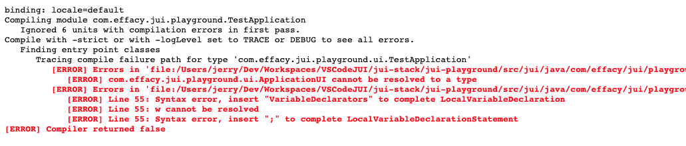

# Code server

The code server is a development tool that efficiently compiles code during runtime as well as serving up source maps for debugging. It is an essential tool for development purposes and one that you should become quite familar with.

This documentation is separated into four sections:

1. [How it works](#how-it-works) to provide a high-level overview of the mechanism undergirding the code server.
2. [Getting started](#getting-started) being a practical guide to using the code server in a project setting.
3. [More than one module](#more-than-one-module) describes how to deploy more than one JUI modules onto a single code server instance.
4. [Code server configuration](#code-server-configuration) describes the various configuration options that can be passed to the code server.
5. [Under-the-hood](#under-the-hood) to introduce some of the technical aspects of the code server and where to look if you want to modify the code server codebase.

## How it works

### Compilation artefacts

During the build process JUI code is compiled to JavaScript which is subsequently packaged (along with supporting assets and any bootstrap code) into a collection of *compliation artefacts*. The intention being that these artefacts are deployed as web resources and are referred to from HTML as needed (see [Compilation](app_compilation.md) for a deeper discussion on this).

In terms of how these artefacts become accessible via URI, the convention is that they are segmented by module and are referenced off the context root descriminated by module name. For example the bootstrap code is accessinble as `<module>/<module>.nocache.js` which can be included in a SCRIPT tag such as (for the **playground** application):

```html
...
<script src="/com.effacy.jui.playground.TestApplication/com.effacy.jui.playground.TestApplication.nocache.js"></script>
...
```
Similarly other artefacts are referenced under `<module>/`.

### Redirecting

The code server essentially serves up these artefacts, using the same URI paths, but from a different port (the default being 9876). The trick here is initiating this redirection.

The bootstrap code mentioned in [Compilation artefacts](#compilation-artefacts) checks for the setting of a certain hook (this is present in the browser window's session store) directing the use of the code server; if present it reloads the bootstrap from the code server (which then directs all subsequent resource loading). The activation of this state is performed by a special bookmark that is added when you setup the code server for the first time (see [Getting started](#getting-started)) which is also used to initiate a recompilation.

A similar bookmark is used to direct away from the code server and use the artefacts as they are served by the application (clearing the aforementioned hook).

### Compilation and debugging

The code server performs *incremental* compilation so only compiles code that is affected by changes since the last compilation occurred. You still need to trigger compilation (using the aforementioned bookmarks) but compilation is generally quite quick.

Sometimes you want to force a full compilation and the code server supports this as a direct action.

In addition to the compilation artefacts the code server makes available source maps for debugging. These map locations in the generated JavaScript to related locations in the originating source code. This means that (for supporting browsers) view the source in its original form including the setting of breakpoints.

?>Note that when using internalised styles (see [Styles](ess_styles.md)) the standard Maven build will create obfuscated ones by the code server will produce more human readable versions that include package and class names. In part this is due to a limitation of the incremental build process (obfuscation of styles is a global operation and incremental compilations can lead to name clashes) but is quite useful in its own right to locate DOM with its generating component.

### Code server interface

The code server also generates an interactive interface off the context root of its serving port (in addition to the in-situ interface elements presented when interacting with the bookmarks).

This provides instructions on setup and use as well as allowing you to survey the compilation artefacts, the sources that were compiled and compilation message log.

?>The code server can serve up more than one module and even modules across different projects, all modules are specified when starting the coder server and the relevant code is expected to be available on the code servers classpath. The description provided here assumes only one project to keep matters simple.

## Getting started

### Prerequistes

We assume that you have a JUI web project that successfully builds (in the traditional sense) and is running in your IDE.

#### Example: Playground

A good starting point is the `jui-playground` (this is very similar to the project created in the [getting started guide](intro_gettingstarted.md) but being part of the `jui-stack` it affords a more complex arrangement of project dependencies):

1. Import the `jui-stack` project into your IDE.
2. Run a full Maven build (this will install artefacts locally under the version `LOCAL-SNAPSHOT` and will invoke a JUI compilation in `jui-playground` that will create the necessary bootstrap code to invoke the code server).
3. Ensure the project builds in the IDE.
4. You have two options here to run the *playground*:
     a. Run `jui-playground` in the IDE as a Spring Boot application (the specifics depend on your IDE).
     b. Executing `java -jar jui-playground/target/jui-playground-LOCAL-SNAPSHOT.jar` (from the command line situated in the root project directory).
5. Navigate to `http://localhost:8080/playground` and you should see the *playground*.

Note that the code server build from the source code in your project, which means that you can use either of the methods described in (4) and still make changes to the JUI code. If you are making changes to non-JUI only code then you need to run the project as per (4a) as you would normally during development.

?>Throughout the rest of this documentation we may refer to the **playground** when presenting examples, when we do we are referring to this.

### Starting the code server

The code server code is runnable from the `com.effacy.jui:jui-platform-codeserver:jar-with-dependencies` (Maven coordinates) JAR file (this includes the code server code, a compiler and all necessary dependencies in a single JAR). Configuration options are passed as arguments, the main class is `com.effacy.jui.codeserver.CodeServer` and the classpath is expected to contain all relevant JUI (and other) resources needed to perform a full compilation (which includes and rebinding).

The general outline to running the code server in your IDE is as follows:

1. Run as a *run configuration* (as suitable for your IDE) using the project that you are wanting serve module(s) for (i.e the web project the code server is supporting).
2. Ensure that the class path of the run configuration includes the aforementioned JAR file (however **don't** includes this as a project dependency, reference it off the filesystem).

After the code server starts the administration interface should be available on `http://localhost:9876` (assuming the default port).

#### Example: Maven Plugin

The `jui-playground` pom includes a profile `codeserver` that will run the code server with the following command:

```bash
mvn -Pcodeserver initialize
```

This approach is probably the simplest, whereby you include a similar profile in your JUI project(s). The model is generalisable so we present it below as it appears in the `jui-playground` and detail the various configuration options:

```xml
<?xml version="1.0" encoding="UTF-8"?>
<project ...>
  ...
  <profiles>
    <!-- Runs the codeserver for this project -->
    <profile>
      <id>codeserver</id>
      <build>
        <plugins>
          <plugin>
            <groupId>com.effacy.jui</groupId>
            <artifactId>jui-maven-plugin</artifactId>
            <version>${release}</version>
            <configuration>
              <module>com.effacy.jui.playground.PlaygroundApp</module>
              <jvmArgs>-Xmx3g</jvmArgs>
              <sources>
                <source>src/jui/java</source>
                <source>src/jui/resources</source>
                <!-- We include target/classes to gain access to rebind classes. -->
                <source>../jui-platform/src/main/java</source>
                <source>../jui-platform/src/main/resources</source>
                <source>../jui-core/src/main/resources</source>
                <source>../jui-core/src/main/java</source>
                <source>../jui-core/target/classes</source>
                <source>../jui-core/target-ide/classes</source>
                <source>../jui-ui/src/main/java</source>
                <source>../jui-ui/src/main/resources</source>
                <source>../jui-ui/target/classes</source>
                <source>../jui-ui/target-ide/classes</source>
                <source>../jui-validation/src/main/java</source>
                <source>../jui-validation/src/main/resources</source>
                <source>../jui-validation/target/classes</source>
                <source>../jui-validation/target-ide/classes</source>
                <source>../jui-text/src/main/java</source>
                <source>../jui-text/src/main/resources</source>
                <source>../jui-text/target/classes</source>
                <source>../jui-text/target-ide/classes</source>
                <source>../jui-remoting/src/main/java</source>
                <source>../jui-remoting/src/main/resources</source>
                <source>../jui-remoting/target/classes</source>
                <source>../jui-remoting/target-ide/classes</source>
                <source>../jui-text/src/main/java</source>
                <source>../jui-text/src/main/resources</source>
                <source>../jui-text/target/classes</source>
                <source>../jui-text/target-ide/classes</source>
              </sources>
              <inclusions>
                <inclusion>org.pepstock:charba:*</inclusion>
              </inclusions>
              <exclusions>
                <!-- These are included by default so need to explicily exclude -->
                <!-- (they are included by the sources above). -->
                <exclusion>com.effacy.jui:*:*</exclusion>
              </exclusions>
            </configuration>
            <executions>
              <execution>
                <id>codeserver</id>
                <phase>initialize</phase>
                <goals>
                  <goal>codeserver</goal>
                </goals>
              </execution>
            </executions>
          </plugin>
        </plugins>
      </build>
    </profile>
  </profiles>
</project>
```

Walking through the configuration:

1. The `version` is `${release}` since the version of the `jui-maven-plugin` is just the version of the reactor. For your own projects replace this with the version of JUI that you are using.
2. The `module` parameter contains a comma-separated list of fully qualified modules (the package and name of the entry point module `.gwt.xml` file).
3. The `jvmArgs` parameter contains a comma-separated list arguments to pass through to the JVM. The most common being the maximum heap size (3G is usually sufficient).
4. The `sources` parameter contains all the source directories you wish to include in scope of JUI compilation. The compiler only needs access to those source locations and JAR files that contain compilable code. These must appear on the same classpath as the code server JAR which means that including other dependencies (especially Spring Boot releated ones) can cause some undesirable behaviours (especially where autoconfiguration is involved) so it is best to keep the classpath light. Note that loctions can be relative.
5. The `inclusions` and `exclusions` declare those artefacts to include and exclude. If no inclusions are specified then all artefacts resolved from the pom will be included, otherwise only those that match the inclusion patterns (along with those used by JUI) will pass. Exclusions are applied ontop of this collection. In the `jui-playground` case this is made more complex as we need to explicitly exclude the JUI libraries as these are included by default noting that they are included by way of the sources (since the playground is intended to support development of JUI itself).

If you are encouter problems getting the code sever up-and-running then try adding the configuration parameter `<diagnose>true</diagnose>`. This will print to logs the classpath used to run the code server along with the options passed (without attempting to launch the code server).


#### Example: VS Code

The simplest approach to running the code server in VS Code using using a launch configuration from the **Run and Debug** section. The following setup creates a code server launch for the **playground** (see [Prerequisites](#example-playground)) but applies to any project. It assumes you have VS Code setup for Java development.

First navigate to the **Run and Debug** section then select to **Add Config (jui-stack)**. This should open the `launch.json` file for the `jui-stack` project. Add the following:

```json
{
    "type": "java",
    "name": "JUI Playground CodeServer",
    "request": "launch",
    "mainClass": "com.effacy.jui.codeserver.CodeServer",
    "args": "-generateJsInteropExports -port 9876 com.effacy.jui.playground.TestApplication",
    "vmArgs": "-Xmx3g",
    "projectName": "jui-playground",
    "classPaths": [
        "${userHome}/.m2/repository/com/effacy/jui/jui-platform-codeserver/<version>/jui-platform-codeserver-<version>-jar-with-dependencies.jar",
        "${workspaceFolder}/jui-platform/src/main/java",
        "${workspaceFolder}/jui-platform/src/main/resources",
        "${workspaceFolder}/jui-core/src/main/java",
        "${workspaceFolder}/jui-core/src/main/resources",
        "${workspaceFolder}/jui-ui/src/main/java",
        "${workspaceFolder}/jui-ui/src/main/resources",
        "${workspaceFolder}/jui-remoting/src/main/java",
        "${workspaceFolder}/jui-remoting/src/main/resources",
        "${workspaceFolder}/jui-validation/src/main/java",
        "${workspaceFolder}/jui-validation/src/main/resources",
        "${workspaceFolder}/jui-playground/src/jui/java",
        "${workspaceFolder}/jui-playground/src/jui/resources",
        "$Auto",
    ]
}
```

Here you should replace `<version>` with the version of the code server installed during your Maven build (we could have used the built version from the project itself however this is the most generic approach).

Note that the built JAR files for each of the JUI projects also includes the sources, this is needed for JUI compilation. The IDE however does not place source files on the classpath for project dependencies, this means that you need to include them explicitly. Hence the entries for `${workspaceFolder}/jui-platform/src/main/java`, etc.

We draw attention to the `args` property which includes `com.effacy.jui.playground.TestApplication`, this is the module reference to the playground application.

### First time running

Now you have the code server running point the browser to `http://localhost:9876` (again assuming the default port). You should see something like the following:


Follow the instructions on the left hand side under **Getting started**. This will result in two bookmarks being placed on your bookmark bar (keep this visible). You only need to do this **once**, the bookmarks will work for any project and any module once they have been added to the browser.

Now navigate to your application (if you are running the **playground** go to `http://localhost:8080/playground`) and then click on the **Dev Mode On** bookmark. You should see something like the following:


All modules declared on the page you are accessing (recall that an application can have more that one module, though this is not typical) are listed with a **Compile** button associated for each. Click on the button and you should see the following:


The code server has started compiling (if your IDE display logging from any run configuration then you will see the compilation in progress) and the browser will poll the code server until it is done. If successful you the browser will refresh with the updated code.

### Operating the code server

#### Recompiling

When you make changes to your code you can see the effect of those changes by invoking a recompilation via the code server. To do this simply click on the **Dev Mode On** bookmark and follow the steps as described in [First time running](#first-time-running). 

#### Failed compilation

If the compilation fails you will see an error message:


By clicking on the **view log** link you can see the compilation logs describing the failure (in the case of the example above we are running the **playground** and modified `ApplicationUI.java` introducing a single character `w` so that it doesn't compile):



Again, if you have direct access to the run configuration logs then you will see the error there as well.

Once you have rectified the problem then simply click on the **Try again** button.

#### Clear cache

The code server attempts incremental compilation but sometimes this does not work as expected. Changes to resource files tend not to be easily associated with source files so changes are not picked up (**trick**: when updating such a resource, for example a CSS file, modify the class file that includes it to force recompilation). Other times the compiler does not full resolve dependences (sometimes this can be tricky). In such cases you should clear the compiler cache and recompile (which results in a full compilation being performed).

To do this click on the **Dev Mode On** bookmark to open the recompilation dialog:


Click on the **Open coder server** link which will open the adminstration interface (see first image in [First time running](#first-time-running)) in a new window. On that click on the  **Clear server cache** button at the top right. You should see a success message appear:


Now return to the recompilation dialog and proceed as per [Recompiling](#recompiling).

#### Debugging

The code server also serves up source maps (in accordance with the [source map standard](https://docs.google.com/document/d/1U1RGAehQwRypUTovF1KRlpiOFze0b-_2gc6fAH0KY0k/edit)). In Chrome you can browse sources from the **Sources** tab of the developer tools (the example is from the front page of the **playground**):


Note that in sources explorer the sources appear under the node matching the module name and under the sub-node referencing the code server (easily identified using the server port). You can place a break point anywhere in the code and the browser will break when encountered. As usual you can inspect and step through.

#### Browsing artefacts

The code server also allows you to browse the compilation artefacts. From the code server administration interface click on the module you wish to browse:


You will be taken to a page that displays the compilation artefacts that are accessible:


Clicking on an artefact will display it (as raw content).  In addition there are links to the logs (**Messages**) and the source code (**Sources**). These are only present after the first compilation. The **Sources** lists all sources that were used during JUI compilation and allows one to view the source annoted with those methods that were used (highlighted).

## More than one module

As alluded to in the screen shots above one may have more than one JUI application module in your codebase (a simple example being the module for your application and that for your component explorer, if you have choosen that project configuration).

To configure the code server for more than one module simply list all modules separated by a space.  For example (in VS Code):

```json
{
    "type": "java",
    "name": "MyApplication CodeServer",
    "request": "launch",
    "mainClass": "com.effacy.jui.codeserver.CodeServer",
    "args": "-generateJsInteropExports -port 9876 myapplication.web.Application myapplication.jui.Playground",
    "vmArgs": "-Xmx3g",
    "projectName": "myapplication",
    ...
}
```

where we assume two modules `myapplication.web.Application` and `myapplication.jui.Playground`.

## Under-the-hood

*Here we reference the code server from a technical standpoint, as it appears in the `jui-platform-codeserver` project. This is only relevant for those wanting a deeper understanding of how it works or who which to contribute to its development.*

Those familar with [GWT](www.gwtproject.org) will notice some similarities, and that is no coincidence. The JUI code server is based on the GWT code server, though subject to a significant rewrite (to better manage dependencies, reduce the potential for library conflicts and to support pluggability of compilation mechanism) as well as bringing it under the auspicies of the JUI code base.

All relevant technical documentation is contained within the project itself and referenced from the projects main `README.md` file.

# Appendix

## Maven configuration

Configuration options for the `codeserver` goal of the `jui-maven-plugin` are:

|Option|Description|
|------|-----------|
|`<module>`|List of fully qualified module names of the entry-point modules.|
|`<jvmArgs>`|A list of arguments to pass directly to the JVM.|
|`<diagnose>`|A `true` or `false` (default) value that will have the plugin print the classpath and command arguments in lieu of running the code server. Useful to ensure that the correct filtering is being applied to the classpath entries.|
|`<port>`|The port the code server should run on (default is `9876`).|
|`<logLevel>`|Passed to the compiler. The log-level the compiler should run at (see [Compiler](app_compilation.md)).|
|`<sourceLevel>`|Passed to the compiler. The Java source-level the compiler should run at (see [Compiler](app_compilation.md)).|
|`<sources>`|A list of project-relative directories containing JUI source code. If not specified then the sources declared in the project will be used (note that if you choose this approach and you are using the `build-helper-maven-plugin` then that plugin *must* run before the code server to ensure that the additional sources are added and thus made available to the plugin).|
|`<inclusions>`|A list of artefacts filters on the project dependencies to include on the classpath of the code server. Each filter is a wild-card filter on Maven coordinates. By default the JUI libraries (and their dependencies) are filtered in.|
|`<exclusions>`|As with `<inclusions>` these are dependencies to exclude. Exclusions operates over the inclusions.|

Note that *list-of* can be expressed either by comma separation or nesting:

```xml
<sources>
    <source>...</source>
    <source>...</source>
    ...
</sources>
```

Finally recall that the specification of sources and dependencies need only consider those that are included in the JUI compilation and that sources can reference other projects relatively (i.e. for multi-module parents).

## Code server configuration

Configuration options are passed to the code server as arguments.

|Option|Description|
|------|-----------|
|`-port <port>`|The port to rune the code server on (default is 9876).|
|`-logLevel <ALL,ERROR,INFO,DEBUG,TRACE>`|Passed to the compiler. The log-level the compiler should run at (see [Compiler](app_compilation.md)). Default is `INFO`.|
|`-sourceLevel <level>`|Passed to the compiler. The Java source-level the compiler should run at (see [Compiler](app_compilation.md)). Defalt is `17`.|
|`-generateJsInteropExports`|Passed to the compiler. The log-level the compiler should run at (see [Compiler](app_compilation.md)).|
|`-style <DETAILED,OBFUSCATED,PRETTY>`|Passed to the compiler. The log-level the compiler should run at (see [Compiler](app_compilation.md)). Default is `OBFUSCATED`.|
