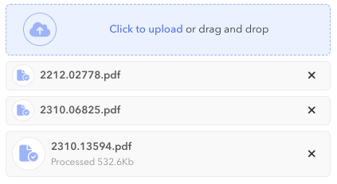
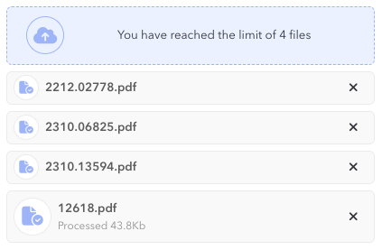
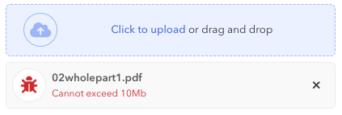

# File management

Support is provided for a range of file based interaction, including upload and download. Covered in this documentation are:

1. [File upload control](#file-upload-control) being a control to perform file uploads.
2. [File downloader](#file-downloader) to support the download of files and polling for long running file generation.

## File upload control

### Description

The `FileUploadControl` (in `com.effacy.jui.ui.client.control`) provides a mechanism to allow for the upload of files from the client to some remote endpoint as well as representing (and modifying) existing files (aka attachments).

The general layout is to provide a drag-and-drop area below which files are added with meta-data (status, upload progress and size).



Variations of this are determined by the choice of style (i.e. a larger drop region or greater number of files before compactifying the display of attached files).

Files that have been added appear with a cross to remove them and a success indicator (file with a tick) when uploaded (if an upload fails then the rendition clearly indicates this). For existing files the presentation differs to surface this fact and the corss is replaced with a trash can.

### Configuration

#### Value type

The value-type of the control is a list of `FileAttachment`'s (this class is declared on `FileUploadControl`). When set externally the attachment represents an existing file and has the status `FileAttachment.Status.EXISTING`. When removed the default is to remove the attachment from the list, unless the control is configured with `includeRemoved` in which case the removed attachment remains and is marked with status `FileAttachment.Status.DELETED`. For existing files it is assumed that an `id` is passed allowing reference to the file (mainly for when it is deleted).

When a file is uploaded successfully a new `FileAttachment` is created with status `FileAttachment.Status.CREATED` and a `reference` that has been returned from the uploader (see [File uploader](#file-uploader)). This reference can be passed back to the server allowing it to retrieve and operate on the file (this is, naturally, implementation specific). *Note that no `id` is assigned in this case.*

#### File uploader

Every file upload control must be backed by an instance of `IFileUploader` that performs the actual upload (as well as providing a `reference` for that upload that can be used later to access and manage the uploaded file, see [Value type](#value-type)).

The specific implementation will depend on the target endpoint with implementations provided for AWS and GCP buckets. Implementations will generally require additional configuration (i.e. a CORS policy, and encoded policy or a signed URL). Detailed information pertaining to this is provided in the Javadoc for the specific uploader.

An example is configuring a GCP bucket uploading using a signed URL. This URL is returned (per file uploaded) by a call to a *service URL* (so is a server-side operation that makes use of the GCP storage API). If this URL is `app/uploader` then we would configure the upload control as follows (for a timeout on the service URL of 3000ms):

```java
Controls.fileUpload (cfg -> {
    cfg.uploader (new GCPSignedUrlFileUploader ("app/uploader", 3000));
    ...
});
```

Since your application will likely implement a single upload method you should consider creating a dedication controls helper class that pre-configures the file upload with the uploader (and any additional desired common configuration). For example:

```java
public class MyAppControls {

    /**
     * Creates a {@link FileUploadControl} that is configured with the appropriate
     * upload target.
     * 
     * @param cfg
     *            (optional) to configure the control.
     * @return the control.
     */
    public static FileUploadControl fileUpload(Consumer<FileUploadControl.Config> cfg) {
        return Controls.fileUpload (config -> {
            config.style (FileUploadControl.Config.Style.COMPACT);
            config.uploader (new GCPSignedUrlFileUploader ("app/uploader", 3000));
            ...
            if (cfg != null)
                cfg.accept (config);
        });
    }

    ...
}
```

#### File count limit

The file upload control can be constrained as to how many files can be attached using the `limit` configuration property. The default is no limit but you should generally provide some limit that is sensible.

Depending on the limit there are some behavioural changes. When a limit of one is configured then the drop region is replaced by the uploaded file (which can be removed). For more than one the files render below the drop region (as seen in the image above) but the region blocks addition of new files when the limit is reached.



#### File validation

You can provide a validator that validates aspects of the file being uploaded. Generally this is used to impose file size and type limitations (prior to those limitations being enforced server-side). *This validation is separate from the standard control validation (which can still be applied) as it is asserted when a file is first selected into the control and prior to any attempt to upload it.*

For example, the following configures a GCP uploader to limit files to at least one byte, but no more than 10Mb (this requires the signed URL to be configured with the extension header `X-Goog-Content-Length-Range` with value `1,104855760`):

```java
Controls.fileUpload (config -> {
    config.uploader (new GCPSignedUrlFileUploader ("app/uploader", 3000)
        .contentLengthRange (1, 104855760L));
    config.fileValidator (f -> {
        if (f.size == 0)
            return Optional.of ("Cannot be empty");
        if (f.size > 104855760L)
            return Optional.of ("Cannot exceed 10Mb");
        return Optional.empty();
    });
    ...
});
```

*Note the call to `contentLengthRange(...)` which directs the passing of the properly formed `X-Goog-Content-Length-Range` header to the signed URL, this is needed otherwise the request will generate a 400 response.*

Attempting to upload a file larger that 10Mb will show as follows:



### Alternative rendering

You may wish to render aspects differently (mainly in relation to the file attachment list). To achieve this you must sub-class the control and override the `renderAttachment(ElementBuilder,FileAttachmentItem)` method.

## File downloader

The `FileDownloader` (in `com.effacy.jui.ui.client`) provides support for downloading files , notifying (visually) when a download is in progress and polling for downloads where the underlying file needs to be generated and generation is long running (i.e. generating a report).

### Simple downloads

Here we consider a simple download of a file from a URL. The simplest approach is to open a new window:

```java
DomGlobal.window.open (/* url */, "_blank");
```

However this tends to open a new tab or window and the experience is not so clean. A more seamless approach is to employ an element, such as an iframe (or anchor). To this end `FileDownloader` offers the family of static methods `download(...)` that does eactly this:

```java
FileDownloader.download (/* url */);
```

These methods create a temporary element to execute the download, removing once it is done. This approach does not, however, provide any indication that a download is in progress. For larger files this lack of signification can be confusing to a user who expects some prompt feedback.

### Notified downloads

For more advanced downloading `FileDownloader` provides the family of `pollable(...)` methods (the *polling* inference is described under [Long running downloads](#long-running-downloads)). These methods make use of [XHR](https://developer.mozilla.org/en-US/docs/Web/API/XMLHttpRequest) objects to perform the download, which affords a greater degree of control.

```java
FileDownloader.pollable (/* url */);
```

A key advantage is that a notification is displayed (the default being at the bottom left corner of the screen) when files are being downloaded. In fact you can tailor the type of file for the notifier, for example:

```java
FileDownloader.pollable ("report", /* url */);
```
will display something similar to the following (in this case it is assumed that four concurrent *report* downloads are in progress):


As far as the notifier is concerned it is just a component (specifically `FileDownloader.FileDownloaderNotifier`). This can be styled as per any standard JUI component (i.e by overriding `FileDownloaderNotifier_Override.css`, see [Styles & themes](ess_styles.md)).

You can also supply your own notifier component, if you do this it must implement `IFileDownloaderNotifier` and be provided via configuration (see [Configuration](#configuration-1)):

```java
FileDownloader.config (new FileDownloaderConfig ()
    .createNotifier (() -> new MyFileDownloaderNotifier ())
    ...
);
```

Note that a single instance of the notifier will be created and it will be located in the bottom left corner of the screen, however this can be adjusted by registering a *container configuration*:

```java
FileDownloader.config (new FileDownloaderConfig ()
    .createNotifier (() -> new MyFileDownloaderNotifier ())
    .configureContainer (el -> el.css ("bottom", "0px")...)
    ...
);
```

Here `el` is an instance of `JQueryElement`.

### Long running downloads

Long running downloads are typically those that require lengthy generation (often reports) that typically extend beyond the usual connection timeout. An approach to this is to initiate the download that starts the file generation then poll until the file is ready. Once ready then download it.

The `pollable(...)` family will handle polling automatically when it receives a `202` status (this is [configurable](#configuration-1) via `pollingStatus(int)`) and a polling url in the header `RetrieveLocation` ([configurable](#configuration-1) via `pollingHeader(String)`). The dowloader will wait a brief period then poll the polling url. If that request yields a `202` (and associated polling url header) then polling will continue, otherwise file content will be expected and will be saved as the downloaded file.

The following demonstrates how a polling status can be returned by the server using the `HttpServletResponse`:

```java
HttpServletResponse response = ...;
response.setStatus (202);
response.addHeader ("RetrieveLocation", "/download/poll/" + pollId);
```

### Additional features

These all apply only when using any of the `pollable(...)` methods.

#### Filenames

The `Content-Disposition` header will be checked for a filename and that will be used to save the file against. The following demonstrates how one can set on the server using the `HttpServletResponse`:

```java
HttpServletResponse response = ...;
response.setHeader ("Content-disposition", "attachment; filename=\""+ filename + "\"");
```

#### Loss of session

When a `403` ([configurable](#configuration-1) via `lossOfSessionStatus(int)`) is received, or there is a redirect to a URL that matches any matcher provided by the `lossOfSessionUrl(Function<String,Boolean>)` [configuration](#configuration-1) (passed is a function that is, itself, passed the redirect url) then a loss of authentication session is assumed.

In this case an error message is displayed to the user and the download is terminated.

#### Error handling

When any unusual status code is received this is deemed an error and the download is terminated. The resultant error message will depend (to some degree) on the status code and can be modified by setting a mapping using the `problemMapper(IProblemMapper)` [configuration](#configuration-1).

In most cases, if a `Message` header is present, then the contents of that header will be assumed to contain an error message and will be displayed. 

### Configuration

Configuration of `FileDownloader` must be performed before use and can only be applied once. The usual place to apply this is in the application entry point class. To configure one creates an instance of `FileDownloaderConfig` then employs the various builder methods to build out the desired behaviours. This instance is then passed to the static `config(...)` method:

```java
FileDownloader.config (new FileDownloaderConfig ()
    .configureContainer (el -> el.css ("bottom", "5px").css ("left", "5px"))
    .lossOfSessionUrl (url -> url.endsWith ("login"))
    ...
);
```