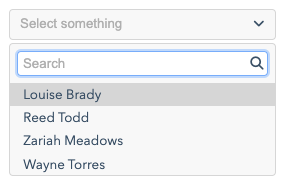
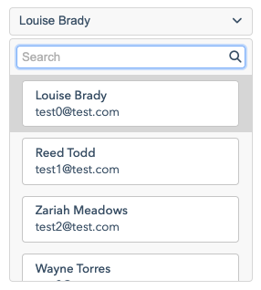
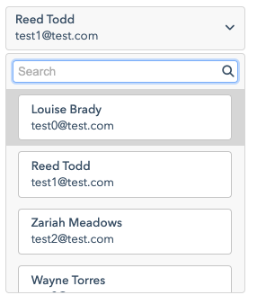

# Selection control

## Description

The `SelectionControl` provides a mechanism to select single items from a collection of candidates. All selection controls are backed by an `IStore` of which `IFilteredStore` and `ISearchStore` have special treatments (in respect of supporting keyword search).

## Stores

As noted the selection control is backed by a store that serves as the source of items to select from. We take the opportunity now, before diving into the details of the selection control, of providing a quick survey of stores as application to selection controls.

### Static stores

The most basic store is a `ListStore`, for which the totality of items can be added at once:

```java
// A simple list store containing three string items. The selection control
// will display these as selectable items.
ListStore<String> store = new ListStore<>(s -> {
    s.add ("Item 1", "Item 2", "Item 3");
});
SelectionControl<String> sel = SelectionControlCreator.build (cfg -> {
    cfg.store (store);
});
```

Such a store need to be restricted to string values, rather they can contain any value type. The question comes down to how the selection control will display a given item. The default is a conversion using `toString()` but an alternative is to provide a label mapper.

```java
public enum MyType { ITEM1, ITEM2, ITEM3 };
ListStore<MyType> store = new ListStore<>(s -> {
    s.add (MyType.ITEM1, MyType.ITEM2, MyType.ITEM3);
});
SelectionControl<MyType> sel = SelectionControlCreator.build (cfg -> {
    cfg.store (store);
    cfg.labelMapper (v -> {
        if (MyType.ITEM1 == v)
            return "Item 1";
        if (MyType.ITEM2 == v)
            return "Item 2";
        return "Item 3";
    });
});
```

More can be found on this is [Examples](#examples) below.

Selection controls support the ability to search by keyword. This search is delegated through as follows:

1. If the store implements `IFilteredStore` then search queries will be filtered by the `boolean filterMatch(String keywords, V value)` method on `SelectionControl` (implementing the predicate filter passed through to `IFilteStore`). The default behaviour is to filter based on the display label as provided through any provided label mapper or delegation to `toString()` on the store value type.
2. If the store implements `ISearchStore` then search queries are passed through to the store itself via the `filter(String keywords)` method.
3. If the store does not implement either `IFilteredStore` or `ISearchStore` as well as **not** implementing `IPaginatedStore` then the store is wrapped in a `FilterStore` thus behaves as per (1).

There are some support classes available to help customise search (i.e. where the default as described in (3) and (1) above is not suitable), one being `SearchStore`. With this you can convert any store into a `ISearchStore` with a custom search filter:

```java
new SearchStore<MyType> (
    new ListStore<MyType> (s -> {
        s.add (MyType.ITEM1, MyType.ITEM2, MyType.ITEM3);
    }),
    (v,k) -> v.name().toLowerCase ().contains (k.toLowerCase ())
)
```

### Dynamic stores

A more complicated scenario arises when we have a store that loads data remotely, that is that it implements `IPaginatedStore` (through more typically, extends `PaginatedStore`). The following is an illustrative example (without detailing any specific remoting technology):

```java
public class MyResult {
    // Properties
}
public class MyResultStore extends PaginatedStore<MyResult> {

    @Override
    protected void requestLoad(int page, int pageSize, ILoadRequestCallback<PositionQueryResult> cb) {
        // Perform a remote query here for the given page of the given size.
        // The passed callback is then used to record success or failure.
        ...
        if (success) {
            cb.onSuccess (
                /* List of results (for the page being loaded) */,
                /* The total # of results (across all pages) */,
                /* true if performing a filter */
            );
        } else {
            cb.onFailure (/* Error message */);
        }
    }
}
SelectionControl<MyResult> sel = SelectionControlCreator.build (cfg -> {
    cfg.store (store);
    cfg.labelMapper (v -> {
        return /* Extract suitable label from v */;
    });
});
```

Note that the last argument to `onSuccess(...)` may seem a little cryptic; however it simply indicates whether the store is being filtered or not. This allows the control to interpret empty results meaningfully as there being no content at all (unfiltered) or no content as a result of the filter (filtered). The control will then render the correct message.

If we want the selection control to perform a keyword search on a paginated the store we must explicitly implement `ISearchStore` (for a remote store we generally pass the keyword search terms across with the query which is only possible with `ISearchStore`):

```java
public class MyResultStore extends PaginatedStore<MyResult> implements ISearchStore<PositionQueryResult> {
    ...

    @Override
    public void filter(String keywords) {
        /* Setup the remote query to filter on the keywords */
        ...
        // Activate a reload.
        reload (10);
    }

    @Override
    public void clearFilter() {
        // Simple default is to apply no keywords, but you may
        // implement as relevant.
        filter ("");
    }
}
```

See [Examples](#examples) for some specific cases.

We finish this section by noting some important behaviours of stores as they are used in selection controls:

1. If you set the configuration property `clearStore(boolean)` to `true` then the store is cleared when the controls is reset (where the store is a `IPaginatedStore`). This will force the store to reload when the selection control is opened for selection (this helps avoid a selection control displaying data from a different context, such as when a dialog is reopened).
2. Paginating stores will often have a pre-set page size, this can be overridden with the configuration property `storeBatchSize(int)`.
3. Setting the configuration propery `allowSearch(boolean)` will suppress the search-by-keyword filter outright.

## Examples

*In the previous section we made use of the `SelectionControlCreator` helper class as it best gave focus to the principles being expressed. In the following we exclusively use `Controls` as being the preferred approach to create standard JUI controls in practice.*

### Static stores

We start with a simple control that employs a enum as the value type; a custom mapper is used to generate labels:

```java
public enum MyValueType {
    V1, V2
}

// This select carries values of the above enum and uses a label mapper to
// map then enum values to a human-readable representation.
Controls.<MyValueType> selector (cfg -> cfg
    .placeholder("Select value")
    .labelMapper (v -> {
        if (v == MyValueType.V1)
            return "Value type 1";
        return "Value type 2";
    }),
    // List of values to populate the selector with (for an enum this is
    // easily done with the 'values()' method). Alternatively you could list
    // each value separately (making use of the varargs parameter list).
    MyValueType.values ()
)
```

### Dynamic stores

The remaining examples in this section make use of the following data class and store. This is intended to represent some value type that has some depth. The store also mimics a loading remotely (with a delay to model latency). In general one can replace this store with any type of store that is suitable for the case at hand (though recall that it must implement `ISearchStore` or `IFilterStore` if keyword search is to be enabled).

```java
// A simple value type (generally will have getters but uses public members for
// simplicity).
public class MyResult {
    public final int ref;
    public final String name;
    public final String email;
    public MyResult(int ref, String name, String email) {
        this.ref = ref;
        this.name = name;
        this.email = email;
    }
}

// This mock store is backed by a search store that is backed by a list store. The
// list store is populated with 100 random items. The search store matches (thus filters)
// by testing if the name field of the datum contains the keywords as written.
public class MyResultStore extends MockPaginatedStore<MyResult> {
    public MyResultStore() {
        super (
            new SearchStore<MyResult> (
                new ListStore<MyResult> (s -> {
                    for (int i = 0; i < 100; i++)
                        s.add (new MyResult (i, Names.NAMES[i], "test" + i + "@test.com "));
                }),
                (v,k) -> v.name.toLowerCase ().contains (k.toLowerCase ())
            )
        );
        delay (300);
    }
}
```

The following selector has a fixed width, placegolder and default height. An explicit label mapper is supplied that extracts and displays the name from the value class.

```java
Controls.<MyResult>selector (cfg -> cfg
    .width (Length.em (20))
    .placeholder ("Select something")
    .store (new MyResultStore ())
    .labelMapper (v -> v.name)
    .comparator ((a,b) -> a.ref == b.ref);
)
```

Note the `.comparator ((a,b) -> a.ref == b.ref)` which allows us to specify an explict mechanism for comparing values. Without this the Object-level `equals(...)` is used to determine equality (and in most cases value types will override this accordingly so this is usually fine) which may not always be desireable.

The control above renders as follows:



The next example builds on the first but provides an alternative renderer for each of the items that appear in the selection list (the associated CSS is listed beneath).

```java
Controls.<MyResult>selector (cfg -> cfg
    .width (Length.em (20))
    .placeholder ("Select something")
    .store (new MyResultStore ())
    .labelMapper (v -> v.name)
    .selectorHeight (Length.em (20))
    .optionRenderer ((el,r) -> {
        Div.$ (el).style ("item").$ (
            Div.$ ().style("name").text (r.name),
            Div.$ ().style("email").text (r.email)
        );
    })
)
```

```css
.item {
    border: 1px solid #ccc;
    border-radius: 4px;
    background-color: #fff;
    padding: 0.5em 1em;
    margin: 0.25em 0;
}
li:hover > .item {
    background-color: #f1f1f1;
}
.item > .name {
    font-weight: 500;
}
.item > .email {
    font-size: 0.9em;
}
```



We now provide a renderer for the selected item (rather than relying on the label mapper). In this case we style it slightly differently from the version that appears in the selector.

```java
Controls.<MyResult> selector (cfg -> cfg
    .width (Length.em (20))
    .placeholder ("Select something")
    .store (new MyResultStore ())
    .selectorHeight (Length.em (20))
    .optionRenderer ((el,r) -> {
        Div.$ (el).style ("item").$ (
            Div.$ ().style("name").text (r.name),
            Div.$ ().style("email").text (r.email)
        );
    })
    .selectionRenderer ((el,r) -> {
        Div.$ (el).style ("item", "selected").$ (
            Div.$ ().style("name").text (r.name),
            Div.$ ().style("email").text (r.email)
        );
    })
)
```
```css
.item.selected {
    border: none;
    background-color: inherit;
    padding: 0;
    margin: 0;
}
```



There are also cases where you may need to impose limitations on the store prior to a loading of data (for example, in an edit form you may need to limit the results based on compatibility with what is being edited). A simple approacg is the extended `store(...)` method that is passed a lamnda-expression that is invoked prior to a store load:

```java
...
.store (new MyResultStore (), (store, value) -> {
    // Configure the 'store' as needed ('value' contains the current value
    // of the selection control).
})
...
```

## Debugging

Given the interaction with an externally provisioned store it can be tricky sometimes seeing what is happening when things are not going to expectations. With this in mind the `SelectionControl` provides several debug modes that activate logging in various contexts.

To make use assign a global debug profile (most easily done in the applications' [entry point](ess_create.md#entry-point-class)) using the static `debug(SelectionControl.DebugMode...)` method:

```java
SelectionControl.debug (SelectionControl.DebugMode.STORE, SelectionControl.DebugMode.MENU);
```

Trace logging under the prefix `selector` (or `selector-menu`) will be generated in the browser console log.

