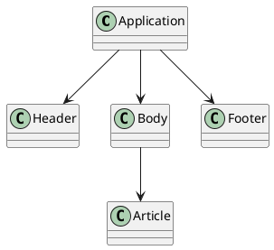
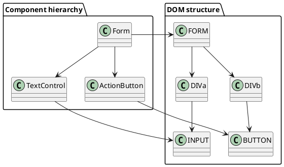
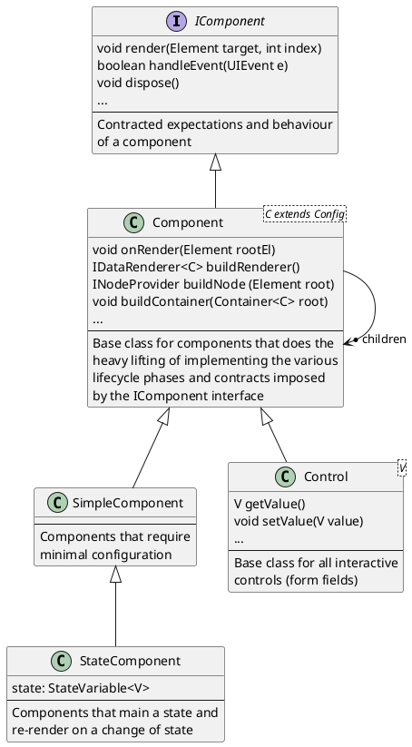
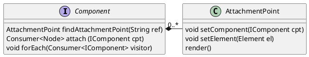
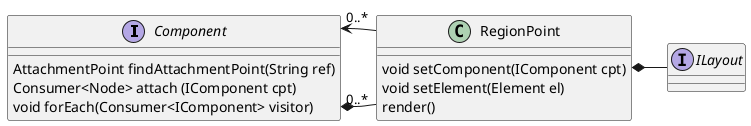

# Components

Components are declared in the `jui-core` project and are available in the associated library jar.

?>The general style of this documentation is more referential than formative (though examples are employed). You are recommended to read this in conjuction with [lessons](lessons.md) [one](lesson_1.md) and [two](lesson_2.md) which place the theory into a practical context.

This documentation is set out as follows:

1. [What are components?](#what-are-components) introduces the notion of a component, composition of components and the component lifecycle as employed by JUI.
2. [Building components](#building-components) decribes the construction of components segmented by the various lifecycle phases.
3. [Child components](#child-components) details the various ways components can be composed focussing on the immediate parent-child association.
4. [Additional topics](#additional-topics) a bried exposition of related and advanced topics with associated references for further reading.
5. [Standards and guidelines](#standards-and-guidelines) the various standards and guidelines related to building and using components that are used in overall documentation set.
6. [Component mechanisms](#component-mechanisms) a detailed exposition of the component lifecycle and the underlying implementation (primarily for reference).

## What are components?

### The concept of a component

Components form the building blocks of a JUI application. They encapsulate portions of UI, along with associated behaviour, into reusable elements that can be deployed across the application.

A component can be entirely self-contained, encapsulating presentation and functionality, or can contain other components to be arranged in a suitable layout. A JUI application thus forms a hierarchy of components under a parent-child arrangement, the top-level component of which is referred to as the *application* component.



Components are thus responsible for their own portions of the application acting (in the most part) independently while serving the purposes required of their parent. To illustrate, common components include:

1. A button with state. The component is responsible for managing the buttons state and its interaction with the user.
2. A form field with state (here state can include being in an error condition, being disabled or being read only). Behavior can be more complex for form fields that include key filtering, formatting and validation, all of which can be encapsulated in a component.
3. Tabbed panel that consists of a set of tabs each of which display a page of content when clicked on. Each of these pages of content are components in-of-themselves (having been added to th tabbed panel).

For a more comprehensive description of components you are encouraged to familiarise yourself with [Compnent Driven User Interfaces](https://www.componentdriven.org/).

### Components and the DOM

Components provide a way of encapsulating functionality that acts on (and responds to) the browser Document Object Model ([DOM](https://developer.mozilla.org/en-US/docs/Web/API/Document_Object_Model/Introduction)).

Each component, once rendered, maintains a reference to its *root* DOM node underwhich appear the various DOM elements under the components control. Child components also have their own root DOM nodes and those too live under the parent components DOM (however remain under the control of the child component not the parent).

By way of illustration consider the following diagram:



On the left are imaginary component (instances): a `Form`, a `TextControl` and an `ActionButton`. These are modelled by classes with method to invoke behaviour and callbacks to respond to events from the DOM. The component (instances) are arranged heirarchically so that the form has the text control and action button as children.

When the form is rendered it creates a basic DOM structure. In our example this is illustrated on the right. A FORM element serves as the root node for the `Form` component underwhich are two DIV elements (and associated CSS to guide layout). The form component directs its child text control to render into the first DIV element resulting in the creation of an INPUT element resident under the DIV. This then forms the root node for the text control. Similarly the form directs the action button to render under the second DIV resulting in a BUTTON element resident under the DIV. This become the root node for the action button.

As a user enters content into the INPUT field the DOM generates browser events. These are captured by the text control allowing it to perform any desired function (i.e. preventing certain key presses or performing on-the-fly validation). When the user clicks on the BUTTON element that too generates a DOM event which can be picked up the action button. This button signals that it has been activated and that signal is picked up by the form component (it registers a listener to the button component). The form component can then process its contents in the appropriate way (such as submitting a remote call).

### JUI components

JUI components are embodied as classes that implement `IComponent` (in the `com.effacy.jui.core.client.component` package) though invariable they extend `Component` (or one of its sub-classes) which performs much of the heavy lifting.



At a minimum a component will provide a means to render itself into the DOM thus presenting itself into the UI. In addition it may declare the ability to respond to user (UI) events as well as maintaining an internal state (including being responsive to changes in that state).

With respect to children, the `Component` class provides a mechanism for adopting child components and incorporating them into the rendering process. This can be used by any custom component to include children either as composite or to provide the ability to add children external to the component (such as is the case with *panels* and *tabsets*).

?>You are encouraged to have a look at the **playground** code starting with `ApplicationUI` which serves as the *application* component, then follow the code to discover the component hierarchy. You should also review the [Tutorial](tutorial.md) that describes how to create a simple dashboard consisting of multiple components assembled into a grid-like layout.

JUI also provides a number of standard components that can be used out-of-the-box. These provide a common set of behaviours that can be reused in your application and include panels, tabs and form controls. These can be found in the `jui-ui` project and associated library and documentation can be found in the **playground** under the **Library** section.

?>The documentation of the standard components in the playground makes use of the JUI component-library feature. In your own application you are encourages to create a dedicated playground for component documentation and development and there you can add your own components to the component-library.

You are encouraged to review these components as they form a good base of examples when creating your ownn. Feel free to copy and modify these as you need.

### Component lifecycle

Components have a life-cycle whereby they are created, rendered (where they are "attached" to the DOM and are able to respond to UI events), interacted with (generally by responding to UI events) and (sometimes) disposed of (including their "detachment" from the DOM and associated UI event flow).

* **Construction and configuration** Where the component is created (instantiated) and, if not the *application component*, associated with a parent. During construction some initial configuration will be provided, this is used to set the initial state of the component and may impose specific constraints the component needs to adhere to.
* **Rendering (self)** The component's render method `render(Element, int)` is called by its parent to tell the component to construct its portion of the DOM into the passed DOM element (at the given index) supplied by the parent. See [Rendering](#rendering) for more details. In addition the component undergoes *attachment* where by it is registered with the UI event mechanism (see [Event handling](#event-handling) below).
* **Rendering (children)** When a component renders it constructs its own DOM then calls upon its children to render. For each child it supplies a DOM element (and index) into which the child renders. Rendering of multiple children into a single DOM element can optionally be subject to a specified *layout* (i.e arrange in a table, vertically or horizontally, possibly with adornments). This layout has the ability to defer rendering if a component is not being shown immediately (for example, in the case of tabs).
* **Modification** When state changes in a component (either by using the [state](ess_states.md) model or responding directly to internally or externally imposed changes) often the DOM will need to modified as well. This can be performed either through direct [DOM manipulation](#dom-manipulation) (by extracting DOM elements from the rendering process and modifying them during run-time) or by [re-rendering](#re-rendering) (which is simple but can be expensive).
* **Event handling** During the operative stage of the components life cycle it will often want to respond to user events (see [Event mechanism](#event-mechanism) for details). During rendering you will identify which elements events should be emitted from and when an element generates an event (such as a change or keypress) it is picked up by the UI event mechanism and directed to the associated component (this is where the widget comes in). This eventually works it way to an invocation of the `handleEvent(UIEvent)` method that the component can respond to. The component can then operate on the event by inspecting changes in the DOM, invoking actions on other components and (if need be) update the DOM.
* **Disposal** A component can be disposed of during runtime, though most often it simple comes into being and remains that way until the browser session is terminated. If a component is actively disposed of then it is removed from the DOM and *detached* from the UI event mechanism. This is performed by a call to the `dispose()` method.

We note that there is a special case for the *application* component that has no parent. In this case that component needs to be *bound* to an element of the page DOM. This binding generally occurs in the module entry point (see [Structuring an application](ess_create.md#entry-point-class) for details) where a browser DOM element is identified as the binding point and the component instance is bound to the element:

```java
ApplicationUI app = new ApplicationUI ();
app.bind ("pageBody");
```

Upon binding the component begins the rendering process (which then cascades through the children).

There are two other cases related to the lifecycle and that is when components are a added or removed to a parent after the parent has rendered. When adding a component the component is immediately instructed to render (as well as being *attached* so that it receives UI events). When removed the component's DOM is removed from the parent and the component is *detached* from the UI event mechanism. Normally this is associated with disposal (in which case the DOM is removed) but the component can be added to another component (in which case it is re-attached).

We now describe briefly how components can be build then explore in detail rendering, event handling and behaviour attachment (along with various other minor but essential topics).

## Building components

*After reading this section you are encourged to scan through the [Lessons](lessons.md) that expand on these topics in a practical setting.*

Components are typically created by extending `Component` (or any of the sub-classes including `SimpleComponent`, `StateComponent` and `Control`) which provides the heavy lifting in respect of the component lifecycle. In the following we walk through each of the lifecycle phases describing how your custom component responds to these phases. Specific examples are employed of concrete components to help guide you through the various concerns.

?>Another approach to creating components is [inlining](#component-inlining). Here one creates a component inlined into the DOM during [rendering](#rendering). This can be quite useful when one wants to make use of the component lifecycle (or simply to encapsulate some behaviour) without the need for re-use of that component. See [Lesson 2](lessons_2.md) for an example.

### Construction and configuration

Construction of a component generally involves passing through some configuration (not always, but is often the case). The simplest is to pass data through the contructor (to minimise new concepts the example employs [rendering in constructor](#rending-in-constructor)):

```java
public class MySimpleButton extends SimpleComponent {

    public MySimpleButton(String title, Invoker invoker) {
        // Register how the component is to be rendered using the
        // data passed through the constructor.
        renderer (root -> {
            // Create a BUTTON element.
            Button.$ (root).$ (btn -> {
                // Assign the title to the text content of the BUTTON element.
                btn.text (config ().title);
                // Register an mouse-click handler that calls the invoker.
                btn.onclick (e -> invoker.invoke ());
            });
        });
    }

}
```

This is fine when the configuration is fairly minimal, for more complex configuration we employ a separate *configuration* class (this extends `Component.Config`). The formalisation assumes that your configuration will follow the *builder pattern* so declares a `build(...)` family of methods to build an instance of your component from the configuration (of course you can still pass the configuration through a constructued, which is ultimately what happens). The following illustrates the approach:

```java
public class MySimpleButton extends Component<MySimpleButton.Config> {

    public static Config extends Component.Config {
        private String title;
        private Invoker invoker;

        public Config title(String title) {
            this.title = title;
            return this;
        }

        public Config invoker(Invoker invoker) {
            this.invoker = invoker;
            return this;
        }

        @Override
        @SuppressWarnings("unchecked")
        public MySimpleButton build(LayoutData... data) {
            return (MySimpleButton) build (new MySimpleButton (this), data);
        }
    }

    public MySimpleButton(Config config) {
        super (config);
    }

    protected INodeProvider buildNode(Element el) {
        return Wrap.$ (el).$ (root -> {
            Button.$(root).$ (btn -> {
                btn.text (config ().title);
                if (config ().handler != null)
                    btn.onclick (e -> config ().handler.accept ());
            });
        }).build ();
    }

}
```

*(note that we have employed here the [rendering by method](#rendering-by-method) approach to emphasise the use of the retained configuration object)*.

First we observe that this extends `Component<C extends Component.Config>` which is parametrised over the configuration class that extends the base configuration for `Component`. We will describe this in more detail in a moment. This class is extended by the inner class `Config` for which we have moved the title and handler from the constructors of the previous examples. Take note of the `build(LayoutData...)` method which overrides the same method on the base configuration class. This returns an instance of the component constructed with the configuration and passed down through the `bulder(MySimpleComponent,LayoutData...)` method. This pattern is applied to all configuration classes. Finally we see that the DOM building refers to the configuration data via `config()` that returns the configuration instance used to configure the component.

Now the configuration class for a custom component must extend `Component.Config`. The provides the following standard configuration that is applicable to all components:

|Configuration|Description|
|--------|-----------|
|`testId(String)`|Used to identity the component instance (direcly or within a heirarchy) for testing purposes. See [Testing](#testing) for an indepth discussion on testing UI.|
|`styles(String...)`|CSS style classes to apply to the root element of the component when it is rendered. These are in addition to the styles that are applied internally by the component itself.|
|`adorn(Consumer<Element)`|Invoked when the component is first rendered (i.e. not invoked on re-rendering). Intended to all for the application of non-style based CSS to the root element of the component (i.e. `adorn (e -> CSS.MIN_WIDTH.apply (e, Length.em (6)))`)|


### Rendering

*Here we limit ourselves to the rendering of the DOM associated directly with the component. Rendering of children is a more comprehensive and is deferred to [Child components](#child-components).*

Rendering is the process by which the component generates its DOM. A component's rendering phase is invoked by its parent component (the top-level or *application* component is handled slightly different, as will be explained shortly) and results in a call to the `IComponent`'a `render(Element,int)` method. This method is passed a DOM element (JUI uses [Elemental2](https://github.com/google/elemental2) for working with concrete DOM elements) and an index into that element for the component to insert its root-level DOM element.

When extending `Component` much of the heavy lighting is performed for you. First the component creates a *root* element then explores the various mechanisms by which your component can render DOM until if finds one that is being used. The expectation is that the choosen mechanism will render the relevant DOM structure into that root element. The component then inserts that root element into the one provided by the parent (as per the `render(...)` method described above).  In addition the component performs an *attachment* (described in detail later) which registers the component with the UI event handling mechanism allowing the component to receive UI events generated within its DOM structure.

We now describe the various approaches to DOM construction one can employ. In all cases the actual DOM is built using the JUI `DomBuilder` framework as described in [Rendering](topic_rendering.md) (we try to keep the examples as intuitive as possible, however you may need to refer to this for a more comprehensive explanation).

#### Rending in constructor

The simplest re-usable component extends `SimpleComponent` and expects configuration to be passed through the constructor as parameters. Rendering is performed (rather, supplied) directly in the constructor:

```java
public class MySimpleButton extends SimpleComponent {

    public MySimpleButton(String title, Invoker handler) {
        renderer (root -> {
            Button.$(root).$ (btn -> {
                btn.text (title);
                btn.onclick (e -> handler.accept ());
            });
        });
    }
}
```

Here we make use of the family of `renderer(...)` methods on `SimpleComponent` with this one taking a lambda expression that is passed an `ElementBuilder` for which the DOM is expected to be built into.

?>For those familiar with the description of DOM rendering provided in [Rendering](topic_rendering.md) this is equivalent to `Wrap.$ (el).$ (/* lambda-expression */).build()` where `/* lambda-expression */` is that passed to the `render(...)` method. One may observe that since the `build()` method is inferred then one cannot extract DOM elements directly. To accommodate this there is a second `render(...)` method that takes another consumer over `NodeContext` as its second argument and with that you can perform node extraction.

The `Component` class provides additional `render(...)` methods that allow for the registration of a `IDataRenderer` (or `IRenderer`) so is able to support a range of rendering options.

#### Rendering by method

This is the most common approach (and the one described in detail in [Rendering](topic_rendering.md)) where one overrides one of the family of `buildNode(...)` methods:

```java
public class MySimpleButton extends SimpleComponent {

    private String title;

    private Invoker invoker;

    public MySimpleButton(String title, Invoker handler) {
        this.title = title;
        this.invoker = invoker;
    }

    protected INodeProvider buildNode(Element el) {
        return Wrap.$ (el).$ (root -> {
            Button.$(root).$ (btn -> {
                btn.text (title);
                btn.onclick (e -> handler.accept ());
            });
        }).build ();
    }

}
```
*(see [Configuration and configuration](#construction-and-configuration) above for a version of this that uses the `Config` approach to configuration).*

Here the `buildNode(Element)` method is passed a concrete DOM element into which the DOM is expected to be contructed and an instance of `INodeProvider` returned. This component inspects this object for child components to adopt and event handlers to register.

In our case we wrap this DOM element to create a DOM builder out of it. To this we can configure our DOM to build and once that is done we build the concrete DOM calling the `build()` method (this returns an `INodeProvider`).

#### Other apporaches

There are other approaches to rendering DOM (such as templates or directly providing renderers) as well as hybrid approaches (through the use of fragments). See [Rendering](topic_rendering.md) for a more expansive exposition on this topic.

#### Dealing with styles

We refer to [Styles](ess_styles.md) for details on the use of style sheets and styles. We also refer to [Rendering](topic_rendering.md) for details on how to apply styles to DOM element during DOM building.

### Modification

#### Re-rendering

A component can respond to its environment in many ways and one in particular is to re-render. If the state of the component has been modified such that the change impacts how the component renders then re-rendering will reflect that new state.

To re-render one only needs to call `rerender()`. This will clear the DOM of the component that reside under its root element (note that we assume that the component has already been rendered so a root element is in place), clears out any event handling and child component references then invokes the same rendering process as was invoked when the component was first rendered.

Building on the previous examples we can extend our simple component by adding an `updateTitle(String)` method that updates the button title, which simply assigns the revised title and re-renders the component:

```java
public class MySimpleButton extends SimpleComponent {

    private String title;

    private Invoker invoker;

    public MySimpleButton(String title, Invoker handler) {
        this.title = title;
        this.invoker = invoker;
    }

    protected INodeProvider buildNode(Element el) {
        return Wrap.$ (el).$ (root -> {
            Button.$(root).$ (btn -> {
                btn.text (title);
                btn.onclick (e -> handler.accept ());
            });
        }).build ();
    }

    public void updateTitle(String title) {
        this.title = title
        rerender ();
    }

}
```

For component that have a configuration you can make use of the `rerender(Config)` method supply a new configuration instance. This re-renders the component using the replacement configuration.

*Re-rending can be both effective and expensive as the DOM for the entire component is re-built. If re-rendering seems a bit of an overkill then you can employ other strategies. One of these being DOM manipulation as described next.*

?>For those familiar with other UI frameworks some make extensive use of re-rendering by coupling components with *state* such that when the state changes the component will automatically re-render. JUI provides a similar (but optional) mechanism which can be reviewed under [State](ess_states.md).

#### DOM manipulation

Re-rendering is not always the preferred approach to modifying the DOM of a component (it can be quite expensive to regenerate the entire DOM of a component, particularly when things changes frequently). Another approach is to update the DOM directly. However, to achieve this you need to select the relevant DOM elements. This can be done during the building of the DOM in the renderer:

```java
public class MySimpleButton extends SimpleComponent {

    private String title;

    private Invoker invoker;

    private Element btnEl;

    public MySimpleButton(String title, Invoker handler) {
        this.title = title;
        this.invoker = invoker;
    }

    protected INodeProvider buildNode(Element el) {
        return Wrap.$ (el).$ (root -> {
            Button.$ (root).$ (btn -> {
                btn.text (title);
                btn.by ("title");
                btn.onclick (e -> handler.accept ());
            });
        }).build (dom -> {
            btnEl = dom.first ("title");
        });
    }

    public void updateTitle(String title) {
        DomSupport.innerText (btnEl, title);
    }

}
```

The DOM rendering assigns a reference to the BUTTON element using `by("title")` which is picked up during the call to the `build(...)` method and assigned to the member `btnEl` (see [Rendering](topic_rendering.md) for details). A call to `updateTitle(String)` now modified the element directly by setting its inner text.

You can also make use of `Wrap.$(...)` for DOM manipulation (note the use of `clear()` which is a method on `ExistingElementBuilder` that removes all the child nodes of the node being wrapped):

```java
...
public void updateTitle(String title) {
    Wrap.$ (btnEl).clear ().$ (el -> {
        el.text (title);
    }).build ();
}
...
```

or the even more convenient `buildInto(...)` method:

```java
...
public void updateTitle(String title) {
    Wrap.buildInto (btnEl, el -> {
        el.text (title);
    });
}
...
```

(which performs the clear and build automatically).


#### Dealing with event handlers

*It is suggested you return to this after reading [Event handling](#event-handling) below. This section is included here as it naturally follows on from the above.*

When building DOM (as above) at runtime the approaches thusfar do not provide a means to register any event handlers that have been declared. For example:

```java
...
public void updateTitle(String title) {
    Wrap.buildInto (btnEl, el -> {
        A.$ (el).text (title).onclick (e -> {
            Logger.info ("Clicked!");
        });
    });
}
...
```

won't actually do anything when the link is clicked on.

To enable event handling you need to register the `NodeContext` returned by `Wrap.buildInto(...)`. The `Component` class provides its own variations on `buildNode(...)` that does this automatically:

```java
...
public void updateTitle(String title) {
    buildInto (btnEl, el -> {
        A.$ (el).text (title).onclick (e -> {
            Logger.info ("Clicked!");
        });
    });
}
...
```

Refer to the topic [Rendering](topic_rendering.md#runtime-rendering) for a more detailed exposition on the registration of event handlers during runtime updates to the DOM.


### Event handling

UI events are an important dimension to component interaction; encapsulation of component behaviour includes how the component's DOM interacts with the user.

One of the activities during the render phase of a component is *attachment*. Here the component integrates with the event handling mechanism allowing it to recieve UI events generated from its DOM. This mechanism is designed to help avoid memory leaks that are common when DOM comes and goes and makes use of a *dispatcher* that dispatches UI events to their related components (this is described in details in [Event handling](#event-handling) as an advanced topic).

A component recives an event from the event mechanism via a call to `onBrowserEvent(...)` (declared on `Component`). Some processing is performed on the passed event which eventually makes its way to `onUIEvent(UIEvent)`. This can be overidden and the events handled directly. More generally, however, one registers an *event handler* (being an instance of `IUIEventHandler`) that is responsible for handling events of specific types. We now turn to this topic in detail.

#### Registering event handlers

One may register event handlers directly using `registerEventHandler(H handler, String replacementKey)`. Here the handler may be associated with a `replacementKey` which will replace any previously registered handler (this is useful for the case where a component is being re-rendered and a new handler is being registered).

Note that the component will first attempt to find a handler that can handle a given event. It will work through each handler in the same order as they were registered until it finds one that can handle the event or all handlers are exhausted.

When it comes to actually registering a handler you will rarely register one directly. Rather registration is often performed through the choice of rendering mechanism.  The most relevant being DOM building as described in [Rendering](topic_rendering.md). We turn to that now.

#### Registration via DOM building

*This section requires faimilarity with [Rendering](topic_rendering.md) and is assumed to have been read first.*

If we review any of the previous component examples we note that we have used the `onclick(...)` method:

```java
public class MySimpleButton extends SimpleComponent {

    public MySimpleButton(String title, Invoker handler) {
        renderer (root -> {
            Button.$(root).$ (btn -> {
                btn.text (title);
                btn.onclick (e -> handler.accept ());
            });
        });
    }
}
```

This method is a member of a family of methods (i.e. `on(Consumer<UIEvent>, UIEventType...)`) declared on `NodeBuilder`. What is happening here is that you are registering an event handler (the consumer) tied to a DOM node (that represented by a builder) that should be triggered when any of the declared (as specified using `UIEventType`) events is generated on the node. The builder collates all these event handlers and creates a dispatcher for them that is included in the returned `NodeContext`. This implements `IUIEventHandler` and is registered by the component as a handler. The component, when recieving a UI event, will dispatch it to this handler for handling. This provides a simple and straight forward means to declare event handlers.

As an aside the component registers an event handler from the rendering mechanism using a specific replacement key. That means that should the component be re-rendered the event handler will be replaced.

#### Registration via renderer

*This approach is rarely used so is included for completeness. It can be safely skipped.*

Both `IRenderer` and `IDataRenderer` (which can be registered with a `Component` via the `renderer(...)` family of methods) return an optional `IUIEventHandler` when activated.  The component will register any such event handler allowing the renderer to specific event handling behaviour.

?>In fact the various mechanisms for rendering, including constructor and build-node, all ultimately result in a renderer being created. As such the underlying mechanism for event handler is shared across all approaches.

#### Registration via runtime rendering

See [Dealing with event handlers](#dealing-with-event-handlers) above.

### Disposal

Disposal of a component occurs when its `dispose()` method is called. This involves removal from the parent and removal of its DOM along with detachment from the event dispatch mechanism. All child components will also be disposed of during the process.

If your component maintains references to anything external (particularly if it has listeners to external sources) these should be removed. You can hook into the disposal flow by overriding the `onDispose()` method and perform any tidy ups there.

## Child components

Composition of components into other components is an important element of any UI framework and us pretty ubiquitous. However, many frameworks rely on dedicated component types (typically formalised as *containers*) to service this role. The approach taken here is more flexible and allows for components to be associated singularly or collectively in multiple locations. This capability is provided for any component (that extends `Component`).

Components can contain child components in any of the following manners:

1. Injected into the DOM during the rendering process (refer to [Rendering](topic_rendering.md#adding-components)).
2. Added pre-render or post-render by way of *attachment*.
3. Added pre-render or post-render by way of *region* and subject to *layout*.

Regardless of how a child component is associated it is deemed managed by the parent and appears in various extraction methods (such as `Component.forEach(...)`) and subject to various lifecycle events (such as disposal).

We now describe separately each of the methods of containment.

### Injection during rendering

This is the simplest approach to composition of components in the case that the parent component is not providing a generic layout function for other (non-specfied) components (such as a tabbed panel).

The DOM builder mechanism allows for the inclusion of components at specific loci in the DOM, for example consider the following component snippet that renders via constructor and includes a `Button` component (created via a helper method on `ButtonCreator`):

```java
...

public MyComponent () {
    renderer (root -> {
        Div.$ (root).$ (inner -> {
            inner.insert (ButtonCreator.build (cfg -> {
                cfg.label ("Click me");
                cfg.handler (cb -> {
                    // Do something here.
                    ...
                    cb.complete ();
                });
            });
        });
    });
}

...
```

which makes use of the `insert()` method on the DOM builder element. To be consistent with other helper classes one usually employs the `$(...)` method:

```java
...

ButtonCreator.$ (inner, cfg -> {
    cfg.label ("Click me");
    cfg.handler (cb -> {
        // Do something here.
        ...
        cb.complete ();
    });
});

...
```

The component will be rendered into the specified location (in this case the body of a DIV added to the components root element). The resulting `NodeContext` maintains a reference to the added button which is made available to `MyComponent` for extraction and inclusion in the component lifecycle. Any number of components can be added this way.

When it comes to the component lifecycle this simple means that the component is suitably attached and detached along with the parent and disposed of when the parent is disposed of. The component will, however, encapsulate its own behaviour and will recieve its own events from the UI event mechanism.

### Attachment points

Components won't always be added during DOM building, they may simply be unknown at that time and need to be added later (this is very much the case for container-like components that hold other components in a generic fashion, though that specific case will be delt with next when it comes to regions).

Attachment points are managed by `Component` via `AttachmentPoint` which is accessible through `findAttachmentPoint(String ref)`.



In the case where we are expecting only a single component we can designate a DOM node as being an *attachment point* to which a component may be *attached* (this can occur before or after rendering).

?>This is less common when using the DOM builder to render but when employing templates this is very common as one can generally only specifical a location in a template for another component to go rather then deal with adding the component later.

Attachment points are declared by calling `findAttachmentPoint(String)` (passed is a unique reference that can be used to return the same attachment point at a later time). Returned is an instance of `AttachmentPoint` to which a DOM element can be assigned with `setElement(Element)`. This becomes the DOM node into which any attach component is rendered. To assign a component to that attachment point one calls `setComponent(IComponent)` on `AttachmentPoint`. What is convenient is that the order of element assignment, component assignment and componet rendering is not relevant. Only when all three are in place is the component rendered into the DOM element. This makes attachment points convenient for component assignment, especially external to the component.

Note that any component that is attached becomes managed by the component it is attached to. The same comments that applied to components rendered through [Injection during rendering](#injection-during-rendering) above apply to components associated through attachment.

Finally we note that we have promoted the DOM builder mechanism as the preferred approach to rendering DOM. To register an attachment point during DOM building you can either extract the node during the call to `build(...)` and assign there, or you can make use of DOM node operations with `apply(...)`:

```java
...$ (el -> {
    el.apply (n -> registerAttachmentPoint ("firstComponent", (Element) n));
});
```

where we make use of the convenience method `registerAttachmentPoint(String,Element)` that combines `findAttachmentPoint(String)` with `setElement(Element)`.

### Region points

Attachment points are limited in that they only allow for a single component to be associted. If you wish to have more than one component then you can make use of regions.

Regions, like attachment points, are declared with `findRegionPoint(String)` (passed is a unique reference that can be used to return the same region at a later time). This returns an instance of `RegionPoint` for which one may assign a DOM element with `setElement(Element)`. Nearly everything is identical to the attachment point except one does not set a single component, rather one may add multiple components.



During rendering the components that are associated to a region points are (like with attachment points) render, with an exception. They are subject to a layout.

Layouts provide a mechanism to arrange components within the DOM element associated with the region. The standard JUI layouts are described in the following table.

|Layout|Description|
|------|-----------|
|`MinimalLayout`|Simple adds the component's root elements directly under the target.|
|`CardFitLayout`|Similar to the `MinimalLayout` except that it optionally absolutely positions children within the bounds of the target and displays only one child at once.|
|`VertLayout`|Arranges the children vertically adorned with spacing and an optional line separator.|
|`ActionBarLayout`|Arranges children in zones horizontally where zones are ordered from left to right and may be oriented left-justified or right-justified. Generally used to setout buttons in a row.|

The defaut layout is `CardFitLayout` with the option to assign a different one at any point.

There are convenience methods to declare region points during DOM building, these employ the `region(...)` family of methods:

```java
...

protected INodeProvider buildNode(Element el) {
    return Wrap.$ (el).$ (root -> {
        Div.$ (root).$ (content -> {
            content.apply (region ("CONTENT", MinimalLayout.config ().build ()));
        });
    }).build ();
}

...

public void add(IComponent cpt) {
    findRegionPoint ("CONTENT").add (cpt);
}

...
```

Here we declare a region point associated with a single DIV element under the component *root element* that employs the minimal layout. The `add(...)` method adds components to the region for display (and these will be renderer one after then other below the DIV). Now components can be added at any time without regard to whether the component has been rendered or not (prior they will be rendered when the parent is rendered and after they will be rendered immediately).

For an explicit example see Part A of [Lesson 2](lessons_2.md) as well as looking at the code for any of the `Panel` JUI components.

## Additional topics

### Component inlining

Inlining of components is a very straight forward way of creating a minimalistic component (see [Lesson 2](lessons_1.md)).  It is really only advisable when you are prototyping or the component you are creating is unique to a context and is not intended for re-use (in fact, it can't be reused).

Inlining makes use of methods available on `ComponentCreator` of which a simple example follows:

```java
IComponent cpt = ComponentCreator.build (el -> {
    Button.$ (el).$ (btn -> {
        btn.text ("Inline button");
        btn.onclick (e -> DomGlobal.window.alert ("Button pressed!"));
    });
}).build ();
```

Here a component is created that consists of a single DIV element (this comes as the `el` argument and is the default root element created by every component into which that component builds its DOM) containing a BUTTON element. When the button is clicked a window alert appears. Note that by wrapping this button as a component encapsulated the event handling to that component (one of the useful features of inlining).

There is also a version `StateComponentCreator` for creating state bound components (see [State](ess_states.md)).

### Debugging

There are various means of debugging components using statically set flags on the `Component` class (most easily set in the application entry point class):

1. **Rendering** To debug rendering set `Component.DEBUG_RENDER = true` and every time a component is rendered or re-rendered will be logged to the console.
2. **Outlining** To place a border around each component set `Component.DEBUG_OUTLINE = true`.
3. **Tagging** To place the name (as returned by the component's `toString()` method) of each component into the `component` attribute of the root DOM element set `Component.DEBUG_NAME = true`.

Other approaches to debugging include using the source maps as served by the code server and placing logging statements using the static methods on `Logger` (which log to the JavaScript console). Related to debugging is [testing](ess_testing.md) which is facilitated by using the test ID mechanism provded by components that injects test ID's into the components DOM.

### Focus and blur

Components (particularly controls) need to manage focus and blur. The machinery to handle this is provided by `Component` (for a detailed exposition refer to [Focus and blur](topic_focusblur.md)) with the only expectation is that you register the DOM elements that gain and loose focus (use the `manageFocusEl(Element)` method):

```java
...
dom -> {
    Element focusEl = manageFocusEl (dom.first ("focus"));
}
...
```

Note that the first registerd focus element will become the default focus element for the component (so when it gain focus programmatically that element will gain focus in the DOM).

If your component employs styles through the styles mechanism (i.e. it overrides `styles()`) then when the component gains and looses focus the `IComponentCSS.focus()` style will be added (or removed accordingly). This allows the component to effect a visual state commensurate with the components focus state. 

### Using a renderer

As alluded to in [Rendering in constructor](#rending-in-constructor) there are `render(...)` methods that take an `IRenderer` or `IDatatRenderer`. We take the opportunity to elaborate on this a little further.

The data renderer  `IDataRenderer` method `render(...)` returns an `IUIEventHandler` which, when used in a component, is registered with the component to process events. A renderer that naturally does not support event handler can be wrapped so that it does. An example follows (where it is assumed the renderer does return something that implements `IDomSelector` which most do, such as those that make use of `DomBuilder`):

```java
public class MyDataRenderer<D> implements IDataRenderer<D> {

    private IDataRenderer<D> renderer;

    public MyDataRenderer(IDataRenderer<D> renderer) {
        this.renderer = renderer;
    }

    public IUIEventHandler render(Element el, D data) {
        return new SelectorUIEventHandler (renderer.render (el, data), handler -> {
            handler.bind ("action", e -> {
                Window.alert ("Action clicked");
            }, UIEventType.ONCLICK);
        });
    }
}
```

This makes use of `SelectorUIEventHandler` which allows one to declare multiple event handlers by specifying a DOM node reference (hence the need for the wrapped renderer to return something that implements `IDomSelector`), a handler and one or more event types.

This approach is most commonly used with cached templates so is not widely employed (the other approaches are easier).

### Adding behaviours

Behaviours are described by interface but implemented in context. A number of standard behaviour have been identified (and described below) for use in various cases. We describe only the primary behaviours while others are generally quite specific so will arise in context.

#### Editability

The interface `IEditable` informs a behaviour on a component that edits a value (or something based on a value). This exposes a primary method `edit(V value)` which, when invoked, should change the state of the component to edit the passed value (or whatever is being referenced by that value). The interface does provide a default implementation and that is to apply the edit to all child components that themselves implement `IEditable`. The obvious scenario is a tabbed panel whose children (being the components associate to the tabs) are editable. Invoking edit on the tabbed panel will invoke edit on the children enabling them to change state.

Also exposed are `editLoading()` and `editFailed()` which can be used preceeding a call to `edit`. The scenario being dealt with here is when an edit action has been invoked and the underlying data needs to be retrieved. In this case a call to `editLoading()` can inform the component that it is about to receive some content to edit and can display accordingly (i.e. a loading indicator). If the load failed for some reason `editFailed()` should be called to revert the state or display an indicated of sorts (often it is wise to clear this with a reset, see below).

#### Resetable

The interface `IResetable` informs a behaviour on a component that it is able to be reset, actioned by a call to `reset()`. As with editability the default implementation invoked reset on the child components that also implement `IResetable`.

#### Dirtable

The interface `IDirtable` indicates that a component can be in a dirty state (i.e. a form with a modified field) and provides a method to determine this fact.

#### Processable

The interface `IProcessable` indicates that a component can process some internal state and generate an outcome. Often this is coupled with editability to provide something to edit and dirtability to indicate when that something has been modified. The processing will typically invoke some remote update and return a result of that update.

Once example of this is when constructing a standard dialog around a component (see `ModalDialogBuilder.dialog(...)`) which presents an action button that can invoke a processing (i.e. a like a form submission).

#### Open (close) awareness

The interface `IOpenAware` is used by components that want to me made aware of when they are being opened (i.e. in a dialog). As with editability the default implementation cascades through the children.

A similar case is provided by `ICloseAware`.

#### Closable

The interface `ICloseable` indicates that a component can be closed (in some sense). Often this is coupled with a firing of the `IModalController.close()` event (which is picked up by any wrapping modal to close the modal).

#### Activation aware

The interface `IActivateAware` informs that a component needs to be aware of when it is activated in some sense. The `CardFitLayout` (for example) makes use of this to notify children when they are activated (which is employed by `TabNavigator`).


## Standards and guidelines

### Configuration

The `Component` class is actually a generic over a type that extends `Component.Config` (the `SimpleComponent` is `Component` directly over `Component.Config` as is intended for those cases where you choose not to employ configuration, such as when a component is created inline). This is the preferred mechanism for providing component configuration.

?> The convention employed is to create your configuration class as a static inner class to the component it is configuration for. This approach has been adopted simply to better associate the configuration with the associated component, however it is not mandatory.

When a configuration is used it is passed through the constructor and is made available via `config()`. In general this is later passed through the various rendering methods to avail the rendering mechanism of the desired configuration for the component.

The `Component.Config` base class is fairly minimal and provides a means to assign a custom `test-id` fragment (see [Testing](ess_testing.md)). It also provides two `build(...)` methods of which `build(LayoutData...)` is expected to be implemented. With this one may create components using the builder pattern:

```java
MyComponent cpt = new MyComponent.Config ()
  .configItem1 (...)
  .configItem2 (...)
  .build ();
```

The implication above is that properies assigned to a configuration should also follow builder principles:

```java
public class MyComponent extends Component<MyComponent.Config> {

    public static class Config extends Component.Config {
        ...
        public Config configItem1(String value) {
            ...
            return this;
        }
        ...
        public Config subConfig(Consumer<SubConfig> configurer) {
            SubConfig subConfig = new SubConfig();
            configurer.accept (subConfig);
            ...
            return this;
        }
        ...
    }
}
```

### Creators

Creators provide a means to create components with specific common configurations. As a convention there are always the following creator methods:

1. `config()` that returns an instance of the configuration (where configuration is used).
2. `build(Consumer<Config>, LayoutData...)` that returns an instance of the component using an optional expression used to build out the components configuration and assigning the passed layout data.
3. (Optional) `build(Consumer<Config>, Consumer<IComponent>, LayoutData...)` that behaves as per (2) but allows for an additional expression to act on the created component.
4. `$(ContainerBuilder<?>, Consumer<Config>)` that behaves as per (2) but inserts the created component into the passed container builder (layout data is not relevant for this).
5. (Optional) `$(ContainerBuilder<?>, Consumer<Config>, Consumer<IComponent>)` that behaves as per (3) but inserts the created component into the passed container builder (layout data is not relevant for this). 

An example of the above follows (this makes use of the support methods on `ComponentCreatorSupport` that boiler-plates repeated code):

```java
public class MyComponentCreator {

    public static MyComponent.Config config() {
        return new MyComponent.Config ();
    }

    public static MyComponent build(Consumer<MyComponent.Config> cfg, LayoutData... data) {
        return ComponentCreatorSupport.build (new MyComponent.Config (), cfg, null, data);
    }

    public static MyComponent $(ContainerBuilder<?> el, Consumer<MyComponent.Config> cfg) {
        return ComponentCreatorSupport.$ (el, new MyComponent.Config (), cfg, null);
    }
}
```

From which you can create components more compactly:

```java
MyComponent cpt = MyComponentCreator.build (cfg -> {
    cfg.configItem1 (...);
    cfg.configItem2 (...);
});
```

?> Unlike configuration, creators tend to live alongside the component class in the same package and be adhere to the naming convention `XXXCreator` (where `XXX` is the component class name). The motivation for this is to simplify the use of the creator. One may ask why not simply have the creator static methods on the class itself? The issue comes should the component be subclassed and then you run into the issue of name clashes.

### CSS styles

CSS styles may be declared in a global CSS or be localised to the component (see [Styles](ess_styles.md) for a detailed discussion). In the latter case convention is to declare all CSS classes and their associated implementation as inner classes to the component (as described in [Styles](ess_styles.md)).

The following is an example:

```java
public class MyComponent extends Component<...> {
    ...

    @Override
    public ILocalCSS styles() {
        return LocalCSS.instance ();
    }

    public interface ILocalCSS extends IComponentCSS {
        ...
    }

    @CssResources(...)
    public abstract class LocalCSS implements ILocalCSS {
        ...
        public static ILocalCSS instance() {
            ...
        }
    }
}
```

Multiple variants of the styles can be created with variants of the `LocalCSS` class as presented above (see the `Button` component for an example).

### Component theming

Many of the standard JUI components permit theming. This is achieved via a selection of *style* that is applied during configuration. Consider `Button` as an example:

```java
Button btn = ButtonCreator.build (cfg -> {
    cfg.label ("Styled button");
    cfg.styel (Button.Config.Style.OUTLINED);
});
```

If we look at `Button.Conig.Style` we see:

```java
public interface Style {

    public ILocalCSS styles();


    public static Style create(final ILocalCSS styles) {
        return new Style () {

            @Override
            public ILocalCSS styles() {
                return styles;
            }
        };
    }

    ...

    public static final Style OUTLINED = create (OutlinedCSS.instance ());

    ...
}
```

Here we see a method `styles()` that returns an instance of the buttons `ILocalCSS` style carrier (see previous section) and a `create(...)` method that returns an instance of `Style`. This method is used to create a variety of styles instances one of which is `OUTLINED` build using the `OutlinedCSS` instance:

```java
@CssResource({
    IComponentCSS.COMPONENT_CSS,
    "com/effacy/jui/ui/client/button/Button.css",
    "com/effacy/jui/ui/client/button/Button_Outlined.css",
    "com/effacy/jui/ui/client/button/Button_Outlined_Override.css"
})
public static abstract class OutlinedCSS implements ILocalCSS {

    private static OutlinedCSS STYLES;

    public static ILocalCSS instance() {
        if (STYLES == null) {
            STYLES = (OutlinedCSS) GWT.create (OutlinedCSS.class);
            STYLES.ensureInjected ();
        }
        return STYLES;
    }
}
```

which follows the mechanism for localised styles described previously.

As you can see this is a pattern based approach to theming that is implemented for each component that makes use of it. Components can declare any style related configuration they like (have a look at `TabNavigator.Config.Style` for tabs and used by `TabNavigator`) to govern how a component presents.

The styling mechanism allows you to implement your own styles (see [Tutorial](tutorial.md)) by providing your own CSS and style configuration as well as override the CSS in existing styles (see [Themes](topic_themes.md)).

## Component mechanisms

*This is an advanced topic to help guide you through the inner-workings of the component framework. This is intended for those who are interested in the details or those who are intending to modify the core JUI classes. Otherwise this section can be safely skipped.*


### Event mechanism

#### Event dispatch

A component, having been renderer, needs to interact with the user. It does so via standard JavaScript DOM events, however this makes use of GWT's event handling mechanism that alleviates the problem of memory leaks (see [DOM Memory Leaks](https://www.gwtproject.org/articles/dom_events_memory_leaks_and_you.html) for details on this point and a more contemporary discussion in a general setting is available at [Memory leaks: the forgotten side of web performance](https://nolanlawson.com/2022/01/05/memory-leaks-the-forgotten-side-of-web-performance/)).

This mechanism isn't particularly imposing so we can describe it relatively concisely here. When a component is rendered its root element is made known to GWT (this is via the `setElement(...)` method on the GWT `Widget` class that `Component` extends) which assigns a back reference from the root element to the component (seen as a GWT widget). When you want to declare an event to be listened to on a DOM element managed by the component you make the declaration using `DOM.sinkEvents(...)` (since we deal with events using `UIEvent` and `UIEventType` one uses the convenience method `UIEventType.sink(...)` or one of the supporting methods described below). Now `DOM.sinkEvent(...)` will assign to the appropriate event handler on the passed DOM element a reference to a global event dispatcher (being shared across all elements). When a DOM element generates a UI event the global dispatcher is invoked that locates the closest root element up the DOM tree from the target of the event. From there it is able to obtain a reference to the associated component (widget) and subsequently invokes the components `onBrowserEvent(...)` method. Our `Component` picks up from there to wrap the event in a `UIEvent` instance and proceeds to manage the processing of that event via `handleEvent(...)`. This process from beginning to end is referred to as the *browser event loop*.

In the following we describe how this processing unfolds from the perspective of how you can respond to UI events. We will take the opportunity to note that as your code handles events it handles then within the context of this event loop. There are cases where you may want to defer some activities until after this loop completes. To do this make use of `TimerSupport.defer(...)` (which performs the necessary setup and provides a safe avenue for adaptation as GWT evolves alongside J2CL).

#### Overriding the event handler

At the most primitive level you can simply override the `boolean handleEvent(UIEvent event)` directly on `Component`. If you choose to do this you will need to perform your own determination of where the event originated (as well as filtering by the type of event). This approach is perfectly fine when the events you need to deal with are minimal in number.

#### Using event handlers

A more flexible approach is to register one or more event handlers directly with the `Component`, this must implement `IUIEventHandler`. Like overriding the event dispatcher the registered event handler need to perform the appropriate filtering:

```java
public class MyComponent extends Component<Config> {

    public MyComponent(Config config) {
        super (config);
        
        registerEventHandler (e -> {
          if (e.isEvent (UIEventType.ONCLICK)) {
              ...
              return true;
          }
          return false;
        });
    }

    ...
}
```

One would generally not employ this method directly but rather use an event handler building or supplying mechanism (for example using `SelectorUIEventHandler` to build event handlers and register that). The mechanism is employed automatically during render when a renderer returns an `IUIEventHandler` (which is registered).

#### Custom event handlers

You can always register event handlers outside of the use of the `buildNode(...)` method, which is useful when you generate DOM at runtime in response to changes in component state. To illustrate consider the following code snippet (which is presumed to reside in a component):

```java
private Element itemListNode;

protected void updateListOfItems(List<MyItem> items) {
    DomSupport.removeAllChildren (itemListNode);
    IUIEventHandler handler = (IUIEventHandler) DomBuilder.el (itemListNode, list -> {
        for (MyItem item : items)
            list.li (li -> {
                li.on (e -> {
                    ...
                }, UIEventType.ONCLICK);
                li.text (item.label ());
            });
        }).build ();
    registerEventHandler (handler, "itemhandler");
}

```

This example suggests that the method updates a list of menu items (residing in an UL node). This makes use of `DomBuilder` to wrap the existing UL node (`itemListNode`) thus building into that node (and it is this node that is returned by `node()` on the `INodeProvider`). Into that node are added UL nodes that each represent a menu item. In addition a click event handler is attached so as to respond to clicks on the menu items (the details omitted).  These handlers are enacted by the `IUIEventHandler` behaviour of the object returned from the `build()` method this is registered with the component as an event handler. Note that the registration includes the string `itemhandler` which is used to tag the handler. Any previously registered handler under that tag will be removed which is consistent with the notion that the old menu item list is being replaced (so we don't need to keep the handlers around).

The above could also have been implemented slightly differently. You could have provided a single event handler then simply registered events on the menu items:


```java
    ...
    public MyComponent () {
        ...
        registerEventHandler (e -> {
            if (!e.isEvent (IUIEventType.ONCLICK))
                return false;
            String reference = e.getTarget ().getAttribute ("item");
            if (reference == null)
                return false;
            // Do something with the reference.
            ...
            return true;
        });
    }
  
    ...
  
    protected void updateListOfItems(List<MyItem> items) {
        DomSupport.removeAllChildren (itemListNode);
        DomBuilder.el (itemListNode, list -> {
            for (MyItem item : items)
                list.li (li -> {
                    li.setAttribute ("item", item.reference ());
                    li.on (UIEventType.ONCLICK);
                    li.text (item.label ());
                });
        }).build ();
  }
  
```

This example still sinks events on the list item but does not provide an explicit handler, rather it defers to the handler registered in the constructor.  This handler expects to find a reference to the menu item in the `item` attribute (which is set during DOM construction).

### Rendering mechanism

*This is an advanced topic to describe how rendering occurs.*

The **Tutorial** section provides a high-level description of the rendering process so you should first become familar with [Components](ess_components.md) and [Containers](containers.md) as a prerequisite.

We now delve into the details of rendering beginning with the initial render as initiated from the application entry point:

```plantuml
autoactivate on
entrypoint -> rootPanel : add(component)
rootPanel -> rootPanel : adopt(component)
rootPanel -> component : setParent(rootPanel)
component -> component : onAttach()
component -> component : render(rootEl)
```

A concrete example of this can be seen in the `TestApplication` class of the playground application. Here a `RootPanel` is created and associated with a DOM element then the root component of the application (in the case of the playground, an instance of `ApplicationUI`) is added to the root panel:

```java
public class TestApplication implements EntryPoint {

    @Override
    public void onModuleLoad() {
        RootPanel rootPanel = RootPanel.get ("pageBody");
        IComponent component = new ApplicationUI ();
        rootPanel.add (component);
    }
}
```

From the above sequence diagram we see that a series of calls eventually leads to a invocation of `render(Element rootEl, int index)` on `Component`, that kicks off the component rendering cycle. We now explore this flow in detail:

```plantuml
autoactivate on
caller -> component : render(rootEl)
component -> component : onBeforeRender()
component --> component
component -> component : onRender(rootEl)
component --> component : domSelector
group "for each uihandler"
  component -> uihandler : select(domSelector)
  uihandler --> component
end
component -> component : onPostRender()
component -> component : onAfterRender()
component --> component
component -> component : reconfigure()
group "for each region"
  component -> regionPoint : layout()
  regionPoint -> layout : layout()
  layout -> layout : onLayout()
  group "for each child"
    layout -> layoutRenderer : renderComponent(child)
    layoutRenderer -> child : render(rootEl)
    child --> layoutRenderer
    layoutRenderer --> layout
  end
  layout --> layout
  layout --> regionPoint
  regionPoint --> component
end
component --> component
component -> component : onAfterRenderAndReconfigure()
component --> component
component --> caller
```

Walking through the sequence we see that when the `render(...)` method on `Component` is called:

1. A call to `onBeforeRender()` is made (this is a hook for sub-classes to perform any actions needed prior to rendering).
2. Then `onRender(...)` is invoked which performs the actually rendering (discussed in detail below); this optionally returns an `IDomSelector` which enables one to extract DOM elements in a convenient manner. This is passed through to each registered UI event handler (registered via `registerEventHandler(...)`) that implements `IDomSelectable` to allow it to extract and bind (sink events) to DOM elements for event management.
3. A call to `onAfterRender()` is made which is another hook for sub-classes to perform any post-render actions.
4. To process the child components in region points `reconfigure()` is invoked. This ultimately walks through each registered region point invoking its `layout()` method, which delegates to the same method on its registered layout. The layout proceeds to render itself (the scaffolding that the children reside within) and each of the child components (which repeat the process for that child). Layouts can be quite efficient here with the `CardFitLayout` only rendering the active component, deferring rendering to other components only when they are activated.
5. Finally the last hook `onAfterRenderAndReconfigure()` is called.

We now turn to `onRender(...)`. This may be overridden to generate the DOM directly but if not the following will occur:

1. A check is made to determine if a renderer is in place, if not then an attempt will be made to create one with a call to `buildRenderer()`. If that does return an renderer and the renderer implements `IUIEventHandler` then it will be registered as an event handler with the component. That means the renderer can both generate DOM and respond to UI events.
2. Assuming a renderer has been resolved then its `render(...)` method is called (and is expected to generate the component's DOM. This may return an instance of `IUIEventHandler` and if it does then that object is registered as an event handler with the component. That means that the renderer can both generate DOM and return from that generation an event handler (this is different from (1)).
3. If the returned object from (2) implements `IDomSelector` then that object is returned to the caller (which is then passed to all registered event handlers that also implement `IDomSelectable` as described above). Otherwise `null` is returned.

The above provides a range of mechanisms to support the generation of DOM, the ability to extract DOM elements from that generation and to declare and manage UI events. These various approaches have been described in the tutorial (see [Components](ess_components.md)).
