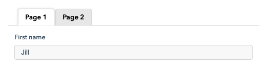

# Controls and forms

?>The following assumes that you are familiar with [Components](ess_components.md).

Capturing user input is a fundamental aspect of most web applications. While building these interactions, one can employ standard HTML input elements directly. However, this approach can quickly become burdensome, involving tasks such as handling loading states, populating retrieved values, detecting content changes, and managing error conditions. To simplify these complexities, most UI frameworks offer tools to componentize controls and better encapsulate standard behaviors. JUI is no exception: providing the primitive control component along with supporting constructs and a number of off-the-shelf implementations of commonly used controls.

This documentation covers, in detail, the JUI model for control based components; more specifically:

1. [Concepts](#concepts) covers the general concepts involved with controls and how controls are used.
2. [Control forms](#forms) provides a standardised approach to laying out controls, managing errors and getting and setting values.
3. [Custom controls](#custom-controls) introduces the development of new controls.

See also [Components & controls](cpt_overview.md) for descriptions of many of the controls.

## Concepts

Controls provide a means to interact with users around a singular value (for example, a name, a date or a choice among options). Controls themselves can be used in any context in which a component can (and indeed they are components themselves). However, controls are usually arranged collectively as forms. These can be relatively complex beasts in that they must associate controls with labels, present them in a suitable layout and manage the presentation of error messages.

Although you are free to build your own form mechanisms and custom controls JUI does provide a number out-of-the-box which should be suitable for most cases (described under [Standard JUI controls](#standard-jui-controls) and [Forms](#forms) for controls and forms respectively).

The remainder of this section focusses on the core concepts of controls that will enable you to understand the fundamental aspects of controls, in particular:

1. [Classes](#classes) describes the various classes and interfaces that define controls.
2. [Values](#values) describes how values are represented, assigned to and retrieved from controls.
3. [Validation](#validation) describes the means by which control values are validated (for client-side validation).
4. [State](#state) outlines the various states that controls occupy.
5. [Collective management](#collective-management) is a precursor to the notion of forms where controls may be managed collectively (particularly with relevance to state management and validation).
6. [Error message handling](#error-message-handling) introduces how error messages can be handled manually.

### Classes

As noted controls are themselves components so implement `IComponent` and further specified by `IControl`. A concrete (abstract) base class `Control` provides much of the boilerplate implementation.


It should be noted that controls:

1. are parameterised over a value type `V` (the value to which the control allows a user assign and to which the control can be initialised),
2. provide support for invalidation (directly invalidation and by way of validators),
3. support additional state (such as being *read only* or *dirty*), and
4. when added to a component can be managed collectively within the component.

With regard to implementation, details are provided under [Custom controls](#custom-controls) as well as [Standard JUI controls](#standard-jui-controls).

### Values

All controls manage a *value* which may be assigned (the control will then present to the user a state representing that value) or retrieved (generally after the user has interacted with the control to change the value).

Value assignmet is performed by way of invoking `void setValue(V)` or `void setValue(Value<V>)`. In the first the value assigned is as passed (with the default behaviour: the control is neither marked as *dirty* nor is any modified event generated). In the second one is able to modifiy the default behaviour (for example, forcing a modified event or marking the control as being dirty) along with providing a revised value. When a value is assigned (that does not dirty the control) this value is deemed the *reset value*; meaning that when `void reset()` is invoked the control reverts to this value (and is no longer marked as being dirty).

Value retrievel is by way of calling `V value()`. This is actually declared on the `IControlValue<V>` interface along with `boolean dirty()`, which determines if the control is dirty (that is, its current value differs from its reset value).

##### Modification events

Another way of retrieving the value is listening to the controls `IModifiedListener.onModified(IControl<?>)` event (see [Events](ess_events.md) for a description of the events mechanism). When a control changes this event is emitted and one can reach back to retrive the new value.  A slightly expediate means of listening to modification events is to lodge a *modified handler* with the controls configuration (see example below). This approach has the advantage of using a lambda-expression that is passed the control, the new value and the value prior to the change.

The following illustrates these concepts:

```java
// Component that creates a text control with an initial value and an HTML button that
// resets the text control back to its reset value. A modified handler is assigned to
// the control via configuration and writes changes to the console. 
ComponentCreator.build (root -> {
    TextControl ctl;
    // Create instance of a TextControl, assign it to ctl and configure with a modification
    // handler that is invoked whenever the control is modified by the user. Insert the
    // control into the components root element.
    Cpt.$ (root, ctl = new TextControl.Config ()
        .modifiedHandler ((c, val, prior) -> {
            Logger.info ("Value set: " + val);
        })
        .build ()
    );
    // Create an HTML button that, when clicked, resets the control created above. Insert into
    // the component root element (after the control).
    Button.$ (root).text ("Reset").onclick (e -> {
        ctl.reset ();
    });
    // Assign an initial value to the control and force a change event to be emitted. This
    // results in a console log being generated immediately (on render). Change this to
    // ctl.setValue ("Initial value"); and no event will be emitted (and no console log
    // written).
    ctl.setValue (Value.of ("Initial value").force ());
});
```

##### Keyword search

It is worth noting here that we can use controls, particularly the standard JUI `TextControl`, for implementing keyword search. One of the challenges with such search is that of being quite "chatty" where each keypress instigates a search query. This can introduce issues both in terms of load (on the server) and experience (non-responsivensss). A way around this is to mediate the number of modification events, which can be done with the `DelayedModifiedHandler`:

```java
.modifiedHandler (DelayedModifiedHandler.create (300, (ctl, val, prior) -> {
    // Do something here.
}));
```

This wraps a passed modification handler (in this case as a lambda-expression) in another handler that batches changes up into time-bands (300 milliseconds as configured) where only the last event in that band is passed through. There is also an additional threshold of a number of events (6 being the default) where the last of those events will always be passed through. This then allows a user to type a search term resulting in only a minimal number of underlying modification events to be generated.

### Validation

Controls manage validation through an `IInvalidator` returned by `invalidator()` (there are some additional support methods that delegate to the invalidator). The invalidator exposes `validate()` method that performs a validation test on the controls value and return whether or not that value is acceptable or not. For controls that are based on `Control` one may assign validators (from the `jui-validation` project and associated library); more on this can be found under [Standard JUI controls](#standard-jui-controls).

Upon validation validators may generate error messages along with a failed validation. In this case the control transitions to an *invalid* state (this may be cleared either on a call to the controls `reset()` method or a call to `IInvalidator.clear()` on the controls associated invalidator). The invalid state generally is represented visually (i.e. outlining in red).

The following example illustrates validation:

```java
// Here we create a component that contains a text control with two validators assigned to it:
// one for not being empty and one for not exceeding 10 characters. An HTML button invokes
// a validation on the control and if invalid obtains the messages from the control and writes
// them to the console log.
ComponentCreator.build (root -> {
    TextControl ctl;
    Cpt.$ (root, ctl = new TextControl.Config ()
        // This method accepts any number of validators. Each will be processed and
        // allowed to contruibute error messages. If any fail the control is marke as
        // being invalid and its state changes to indicate this (i.e. parts of it go
        // red).
        .validator (
            NotEmptyValidator.validator ("Cannot be empty"),
            LengthValidator.validator (0, 10, "Cannot be more that {max} characters")
        )
        .build ()
    );
    Button.$ (root).text ("Validate").onclick (e -> {
        // Validate the control. If it is invalid the retrieve and log the first error
        // message.
        if (!ctl.validate ())
            Logger.error ("INVALID! " + ctl.invalidator ().messages ().get (0));
    });
})
```

Note that invalidating a control only changes its presentation to indicate that it is invalid; no attempt is made to present any of the error messages. It is expected that the context in which the control is presented will perform this function (see [Form contructs](#form-constructs) for a standardised approach to this). Although error messages can be retrieved directly (as in the example above) on can take advantage of the  `IInvalidListener.onInvalidated(IControl<?>, List<String>)` event. This is emitted whenever there is a change of validation state (becoming invalid or clearing the invalidation state). Similarly with the modified listener there is an *invalidation handler* that can be assigned to the controls configuration that will be invoked on changes in validation state.

So far we have only considered invalidation arising from validators that have been assigned to the control, however, invalidation (and associated error messages) can be applied externally. This is achieved by calling `IInvalidator.invalidate(...)` and is usually employed when validation has been performed outside of the control (for example, when error messages have been returned from a remote call). Also provided is the method `accept(List<? extends IErrorMessage>)` which allow for the application of a collection of named error messages (generally sourced remotely). The `IErrorMessage` interface exposes `getPath()` which can be used by the controls invalidator to select which error messages apply to that control (these are then removed from the passed list). For controls that extend `Control` these paths can be assigned during configuration by way of the `acceptor(...)` family of methods (though note that if a control is assigned a name via `name(String)` then that name automatically becomes an acceptor thereby accepting error messages whose path matches the controls name).

The following example illustrates the application of external validation by faking an externally imposed error condition:

```java
// This component arranges two text controls (to capture first and last names) and an HTML
// button into into a single DIV using the flex layout to align horizontally. When the button
// is clicked a collection of contrived error messages are passed to each control using the
// "accept" method. The messages whose paths match the respective controls are picked up by
// those controls and invalidate them. Each control is assigned an invalidate listener which
// writes the respective controls (first) error message to the console log.
ComponentCreator.build (root -> {
    TextControl ctl1;
    TextControl ctl2;
    Div.$ (root).css ("display", "flex").css ("gap", "1em").$ (
        // Two controls created. The first control is assigned to accept error messages
        // whose path is "firstName". The second control picks up those whose path is
        // "lastName". Note that we could have named the controls these and the effect
        // would be the same (i.e. try replacing 'acceptor` with `name` and verify that
        // the error messages apply).
        Cpt.$ (ctl1 = new TextControl.Config ()
            .placeholder ("First name")
            .acceptor ("firstName")
            .build ()),
        Cpt.$ (ctl2 = new TextControl.Config ()
            .placeholder ("Last name")
            .acceptor ("lastName")
            .build ()),
        // A button is created at the end of the row. When activated it passes to each
        // control a list of (fake) error messages as if they were received from some other
        // system. Each control picks up its associated error message.
        Button.$ ().text ("Validate").onclick (e -> {
            List<IErrorMessage> errors = new ArrayList<> ();
            errors.add (new ErrorMessage ("firstName", "Not a valid first name"));
            errors.add (new ErrorMessage ("lastName", "Not a valid last name"));
            ctl1.invalidator ().accept (errors);
            ctl2.invalidator ().accept (errors);
        })
    );
    // Here we add invalid listeners directly to the components. When a component becomes
    // invalid the first error message will be written to the console log.
    ctl1.addListener (IInvalidListener.create ((ctl,errors) -> {
        Logger.error ("First name: " + errors.get(0));
    }, ctl -> {}));
    ctl2.addListener (IInvalidListener.create ((ctl,errors) -> {
        Logger.error ("Last name: " + errors.get(0));
    }, ctl -> {}));
})
```

There is an easier mechanism for validation across multiple controls and that is described under [Collective management](#collective-management).

### State

Controls maintain additional state over components, two of these have been described above (that of being *invalid* and *dirty*). The additional states are:

1. **Empty** when the control is deemed to have no value (this is quite dependent on the control, for example a text field will be empty if the contents are blank or a selector empty when none of the options have been selected).
2. **Read-only** when a control is intentionally being used to present information rather an being in a temporary state of disablement. Often this is accompanied with some form of lock symbolism.
3. **Waiting** when the control is awaiting content to present (i.e. data is being loaded).
4. **Suspended** when the control is blocked from participating in validations (and other relatived activties). This is used when one wishes to maintain visual state but take a control out of the flow of operation.

The following illustrates the waiting state:

```java
// A simple component that contains a text control that is initially put in the waiting state. An
// HTML button is added that, which clicked, assigns an initial value to the control and takes it
// out of the waiting state.
ComponentCreator.build (root -> {
    TextControl ctl;
    Cpt.$ (root, ctl = new TextControl.Config ()
        .build ());
    ctl.waiting (true);
    Button.$ (root).text ("Load").onclick (e -> {
        ctl.setValue ("Loaded value");
        ctl.waiting (false);
    });
})
```

We now turn to the standard JUI controls which will bring to life the concepts described above.

### Collective management

When controls are added to a component (which include controls created during rendering and added directly to the DOM, as in the examples given so far) they are grouped together so as to be able to be managed collectively. This management is provided through an instance of `ControlContext` yielded by a call to `ControlContext controls()`. Some of the facilities provided are:

1. Application of external error messages by extending the `accept(List<String> messages)` method to act across all controls (see first example below).
2. Retrieval of controls by name (see second example below). *Note that this is not type safe.*
3. Application of most of the state change actions (i.e. `waiting(boolean)`, `enable()`, `disable()`, etc).

Note that when a control is removed (either directly or by re-rendering or using `buildInto(...)`) that that control is also removed from collective management.

The following illustrates how to use the `ControlContext` to apply error messages externally, building on a similar example given previously:

```java
// This is similar to the example above (under the validation section) except this time we
// create a dedicated component and access that components controls object. This means that
// we don't have to maintain explicit references to the controls that have been created.
public class SimpleForm extends SimpleComponent {
        
    protected INodeProvider buildNode(Element el) {
        return Wrap.$ (el).$ (root -> {
            Div.$ (root).css ("display", "flex").css ("gap", "1em").$ (
                // For both the control we now employ the invalidation handler
                // approach (via configuration) to register a handler to listen
                // to changes in validation state. This handler is passed a
                // boolean (true if invalid) in the first argument and a list
                // of messages in the second.
                Cpt.$ (new TextControl.Config ()
                    .placeholder ("First name")
                    .acceptor ("firstName")
                    .invalidationHandler ((invalid,messages) -> {
                        if (invalid)
                            Logger.error ("First name: " + messages.get(0));
                    })
                    .build ()),
                Cpt.$ (new TextControl.Config ()
                    .placeholder ("Last name")
                    .acceptor ("lastName")
                    .invalidationHandler ((invalid,messages) -> {
                        if (invalid)
                            Logger.error ("Last name: " + messages.get(0));
                    })
                    .build ()),
                // As with the previous example we generate contrived errors. However this
                // time we pass them through to the controls object on the component. This
                // then distributes the errors to the controls.
                Button.$ ().text ("Validate").onclick (e -> {
                    List<IErrorMessage> errors = new ArrayList<> ();
                    errors.add (new ErrorMessage ("firstName", "Not a valid first name"));
                    errors.add (new ErrorMessage ("lastName", "Not a valid last name"));
                    SimpleForm.this.controls ().accept (errors);
                })
            );
        }).build ();
    }
}
```

The following example we continue to build on previous but explore the lookup of controls by name:

```java
// Here our component (as with the previous example) presents two text controls for first and
// last name. However we now have two HTML buttons. The first loads data into each of the text
// controls using the control context for the component, referencing the controls by name. The
// second retrieves the values and writes them to the console log. As an addition we start
// the controls off in a waiting state and revert that state when the load button is clicked
// for the first time.
public class LoadForm extends SimpleComponent {

    protected INodeProvider buildNode(Element el) {
        return Wrap.$ (el).$ (root -> {
            Div.$ (root).css ("display", "flex").css ("gap", "1em").$ (
                // Note the assignment of name.
                Cpt.$ (new TextControl.Config ()
                    .placeholder ("First name")
                    .name ("firstName")
                    .build ()),
                Cpt.$ (new TextControl.Config ()
                    .placeholder ("Last name")
                    .name ("lastName")
                    .build ()),
                Button.$ ().text ("Load").onclick (e -> {
                    LoadForm.this.controls ().waiting (false);
                    LoadForm.this.controls ().get ("firstName").setValue ("Jill");
                    LoadForm.this.controls ().get ("lastName").setValue ("Jones");
                }),
                Button.$ ().text ("Retrieve").onclick (e -> {
                    Logger.info ("First name: " + LoadForm.this.controls ().get ("firstName").value ());
                    Logger.info ("Second name: " + LoadForm.this.controls ().get ("lastName").value ());
                })
            );
        }).build ();
    }

    @Override
    protected void onAfterRender() {
        controls().waiting (true);
    }
}
```

To close out this section we introduce a simple mechanism for dealing with error messages themselves.

### Error message handling

A more comprehensive framework for organising controls into forms (which includes dealing with error messages) is described under [Forms](#forms). However there will be times where you want more flexibility and this means dealing with error messages directly. To facilitate this JUI provides the `ControlErrorBroker`.

A broker is created for each field to which is registered a place to assign an error class, a place to inject error messages (the expectation being a UL element) and the control under consideration. When the control changes validation state the broker applies (or removes) the error style and populates (or clears) the error message collective.

To illustrate the following is a simple example (wrapped in an inline component for brevity):

```java
ComponentCreator.build ((cpt, root) -> {
    Div.$ (root).$ (field -> {
        ControlErrorBroker errorBroker = new ControlErrorBroker ();
        field.with (n -> errorBroker.setErrorStyleTarget ((Element) n, "error"));
        Cpt.$ (field, Controls.text (cfg -> {
            cfg.placeholder ("Your name");
            cfg.validator (
                NotEmptyValidator.validator("Cannot be empty")
            );
        }, ctl -> {
            errorBroker.setControl (ctl);
        }));
        Ul.$ (field).$ (errors -> {
            errors.with (n -> errorBroker.setMessageTarget ((Element) n));
        });
    });
    // Here we invoke the components controls validator.
    Btn.$ (root, "Validate").onclick (()-> ((Component<?>) cpt.get ()).controls ().validate ());
});
```

Which presents as follows (after the validate button has been clicked when there is no content in the text field):


Observing that we have not specified any styling so appear in the "raw".

## Forms

Generally controls are assembled into logical units to capture a collective of information from the user at one time, that means they need to be assembled into a cohesive unit. This may be done manually (similar to the previous examples) but care needs to be taken in how error messages are managed, values are assigned and information retreived. In addition, complex forms may require controls to be made visible or hidden not to mention one should adhere to a standard look and feel to ensure consistency.

To facilitate this JUI provides a standardised mechanism in the form of the `ControlForm` component. With this you can assemble relatively complex forms and have the various behaviours managed automatically. Here we describe the mechanism in detail and how it can be used in an application.

The section is broken up as follows:

1. [Concepts](#concepts-1) outlines the key concepts for the standard JUI form mechanism.
2. [Building forms](#building-forms) walks through the process of building forms including detailed descriptions of the various facilities offered.
3. [Edit model](#edit-model) introduces the edit model used by forms along with a generalised editing frameworks implemented by the interface `IEditable`.
4. [Forms as dialogs](#forms-as-dialogs) describes some patterns one can use to turn a form into a dialog, including the used of `IProcessable` for automating updates and `IEditable` for provisioning.
5. [Multipage forms](#multipage-forms) can be used to break a form into separate pages that are navigated through in a step-wise manner.
6. [Implementation details](#implementation-details) is an advanced topic that discusses the implementation details of control form; this is not needed for a working knowledge of forms.

### Concepts

Here we briefly introduces some of the key concepts used in the JUI standard form mechanism. Just enough is presented here to allow you to make sense of the following section which makes a liberal use of examples and code snippets to more fully familiarise you with form building. Note that these forms employ the use of a builder pattern for construction, so there will be references to this in the following.

At the heart of a form is the *group* (the associated builder being `IGroupBuilder`). This may have a header and footer (both optional) between which are arranged vertically any number of *rows* or nested groups (just *groups* themselves but with formatting and sizing suitable for inclusion in a parent group) intermingled with other content (such as components or DOM) not specific to the form mechanism.

A *row* is a collection of *cells* which are setout horizontally in the row from left to right. Each cell has an optional label, a location for the display of error messages and a containment area for a control (though cells may also contain vanilla components, such as a button). Cells may also present help and guidance text (both optional).

Top-level groups are bundled into a *form* (the associated building be `IFormBuilder`) and that represents the form as a whole (these top-level groups actually toggle visbility so can be used to build stepped forms with one section being displayed at a time).

Now the forms and groups described above are not components themselves but adhere to the DOM builder principles (see [Rendering](topic_rendering.md)). For convenience a `ControlForm` component is provided that implements `IFormBuilder` and can be used to construct concrete forms. We use that exclusively in the examples that follow.

*Note that `ControlForm` adheres to the usual principles of [Components](ess_components.md), specifically the ability to modify the standard styles as well as being able to craft your own ones. See [Themes](topic_themes.md) for more details on this in the general setting.*

### Building forms

We introduce form building by way of a brief orienting example, we then proceed to describe in detail the various aspects of form building.

1. [Orientation](#orientation)
2. [Inline forms](#inline-forms)
3. [Inserting controls and groups](#inserting-controls-and-groups)
4. [Formatting and layout](#formatting-and-layout)
5. [Spacing and position](#spacing-and-position)
6. [Validation and errors](#validation-and-errors)
7. [References and control values](#references-and-control-values)
8. [Headers and footers](#headers-and-footers)
9. [Separators](#separators)
10. [Nested groups](#nested-groups)
11. [Side-by-side groups](#side-by-side-groups)
12. [Other content](#other-content)

#### Orientation

The most common approach is to extend `ControlForm` and configure the form from the constructor (ignore the `<Void,Void>` parameterisation for now, that will be explained later):

```java
public class FormExample extends ControlForm<Void,Void> {

    public FormExample() {
        super (new ControlForm.Config ().maxWidth (Length.px (500)));

        header (header -> {
            header.icon (FontAwesome.user ());
            header.title ("A simple form");
            header.instruction ("This is a simple form for demonstration purposes");
        });

        control ("Your name", Controls.text (cfg -> {
            cfg.placeholder ("Enter you name");
            cfg.name ("name");
            cfg.validator (
                NotEmptyValidator.validator ("please enter your name"),
                LengthValidator.validator (0, 40, "cannot exceed {max} characters")
            );
        }), cell -> {
            cell.grow (1);
            cell.required ();
        });

        // The bar is a convenience method to add an action bar to the form.
        bar (bar -> {
            bar.add (ButtonCreator.build(btn -> {
                btn.label ("Submit");
                btn.handler (() -> {
                    if (FormExample.this.validate ()) {
                        FormExample.this.controls ().forEach (ctl -> {
                            Logger.info (ctl.getName () + ": " + ctl.value ());
                        });
                    }
                });
            }));
        });
    }

}
```

We take note of the following points:

1. The form has a single (default) group with a header that contains a title (and icon) and some instructions.
2. There is a single row with a single cell containing a text field and label. The control is directly configured with a name, placeholder and validations. Separately the cell is configured for full width (the `grow(1)`) and is a required field (this only affected the visual presentation of the label, you still need to perform field-level validation separately, as is done here).
3. A button bar is added with a single button that when clicked validates the form. If the validation is successful each control is iterated over and its contents written to the console log. In an actual application you would likely perform a server-side call to process the captured data (more on this later).

The form renders as below (here we have clicked on the button with no content in the field, you can see that the form generates an error message at the top and locates the field messages under the text field).


Now this contains a single control which is declared using the `control(...)` method. This is actually a short-cut for creating a row and adding a control to that row. If we want to split the name into first name and last name with both controls on the same row then we need to be more explicit:

```java
// This replaces the `control (cfg -> {...})` method above.
row (row -> {
    row.control ("Your first name", Controls.text (cfg -> {
        cfg.placeholder ("Enter you first name");
        cfg.name ("firstName");
        cfg.validator (
            NotEmptyValidator.validator("please enter your first name"),
            LengthValidator.validator(0, 40, "cannot exceed {max} characters")
        );
    }), cell -> {
        cell.grow (1);
        cell.required ();
    });
    row.control ("Your last name", Controls.text (cfg -> {
        cfg.placeholder ("Enter you last name");
        cfg.name ("lastName");
        cfg.validator (
            NotEmptyValidator.validator ("please enter your last name"),
            LengthValidator.validator(0, 40, "cannot exceed {max} characters")
        );
    }), cell -> {
        cell.grow (1);
        cell.required ();
    });
});
```

This presents as follows (again, after clicking the submit button with no content, noting the location of the error messages as they appear under each control).


You can add multiple rows as you need:

```java
// Added below the row in the previous example.
row (row -> {
    row.control ("A description of yourself", Controls.textarea (cfg -> {
        cfg.name ("description");
        cfg.rows (5);
        cfg.validator (
            LengthValidator.validator (0, 400, "cannot exceed {max} characters")
        );
    }), cell -> {
        cell.grow (1);
    });
});
```

Which appears as follows:


You should have enough of an idea on how to proceed with implementing basic forms, at least enough to replicate the above and work with future examples. We move on to detailing specific aspects of form building.

#### Inline forms

In the previous section we created a control form by extending `ControlForm`. It is useful, at this point, to indicate that you can also create these inline (see [Components](ess_components.md#component-inlining) for details on inlining) using `ControlFormCreator`.

The following creates the form at the end of the last section using inlining:

```java
ControlFormCreator.<Void,Void> build (frm -> {
    frm.header (header -> {
        header.icon (FontAwesome.user ());
        header.title ("A simple form");
        header.instruction ("This is a simple form for demonstration purposes");
    });
    frm.row (row -> {
        row.control ("Your first name", Controls.text (cfg -> {
            cfg.placeholder ("Enter you first name");
            cfg.name ("firstName");
            cfg.validator (
                NotEmptyValidator.validator("please enter your first name"),
                LengthValidator.validator(0, 40, "cannot exceed {max} characters")
            );
        }), cell -> {
            cell.grow (1);
            cell.required ();
        });
        row.control ("Your last name", Controls.text (cfg -> {
            cfg.placeholder ("Enter you last name");
            cfg.name ("lastName");
            cfg.validator (
                NotEmptyValidator.validator ("please enter your last name"),
                LengthValidator.validator(0, 40, "cannot exceed {max} characters")
            );
        }), cell -> {
            cell.grow (1);
            cell.required ();
        });
    });
    frm.row (row -> {
        row.control ("A description of yourself", Controls.textarea (cfg -> {
            cfg.name ("description");
            cfg.rows (5);
            cfg.validator (
                LengthValidator.validator (0, 400, "cannot exceed {max} characters")
            );
        }), cell -> {
            cell.grow (1);
        });
    });
});
```

#### Inserting controls and groups

*In the following we make use of the `Controls` helper class to create controls for insertion into the form. For custom controls you need to instantiate these directly (or by your own helper classes).*

We begin with the `ControlForm` and note that it implements `IGroupBuilder`. What is happening under-the-hood is that the control form declares a top-level group transparently and delegate calls through to that. So when you make a calle to `row (...)` you are creating a row in that top-level group.

With this in mind we can create such a row and add a control to that row as follows:


```java
public class MyForm extends ControlForm<Void,Void> {

    public MyForm() {
        ...

        // Create a row in the top-level group.
        row (row -> {
            // Create a single control in the row.
            row.control ("Name", Controls.text (cfg -> {}));
        });
        ...
    }
    ...
}
```

In fact we can simplify this even more, since we are creating a single control in a single row we can call `control(...)` directly:

```java
public MyForm() {
    ...

    // Create a single control in a new row in the top-level group.
    control ("Name", Controls.text (cfg -> {}));
    ...
}
```

If, however, we want to add more than one control to the row then we need to go back to adding the row explicitly:

```java
public MyForm() {
    ...

    // Create a row in the top-level group.
    row (row -> {
        // Add controls to the row.
        row.control ("First name", Controls.text (cfg -> {}));
        row.control ("Last name", Controls.text (cfg -> {}));
    });
    ...
}
```

Since groups can contain nested groups then we can add to the top-level group a nested as follows:

```java
public MyForm() {
    ...

    // Adds a nested group to the top-level group.
    group (group -> {
        // Create a row in the nested group.
        group.row (row -> {
            // Add controls to the row.
            row.control ("First name", Controls.text (cfg -> {}));
            row.control ("Last name", Controls.text (cfg -> {}));
        });
    });
    ...
}
```

We can event keep going:

```java
// Adds a nested group to the top-level group.
group (group1 -> {
    // Create a second-level nested group (in the group).
    group1.group (group2 -> {
        // Create a row in the second-level nested group.
        group2.row (row -> {
            // Add controls to the row.
            row.control ("First name", Controls.text (cfg -> {}));
            row.control ("Last name", Controls.text (cfg -> {}));
        });
    });
});
```

Note that nested group can be used to delineate sections of your form as well as playing a functional role, for more on this see [Nested groups](#nested-groups).

#### Formatting and layout

Having discussed the insertion of contols (and groups, though we are not going to consider those here) we turn to the various formatting options available to us.

We know from our [Orientation](#orientation) that a row can contain any number of controls, each with their own label (which is optional) and locus for display error messages. If we look at a very simple layout:

```java
separator ();
row (row -> {
    row.control ("First name", Controls.text (cfg -> {}));
    row.control ("Second name", Controls.text (cfg -> {}));
});
```

Looks something like this (a separator has been included, see [Separators](#separators), simply to indicate the full width of the form):


So the controls appears as their natural, unconstrained, width. Rather, the cells that make up the row appear without any specific with and this fall to the natural widths of their controls the contain. We can assign a specific width to the controls but if we just want the controls to expand to take up the full width available then we can use the `grow(int)` method:

```java
row (row -> {
    row.control ("First name", Controls.text (cfg -> {}), cell -> {
        cell.grow (1);
    });
    row.control ("Second name", Controls.text (cfg -> {}));
});
```

Which appears as follows:


Note that we have used the version of the `control(...)` method that takes a `Consumer<IControlCell>` as its last argument. The `IControlCell` provides a number of methods that allow us to further configure the cell. In this case we gave directed the first cell to grow (while leaving the second cell alone). To balance these out we could configure the second cell:

```java
row (row -> {
    row.control ("First name", Controls.text (cfg -> {}), cell -> {
        cell.grow (1);
    });
    row.control ("Second name", Controls.text (cfg -> {}), cell -> {
        cell.grow (1);
    });
});
```

Note that the numbers passed to `grow(int)` are used to perform a relative sizing (under-the-hood this is just a flex layout and the `grow(n)` applies a `flex-grow: n`).

We can even create a special *expander* cell that contains no content by rows to fill as much space as possible:

```java
separator ();
row (row -> {
    row.expander ();
    row.control ("Name", Controls.text (cfg -> {}));
});
```

Which appears as follows:


We can also do a number of things with cells including disabling a control initially, providing guidance (or informational) text as well as help text next to the label:

```java
row (row -> {
    row.control ("First name", Controls.text (cfg -> {}), cell -> {
        cell.grow (1);
        cell.disable ();
    });
    row.control ("Middle name", Controls.text (cfg -> {}), cell -> {
        cell.grow (1);
        cell.guidance ("This is some guidance");
    });
    row.control ("Last name", Controls.text (cfg -> {}), cell -> {
        cell.grow (1);
        cell.help ("This is some help text");
    });
});
```

Which presents as (note that the help text only appears when the mouse hovers over the question mark):


You also have some control over the appearance of labels. First they can be marked as *required*, though this only changes its presentation and you need to assign (and perform) and relevant validation:

```java
row (row -> {
    row.control ("First name", Controls.text (cfg -> {}), cell -> {
        cell.grow (1);
        cell.required () ;
    });
    row.control ("Middle name", Controls.text (cfg -> {}), cell -> {
        cell.grow (1);
    });
    row.control ("Last name", Controls.text (cfg -> {}), cell -> {
        cell.grow (1);
        cell.required ();
    });
});
```

Which appears as:


We can even omit labels:

```java
row (row -> {
    row.control ("Name", Controls.text (cfg -> {
        cfg.placeholder ("First name");
    }), cell -> {
        cell.grow (1);
        cell.required() ;
    });
    row.control (null, Controls.text (cfg -> {
        cfg.placeholder ("Middle name");
    }), cell -> {
        cell.grow (1);
    });
    row.control (null, Controls.text (cfg -> {
        cfg.placeholder ("Last name");
    }), cell -> {
        cell.grow (1);
    });
});
```

Which appears as:


We finish this section with one additional note on cells. If you hide a control (see [Controls referencing other controls](#controls-referencing-other-controls)) then the cell itself (and thus any label, guidance or help text) will also be hidden.

#### Spacing and position

Most of the spacing is governed by the depth of nesting of groups (as noted above) however you do have some limited control over row spacing and the positioning of cell contents.

Sometimes you may want to adjust the spacing between rows (to open or tight up). This can be achieved with `adjustPrior(Length)`. A negative length will reduce the spacing and a positive one will increase it.

```java
...
row (row -> {
    row.adjustPrior(Length.px(-10));
    ...
```

You can also offset the contents of a cell with `offset(int,int)` where the first argument is a vertical adjustment (in pixels) and the second a horizontal.

```java
control (... , cell -> {
    cell.offset(-1, 1);
    ...
});
```
Note that the offset applies also to general components in a cell.

For grow cell (i.e. where `grow(...)` is set) the cell may be wider than the control. In this case the control will naturally be aligned to the left. You can change that alignment to be on the right:

```java
control (... , cell -> {
    cell.grow(1);
    cell.rightAlign();
    ...
});
```

#### Validation and errors

The `ControlForm` exposes the `validate()` method that, when invoked, will iterate over each active (that is, visible and accepting of input) component validating it (which will invoke any registered validators). Any control that is invalid will have its error messages presented (as illustrated in [Orientation](#orientation)) and will result in the `validate()` method returning `false` and the form displaying an error message at the top:


Naturally one can apply error messages directly to the form (such as after a remote call when the call fails) via `invalidate(List<? extends IErrorMessage>)`. Passed is a list of `IErrorMessage` instance, each encapsulating an error message and (generally) a path to the source of the message. This path can be mapped to a specific control by passing the path to the `acceptor(String...)` method during control configuration (see [Collective management](#collective-management)). When you invoke `invalidate(...)` the messages will be passed to each active control. If the control accepts the message then the message is removed from the list and the control marked as invalid (with the error message being displayed as described above). Any residual messages not picked up by a control are then displayed in error block at the top of the form.

Note that you can change the presentation of the error message either by using one of the approaches described in [Styles & themes](ess_styles.md) (see `ControlForm_Standard.css` for the standard styles) or by providing your own error renderer during configuration of the control form. For the latter the following:

```java
.errorRenderer ((el,msg) -> {
    Notice.$ (el)
        .adorn (FragmentAdornments.marginBottom (Length.em (2)))
        .variant (Notice.Variant.DANGER)
        .icon (FontAwesome.bell ())
        .message ("There was a problem, please see messages below").$ (body -> {
            if ((msg != null) && !msg.isEmpty ()) {
                Ul.$ (body).$ (errors -> {
                    msg.forEach (m -> Li.$ (errors).text (m.getMessage ()));
                });
            }
        });
})
```

uses the JUI `Notice` fragment and renders as:


Of course this needs to be done for all forms. For a universal change the recommended approach is to modify the CSS. The example above can be mimicked by introducing the replacement CSS file `ControlForm_Standard_Override.css`:

```css
.component .errors > div.errors_inner {
    border-left: 5px solid var(--cpt-form-error-icon);
}
```

in the directory `public/com/effacy/jui/ui/client/control/builder` off the module base of the main application JUI project (see [Styles & themes](ess_styles.md)).

#### References and control values

Controls are not very useful unless we can assign them values and retrieve value from them. We investigate these properties as well as other actions we can perform on controls.

*Note that forms do provide a more sophisticated set and get model that can be employed. This is described separately in [Advanced get and set model](#advanced-get-and-set-model).*

##### Getting and setting values

When assigning a control to a form you can either record a reference to the control instance in a variable and use that reference directly to get and set the controls value, or you can supply a *soft* reference by using the `by(String)` method on the cell handler and using methods on the modification context to access the control:

```java
row (row -> {
    row.control ("Name", Controls.text (cfg -> {}), cell -> {
        cell.by ("name");
    });
});
bar (bar -> {
    bar.add (ButtonCreator.build (btn -> {
        btn.label ("Submit");
        btn.handler (() -> {
            Logger.info ("Name: " + value ("name"));
        });
    }));
});
```

Here we have a single text field that has been assigned the soft reference `"name"` along with a button that writes the value of the text field to the console log. The buttons handler retrieves the text field value by calling the modification context method `value(String)` passing the soft reference of the control.

Since referencing is so common there are variants of the `control(...)` method that take the reference as the first argument:

```java
row (row -> {
    row.control ("firstName", "First name", Controls.text (cfg -> {}), cell -> {});
    row.control ("lastName", "Last name", Controls.text (cfg -> {}), cell -> {});
});
bar (bar -> {
    bar.add (ButtonCreator.build (btn -> {
        btn.label ("Submit");
        btn.handler (() -> {
            Logger.info ("First name: " + value ("firstName"));
            Logger.info ("Last name: " + value ("lastName"));
        });
    }));
});
```

To assign a value to a control we can use the `set(String,Object)` method on the modification context:

```java
row (row -> {
    row.control ("name", "Name", Controls.text (cfg -> {}), cell -> {});
});
bar (bar -> {
    bar.add (ButtonCreator.build (btn -> {
        btn.label ("Assign");
        btn.handler (() -> {
            set ("name", "Jill Jones");
        });
    }));
});
```

The modification context also provides a `control(String)` method that will retrieve the underlying control instance itself.

##### Controls referencing other controls

Often forms will have some dynamic aspect where some controls in the form configure based on the state of other controls.

Consider a simple example where there is a selection list for the title designation of a person, but we want them to be able to provide thier own designation when selecting an "Other" option. One approach to this problems builds on soft references and some of the state methods on the modification context:

```java
row (row -> {
    // Adds a selection list with two options: "Dr" and "Other".
    row.control ("title", "Title", Controls.<String> selector (cfg -> {
        cfg.allowSearch (false);
        cfg.modifiedHandler ((ctl, val, prior) -> {
            // When "Other" is selected we enable the "other" text field,
            // otherwise we clear and disable it.
            if ("Other".equals (val)) {
                enable ("other");
            } else {
                set ("other", "");
                disable ("other");
            }
        })
        .width (Length.em (10));
    }, "Dr", "Other"));

    // Adds in an empty text control to accept the "Other" designation.
    row.control ("other", "Other title (or salutation)", Controls.text (cfg -> {
        cfg.placeholder ("Other title");
    }), cell -> cell.grow (1));
});
onBuild (ctx -> {
    // This could have been done directly when configuring the cell
    // but it is here to emphasise the broad access one has to the
    // modification context and that we have a notion of code that can
    // be deferred until the form is built (which means we can do other
    // things as well).
    disable ("other");
});
```

Here we declare a soft reference to the text field and use that to change the state of the field from the modified handler of the selection control (this makes use of the `set(String,Object)` method introduced in the previous section and two new methods `disable(String)` and `enable(String)` on the modification context which are equivalent to invoking `enable()` and `disable()` on the control itself). The `onBuild(...)` method is used to set the initial state. The result is as follows:


And with the "Other" option selected:


*Note that we could replace `disable` and `enable` with `hide` and `show` for which we would then show and hide the "Other" control (and its associated label).*

Since soft references are more susceptible to mistyping, for complex arrangements it may be better to hold a direct reference to the controls involved. For comparison the following recasts the previous example using this approach:

```java
row (row -> {
    // Create direct reference to the text control.
    TextControl otherCtl = Controls.text (cfg -> {
        cfg.placeholder ("Other title");
    });
    otherCtl.disable ();

    // Add the selection control into the form that changes the state
    // of the text control created above.
    row.control ("title", "Title", Controls.<String> selector (cfg -> {
        cfg.allowSearch (false);
        cfg.modifiedHandler ((ctl, val, prior) -> {
            if ("Other".equals (val)) {
                otherCtl.enable ();
            } else {
                otherCtl.setValue ("");
                otherCtl.disable ();
            }
        })
        .width (Length.em (10));
    }, "Dr", "Other"));

    // Add the text control into the form.
    row.control ("Other title (or salutation)", otherCtl, cell -> cell.grow (1));
});
```

Or even make use of class membership and create the control inline: 

```java

// Class member.
private TextControl otherCtl;

...

row (row -> {
    // Create and assign the selector. This controls the state of the text
    // control assigned as a class member.
    row.control ("title", "Title", Controls.<String> selector (cfg -> {
        cfg.allowSearch (false);
        cfg.modifiedHandler ((ctl, val, prior) -> {
            if ("Other".equals (val)) {
                otherCtl.enable ();
            } else {
                otherCtl.setValue ("");
                otherCtl.disable ();
            }
        })
        .width (Length.em (10));
    }, "Dr", "Other"));

    // Create and assigne the text control.
    row.control ("Other title (or salutation)", otherCtl = Controls.text (cfg -> {
        cfg.placeholder ("Other title");
    }), handler -> handler.grow (1));

    // Set initially to disabled.
    otherCtl.disable ();
});
```

At the end-of-the-day the approach taken will depend on context and preference.

#### Headers and footers

Headers and footers can be added with the `IGroupBuilder` methods `header(Consumer<IHeaderBuilder>)` and `footer(Consumer<IFooterBuilder>)` methods.

The `IHeaderBuilder` configures the various elements of a header (such as the title, instructions and icon) while `IFooterBuilder` does the same for the footer.

For example:

```java
// Create a nested gropu with a header and a footer.
group (grp -> {
    grp.header (hdr -> {
        hdr.title ("Personal details");
        hdr.instruction ("Only provide details that you want to provide and are happy others will see.");
    });
    grp.footer (ftr -> {
        ftr.guidance ("Preferred name is an informal name that you would like others to refer to you as.");
    });
});
```

Which renders as follows:


Headers and footers also provide a means to provider a renderer, as a lambda-expression that is passed an `ElementBuilder`. If a renderer is supplied then it will be used rather than any of the other configuration.

#### Separators

A group may declare a separator, which places a line above the group thereby separating it from the previous (in a manner that respect layout spacing).

```java
group (grp -> {
    grp.header(header -> {
        header.title ("This group has no separator");
        header.instruction ("This group appears above a group that has a separator.");
    });
});
group (grp -> {
    grp.separator ();
    grp.header(header -> {
        header.title ("This group has a separator");
        header.instruction ("Separators appear above the group to differentiate between the group and the previous group.");
    });
});
```

Which presents as follows:


For separating rows in a group consider an approach such as described in [Other content](#other-content) (for example, using a horizontal line DOM element).

#### Nested groups

Groups themselves may contain groups, up to a limit of 4 levels of nesting, and these groups are used to encapsulate controls (and other content). There are several purposes for doing so. One reason is that nested groups offer increasingly tightened presentation. Additionally, groups may be shown or hidden, and they may participate in defining selection options. We will explore each of these in turn.

##### Visual hierarchy

First we simple re-construct the form in the previous example to appear inside a nested group. The nested group is added with the `group (...)` method and configured via the passed lamnda-expression:

```java
// This builds on the previous example by replace the invocations of `header(...)`
// and `row(...)` with the following.
group (grp -> {
    grp.header (header -> {
        header.icon (FontAwesome.user());
        header.title ("A simple form");
        header.instruction ("This is a simple form for demonstration purposes");
    });
    grp.row (row -> {
        row.control ("Your first name", Controls.text (cfg -> {
            cfg.placeholder ("Enter you first name");
        }), cell -> {
            cell.grow (1);
            cell.required ();
        });
        row.control ("Your last name", Controls.text (cfg -> {
            cfg.placeholder ("Enter you last name");
        }), cell -> {
            cell.grow (1);
            cell.required ();
        });
    });
    grp.row (row -> {
        row.control ("A description of yourself", Controls.textarea (cfg -> {
            cfg.name ("description");
            cfg.rows (5);
        }), cell -> {
            cell.grow (1);
        });
    });
});

```

The effect is apparent in the presentation below where the title is of a slightly smaller font size and the row spacing is more compact:


As compared to the non-nested version (slightly larger title font and row spacing):


##### Showing and hiding groups

We can also show and hide groups:

```java
control (null, Controls.check (cfg -> {
    cfg.label ("I have some additional information to add");
    cfg.modifiedHandler ((ctl, val, prior) -> {
        if (val)
            show ("extrainfo");
        else
            hide ("extrainfo");
    });
}));
group (subgrp -> {
    subgrp.by ("extrainfo");
    subgrp.indent (Length.em (2.5));
    subgrp.header (header -> {
        header.instruction("Please provide the additional information in the fields below");
    });
    subgrp.control("First extra bit of information", Controls.text(cfg -> {}), cell -> {
        cell.grow (1);
    });
    subgrp.control("Second extra bit of information", Controls.text(cfg -> {}), cell -> {
        cell.grow (1);
    });
});
onBuild (ctx ->  {
    ctx.hide ("extrainfo");
});
```

Which presents as follows:


Noting that when the checkbox is un-checked the contents below (in the nested group) become hidden.

Delving into the code snippet we give the nested group the reference `extrainfo` by way of the `by(String)` method. Since the `ControlForm` implements `IModificationContext` we can invoke directly on it the `show(...)` and `hide(...)` methods which operate by way of reference (this not only includes nested groups by named controls and components). This facility is employed by the modification handler configured againt the check control. Finally we want the nested group to be hidden by default and we registed an `onBuild(Consumer<IModificationContext>)` handler for this purpose (this is executed when the form is built and the modification context is operational, in this case we use the same `hide(...)` method as previously mentioned to hide the group).

Finally we take note of the indent (`subgrp.indent (Length.em (2.5))`) which shifts the nested group to the right and aligns it with the label on the check box. Nested group have no alignment adjustments by default.

##### Conditional groups (single)

In the previous example we used a checkbox control to open and close a group, simply to illustrate show and hide. If what you really want is a checkbox to open a group then there is a better way (aesthetically anyhow) using *conditional groups*.

Let us recast the above example:

```java
group (subgrp -> {
    subgrp.conditional (cond -> {
        cond.active ();
    });
    subgrp.header (header -> {
        header.title ("I have some additional information to add");
        header.instruction("I have some additional information to provide");
    });
    subgrp.control("First extra bit of information", Controls.text(cfg -> {}), cell -> {
        cell.grow (1);
    });
    subgrp.control("Second extra bit of information", Controls.text(cfg -> {}), cell -> {
        cell.grow (1);
    });
});
```

Which looks like:


Looking carefully we see that we (separate from what we have removed) have added:

```java
subgrp.conditional (cond -> {
    cond.active ();
});
```

This makes the group a *conditional* one that is initially in the active (open) state (if we were happy with the default state the expresion could have been empty `subgrp.conditional (cond -> {})`).

If we want to find the state of the group (open or closed) then we can given the group a reference and use the modification context `value(...)` method:

```java
group (subgrp -> {
    subgrp.by ("extrainfo");
    ...
});
...
boolean extraInfoOpen = value ("extrainfo");
```

This treats a conditional group like a boolean-valued control.

Now we observe that the heading is quite prominent. We can reduce the size (and spacing more generally) by nesting the group at a greater depth. As a convenience we can appeal to one of the `group2(...)` or `group3(...)` methods:

```java
group3 (subgrp -> {
    subgrp.conditional (cond -> {
        cond.active();
    });
    subgrp.header (header -> {
        header.title ("I have some additional information to add");
        header.instruction("I have some additional information to provide");
    });
    ...
});
```

Which renders as:


Now we can go beyond single conditional groups (where the control is to open or close that specific group) to selecting among several groups (using radio buttons). This is the topic of the next section.


##### Conditional groups (multiple)

Showing and hiding groups is useful but sometimes we want to be able to select among several options so that only one is selected and shown at any one time. This behaviour is configured using the `group(...)` configuration inside of `conditional(...)`, as illustrated in the following example:

```java
group2 (grp -> {
    grp.group (sub -> {
        sub.conditional (cond -> cond
            .active (true)
            .group ("UserType", "standard")
            .behaviour (ConditionalBehaviour.HIDE)
        );
        sub.header (hdr ->  hdr
            .title ("Standard user")
            .instruction ("A standard user is one that represents a real person and can be invited to access this account.")
        );
        sub.control ("email", "The users' email address", Controls.text (cfg -> {}), cell -> {
            cell.grow (1);
        });
    });
    grp.group (sub -> {
        sub.conditional (cond -> cond
            .group ("UserType", "api")
            .behaviour (ConditionalBehaviour.HIDE)
        );
        sub.header (hdr -> hdr
            .title ("API user")
            .instruction ("Use this to allows a third party application to access this account via the API.")
        );
        // See the 'Other content' section below for an explanation
        // of what this does.
        Notice.$ (sub).message ("An API key and associated secret will be generated when the user is created");
    });
});
onReset (ctx -> {
    ctx.set ("UserType", "standard");
});
```
Here we declare a single outer group of depth 2 (to reduce the size and spacing of the conditional groups) containing two conditionally configured groups:

1. Configured with the collective grouping under the name `UserType` with respective descriminators `standard` and `api`. The group name is used to tie the groups together thereby allowing one to toggle between the groups.
2. To hide when not active (via `ConditionalBehaviour.HIDE`).
3. The first group is active initially.
4. On reset sets the first group as being active (conditional groups are 'wired' into the modification context `set(...)` method to be treated as a form of control themselves.

This effect is as follows - with the first option selected (the default state):


and with the second option selected:


Note that a title is required in all cases (which aligns with the selector control).

Finally, we can determine which group is selected by using the grouping name passed through to the `value(...)` retrieval method on the modification context (which is available on the `ControlForm`):

```java
if ("api".equals (value("UserType")))
    ...
else
    ...
```

In this way the grouping acts like a control from which a value can be obtained (as noted above, also set using `set(...)` which will activate the group with the matching discriminator).

#### Side-by-side groups

A group may be marked with `horizontal()` in which case its contents are rendered not vertically but horizontally (i.e. side-to-side). This is useful for setting groups of controls in columns.

#### Other content

Other types of content can be included into a group and can be included in different places and be of different types. We begin by describing how one can include components (rather than controls) into cells then move onto more general content directly into the body content of the group.

##### Components in cells

Controls are not the only constructs that can be assigned to a cell, any component can. This is particularly useful for incorporating actions:

```java
row (row -> {
    row.control ("Owner / operator", Controls.selector (cfg -> {
        cfg.placeholder ("Select person");
    }), cell -> {
        cell.grow (1);
    });
    row.component (ButtonCreator.build (cfg -> {
        cfg.label ("Add new");
        cfg.iconOnLeft ().icon (FontAwesome.plus ());
    }));
});
```

Which displays a text field and button on the same row:


Note the we have used the `component(IComponent)` method on the row to add a cell containing a component (rather than one of the `control(...)` methods). Adding components is a simplified process as we need not concern ourselves with values and labels.


##### Additional body content

We can move beyond cells and insert components direcly into the flow of body content (that is, at the same level as rows, nested groups and separators):

```java
group (grp -> {
    grp.control ("First field", Controls.text (cfg -> {}), cell -> {
        cell.grow(1);
    });

    // An inline component is used to wrap up the DOM content.
    grp.insert (ComponentCreator.build (cpt -> {
        cpt.css ("display", "flex").css (CSS.GAP, Length.em (1)).css (CSS.COLOR, Color.variable ("--jui-text"));
        Em.$ (cpt).style (FontAwesome.cat()).css (CSS.FONT_SIZE, Length.em (1.3));
        P.$ (cpt).css (CSS.MARGIN, Insets.em(0))
            .text ("This is some content that has been introduced directly.");
    }));

    grp.control ("Second field", Controls.text (cfg -> {}), cell -> {
        cell.grow(1);
    });
});
```
Here we have created an inline component (for convenience, however any component would do) whose DOM content displays a cat icon with some text (suitably styled). This renders as follows:


If one looks closely at the signature of the group `insert(IDomInsertable...)` method, it actually takes any number of `IDomInsertable`'s of which the DOM builder framework provides (see [Rendering](topic_rendering.md) for a full description of DOM building and the various classes and interfaces involved). This means that we could insert DOM directly, thereby recasting the previous example as:

```java
group (grp -> {
    grp.control ("First field", Controls.text (cfg -> {}), cell -> {
        cell.grow (1);
    });

    // Since we can insert an IDomInsertable we can avoid creating a component
    // and just inject the DOM directly through the DomBuilder.
    grp.insert (parent -> Div.$(parent).$(div -> {
        div.css("display: flex; gap: 1em; color: var(--jui-text);");
        Em.$(div).style (FontAwesome.cat()).css("font-size: 1.3em;");
        P.$(div).css("margin: 0;")
            .text ("This is some content that has been introduced directly.");
    }));
    
    grp.control ("Second field", Controls.text (cfg -> {}), cell -> {
        cell.grow (1);
    });
});
```

If fact the `insert(...)` method comes from `IDomInsertableContainer` which `IGroupBuilder` extends. That means we can employ the DOM builder helper classes even more directly:

```java
group (grp -> {
    grp.control ("First field", Controls.text (cfg -> {}), cell -> {
        cell.grow(1);
    });

    // Even easier is to use our DOM helper classes directly on the group.
    Div.$ (grp).css ("display", "flex").css (CSS.GAP, Length.em (1)).css (CSS.COLOR, Color.variable ("--jui-text")).$ (
        Em.$ ().style (FontAwesome.cat()).css (CSS.FONT_SIZE, Length.em (1.3)),
        P.$ ().css (CSS.MARGIN, Insets.em(0)).text ("This is some content that has been introduced directly.")
    );

    grp.control ("Second field", Controls.text (cfg -> {}), cell -> {
        cell.grow(1);
    });
});
```

The above is a fairly artifical example, a more realistic (and useful) one is inserting a notification (using the `Notice` fragment; see [Components](topic_rendering.md#jui-standard-fragments) for a description of fragments):

```java
group (grp -> {
    grp.control ("First field", Controls.text (cfg -> {}), cell -> {
        cell.grow(1);
    });
    Notice.$ (grp).message ("Please take note of this important piece of information!");
    grp.control ("Second field", Controls.text (cfg -> {}), cell -> {
        cell.grow(1);
    });
});
```

Which renders as:


Building on this you can even show and hide the notice (making use of the `use(Consumer<Node>)` method) much in the same way to would with a standard rendering:

```java
Element noticeEl;

...

Notice.$ (grp)
    .message ("Please take note of this important piece of information!")
    .use (n -> noticeEl = (Element) n);

...

if (/* condition */)
    JQuery.$ (noticeEl).show ();
else
    JQuery.$ (noticeEl).hide ();
```

### Edit model

In general a form is structured around the editing of existing content or the capture of new content. In the former case one first needs to assign the values being edited to the relevant controls, while in both cases the values of controls need to be obtained and consolidated to be actioned.

#### Value assignment and retrieval

Obtaining and assigning values can be onerous and sometimes complex. One approach is to encapsulate the assignment and retrieval in a contigous block of code, such as (the same principle applies if we access the controls directly rather than by name):

```java
public void edit(MyResult data) {
    // Assign values to the controls.
    set ("firstName", data.getFirstName ());
    set ("lastName", data.getLastName ());
    ...
}

public void process() {
    // Retrieve values from the controls.
    MyResult data = new MyResult();
    data.setFirstName ((String) get ("firstName"));
    data.setLastName ((String) get ("lastName"));
    ...
    // Do something with data.
}
```

An alternative approach is provided by `ControlForm` and that is the use of the `edit(SRC)` and `retrieve(DST)`
method where `SRC` and `DST` are the parametrising types in `ControlForm<SRC,DST>` (in the previous examples we have considered these as `Void` and simply not used them).

##### Assignment

Looking at `edit(SRC)`, this iterates over each control and makes use of a declared *getter* to get a value from the passed `SRC` object to assign to the control. This getter is declared during the declaration of the control. The following example illustrates this assuming that `SRC` is the `MyResult` class inferred in the example above:

```java
...
row (row -> {
    row.control ("First name", Controls.text (cfg -> {
        cfg.placeholder ("First name");
    }), cell -> {
        cell.grow (1);
        // Assign a value getter that extracts the first name from the MyResult
        // instance and uses that to populate the control.
        cell.edit (v -> v.getFirstName ());
    });
    row.control ("Last name", Controls.text (cfg -> {
        cfg.placeholder ("Last name");
    }), cell -> {
        cell.grow (1);
        // Assign a value getter that extracts the last name from the MyResult
        // instance and uses that to populate the control.
        cell.edit (v -> v.getLastName ());
    });
});
...
```

You can see the declaration of the getter is made using the `edit(IGetter<V,SRC>)` method on the cell handler. Here `V` is the control value and `IGetter<V,SRC>` is a functional interface that takes a single argument (the `SRC` object) and returning a value (of type `V`) to assign to the control.

To update the controls in the form we simply call `edit(...)` on the form instance. Here is a more explicit example.

```java
// Create a form; note that the first generic type is MyData (the type
// value being set).
ControlForm<MyData,Void> form = ControlFormCreator.build (frm -> {
    frm.row (row -> {
        row.control ("First name", Controls.text (cfg -> {
            cfg.placeholder ("First name");
        }), cell -> {
            cell.grow (1);
            cell.edit (v -> v.getFirstName ());
        });
        row.control ("Last name", Controls.text (cfg -> {
            cfg.placeholder ("Last name");
        }), cell -> {
            cell.grow (1);
            cell.edit (v -> v.getLastName ());
        });
    });
});

// Add the form (this assumes it is being added to a panel but could be
// anything).
add (form);

// Assign a value to the form to edit.
MyData data = new MyData ();
data.setFirstName ("Jill");
data.setLastName ("Jones");
form.edit (data);
```

Which presents as follows:


?> There is another form of edit which passes the control along with the source value, so one may write `edit ((ctl,v) -> {...; return ...;})`. This allows you to change control state according to the source value.

##### Retrieval

To extract form values and place them into an object we can make use of the `retrieval(DST)` method on `ControlForm<SRC,DST>`. As with `edit(...)` this iterates over each control and makes use of a declared *setter* to apply the control value to the passed `DST` object. We extend the example above to support retrieval:

```java
// Note that we have set the second generic type to MyData.
ControlForm<MyData,MyData> form = ControlFormCreator.build (frm -> {
    frm.row (row -> {
        row.control ("First name", Controls.text (cfg -> {
            cfg.placeholder ("First name");
        }), cell -> {
            cell.grow (1);
            cell.edit (v -> v.getFirstName ());
            // Assign a value setter that takes the control value and assigns it to the
            // destination object.
            cell.retrieve ((ctx,val,dst) -> dst.setFirstName(val));
        });
        row.control ("Last name", Controls.text (cfg -> {
            cfg.placeholder ("Last name");
        }), cell -> {
            cell.grow (1);
            cell.edit (v -> v.getLastName ());
            // Assign a value setter that takes the control value and assigns it to the
            // destination object.
            cell.retrieve ((ctx,val,dst) -> dst.setLastName(val));
        });
    });
});
add (form);

// This will probably be invoked via some action (i.e. button).
MyData data = form.retrieve (new MyData ());
Logger.info (data.getFirstName() + " " + data.getLastName());
```

As noted in the comment the retrieval will tend to be instigated upon some action (such as the click on a save button). With this in mind, such an action implies acting only on those controls that have actually changed (i.e. those that are dirty). The default behaviour is that setters are only invoked on those controls that are dirty, so that the object passed will only be populated which changed data. This is quite good when the passed object is some form of command (see [Remoting](topic_remoting.md#command-class)). However, that behaviour can be problematic and you may want the setter being invoked in all cases. You can change this behaviour by setting the `setterApplyWhenNotDirty` property on the `ControlForm.Config` configuration passed through during form construction.

#### Generalised editing (and `IEditable`)

If you look at `ControlForm<SRC,DST>` carefully you will notice that it implements `IEditable<SRC>`. This interface provided a generalised behaviour for editing and provides a contract for the `edit(...)` method. In particular:

1. Most of the methods have default implementations that iterate over child components and delegating to those children than also implement `IEditable`.
2. There are support methods for displaying a loading state `editLoading()` and responding to a failed edit state (i.e. when loading fails) `editFailed(...)`.
3. Support is provided for asynchronous loading via `edit(IResolver<V>)` (where the underlying data needs to be loaded from an external source, i.e. remotely).

Now `ControlForm` provides specific implementations for `editLoading()` and `editFailed()`. For the former this puts all the controls into their *waiting* state, this changes their presentation to one that signals information is being loaded. In the second case the form presents an error message at the top of the form (similar to the case where there are validation errors).

Before moving onto point (1) we make a brief note on asynchronous loading (3). The interface `IResolver` declares a single method `void resolve(Consumer<T> receiver, Consumer<String> failure)` which is expected to invoke one of the passed consumer callbacks to fullfil the promise of retrieving the underlying value or flagging an error. The default `edit(IResolver<V>)` method employs the balance of methods on `IEditable` to place the component in the loading state, retrieve the value and either assign it with `edit(V)` or, if there is an error, place the component in an error state with `editFailed(String)`. The advantage here is that you can decouple the mechanism of remote loading from the state lifecycle of the form, and to do so in a reusable manner. An example resolver implementation follows where there is an editable result `MyResult` and a summary variant `MyQueryResult` which does not have enough information to perform an edit but you want to use to trigger an edit:

```java
public MyResultResolver implements IResolver<MyResult> {

    public static IResolver<MyResult> of(MyQueryResult result) {
        // A remote load is required and we wrap around the result ID.
        return new MyResultResolver (result.getId ());
    }

    public static IResolver<MyResult> of(MyResult result) {
        // Here we don't actually need to perform a remote load as we
        // have the result at hand. So we just wrap it.
        return IResolver.of (result);
    }

    private long id;

    MyResultResolver(long id) {
        this.id = id;
    }

    @Override
    public void resolve(Consumer<MyResult> receiver, Consumer<String> failure) {
        // A remote invocation for illusration (could be any means of retrieval).
        new MyServiceHandler<MyResult> ()
            .onSuccessful (v -> {
                receiver.accept (v);
            })
            .onFailure ((v, s) -> {
                String msg = v.isEmpty () ? "Unknown error" : v.get (0).getMessage ();
                failure.accept (msg);
            })
            .remoteExecute (new MyResult(id));
    }
}
```

We can the invoke an edit as follows:

```java
form.edit (MyResultResolver.of (...));
```

We finish the section off by illustrating how we can take advantage of `IEditable`. As noted in point (1) the default implementation of each method delegates through to the children. We can illustrate this in motion by considering a tabbed panel that contains several forms:

```java
public class MyTabbedForm extends TabNavigator implements IEditable<MyData> {

    public MyTabbedForm() {
        super (new TabNavigator.Config ().padding (Insets.em (1)).minHeight (Length.px (200)));

        // First tab contains a single control form that contains a text field for
        // the first name (of MyData).
        tab ("page1", "Page 1", ControlFormCreator.<MyData,Void> build (frm -> {
            frm.control ("First name", Controls.text (cfg -> {
                cfg.placeholder ("First name");
            }), cell -> {
                cell.grow (1);
                cell.edit (v -> v.getFirstName ());
            });
        }));

        // Second tab contains a single control form that contains a text field for
        // the last name (of MyData).
        tab ("page2", "Page 2", ControlFormCreator.<MyData,Void> build (frm -> {
            frm.control ("Last name", Controls.text (cfg -> {
                cfg.placeholder ("Last name");
            }), cell -> {
                cell.grow (1);
                cell.edit (v -> v.getLastName ());
            });
        }));
    }
}

...

// Here it is being added to a panel.
MyTabbedForm form = add (new MyTabbedForm ());
MyData data = new MyData ();
data.setFirstName ("Jill");
data.setLastName ("Jones");
// Invoke edit which passes through to each of the child forms components.
form.edit (data);
```

Here the tabbed pabel implements `IEditable<MyData>`, thus inherits the default implementations of the various methods. This delegates through to the child components (being the tabs) which is what we want. When we invoke `edit(...)` the edit method is invoked on each of the child `ControlForm`'s which applies the value to the separate controls in each form. The result is as follows:




### Forms as dialogs

It is quite common to present forms in dialogs (see [Modals](ess_modals.md) for an indepth discussion of dialogs). The simplest approach is to create a dedicated class for the form (including processing the data from the form) then embedding some code that wraps an instance of the form in a dialog.

We explore expressions of these form-based modals in various circumstances, beginning with capture forms (i.e. what one may use in the situation of a create flow) then moving to updates.

It should also be noted that there are plenty of ways one can embed forms in dialogs; so those described here are in no way privileged.

#### Capture forms

Here we only want to use a form to capture information; the following illustration will be used to describe the concepts and constructs that apply:

```java
/**************************************************************************
 * Simple data class for representing the form contents.
 **************************************************************************/
public class MySimpleFormData {

    private String name;

    public void setName(String name) {
        this.name = name;
    }

    public String getName() {
        return name;
    }
}

/**************************************************************************
 * This is a form component that is "dialogised".
 **************************************************************************/
public static class MySimpleCaptureForm extends ControlForm<Void,MySimpleFormData> implements IProcessable<MySimpleFormData> {

    // Dialog support

    private static IDialogOpener<Void, MySimpleFormData> DIALOG;

    public static void open(Consumer<Optional<MySimpleFormData>> cb) {
        if (DIALOG == null)
            DIALOG = ModalDialogCreator.<Void, MySimpleFormData, MySimpleForm>dialog (new MySimpleCaptureForm (), cfg -> {
                cfg.title ("Enter a name")
                    .type (Type.CENTER)
                    .width (Length.px (450));
            }, cancel -> cancel.label ("cancel"), apply -> apply.label ("Accept"));
        DIALOG.open (null, cb);
    }

    // Form itself

    public MySimpleCaptureForm() {
        super (ControlFormCreator.createForDialog ());

        // Single text field that populates the `name` property of the
        // form data class MySimpleFormData.
        control ("name", "Name", Controls.text(cfg -> {
            cfg.validator (NotEmptyValidator.validator ("Please enter a name"));
        }), cell -> {
            cell.grow (1);
            cell.required ();
            cell.retrieve ((ctx,val,dst) -> dst.setName(val));
        });
    }

    // From IProcessable

    @Override
    public void process(Consumer<Optional<MySimpleFormData>> outcome) {
        if (!validate ()) {
            outcome.accept (Optional.empty ());
            return;
        }
        outcome.accept(Optional.of (retrieve(new MySimpleFormData())));
        return;
    }

}
```

We first note that the class extends `ControlForm` and is parameterised by `Void` and `MySimpleFormData`. The `Void` indicates that no [set](#assignment) value type is being specified (which is typical for capture-only forms) while `MySimpleFormData` is the composite value [retrieved](#retrieval) from the form (in this case it has only one property that reflects the contents of the name text field).

The form itself is built into the contructor (note that `ControlFormCreator.createForDialog ()` simply creates a base configuration for the `ControlForm` that is reasonable for use the constrained environment of a dialog). This consists of a single `name` text field with a non-empty validator and a retrieval declaration that populates the `name` property of `MySimpleFormData`.

The class also implements `IProcessable<MySimpleFormData>` which declares the `process(Consumer<Optional<MySimpleFormData>>)` method. The modal dialog mechanism (described shortly) can automatically detect this and will invoke it when the action button is clicked. When invoked the method first validates the form and if it fails invokes the callback with `Optional.empty()`. The dialog mechanism interprets this as a failed form processing and keeps the dialog open. If the validation is successful an instance of `MySimplFormData` is populated (via `retrieve(...)`, as described in [edit form retrieval](#retrieval)) the returned to the callback. The dialog mechanism detects that something has been returned and closes the dialog (more on this in a moment).

?>In this simple example the `process(...)` method just captures the data from the form, encapsulating it in an instance of `MySimplFormData` and returns that instance. More generally a form will pass data back to the server for processing and the result of that is returned back to the caller of the dialog.

We now turn the dialog enablement itself, which is emboded in the following code:

```java
private static IDialogOpener<Void, MySimpleFormData> DIALOG;

public static void open(Consumer<Optional<MySimpleFormData>> cb) {
    if (DIALOG == null)
        DIALOG = ModalDialogCreator.<Void, MySimpleFormData, MySimpleForm>dialog (new MySimpleForm (), cfg -> {
            cfg.title ("Enter a name")
                .type (Type.CENTER)
                .width (Length.px (450));
        }, cancel -> cancel.label ("cancel"), apply -> apply.label ("Accept"));
    DIALOG.open (null, cb);
}
```

What is happening here is that we are constructing an instance of `IDialogOpener` specific to our form (the dialog opener is a simple mechanism that allows one to open and close repeatedly a dialog in a managed way) and holding that as a static member on our form class (and facilitate re-use throughout an application). The opener is built with the `dialog(...)` static method on the helper class `ModalDialogCreator`. The first argument passed is a component that embodies the content of the dialog, the second is the configuration for the dialog itself (here we provide a title, style and fixed width). The third argument configures the cancel button while the last configures the action button. *There are other variants to this method which afford a much greater degree of configuration, but this version is generally sufficient for most form-based dialogs.*

To invoke the dialog we simply call the static method `open(...)` which will create the dialog opener (if not already created - recall that we are operating in a single threaded environment here so no need for synchronisation) then invoke the openers own `open(...)` method. This method take two arguments, the first we don't need (so is `null`) while the second is a callback.

As you may guess, `open(...)` can be called multiple times (re-opening the dialog). The dialog opening detects for `IResetable` (which `ControlForm` implements) and automatically invokes `reset()` on open. This ensures the form controls are reset between opens.

The following illustrates how this can be used in practice: 

```java
// Standard JUI button that opens the dialog when clicked.
ButtonCreator.build (cfg -> {
    cfg.label ("Get name");
    cfg.handler (() -> {
        MySimpleForm.open (outcome -> {
            outcome.ifPresent (value -> {
                // Log the value returned by the form to the console.
                Logger.info (value.getName ());
            });
        });
    });
});
```

Which presents as:


To finish we make a quick note on the callback. The signature appears twice: once on the dialog `open(...)` method and again on `process(...)`. The second is actually called through by the dialog opener while the first is actively invoked by the opener. If the process invocation is successful the outcome is delegated through and the dialog is closed, if not successful it is not delegated but rather the dialog simply remains open. If the dialog is cancelled (either by the close action or the cancel button) them the callback to the `open(...)` method is invoked with `Optional.of ()` (an empty value) and the dialog is closed. We see the use of this behaviour in the invocation code above where the outcome is tested for being present and if it is the name property is written to the console.

#### Update forms

In the previous example the first generic parameter of `ControlForm` was `Void`, which is used when we don't intend to provide data to the form to be updated. If we want to update data we can proceed as follows:

```java
public static class MySimpleUpdateForm extends ControlForm<MySimpleFormData,MySimpleFormData> implements IProcessable<MySimpleFormData> {

    private static IDialogOpener<MySimpleFormData, MySimpleFormData> DIALOG;

    public static void open(MySimpleFormData data, Consumer<Optional<MySimpleFormData>> cb) {
        if (DIALOG == null)
            DIALOG = ModalDialogCreator.<MySimpleFormData, MySimpleFormData, MySimpleUpdateForm>dialog (new MySimpleUpdateForm (), cfg -> {
                cfg.title ("Update the name")
                    .type (Type.CENTER)
                    .width (Length.px (450));
            }, cancel -> cancel.label ("cancel"), apply -> apply.label ("Apply"));
        // We are now passing through data.
        DIALOG.open (data, cb);
    }

    public MySimpleUpdateForm() {
        super (ControlFormCreator.createForDialog ());

        control ("name", "Name", Controls.text(cfg -> {
            cfg.validator (NotEmptyValidator.validator ("Please enter a name"));
        }), cell -> {
            cell.grow (1);
            cell.required ();
            // This is new, it assigns the initial value to the control.
            cell.edit (v -> v.getName ());
            // This has been modified so it is called even if the control
            // is not dirty. This is so we get a value back, but in
            // practice you likely will only process changes.
            cell.retrieve ((ctx,val,dst) -> dst.setName(val), true);
        });
    }
    
    @Override
    public void process(Consumer<Optional<MySimpleFormData>> outcome) {
        if (!validate ()) {
            outcome.accept (Optional.empty ());
            return;
        }
        outcome.accept(Optional.of (retrieve(new MySimpleFormData())));
        return;
    }

}
```

Careful observation would elucidate that not much has changed:

1. The first generic parameter of `ControlForm` is now `MySimpleFormData` (there is not requirement that this be the same as the other parameter, just in this case we are populating the form from this).
2. The addition of `cell.edit (...)` to the name control which extracts the `name` parameter from the passed data and applies it to the control.
3. The modification of `retrieve(...)` so that it will always be invoked (just so we have something to return even when no changes have been made).
4. The `open(...)` method now takes an instance of `MySimpleFormData` which is passed through to the dialog opener.

Note (4) that we pass through some initial data. The dialog opener mechanism detects if the dialog contents implements `IEditable` (which `ControlForm` does) and if so it invokes `edit(...)` passing the initial data. The default implementation of `edit(...)` on `ControlForm` goes through and updates the controls as described in [Edit form assignment](#assignment). If you wanted more control over this you would simply override the `edit(...)` method.

#### Remote invocations

Generally create and update forms will involve some form of remote invocation for which a success or failure results; in the case of a failure one will generally see a collection of error messages.

In terms of the `process(...)` method described in the previous two sections the pattern is simply:

1. On success invoke the callback with the return object (i.e. `outcome.accept (Optional.of (...))`).
2. On failure call  `invalidate(...)` passing appropriately wrapped error messages and invok the callback with an empty optional (i.e. `outcome.accept (Optional.empty())`).

The following example illustrates this:

```java
@Override
public void process(Consumer<Optional<MySimpleFormData>> outcome) {
    if (!validate ()) {
        outcome.accept (Optional.empty ());
        return;
    }

    // Now peform the remote operation, for illustration we will use the RPC mechanism
    // (but the principles apply equally to any mechanism you choose).
    new MyApplicationRemoteServiceHandler<MyReponse> ()
        .onSuccessful(w -> {
            // w is the response of type MyResponse.
            outcome.accept (Optional.of (w));
        })
        .onFailure((msg,type) -> {
            // msg is a list of error messages. In your specific case you will probably
            // need to wrap each in an ErrorMessage so they can be passed to
            // invalidate(...).
            invalidate (msg);
            outcome.accept (Optional.empty ());
        })
        .remoteExecute (...);
    return;
}
```

### Multipage forms

Tucked away inside of `ControlForm` is the notion of a *page*. A page is a top-level group that the control form displays in isolation (that is, only one page is displayed at a time). The paging mechanism is quite transparent to the user an in the general case a form operates with a single page (so there is no need to interact with the paging mechanism).

One may add more pages with the `page(...)` method:

```java
public MyMultiPageForm() {
    ...

    // First page.
    page (page -> {
        // Here `page` is just a group.
        page.row (row -> {
            ...
        });
    });

    // Second page.
    page (page -> {
        page.row (row -> {
            ...
        });
    });

    ...
}
```

*Note that previous examples allow one to use the various group configuration methods directly on the form (since it implements `IGroupBuilder`). Under the hood the form quietly creates the first page so, in effect, these forms are just one page forms.*

The first page is presented initially by default. To navigate among pages one needs an `INavigator`. A default navigator (which is usually sufficient) is established by a call to `navigator()` (and subsequent calls return the same navigator instance). This treats the pages as a linear sequence that can be navigated back and forward through via the `next(...)` and `previous(...)` methods.

The following is a more complete example of a multi-step form in a dialog (see [Modals](ess_modals.md) for the structures involved):

```java
public class MyMultistepCreateForm extends ControlForm<Void,XXX> implements IProcessable<YYY> {

    private static IDialogOpener<Void, YYY> DIALOG;

    public static void open(Consumer<Optional<YYY>> cb) {
        if (DIALOG == null)
            DIALOG = ModalDialogCreator.<Void, YYY, MyMultistepCreateForm>dialog (new MyMultistepCreateForm (), cfg -> {
                cfg.style (ModalStyle.UNIFORM)
                    .title ("Create an XXX")
                    .type (Type.CENTER);
            }, actions -> {
                // Add in a cancel button.
                actions.cancel ();
                // Declare the "back" button.
                actions.button ((c, btn) -> {
                    btn.reference ("back");
                    btn.label ("Back").icon (FontAwesome.arrowLeft ()).outlined ().left (true);
                    btn.handler (handler -> {
                        // Note that `previous(true)` will navigate back and it
                        // will clear the values on the controls on the page
                        // being navigated away from.
                        handler.contents ().navigator().previous (true)
                            .start(() -> {
                                handler.modal ().disable ("back");
                                handler.modal ().show ("next");
                                handler.modal ().hide ("save");
                            })
                            .next(() -> {
                                handler.modal ().show ("next");
                                handler.modal ().hide ("save");
                            });
                        handler.done ();
                    });
                });
                // Declare the "next" button.
                actions.button ((c, btn) -> {
                    btn.reference ("next");
                    btn.label ("Next").icon (FontAwesome.arrowRight (), true);
                    btn.handler (handler -> {
                        handler.contents ().navigator ().next ()
                            .end(() -> {
                                handler.modal ().enable ("back");
                                handler.modal ().hide ("next");
                                handler.modal ().show ("save");
                            })
                            .next(() -> {
                                handler.modal ().enable ("back");
                            });
                        handler.done ();
                    });
                });
                // Declar the "save" button.
                actions.button ((c, btn) -> {
                    btn.reference ("save");
                    btn.label ("Save").icon (FontAwesome.check (), false);
                    btn.defaultHandler (cb);
                });
            }).onOpen (modal -> {
                // Establish initial button states when opened.
                modal.disable ("back");
                modal.show ("next");
                modal.hide ("save");
            });
        DIALOG.open (null, cb);
    }

    protected MyMultistepCreateForm() {
        super (ControlFormCreator.createForDialog ());

        page (page -> {
            // Controls for the first page.
        });

        page (page -> {
            // Controls for the second page.
        });

        page (page -> {
            // Controls for the third page.
        });
    }

    @Override
    public void process(Consumer<Optional<YYY>> outcome) {
        if (!validate ()) {
            outcome.accept (Optional.empty ());
            return;
        }

        // Perform an update.
        if (/* success */)
            outcome.accept (Optional.of (/* instance of YYY */));
        else
            outcome.accept (Optional.empty ());
    }

}
```

In the above we declare within the dialog a back button, next button and save button. The handlers for the former two act on the `INavigator` instance returned by `navigator()`. For example, when the next button is clicked the following code is executed:

```java
... (handler -> {
    handler.contents ().navigator ().next ()
        .end(() -> {
            handler.modal ().enable ("back");
            handler.modal ().hide ("next");
            handler.modal ().show ("save");
        })
        .next(() -> {
            handler.modal ().enable ("back");
        });
    handler.done ();
});
```

Here the navigotor `next()` method is invoked which returns the `Directions` enum. This encodes the allowable directions as well as conditional methods (that invoke code when a condition is met). The above employs `end(...)` (which is invoked when there is no following page) and `next(...)` (which is invoked when there is a following page). In all cases we ensure the back button is enabled but if we are at the end we show the save button and hide the next (the back action unfolds this). Thus, as we navigate through the page sequence we can ensure the right button actions are present and enabled. 

### Implementation details

?> This is an advanced section that goes into the implementation details of the various constructs described above. This is entirely optional.

At the heart of form building is `IFormBuilder` (implemented by `FormBuilder`). It is this that is configured with the various form constructs it will build (i.e groups, controls, etc) for which it renders the corresponding DOM via the DOM builder mechanism (it implements `IDomInsertable`; see [Rendering](topic_rendering.md)).

The form builder contains at least one top-level group, which itself is an `IGroupBuilder` (implemented by `GroupBuilder`). It too implements `IDomInsertable` and it to renders in accordance with the DOM builder mechanism (in fact `FormBuilder` takes advantage of this). This pattern is repeated for `IHeaderBuilder` (implemented by `HeaderBuilder`), `IFooterBuilder` (implemented by `FooterBuilder`) and `IRowBuilder` (implemented by `RowBuilder`); all of which are `IDomInsertable`'s (so are responsible for their own presentation) and all compose together during rendering.

Now `ControlForm` is a component that contains a single instance of `FormBuilder` which it uses to render (it adorns this with the ability to present an error message at the top of the form). As such, the control form is really a carrier for the form builder along with the various embedded controls.

As a simplification, `FormBuilder` implements `IGroupBuilder` whose methods delegate to the current group being built. `ControlForm` itself implements `IFormBuilder` and `IGroupBuilder` which it delegates to its single instance of `FormBuilder`.

*Since the various constituents implement `IDomInsertable` the could, in theory, be used independently of `ControlForm` so long as the styles are available.*

It is worth noting that `IGroupBuilder` contains not only rows (`IRowBuilder`) but nested groups (also implementing `IGroupBuilder`). It deals with this by simply adhering to the DOM builder model by implementing `IDomInsertableContainer` and treating these as child `IDomInsertable`s. This means, of course, that you can add any `IDomInsertable` to a `IGroupBuilder` (and this was explored previously in [Other content](#other-content)).

As a final note we look at `IModificationContext` which provides a gateway to intracting with the built form. Both `FormBuilder` and `GroupBuilder` hold an instance of `IModificationContext` which is either created or passed through during construction. For any given hierarchy of builders the root constructs the context and shares it with its descendents. In our case this always begins with the form builder instance of the control form. The context exposes methods to allow the various groups to register its constructs with the context for which the context can employ.  As a simplification `ControlForm` (and `FormBuilder`) implements `IModificationContext` for which is delegates to the underlying context instance.

For further detail you are encouraged to view the source under the `com.effacy.jui.ui.client.control.builder` package in the **jui-ui** project.

## Custom controls

The [standard JUI controls](#standard-jui-controls) should cover most demands but there often arises the need for either nuience or an interaction that is completely bespoke. In these cases you could consider creating your own control.

### Building your own

In order for a control (component) to operate with the various suporting structures and mechanisms decribed above it needs to implement `IControl`. The recommended approach is to extend `Control<V,C extends Component.Config>` (where `V` is the value type) which handles most of the plumbing (such as blur and focus management). In this case you only need (at a minimum) provide implementations for:

1. `buildNode(...)` for rendering the control scaffolding (see [Component](ess_components.md) and [Rendering](topic_rendering.md)) (or whatever DOM rendering methodology you choose).
2. `V valueFromSource()` which maps the underly DOM state to a value instance (as returned by `getValue()`).
3. `void valueToSource(V)` which maps a value instance to presentation.

The following can be used as a starting template:

```java
public class MyControl extends Control<MyValue,MyControl.Config> {

    public static class Config extends Control.Config<MyValue,Config> {

        @Override
        @SuppressWarnings("unchecked")
        public MyControl build(LayoutData... data) {
            return build (new MyControl (this), data);
        }

    }

    public MyControl(Config config) {
        super(config);
    }

    @Override
    protected MyValue valueFromSource() {
        ...
        return null;
    }

    @Override
    protected void valueToSource(MyValue value) {
        ...
    }

    @Override
    protected INodeProvider buildNode(Element el) {
        return Wrap.$ (el).$ (root -> {
            ...
        }).build ();
    }
}
```

In general, you construct a DOM structure that prepresents the edit interface for the value type your control will manage. This may be quite simple (much like standard HTML form field) or quite rich (such as is the case for a date selector).

When you receive UI events that modify the control state, these changes propagate through the `Control` (you will generally trigger this by call to `modified()` arising from suitably located event handlers) resulting in a call to `V valueFromSource()`. The understanding is that changes in state generally corresponding to a change in the value representation and that needs to be mapped back to a concrete instance of that value which can be returned by the control. Conversely when you assign a value programmatically to the control (via `setValue(V)`) that value needs to translate to a representation in DOM, and that is performed by `valueToSource(...)`.

### Illustrative example

To illustrate we include below a portion of the standard JUI `TextControl` (we only include the code relevant for our discussion, you are encouraged to look at the full source which should answer any of the invariable questions you may have from this snippet):

```java
public class TextControl extends Control<String, TextControl.Config> {

    ...

    protected HTMLInputElement inputEl;

    @Override
    public String valueFromSource() {
        String value = StringSupport.safe (inputEl.value);
        ...
        return value;
    }

    @Override
    public void valueToSource(String value) {
        ...
        inputEl.value = StringSupport.safe (value);
    }

    @Override
    protected INodeProvider buildNode(Element el, Config data) {
        return Wrap.$ (el).$ (
            Div.$ ().style (styles ().inner ()).$ (
                ...,
                Input.$ (data.password ? "password" : "text").$ (input -> {
                    input.ref ("input");
                    ...
                    input.on (e -> modified (), UIEventType.ONKEYUP, UIEventType.ONPASTE);
                    ...
                }),
                Em.$ ().iff (data.clearAction)
                    .style (styles ().clear (), FontAwesome.times ())
                    ...
                    .on (e -> {
                        inputEl.value = "";
                        modified ();
                    }, UIEventType.ONCLICK),
                ...
            )
        ).build (tree -> {
            // Register the input as the focus element (we only have one).
            inputEl = (HTMLInputElement) manageFocusEl (tree.first ("input"));
        });
    }

    ...
}
```

We observe that when rendering we create a structure similar to the following:

```html
<div> <!-- The component root -->
    <div class=".inner">
        <input type="text" />
        <em class=".clear" /> <!-- An action to clear the contents -->
    </div>
</div>
```

This is contingent on the configuration, in particaular (the actual text control has more configuration than is shown in the snippet):

1. If the control is configured for *password* capture then the input type will be of type `password`.
2. If the control is configured for having a *clear action* then a cross icon will be displayed to the right of the input.

The input HTML element is extracted as a member variable as well as being configured with an event handler the is invoked on `UIEventType.ONKEYUP` and `UIEventType.ONPASTE` events. These invoke the `modified()` method indicating that the control has responded to user input. The control base class code will eventually invoke `valueFromSource()` which extracts and return the value on the element (which then becomes the value of the control as returned by an invocation to the controls `value()` method).

If the clear action is being rendered then that element is configured with an event handler that responds to an `UIEventType.ONCLICK` event. So when clicked on it will clear the value of the input element and notify the control that there has been a change.

Assigning a value to the control is fairly straight forward and involves a direct assignment to the input element.

You should be in a position now to beging implementing your own controls; when you do it is recommended to review the code for the other standard JUI controls as that will provide a greater depth and breadth to the possibilities.

### Additional considerations

#### Normalisation

Sometime you want to normalise the value as it is held internally, particularly how a `null` value can be mapped onto a non-`null` one (for example, an empty list or an empty string). This can be achieved by implementing the `V prepareValueForAssignment(V)` and `V prepareValueForRetrieval(V)` methods. For example, if your control manages a list of `String` values and you want an empty list to be equivlent to `null` the implement the following:

```java
@Override
protected List<String> prepareValueForAssignment(List<String> value) {
    if (value == null)
        return new ArrayList<>();
    return value;
}

@Override
protected List<String> prepareValueForRetrieval(List<String> value) {
    return prepareValueForAssignment (value);
}
```

Related is the `boolean empty(V)` method that determines under what conditions a value is deemed empty. The default checks for `null`, an empty `String` or an empty `Collection`.  If you have other valid empty conditions for the specific value then you should override this method accordingly.

#### Value cloning

When values are passed to and from controls the default is to assume the value is (in-of-itself) immutable. The execption is a list or map where these are cloned (but the contents copied across unchanged); this enusures that adding to, or removing from, a list passed to (or obtained from) a control does not impact the value held by the store.

Sometimes the underlying value maybe changed by the control and in this instance you do not want that change to affect other locations where the value is stored (for example, a copy is stored as the reset value where you want to detect a difference between values). The first option is to perform an explicit copy in the `valueToSource(...)` and `valueFromSource(...)` medthods. This is good when you are being quite selective as to when a copy needs to occur. A more brute-force approach is to override the `V clone(V)` method.

If you need finer control then there are separate methods for cloning in specific circumstances (the default implementations delegate to `V clone(V)`): ` V cloneForValueToSource(V)`, ` V cloneForCurrentValue(V)` and `V cloneForResetValue(V)`.

*If you want an example of this see the `FileUploadControl` where the copy occurs in the `valueFromSource(...)` when meta-data is used to represent a change (the case of being removed). This case is quite subtle.*

#### Equality checking

Controls require the ability to compare two values (to determine if the control is dirty, for example). This is provided by the `boolean equals(V v1, V v2)` method. The default implementation will check for object equality and a simple form of `Collection` equality (that the sizes are the same and they contain the same elements under object equality) for collections.

In the most part object equality is sufficient (meaning that you should have appropriate `int hashCode()` and `boolean equals(Object)` methods). However more complex comparisons may require overriding this method.

#### Focus and blur

We end this section with a note on focus and blur. You are expected to register those DOM elements that accept focus and blur (see [Components](ess_components.md#focus-and-blur)) using the `manageFocusEl(Element)` method. Generally you only need to do this with the INPUT (and related) element however the specific needs will depend on the controls behaviour.

