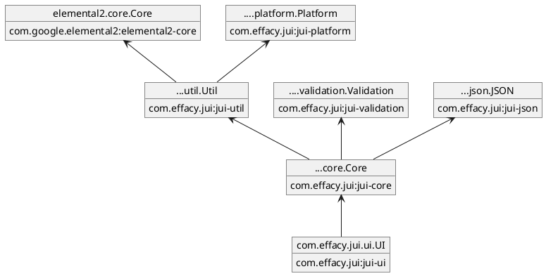

# Modules and applications

?> In the following we assume that Maven is the build system.

We cover a range of scenarios in the following from simple modules (that contain library code) through to a complete application.

## JUI modules

### Module structure

The notion of a module is core to JUI and encapsulates a body of code that can be referenced (much like a dependency) for JUI compilation.

*Generally a module will be declared in its own project. This is not a strict requirement and a single porject can declare more than one module (this is not so uncommon). However the principles remain the same whether there is one or many modules, so we assume just one for the purposes of this description.*

A module will:

1. Define the location of JUI source code that is subject to JUI compilation (a module may include non-JUI code which is either for other purposes or for *rebinding*, a topic we will cover later).
2. Reference any other module or modules that its JUI code depends on.
3. Declare any assets that need to be bundled with the module for deployment.
4. Declare any overrides of code or resource that appear in referenced modules (this is mostly used for overriding CSS).
5. Declare any configuration properties, and modify any existing properties of modules it references.
6. Optionally declare an *entrypoint* class (one that implement `EntryPoint` or `ApplicationEntryPoint`) that will be executed when it is *loaded*.

To illustrate this we consider the JUI UI module as defined in the **jui-ui** project and associated library (each box displays the module at the top and the Maven coordinates of the associated project in the bottom):



We see that the module `com.effacy.jui.ui.UI` references `com.effacy.jui.core.Core` which in turn references the (`com.effacy.jui`) `Validation`, `JSON` and `Util` modules. The latter references `Platform` and the external module `elemental2.dom.Dom` (there are more referenced that have been omitted, but this should be sufficient for illustrative purposes).

### Module descriptor

Each module declares an XML based *module descriptor* which resides under the modules root package. For example, the `com.effacy.jui.ui.UI` module resides in the `com.effacy.jui.ui` package and named `UI.gwt.xml`:

```xml
<?xml version="1.0" encoding="UTF-8"?>
<!DOCTYPE module PUBLIC "-//JUI//1.0.0" "jui-module-1.0.0.dtd">
<module>
  <inherits name="com.effacy.jui.core.Core" />
  <source path="client" />
  <entry-point class="com.effacy.jui.ui.client.Initialiser" />
</module>
```

We observe that the module:

1. inherits from `com.effacy.jui.core.Core` (using the `inherits` tag),
2. declares that the JUI sources reside under the relative `client` package (i.e. `com.effacy.jui.ui.client`), and
3. declares an entry-point class `com.effacy.jui.ui.client.Initialiser` that is invoked when the module is loaded (this will be defined later).

See [Appendix: Module configuration](#module-configuration) for details of the various configuration options available to modules via the descriptor.

### Project structure

We now turn to how to structure a project for module development. Lets assume you are creating a module `MyModule` under the root package `mymodule`, the corresponding (representative) file structure would look somthing like the following (we adhere to the convention of separating source code from resources into separate source trees):

```txt
src
├── ...
└── jui
|   ├── java
|   |   └── mymodule.client
|   |       └── MyModule.class
|   └── resources
|       └── mymodule
|           ├── public
|           └── MyModule.gwt.xml
└── pom.xml
```

In particuar:

1. The `java` sub-tree contains the (optional) entry-point class `MyModule.class`. This implements `EntryPoint` (in `com.effacy.jui.platform.core.client`) that exposes a single method `onModuleLoad()` that is called when the module is loaded. Note that this resides under the sub-package `client`.
2. The module declaration `MyModule.gwt.xml` resides under `resources` sub-tree and serves to describe the module.
3. The `public` directory (optional) contains any fixed assets that you want copied through to the compilation assets that will be ultimately served up. This is location referred to as the *module base*.

A minimalistic module declaration would look something like:

```xml
<?xml version="1.0" encoding="UTF-8"?>
<!DOCTYPE module PUBLIC "-//JUI//1.0.0" "jui-module-1.0.0.dtd">
<module>
  <source path="client" />
  <entry-point class="mymodule.client.MyModule" />
</module>
```

Which declares only the entry point class and the (relative) location of the JUI source code (`client` in this case).  All JUI code would then reside under the package `mymodule.client`.

## JUI applications

A JUI application builds on the module concept (in fact it is a module itself). In addition we need a mechanism to compile the JUI code to JavaScript so that it can be deployed and made available to the client browser, as well as a way to incorporate that code into the running application.

We start by describing the project structure.

### Project structure

Here we build on the structure above (for modules) and extend accordingly. As a matter of convention we keep UI code into its own source tree, namely `src/jui/java` and `src/jui/resources`, while keeping server code separate, namely `src/main/java` and `src/main/resources` (see [Using Maven - Additional source directories](#using-maven) to see how this can be achieved).

We will also be a little more expressive about package names choosing `myapplication.webapp.ui` to be our ui package with entry point class `MyApplication` (see the following section); the corresponding (initial) file structure would look somthing like the following:

```txt
src
├── jui
|   ├── java
|   |   └── myapplication.webapp.ui
|   |   |   └── MyApplication.class
|   └── resources
|       └── myapplication.webapp
|           ├── public
|           └── MyApplication.gwt.xml
├── main
|   ├── java
|   |   └── myapplication.webapp
|   |       ├── MyApplicationController.class
|   |       └── MyApplicationRoot.class
|   |    
|   └── resources
|       ├── static
|       |   └── css
|       |      └── main.css
|       └── templates 
|           └── app.html
└── pom.xml
```

We expand on the various elements in the following, though where there are obmissions refer back to the module description above.

### Module definition

A minimal module definition follows:

```xml
<?xml version="1.0" encoding="UTF-8"?>
<!DOCTYPE module PUBLIC "-//JUI//1.0.0" "jui-module-1.0.0.dtd">
<module>
  <inherits name="com.effacy.jui.ui.UI" />
  <source path="ui" />
  <entry-point class="myapplication.webapp.ui.MyApplication" />
</module>
```

Observe that we are referencing the JUI UI module `com.effacy.jui.ui.UI` which most JUI based applications will do (note that you have reference multuple modules using muliple `inherit` tags). We have also changed the JUI sub-package from `client` to `ui` just to be more purposeful in respect of naming.

### Entry point class

It has been mentioned that the entry point class of a module is invoked when the module loads. What this means is when a JUI application bootstraps in the browser each module is iterated over and respective entry points are invoked. It is expected that the application (root) module is responsible for binding the JUI application to the running DOM. To be more explicit, the application module sets in place the top-level component (or components), binding them to the DOM of the [entry point HTML](#entry-point-html) page and establishing event handler to process user input.

In this case the entry point class should implement `ApplicationEntryPoint` (also in `com.effacy.jui.platform.core.client`) rather than `EntryPoint` (in fact `ApplicationEntryPoint` extends `EntryPoint` but provides some useful specialisations).

A possible entry point class for `MyApplication` follows:

```java
import com.effacy.jui.platform.core.client.ApplicationEntryPoint;

public class MyApplication implements ApplicationEntryPoint {

    @Override
    public void onApplicationLoad() {
        RootBinding binding = RootBinding.bind ("pageBody");
        DomSupport.removeAllChildren (binding.getElement ());
        binding.add (ComponentCreator.build (root -> {
            Div.$ (root).$ (outer -> {
                Button.$ (outer).$ (btn -> {
                    btn.text ("Click this button");
                    btn.onclick (e -> DomGlobal.window.alert ("The button has been clicked"));
                });
            });
        }));
    }

}
```
This creates a `RootBinding` against the DOM element with ID `pageBody` which is used to register a top-level component. In this case this is just a simple inlined component that renders a button that pops up a window alert when clicked.

?> There is no restriction on how many top-level components you can make use of, you can bind as many as you like to the DOM created by the entry point HTML.

### Compiling JUI to JavaScript

Since we are assuming Maven is being used as the build system compilation is performed by use of the `gwt-maven-plugin` (see [JavaScript compilation and linking](#javascript-compilation-and-linking)). This is configured to build content into `src/main/resources/static` which creates a directory named the same as the module (i.e. `<module>` or in the example case described so far, `myapplication.webapp.MyApplication`). The following are created in this directory:

1. The bootstrap JS file that ends in `<module>.nocache.js` (i.e. `myapplication.webapp.MyApplication.nocache.js`).
2. The compiled JUI code (this can be subject to code-splitting so may appear in multiple files); these are loaded by the bootstrap JS.
3. Any assets that are present in the `public` directories of the referenced modules.
4. Supporting assets for debugging.

With our Spring Boot setup content under `src/main/resources/static` is served directly off the context root so one can include any of the compilation outputs from client HTML. We are now in a position to discuss the *entry point HTML*.

?>We will describe this later but during development you do not need to perform continual JUI compilations with Maven to expose changes you make. JUI has a special development specific *code server* (see [Development](#development)) that performs this role.

### Entry point HTML

As noted above the compiled JUI resources are available under `<module>/` with the bootstrap `<module>/<module>.nocache.js`.  The entry point HTML page need only includes this JS file for the application to start up:

```html
<html>
  <head>
    ...
    <script src="/myapplication.webapp.MyApplication/myapplication.webapp.MyApplication.nocache.js"></script>
  </head>
  <body>
     <div id="pageBody">Application Loading...</div>
  </body>
</html>
```

The inclusion of the script will result in the entry point class being instantiated and `onModuleLoad()` being called. We see from above this binds to the DOM node whose id is `pageBody`. In addition the contents of this node are removed before the top-level component is added (this means we can place a loading message in this element that prompts the user to wait while the main block of JavaScript is downloaded by the bootstrapper prior to the application starting up).

?> In addition to the above you **must** to include a reference to JQuery `<script src="/myapplication.webapp.MyApplication/jquery.min.js"></script>` (alternatively you can reference one of the standard JQuery urls if you prefer a specific version). A later version of JUI will perform this internally.

### Development

The above is all you need to get going. From there you create JUI components as you need to assemble your application into the top-level component. As previously noted you can use the JUI *code server* to avoid having to perform a Maven build each time you want to test a change to JUI code.

The code server works by exposing the compilation assets on a separate port (the default being 9876) and is activated by use of a special bookmark that you add to your browsers bookmark bar. When the bookmark is activated the bootstrap code responds by directing requests for compilation assets through the code server. The code server responds by performing (on demand) incremental JUI compilations. The advantage of this is that compilation is concentrated on the changes you make thereby reducing the average compilation time.

An additional advantage of the code server is that it also makes available source maps, meaning that you can debug you code in the browser (i.e. by setting breakpoints) against the original Java source code.

!> When setting up your project you will need to run a Maven build at least once to generate the bootstrap code that you include in you entry point HTML. This bootstrap code enables interaction with the code server, but it does not need to be kept upto date.

To run the code server:

1. Configure the code server in your IDE (this information is contained in the README.md file of this project which guides you through setting up your IDE for working with the **playground**, noting that the same principles will apply to your own projects).
2. Ensure you have performed at least one Maven build (see note above).
3. Start your application server (i.e. run your application as you would normally).
4. Start the code server. For the first time open `http://localhost:9876` and follow the instructions (this will ask you drag two bookmarks to your bookmarks bar, these are used to enages and disengage the code server).
5. Navigate to your application entry point HTML page. The code server will likely start automatically, if it does not simply select the `Dev Mode On` bookmark to start it up.

The first build will take a bit of time but subsequent builds are a lot faster. A couple of points to note:

1. You may have multiple projects involved that are being developed simultanously in your IDE. In this case you need to perform a project build to ensure the code server will pick up the changes (activating automatic builds in your IDE can be useful for this).
2. The page `http://localhost:9876` includes a **Clean** button that will direct the code server to perform a full rebuild (by clearing its cache).
3. When using Chrome you can make use of the source maps using the developer tools (under the **Sources** tab you should be able to find the code organised by package in the side bar under **Pages** and under a node named `127.0.0.1:9876`).

## Component explorer

So far we have described general modules (for libraries of reusable JUI code) and applications (the final consumer of the JUI code). There is another concept and that is *component explorer* (colloqually referred to as a *playground*, which is no coincidence in its reference to **jui-playground**).

This is an intermediary project is oestensibly a module that contains JUI code used in multiple places (i.e. reused) in the application but is augmented with an application itself that presents both a documentation of fragments and components used and an area for experimentation and development of said fragments and components.

Since this is a little more involved we describe the construction of this explorer in quite some depth. It also serves as a good example project to build from scratch when you first start out using JUI.

Note that the [Getting started](getting_started.md) guide walks through the creation of a project that can be easily adapted to a component explorer. 

### Project structure

Again we consider a **Spring Boot** application with Thymeleaf that delivers (at a minimum) a component explorer. To begin create a project with the following structure (replace the package `myapplication` with your own package):

```txt
<project>
├─ src
|   ├── jui
|   |   ├── java
|   |   |   └── myapplication.jui.playground.ui
|   |   |   |   ├── PlaygroundApp.class
|   |   |   |   └── PlaygroundUI.class
|   |   |   └── myapplication.jui.ui
|   |   |       └── UIInitialiser.class
|   |   └── resources
|   |       └── myapplication.jui
|   |       |   ├── public
|   |       |   |   └── fragments.css
|   |       |   ├── super
|   |       |   └── UI.gwt.xml
|   |       └── myapplication.jui.playground
|   |           └── PlaygroundApp.gwt.xml
|   └── main
|       ├── java
|       |   └── myapplication.jui.playground
|       |       ├── PagesController.class
|       |       └── PlaygroundApp.class
|       |    
|       └── resources
|           ├── static
|           |   └── css
|           |       └── main.css
|           └── templates 
|               └── playground.html
└── pom.xml
```

The various elements of this structure are described below.

#### JUI library source

*This consists of re-usable source code shared with other projects.* 

Relevant to this are `UIInitialiser.class` and `UI.gwt.xml` (along with supporting resources). We begin with `UI.gwt.xml`:

```xml
<?xml version="1.0" encoding="UTF-8"?>
<!DOCTYPE module PUBLIC "-//JUI//1.0.0" "jui-module-1.0.0.dtd">
<module>
  <inherits name="com.effacy.jui.ui.UI" />
  <source path="ui" />
  <super-source path="super" />
  <entry-point class="myapplication.jui.ui.UIInitialiser" />
</module>
```

This is a simple module declaration that:

1. references the JUI UI module (`<inherits name="com.effacy.jui.ui.UI" />`),
2. declares JUI code under the package `myapplication.jui.ui` (`<source path="ui" />`),
3. allows for CSS overrides under `super` (see [Styles](ess_styles.md)), and
4. declares an entrypoint `UIInitialiser.class`.

As for `UIInitialiser.class`:

```java
package myapplication.jui.ui;

import com.effacy.jui.core.client.dom.css.CSSInjector;
import com.effacy.jui.platform.core.client.EntryPoint;

public class UIInitialiser implements EntryPoint {

    @Override
    public void onModuleLoad() {
        CSSInjector.injectFromModuleBase ("fragments.css");
    }
}
```

This injects `fragments.css` contained under the `public` directory (which contains CSS for fragments, this is not a strict requirement but is very convenient both from a practical standpoint and to illustrate how the entry point is used in the context of a library).

There are no fragments or components declared above however they would appear in a package structure under `myapplication.jui.ui`.

#### Playground source

This consists of the JUI specific code `PlaygroundApp.class`, `PlaygroundUI.class` and `PlaygroundApp.gwt.xml` along with the server code under `src/main`. This code is not intended to be shared with the web project and is excluded during the Maven build (more on this later).

We begin describing `PlaygroundApp.gwt.xml`:

```xml
<?xml version="1.0" encoding="UTF-8"?>
<!DOCTYPE module PUBLIC "-//JUI//1.0.0" "jui-module-1.0.0.dtd">
<module>
  <inherits name="myapplication.jui.UI" />
  <source path="ui" />
  <entry-point class="myapplication.jui.playground.ui.PlaygroundApp" />
</module>
```
 We first note that this inherits from `myapplication.jui.UI` which is our module file `UI.gwt.xml` (described below). The JUI source code is contained in the package `myapplication.jui.playground.ui` (as specified with `<source path="ui" />`) and the module class is `PlaygroundApp.class`:

```java
public class PlaygroundApp implements ApplicationEntryPoint {

    @Override
    public void onApplicationLoad() {
        new PlaygroundUI ().bind ("pageBody");
    }
}
```

This entry point simply creates an instance of the component `PlaygroundUI` and binds to the DOM element `pageBody` (more on how this is initialised shortly). We take a brief look at `PlaygroundUI.class`:

```java
public class PlaygroundUI extends TabNavigator {

    public PlaygroundUI() {
        super (TabNavigatorCreator.create ().padding (Insets.em (1)).style (TabNavigator.Config.Style.HORIZONTAL));

        tab ("explorer", "Explorer", new ComponentExplorer ());
    }
}
```

This is just a stub that declares a side-tabbed pabel that contains a single tab the embodied the standard JUI component explorer. You would build this out specifically for your own purposes (for example, to build on the component explorer for your own fragments and components).

We are now in a position to look at the server-side code. Lets start with `PlaygroundApp.class`:

```java
@SpringBootApplication
public class PlaygroundApp {
    public static void main(String... args) {
        SpringApplication.run (PlaygroundApp.class, args);
    }
}
```

Which is just a standard Spring Boot application class that, when run, stands up a webserver that serves content declared in `PagesController.class`:

```java
@Controller
public class PagesController {

    @GetMapping("/playground")
    public String main(Model model, HttpServletRequest request) {
        // To activate testing mode (which inserts test ID's) pass ?test=true
        model.addAttribute ("testMode", "true".equals (request.getParameter("test")));
        return "playground";
    }
    
    @GetMapping("/")
    public String root() {
        return "redirect:/playground";
    }
}
```

This redirects the root url to `/playground` and serves up the playground application from `/playground`. When this url is accessed the server will serve up the file `playground.html` from the `templates` directory:

```html
<!DOCTYPE HTML>
<html xmlns:th="http://www.thymeleaf.org">

<head>
    <title>MyApplication Playground</title>
    <meta http-equiv="Content-Type" content="text/html; charset=UTF-8" />
    <meta name="jui:test" value="true" th:if="${testMode}" />
    <link rel="stylesheet" type="text/css" href="../static/css/main.css" th:href="@{/css/main.css}" />
    <script
        src="../static/myapplication.jui.playground.PlaygroundApp/myapplication.jui.playground.PlaygroundApp.nocache.js"
        th:src="@{/myapplication.jui.playground.PlaygroundApp/myapplication.jui.playground.PlaygroundApp.nocache.js}"></script>
</head>

<body>
    <div id="pageBody">Application Loading...</div>
</body>

</html>
```

Here we see that we are requesting content from `../static/myapplication.jui.playground.PlaygroundApp/myapplication.jui.playground.PlaygroundApp.nocache.js`. This is our bootstrap JS generated after a JUI code build, this code is **not** checked in and generated during build time. That means that prior to running the playground locally you **must perform a Maven build** so that JUI code is compiled and made available to be deployed. We also note the DIV element whose ID is `pageBody`, this is the target for binding the JUI application as present in `PlaygroundApp.class` described above.

Finally we note the include of `main.css` of which a simple version is give below:

```css
html, body {
    font-size: 13px;
    font-kerning: normal;
    height: 100%;
    width: 100%;
    margin: 0px;
    text-rendering: optimizelegibility;
}

body * {
    box-sizing: border-box;
    overflow-wrap: break-word;
    -webkit-font-smoothing: antialiased;
}

body {
    font-family: Avenir Next W02,Avenir Next,"Helvetica Neue",Helvetica-,Arial,sans-serif;
    overflow: hidden;
}

#pageBody {
    height: 100%;
}
```

#### Maven build

Since we use Maven here is a minimal `pom.xml` to get us going:

```xml
<?xml version="1.0" encoding="UTF-8"?>
<project xmlns="http://maven.apache.org/POM/4.0.0" xmlns:xsi="http://www.w3.org/2001/XMLSchema-instance" xsi:schemaLocation="http://maven.apache.org/POM/4.0.0 http://maven.apache.org/maven-v4_0_0.xsd">
    <modelVersion>4.0.0</modelVersion>
    <!-- Insert relevant parent and project information -->
    ...
    <packaging>jar</packaging>
    <name>Application - JUI Components</name>

    <properties>
        <!-- Insert relevant versions here -->
        <version.effacy-jui>...</version.effacy-jui>
        <version.spring-boot>...</version.spring-boot>
        <version.gwt-maven-plugin>2.10.0</version.version.gwt-maven-plugin>
    </properties>

    <dependencies>
        <dependency>
            <groupId>com.effacy.jui</groupId>
            <artifactId>jui-ui</artifactId>
            <version>${version.effacy-jui}</version>
        </dependency>

        <!-- Optional as these are only needed for the playground -->
        <dependency>
            <groupId>org.springframework.boot</groupId>
            <artifactId>spring-boot-starter-web</artifactId>
            <version>${version.spring-boot}</version>
            <optional>true</optional>
        </dependency>
        <dependency>
            <groupId>org.springframework.boot</groupId>
            <artifactId>spring-boot-starter-thymeleaf</artifactId>
            <version>${version.spring-boot}</version>
            <optional>true</optional>
        </dependency>
    </dependencies>

    <build>
        <sourceDirectory>src/main/java</sourceDirectory>
        <resources>
            <resource>
                <!-- General resources -->
                <directory>src/main/resources</directory>
                <filtering>false</filtering>
            </resource>
            <resource>
                <directory>src/jui/resources</directory>
                <filtering>false</filtering>
            </resource>
            <resource>
                <!-- This allows for the JUI sources to be bundled in with the JAR -->
                <directory>src/jui/java</directory>
                <filtering>false</filtering>
            </resource>
        </resources>

        <plugins>
            <!-- Additional sources -->
            <plugin>
                <groupId>org.codehaus.mojo</groupId>
                <artifactId>build-helper-maven-plugin</artifactId>
                <executions>
                <execution>
                    <id>add-source</id>
                    <phase>generate-sources</phase>
                    <goals>
                        <goal>add-source</goal>
                    </goals>
                    <configuration>
                        <sources>
                            <source>src/jui/java</source>
                            <source>src/jui/resources</source>
                        </sources>
                    </configuration>
                </execution>
                </executions>
            </plugin>
            <!-- GWT compilation -->
            <plugin>
                <groupId>org.codehaus.mojo</groupId>
                <artifactId>gwt-maven-plugin</artifactId>
                <version>${version.gwt-maven-plugin}</version>
                <executions>
                    <execution>
                        <phase>compile</phase>
                        <goals>
                            <goal>compile</goal>
                        </goals>
                        <configuration>
                            <module>myapplication.jui.playground.PlaygroundApp</module>
                            <extraJvmArgs>-Xmx4096M -Xss1024k</extraJvmArgs>
                            <style>OBF</style>
                            <force>true</force>
                            <webappDirectory>${basedir}/src/main/resources/static</webappDirectory>
                        </configuration>
                    </execution>
                </executions>
            </plugin>
            <!-- Excludes content not applicable for library -->
            <plugin>
                <groupId>org.apache.maven.plugins</groupId>
                <artifactId>maven-jar-plugin</artifactId>
                <configuration>
                    <excludes>
                        <exclude>static/**/*</exclude>
                        <exclude>templates/**/*</exclude>
                        <exclude>WEB-INF/**/*</exclude>
                        <exclude>gwt-unitCache/**/*</exclude>
                        <exclude>myapplication/jui/playground/**/*</exclude>
                    </excludes>
                </configuration>
            </plugin>
        </plugins>
    </build>
</project>
```

Note that `myapplication` should be replaced accordingly and relevant versions provided for dependencies. In addition we draw attention to a couple of key points:

1. The GWT compliation is performed by the `gwt-maven-plugin` plugin. This is configured to write the compilation artefacts to `${basedir}/src/main/resources/static` which makes them available to the server for serving. This is why we need to perform a Maven build prior to running the application.
2. The `maven-jar-plugin` plugin is configured to exclude code and assets that are specific to the playground server application. Coupled with the `optional` nature of dependencies this keeps the associated build artefact small and relevant.

#### Running the playground

You can run the playground in exactly the same manner in which you run **jui-playground**, which includes the user of the JUI code server. This is the expectation when you develop against the playgound.

From a development perspective, since the playground is predominantly designed for development, this is the expected way to run it. However you may want to run it standalone. In this case you can make use of profiles to create an alternative JAR that can be executed directly:

```xml
...
<profiles>

    <!-- Profile for generating a documentation server -->
    <profile>
        <id>server</id>
        <activation>
            <property>
                <name>server</name>
            </property>
        </activation>
        <build>
            <plugins>
                <!-- Override our default exclusion of server resources -->
                <plugin>
                    <groupId>org.apache.maven.plugins</groupId>
                    <artifactId>maven-jar-plugin</artifactId>
                    <configuration>
                        <excludes combine.self="override">
                            <exclude>gwt-unitCache/**/*</exclude>
                        </excludes>
                    </configuration>
                </plugin>
                <!-- Repackage the JAR so that it is executable -->
                <plugin>
                    <groupId>org.springframework.boot</groupId>
                    <artifactId>spring-boot-maven-plugin</artifactId>
                    <configuration>
                        <mainClass>myapplication.jui.playground.PlaygroundApp</mainClass>
                        <classifier>server</classifier>
                    </configuration>
                    <executions>
                        <execution>
                            <goals>
                                <goal>repackage</goal>
                            </goals>
                        </execution>
                    </executions>
                </plugin>
            </plugins>
        </build>
    </profile>
</profiles>
...
```

Running `mvn -Dserver install` will generate a two JAR files: one containing the module code that can be used as a dependency and another, with the `server` classifier, that is an executable JAR that can be run with `java -jar <jar-file-with-server-classifier>`. **Important** the default JAR can be used as a dependency, however it will also contain the playground assets which are not needed. This is fine (in that it won't cause any problems) but it will be uncessarily large.

## Appendices

### JUI playground as an example

The **playground** is configured as follows:

1. There are three separate code trees for the main application code (which is based on Spring Boot and makes use of [Thymeleaf](https://www.thymeleaf.org/)] for Spring), the JUI code and for integration tests.
2. The module package is `com.effacy.jui.playground` and the UI package is `com.effacy.jui.playground.ui`.
3. The entry point class is `com.effacy.jui.playground.ui.TestApplication` (and has one top-level component `com.effacy.jui.playground.ui.ApplicationUI`).
4. The module file is `TestApplication.gwt.xml` found under the `com.effacy.jui.playground` package in the resource sub-tree.
5. The entry point HTML is defined by the template `playground.html` found under the `templates` folder in `src/main/resources`. This is bound in the `PagesController` under the request mapping `/playground`.
6. The web assets generated by the compiler / linker are created under the `static` folder in `src/main/resources` (this appears as `com.effacy.jui.playground.TestApplication` is not versioned, see [Using Maven - JavaScript compilation and linking](#using-maven) for the associated Maven configuration).
7. Additional assets are placed under the `public` folder in the module package. You will see these have been copied into the directory in (6).


### Using Maven

#### Additional source directories

If you are using Maven you can reference multiple source locations using the `build-helper-maven-plugin` (see [Maven Project with Multiple Source Directories](https://www.baeldung.com/maven-project-multiple-src-directories) for a more indepth discussion):

```xml
<plugin>
    <groupId>org.codehaus.mojo</groupId>
    <artifactId>build-helper-maven-plugin</artifactId>
    <executions>
        <execution>
            <id>add-source</id>
            <phase>generate-sources</phase>
            <goals>
                <goal>add-source</goal>
            </goals>
            <configuration>
                <sources>
                    <source>src/jui/java</source>
                    <source>src/jui/resources</source>
                    ...
                </sources>
            </configuration>
        </execution>
        ...
    </executions>
</plugin>
```

#### JavaScript compilation and linking

GWT builds can be performed using the `gwt-maven-plugin` with a configuration similar to the following:

```xml
<plugin>
    <groupId>org.codehaus.mojo</groupId>
    <artifactId>gwt-maven-plugin</artifactId>
    <version>${version.gwt}</version>
    <executions>
        <execution>
            <phase>compile</phase>
            <goals>
                <goal>compile</goal>
            </goals>
            <configuration>
                <module>com.effacy.jui.playground.TestApplication</module>
                <extraJvmArgs>-Xmx4096M -Xss1024k</extraJvmArgs>
                <style>OBF</style>
                <force>true</force>
                <disableCastChecking>true</disableCastChecking>
                <webappDirectory>${basedir}/src/main/resources/static</webappDirectory>
                <generateJsInteropExports>true</generateJsInteropExports>
            </configuration>
        </execution>
    </executions>
</plugin>
```

This is taken from the **playground** `pom.xml` so has directives pertinent to that. Note the values of the `module` and the `webappDirectory` configuration parameters. The latter directs the web assets to be built into the directory `src/main/resources/static` (which is served up by the application) and should be changed accordingly.

You can also generate build reports by adding the following:

```xml
<configuration>
  <compileReport>true</compileReport>
  ...
</configuration>
```

The reports will be created in `extra/<module-path>` under the build target (which we assume to be `target` being the default location). The most revealing report is found at `soycReport/compile-report/index.html` which describes the build permutations (permutations target different contexts that include browser type and locale), code sizes and split-points (split-points enables the separation of code into separate files for download on demand [Code Splitting](https://www.gwtproject.org/doc/latest/DevGuideCodeSplitting.html)). See [Compilation Reports](https://www.gwtproject.org/doc/latest/DevGuideCompileReport.html) for more details.

### Module configuration

Modules always include a descriptor (a file that ends with `.gwt.xml`; these are prescribed by the needs of the GWT transpiler) which serves as the means to describe how the transpiler should behave. An example (as presented previously in this document) being:

```xml
<?xml version="1.0" encoding="UTF-8"?>
<!DOCTYPE module PUBLIC "-//JUI//1.0.0" "jui-module-1.0.0.dtd">
<module>
  <inherits name="com.effacy.jui.core.Core" />
  <source path="client" />
  <entry-point class="com.effacy.jui.ui.client.Initialiser" />
</module>
```

Here we see that various configuration is presented by way of elements (of which three are employed: one the declare inheritance, one to prescibe the location of sources files for compilation and one for an entry point class to invoked when the module is loaded).

The following sets out and describes the configuration tools that are available:

|Element|Parameters|Description|
|-------|----------|-----------|
|`inherits`|`name`|Inherit the given module. The effect is a merging of the specified module with this one so that act as one (though configuration in the current module overrides that of the inherited). The module is specified in the form `<package>.<module-name>` which locates the module descriptor file (exluding the `.gwt.xml` extension) on the classpath. Repeat the element for multiple modules.|
|`source`|`path`|A (locally relative) package that contains JUI source code for compilation. Note that the package must reside *under* the module package (i.e. you cannot use `...` references). Repeat for multiple packages.|
|`entry-point`|`class`|Fully qualified class name of a class that implements `EntryPoint` or `ApplicationEntryPoint`. Multiple are allowed but generally there is one (or none) for a given module. Where there are multiple (and that includes those inherited) they are processed in order of appearance.|
|`public`|`path`|The default, for modules, is to treat the `public` folder (if present) under the module package as a location of public-accessible resources that are copied verbatim to the deployment. Generally this will contain web assets (CSS, fonts, etc) for direct consumption by the browser (this is often referred to as the *module base*, see `CSSInjector.injectFromModuleBase(String)` for example). This can be redirected to a different folder using this directive (for example, were you have more than one module declared under the same package and want to differentiate such assets).|
|`stylesheet`|`src`|Loads the given CSS prior to invoking the entry point module. If the source is relative it will be relative to the *module base* (see `public` above).|

Additional configuration options may be available depending on the choice of transpiler (at this stage only the GWT transpilier is supported so you have access to all the GWT module configuration options).