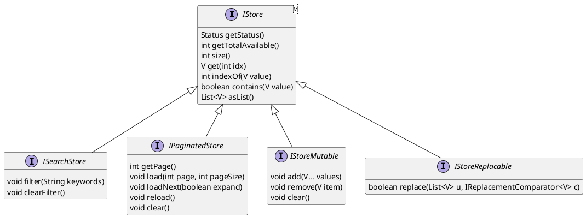
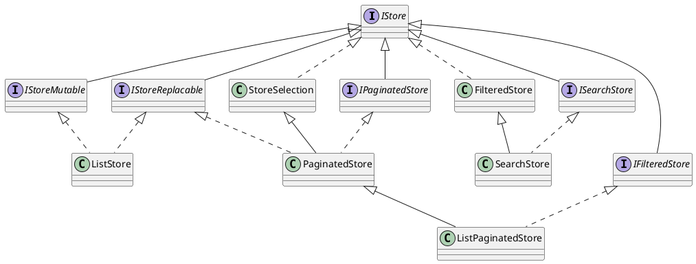

# Galleries and stores

Here we cover the essentials related to galleries (including tables) and stores.

## Stores

?> See also [selection control](ess_controls.md#selection-control) in [Controls](ess_controls.md); these make use of stores for supplying selection items and provides a slightly more practical overview the in-depth discussion here.

Stores (`com.effacy.jui.core.client.store` in **jui-core**) provide a mechanism to represent a collection of records (of the same type) that can be presented through galleries, tables and other components (such as the `SelectionControl`). The representation is one that is specifically UI oriented so can be complete or simply a view into a larger body of data that is retreived progressively (generally remotely). In addition a store can support filtering of the data either by keyword or by some custom mechanism.

### Pagination

The `PaginationStore` is one that is dedicated to presenting a filtered view of a larger dataset that is accessed remotely. Of the key filtering mechanisms is the notion of *paging* where one defines a sorting of the larger dataset and pages through that sorting by specification of a *page* (indexed from 0) and a *page size* (the number of data items per page).

#### Implementing a paging store

To implement such a store one only needs to extend `PaginationStore` and provide a implementation of `requestLoad(...)`. To illustrate let us assume we are using JUI RPC (though the same principles apply to any form of remoting) with the following DTO classes:

```java
// This is the data DTO. It extends RecordResult<Long> to indicate
// that the items mirror some form of entity keyed by a Long.
public class MyItemQueryResult extends RecordResult<Long> {
    ...
}

// This is the carrier DTO for the page of MyItemResult's
// returned by the query. This follows the standard RPC pattern
// by extending ResultSet<MyItemResult>.
public class MyItemQueryResultSet extends ResultSet<MyItemQueryResult> {
    public MyItemQueryResultSet() {
        super (null, 0);
    }
    ...
}

// This is a simple query class. It has no additional filters
// other than the pagination. This follows the standard RPC
// pattern by extending PageQuery<MyItemResultSet> (the return
// type of the remote query is the result set over the items
// MyItemResult).
public class MyItemQuery extends PageQuery<MyItemQueryResult> {

    protected MyItemQuery() {}

    public MyItemQuery(int page, int pageSize) {
        super (page, pageSize);
    }
}

```

On the UI side we also have the remoting handler `MyRemotingServiceHandler` (the servicing of the endpoint will be assumed to be given). We can extend `PaginationStore` as follows:

```java
public class MyItemStore extends PaginatedStore<MyItemQueryResult> {

    private MyItemQuery query = new MyItemQuery (0, 10);

    @Override
    protected void requestLoad(int page, int pageSize, ILoadRequestCallback<MyItemQueryResult> cb) {
        query.setPage (page);
        query.setPageSize (pageSize);
        new MyRemoteServiceHandler<MyItemQueryResultSet> ()
            .onSuccessful (v -> {
                // Here we return the results for the page, the total number of results
                // that are accessible and false for filtering (not relevant yet).
                cb.onSuccess (v.getResults (), v.getTotalResults (), false);
            })
            .onFailure ((v, s) -> {
                // Here we pass back an error messages that places the store in
                // an error state.
                if (v.isEmpty ())
                    cb.onFailure ("There was a problem retrieving the results.");
                else
                    cb.onFailure (v.get (0).getMessage ());
            })
            .remoteExecute (query);
    }

    @Override
    protected void onClear() {
        query = new MyItemQuery (0, 10);
    }

}
```

We note that we maintain an instance of the query class internally and it is that which is used in `requestLoad(...)`. All that we need to do when that method is invoked is to populate the page and page size then execute the query. If we had additional filters to apply the we could apply them with an additional method, something like the following:

```java
public class MyItemStore extends PaginatedStore<MyItemQueryResult> {
    ...
    public void query(Consumer<MyItemQuery> updater) {
        if (updater != null)
            updater.accept (query);
        reload (10);
    }
}
```

When `query(...)` is invoked one passes a lambda-expression that accepts the query then modifies it. After it has been modified the `query(...)` method invokes `reload (10)` which clears the contents of the store and loads the first 10 items (it does this by setting the page size to 10 and loading the first page).

#### Paging through the data

Once you have a store in place you pull a page of results in by calling:

1. `reload(int)` passing the number of results to pull (this becomes the page size and loaded is the first page). Calling `reload()` will do the same but with the last page size that was set. 
2. `load(int,int)` passing the page and the page size will load the given page of results.
3. `clear()` will clear all the results leaving an empty store.

The expectation will be that the store will contain the results that match the query that was performed. There is a special case withthe `load(...)` method and that is when the first page is being loaded (page 0). In this instance the store will attempt to use the data it already holds to reduce the burden on the underlying retrieval. That means that one can implement *infinite scrolling* simply by increasing the page size in which case the store will only load the difference. This is how `Gallery` and `Table` work.

*In the most part you won't need to worry abount paging as stores will typically back some other component such as a gallery, table or selection control.*

#### Detecting changes in the store

Pagination stores generate the following events:

1. `onBeforeLoad` which is invoked just prior to the store performing a load (i.e. calling `requestLoad(...)`).
2. `onAfterLoad` which is invoked after data is returned (i.e. via the callback passed to `requestLoad(...)`).
3. `onChange` which is invoked when there is some change in the data held by the store (including being cleared).
4. `onClear` which is invoked when the store has been cleared (i.e. via a call to `clear()`).

As with the standard event model you can either override the event method or you can register a handler:

```java
MyStore store = ...;
store.handleOnBeforeLoad (s -> {
    Logger.info ("Store has started a load...");
});
store.handleOnAfterLoad (s -> {
    Logger.info ("... load finished (" + s.size () + " items)");
});
store.reload ();
```

*The store also supports the older style of event propagation via `Observable`. The corresponding events are embodied in `IStoreLoadingListener` and `IStoreChangedListener`.*

#### Store loading states

Stores support a *state* (of enum type `IStore.State`) which indicates how one can rely on its contents. For paginated stores the state is quite important:

1. When first instantiated or when cleared the state is `UNLOADED`. This simply means that no query has yet been performed so the store has no knowledge of the size of the underlying dataset.
2. After the first *unfiltered* load the store will be provided with a dataset size and will obatin the state of `LOADED`. In this case, should the store record a total size of zero, then the underlying dataset will be empty (and the user can be informed of such).
3. Should a load be performed against a *filtered* query then the state will be `FILTERED`. If the store should record a total size of zero then that simply means the filtering applied yeilds no results (rather that the dataset holding no results). This will likely lead to a slightly different message being presented to the user (and maybe an action such as clearing the filters that have been applied). *When filtering is being applied this is passed as a boolen to the callback presented to `requestLoad(...)`. See example below.
4. There are two other states `LOADING` (for when the store is in the processing of loading data) and `ERROR` (when the load failed). For the latter there may be an additional error message (see example in [Implementing a paging store](#implementing-a-paging-store)).

It is useful to elaborate on point (3) with regard to filtering. In our example above we ignored filtering as the query actually had no filters to apply (an common filter is applying keywords). We can extend this example to include a demonstration of filtering:

```java
public class MyItemQuery extends PageQuery<MyItemQueryResult> {

    private String keywords;

    protected MyItemQuery() {}

    public MyItemQuery(int page, int pageSize) {
        super (page, pageSize);
    }

    public String getKeywords() {
        return keywords;
    }

    public void setKeywords(String keywords) {
        this.keywords = keywords;
    }

    @Override
    public boolean filtering() {
        return !StringSupport.empty (keywords);
    }
}
```

Note that `filtering()` is actually declared on `PageQuery` but returns `false` by default; here we simply determine if any keywords are present.  Now we modify the store implementation:

```java
public class MyItemStore extends PaginatedStore<MyItemQueryResult> {

    ...

    @Override
    protected void requestLoad(int page, int pageSize, ILoadRequestCallback<MyItemQueryResult> cb) {
        ...
        new MyRemoteServiceHandler<MyItemQueryResultSet> ()
            .onSuccessful (v -> {
                // We now pull the filtering flag from the query.
                cb.onSuccess (v.getResults (), v.getTotalResults (), query.filtering ());
            })
            ...
            .remoteExecute (query);
    }

    ...

}
```

### Auto-refreshing

When employing a store that sources its contents remotely it is sometimes the case that one or more of the store items is in a state of flux. An example would be where are store holds a list of documents, each represented by a record that reflects the state of the document. When a document is uploaded a record is generated but the document is assigned an initial inaccessible state until it passes a virus scan. Ideally you would the user to initially see that the document is pending a virus scan then when it has passed the visual representation to reflect the case. Rather than have the user contunually refresh the list it would be preferable if this we done automatically.

To facilitate this one may use the `AutoRefresher`. This is created with a reference to the backing store (which must implement `IStoreReplacable`) and a refresh period (i.e. refresh every 5 seconds). Configured into the refresher is a predicate to test if a store item needs to be refreshed, a retrieval processor to retieve the latest versions of a given set of items and a comparator to compare an existing item in the store with a candidate refreshed version to determine if that item should be replaced.

When the store is changed (i.e. loaded or reloaded) the autorefreshing will walk through each item using the test predicate to determine if that item needs monitoring. If there are none the refresh process ends until the next change of the store. Where there are such items these are recorded in a list and a refresh process is kicked off. This involves first waiting for the refresh period to pass (if there is another change detected in that time the process starts anew) then invoking the retrieval processor with the list of items which proceeded to retrieve the latest versions of those items which it passed back through a callback. Once recieved those items are passed to the store for replacement (this is where the comparator comes it). Finally a check is once again performed to see if any items remain that still need to be monitored, if there are the process above repeats (and does so until there are no more items needing monitoring). The effect is a periodic poll of the store that progressively updates items until all items are *stable*.

?> When it comes to replacing an item it is quite useful to use the notion of *samenesss* and *equality*. Two items are the same if they represent the smame underlying record (i.e. they share the same ID) while there are only equal if they represent the same version of that record. An item can then be replaced when it is the *same* but *not equal* to the candidate item for replacement. As suggested sameness is often a matter of checking for the same reference (i.e. ID) however equality needs to distinguish between versions. This can be achieved by field-level comparison or by some version indicator (for example, a version count used to implement optimstic locking). If you use the JUI RPC mechanism you may find `RecordResult` and `IComparableRecord` useful (in **jui-remote**) then the comparator is just `(a,b) -> a.same (b) && !a.equals (b)`.

To see this in action, consider the following example (this makes use of the JUI RPC so follows the naming conventions for the DTO's, however, any remoting model could be used):

```java
// The item type represents a database record keyed by a Long
// identified and uses an int for a version counter. This is
// embodied in RecordResult.
public class MyItemResult extends RecordResult<Long> {
    ...
}

// Assume also a MyItemResultSet and MyItemQuery.

public class MyItemStore extends PaginatedStore<MyItemResult> {

    private AutoRefresher<MyItemResult> autorefresher;

    public MyItemStore() {
        // Build an autorefresher backed by this store.
        autorefresher = new AutoRefresher<MyItemResult>(this, 4000)

            // The item class extends RecordResult so we just do a
            // same-but-not-equal test.
            .comparator ((a,b) -> a.same(b) && !a.equals(b))

            // The predicate needs to return true if the
            // passed item need to be refreshed.
            .test (a -> /* some condition to test for */)

            // The processor just does a lookup on the items that
            // are passed through for monitoring.
            .processor((items, cb) -> {
                // Create a new query that will use a page size equal
                // to the number of items being monitored and retrieves
                // the first page of results. This should capture
                // eveything at once.
                MyItemQuery q = new MyItemQuery (0, ids.size ());

                // Here we assume a list of Long's under the property
                // includeIds. The remote mechanism will query just
                for (MyItemResult r : items)
                    q.getIncludeIds ().add (r.getId ());
                
                // Run the query to get just those items set in
                // includeIds.
                new MyRemoteServiceHandler<MyItemResultSet> ()
                    .onSuccessful (v -> {
                        // Pass back the list of retrieved items.
                        cb.accept (v.asList ());
                    })
                    .onFailure ((v, s) -> {
                        // This is ok, the refresher will just
                        // keep running.
                        cb.accept (null);
                    })
                    .remoteExecute (q);
            });
    }

    public AutoRefresher<MyItemResult> autorefresher() {
        return autorefresher;
    }

    ...

}
```

The autorefresher can also be tuned on and off. This is an important consideration to ensure that when you navigate away from the presentation of the store's content then the polling stops (and when you navigate back it starts again). The following is a simple implementation using `INavigationAware`:

```java
public class MyItemViewPanel extends SimpleComponent implements INavigationAware {

    // The implementation is assumed to expose a method autorefresher() that
    // returns the refresher instance from the store.
    private MyItemStore store = new MyItemStore ();

    protected INodeProvider buildNode(Element el) {
        ...
        /* Displays the store contents and updates */
        /* when changes, i.e. a Gallery.           */
        ...
    }

    @Override
    public void onNavigateTo(NavigationContext context) {
        store.reload ();
        store.autorefresher ().activate ();
    }

    @Override
    public void onNavigateFrom() {
        store.autorefresher ().deactivate ();
    }

}

```

### Classes

For reference we provide a heirarachy of the interfaces and classes that constitute the store family.

#### Store interface heirarchy



#### Store implementations



|Class|Description|
|-----|-----------|
|`ListStore`|The simplest of all store.|