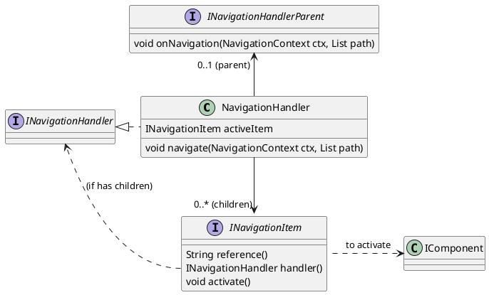
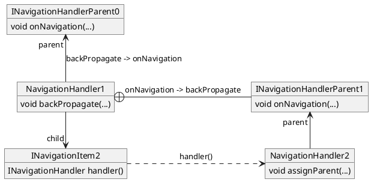
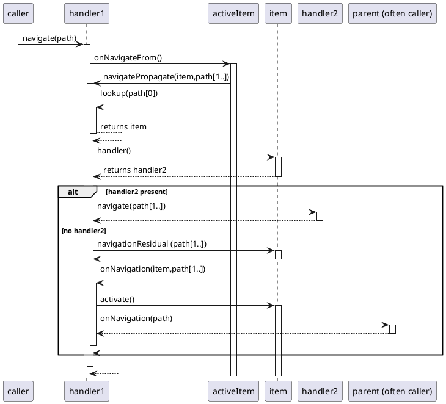

# Navigation

Navigation relates to navigation among a nested hierarchy of "pages" (i.e. components). The most prototypical example being tabs (and nested tabs) but can incorporate a range of different structures. The navigation mechanism described below is quite general and support a range of navigation models (which include tab-sets and their use in tab panels) including custom components.

JUI comes with an implementation of a model of navigation that can be applied across a range of concerns and is integrated into a number of components (i.e. the `TabNavigator` being one).

This document describes this model, details how it can be deployed into a project and provides a comprehensive overview of its implementation.

?> All navigation classes are in the `com.effacy.jui.core.navigation` package of the `jui-core` library. Standard implementation of tab-sets and tabs can be found in the `com.effacy.jui.core.suite.tabs` package.

Contained within:

1. [Navigation model](#navigation-model) provides a description of how navigation is represented and changes propagated, this includes a survey of the relevant classes.
2. [Use in practice](#use-in-practice) desribes concrete example of how navigation is implemented into an application.
3. [Debugging](#debugging) presents a survey of the debugging facilities offered to track what is happening during navigation events.
4. [Implementation details](#implementation-details) delves into the details of the JUI implementation of the navigation model.

## Navigation model

We begin by describing the theoretical aspects of the navigation model. For specific examples, including how to build custom navigation, see the following section [Use in practice](#use-in-practice).

### Paths and trees

The navigation model works on the basis of there being a *navigation tree* consisting of a hierarchical structure of nodes with a single node at the root. We call an *activation* of the navigation tree being a descendant sequence (meaning that each pair of adjacent nodes from the sequence forms a parent-child relationship) of nodes starting at the root and ending in a leaf. The *state* of a navigation tree is defined by its current activation.

To each node we assign a unique (within the context of the tree) *reference*. We can then represent any activation of the tree as a sequence of references, which can be compactly written as a slash-separated list (such as `page1/page2/page3`). Such a representation we call a *navigation path*. Should we just write down any such an expression, which we call a *candidate path*, then that may or may not be a navigation path (that is, it may or may not be associated with a valid activation; i.e if `page1/page2/page3` is valid then `page1/page3/page2` could not since `page3` is a child of `page2` not the other way around). However, we can always associate it uniquely with a navigation path so long as we associate with every interior node a default child. To do this we take the longest prefix of the candidate path that generates a descendant sequence of nodes. If the last node is a leaf then the candidate path was a navigation path, if not we just extend the sequence iteratively by adding the default child of the last node. At some point we will end in a leaf and the result is a navigation path. For example, suppose `page2` and `page3` are children of `page1` and the default child of `page2` is `page28`. Consider the candidate path `page1/page2/page3` which is not a navigation path (since `page3` is not a child of `page1`). Following the aforementioned mapping the associated navigation path is `page1/page2/page28`. Extending this example suppose the default child of `page1` is `page2` then the associated navigation path of `page1/alpha/beta` is also `page1/page2/page28`.

*It should be noted that we can treat candidate paths as those presented validly (i.e. are navigation paths), those presented validly but truncated (i.e. does not terminate in a leaf node) and those presented invalidly (where a reference does not match or the generated sequence is not descendant). It sometimes makes sense to react differently to invalid candidates by either resolving them as described or failing the navigation event and generating an error. This is discussed later, but for now we assume they are resolved.*

### Navigation events

A *navigation event* changes the state of a tree from one activation to another. These can come about by two types of *activation*:

1. Externally by providing a candidate path (i.e. from a link or URL). Here the candidate path is mapped to a navigation path which defines the new activation.
2. Internally by specifying a single node (i.e. when clicking on a tab). Here we form a navigation path by composing the unique path from the root to the selected node then extending to a leaf (if not already a leaf) by using the default children.

We note that in both cases a navigation path is only fully determined after the navigation event has finished processing. So how do we actually process such an event and do so in a manner that operates consistently regardless of the means by which it came about.

We begin by re-expressing a tree rather than a collection of nodes but as a root node with child nodes that are themselves (sub-)trees (the special case of a tree with only a root node is a *leaf tree*). We can then determine an activation recursively. We begin by asserting a starting node (the root for the first scenario and the specified node for the second scenario) for which we consider the associated (sub-)tree for which it is the root. We also ensure we have a candidate path (the path provided for the first scenario or the empty path for the second) relative to the (sub-)tree. We first check if the tree is a leaf tree, if it is we activate the node (thus the sub-tree) and return. If not we check if the path is empty and if it is we choose the default node. If it is not empty we remove the first component of the candidate path and determine the associated child node with the matching reference (if there is no match then we use the default node and clear the candidate path so it is empty). We now consider the sub-tree associated with that child node and the revised candidate path and repeat the process with the sub-tree of the child node (this is where the recursion comes in). When that returns we know the sub-tree has activated and we can then activate the node and return. Eventually this process ends with the encompassing navigation tree itself which now has a new activation.

For the process described above the descendant flow is referred to as the *forward propagation* while the return flow is the *back propagation*. As described the activation of nodes occurs on the back propagation but could easily occur on the forward (however doing so on the back propagation allows the forward propagation to terminate without a change of activation, such as when one choose to generate an error condition when the candidate path has invalid references). The process is also quite easy to implement.

### Class survey

We round out this section with a brief survey of the classes involved before turning (in [Use in practice](#use-in-practice)) to some concrete examples. It should be noted that the classes described provide the scaffolding for implementing a navigation tree so often won't need to be dealt with directly (other than some of the interfaces for notifications).

We model the navigation tree with `INavigationHandler` that declares the method `navigate(NavigationContext context, List<String> path)`. This is used to activate a navigation event with the context carrying information through the propagation pathway. This can be called externally or internally so covers both the scenarios (in fact, at this level, the notion of internal and external activation is not relevant as this is entirely encompassed in which handler you choose to initiate navigation from).

The default implementation of the handler is `NavigationHandler` which is able to hold any number of `INavigationItem`'s. An item represents a node and has the ability to be activated (i.e. displayed). Of note is the method `navigationResidual(List<String> residual)` which is called when the item is leaf but the candidate path is not empty. This allows for the residual part of the path to be passed through to the item for further processing (which lies outside of the navigation tree).

An `INavigationHandlerParent` can also be registered against a handler. Normally this is done when the handler is a component (sub-tree) of another but one can add one as a listener to the top-level handler to pick up when a navigation event has occurred (along with the associated navigation path) and adjust the UI accordingly (i.e. update the URL path or bread-crumb trail).

An item (via `INavigationHandlerProvider`) provides a means to return a `INavigationHandler` which represents the sub-tree associated to the item (aka node). This decoupling is what allows one to build out a navigation structure with tabs, sub-tabs and components.

The default item implementation is `NavigationItem` which can wrap a `Component` and bind to it a reference. This will delegate to the component  various requests and notifications in accordance to whether the component implements the relevant interface.  In particular, should it implement:

1. `INavigationResidualAware` then the component will receive residual paths.
2. `INavigationHandlerProvider` then it will be expected to act as a navigation tree and provide a suitable `INavigationHandler`.
3. `INavigationAware` it will receive notifications to prepare for navigation and the option to intervene in an activation.

Finally there is the `NavigationHandlerRouter` which is a support class for implementing `INavigationHandler`'s for specific custom cases. An example of this is given below for the playground.

## Use in practice

### Tabbed panels

An implementation of tabs is provided by `TabNavigator` in the `com.effacy.jui.ui.client.navigation` package and provides. Creating a tab panel is quite straight forward:

```java
public class MySection extends TabNavigator {

  public GalleryExamples() {
    super (new TabNavigator.Config().style (TabNavigator.Config.Style.HORIZONTAL).padding (Insets.em (0)));

    tab ("page1", "Page one", new TextComponent ("Page 1"));
    tab ("page2", "Page two", new TextComponent ("Page 2"));
    tab ("page3", "Page three", TabNavigatorCreator.create (cfg -> {
        cfg.style (TabNavigator.Config.Style.HORIZONTAL).padding (Insets.em (1));
        cfg.tab ("page1", "Sub-page one", new TextComponent ("Sub-page 1"));
        cfg.tab ("page2", "Sub-page two", new TextComponent ("Sub-page 2"));
    }));
    addListener (INavigationHandlerParent.navigation ((ctx, path) -> {
      Logger.log ("Navigation: " + ListSupport.contract (path, "/"));
    }));
  }
}
```

In this example we create a tabbed panel, using the standard horizontal tab layout, that holds three pages. Two of the pages contain simple content (some text using the `TextComponent` from the playground) while the third contains another tabs set (also using the standard horizontal layout) consisting itself of two pages (each of which contain simple text content). In addition a `INavigationHandlerListener` is added to the tabbed panel to receive navigation events and to log them to the console.

Some useful points of note are provided for tabbed panels:

1. It implements `INavigationAware` and will delegate these to the currently active component whenever that component implements `INavigationAware`. This means that one can add nested tabbed panels and a call to `onNavigateFrom(...)` will make it way down through all the active tabs to the one that contains the component being displayed which can receive and process the callback. That means that even when deeply nested a dirty form can intervene with the navigation attempt and prompt the user for confirmation. See the example below.
2. Internally this makes use of a `TabSet` component (that renders the tabs) that provides a number of pre-defined layouts (see `TabNavigator.Config.Style`) which can be extended via customisation.

?>Note that `INavigationAware` has to be implemented **by the component that serves as the tab**, child components of such a tab will not receive navigation events naturally even if they implement `INavigationAware`.

### Delegation

Sometimes you may construct a component that either includes a navigable component (i.e. a tabbed panel) or providers its own navigation (see [Custom navigation](#custom-navigation) below). In both these cases you want to component to partake in navigation. At a minimum the component class should implement `INavigationHandlerProvider` (meaning it can be added into another mechanism, such as a `TabNavigator`, and have it's navigation embed into the parents) through often it is useful to implement `INavigationHandler` (similarly it can be added to `TabNavigator` as before but now it can act as the top-level navigation structure to which navigation requests can be applied directly). Both these cases can be handled with `INavigationHandlerWithProvider` that extends both `INavigationHandler` and `INavigationHandlerProvider` and provides default imeplementations of the methods on `INavigationHandler` that delegate through to the handler returned by `INavigationHandlerProvider.handler()`.

If we focus on the non-custom case (i.e. a component that includes a navigable component, such as a `TabNavigator`) then what you want to do is delegate through to that component. The challenge with this is that you need to ensure your delegate component has been created at the time the delegations occurs, which is not always convenient. To decouple this dependency we can make use of `NavigationHandlerDelegate` that permits the underlying handler to be assigned at an arbitrary time (such as post-render). To use this:

1. Have the component implement `INavigationHandlerWithProvider` (alternatively you can implement `INavigationHandler` but then you need to implement the delegating methods directly).
2. Create an instance of `NavigationHandlerDelegate` and return it via the implementation of `INavigationHandlerProvider.handler()` (if you chose to implement `INavigationHandler` then this is not necessary, rather you need to directly implement the delegating methods).
3. Assign the navigable child to the `NavigationHandlerDelegate` instance when it is created (timing of this is not critical as any parent assignment will be delagated to the delegate on its assignment).

The following illustrates the considerations above:

```java
public class MyComponent extends SimpleComponent implements INavigationHandlerWithProvider {

    @Override
    protected INodeProvider buildNode(Element el) {
        return Wrap.$ (el).$ (root -> {
            ...
            TabNavigator tabs = TabNavigatorCreator.$ (root, cfg -> {
                ...
            }, cpt -> {
                ...
            });
            navigationDelegate.assignDelegate (tabs);
        }).build ();
    }

    private NavigationHandlerDelegate navigationDelegate = new NavigationHandlerDelegate ();

    @Override
    public INavigationHandler handler() {
        return navigationDelegate;
    }
}

```

**Note** that you could have implemented just `INavigationHandlerProvider` and the above example would apply equally well, the caveat here is that the component could not be used as the root of the navigation hierarchy and would need to incorporated into a larger structure.

### Navigation awareness

Components can implement `INavigationAware` and receive notifications from the navigation framework. One of the most useful is `onNavigateFrom` as the following example demonstrates:

```java
public class MyNavigationExample extends TabNavigator {

    public MyNavigationExample() {
        super (new TabNavigator.Config (TabNavigator.Config.Style.HORIZONTAL).padding (Insets.em (0)));

        tab ("page1", "Page 1", new TextComponent ("Page 1"));
        tab ("page2", "Page 2",TabNavigatorCreator.create (cfg -> {
            cfg.style (TabNavigator.Config.Style.HORIZONTAL).padding (Insets.em (1));
            cfg.tab ("page1", "Sub-page one", new TextComponent ("Sub-page 1"));
            cfg.tab ("page2", "Sub-page two", new NavigationAwareComponent ());
        }));
    }
    
    public static class NavigationAwareComponent extends SimpleComponent implements INavigationAware {

        @Override
        protected INodeProvider buildNode(Component.Config data) {
            return DomBuilder.div (div -> {
                div.p ().text ("This is a navigation aware component");
            }).build ();
        }

        @Override
        public void onNavigateFrom(INavigateCallback cb) {
            NotificationDialog.confirm ("Navigation check", "Are you sure you want to navigate away from this page?", (t, h) -> {
                if (t == OutcomeType.OK)
                    cb.proceed ();
                h.complete ();
            });
        }
    }
}
```

Here we create a simple navigation structure using tabbed panels. Most of the tabs display some simple text (using the `TextComponent` from the playground) but one makes use of `NavigationAwareComponent`. This too displays some simple text but also implements `onNavigateFrom(...)`. When an attempt is made to navigate away from this tab (regardless of what to) the forward propagation invokes this method with a callback. In this example a confirmation dialog is presented and if confirmed the navigation can proceed (otherwise the navigation event is aborted simply by not proceeding). 

There are two other methods made available by this interface: `onNavigateToPrepare(String segment)` and `onNavigateTo(NavigationContext context)`. The former is invoked on the forward propagation and the latter on the back propagation after the associated item has been activated.

Often there are children of an `INavigationAware` component that also benefit from being aware of when their parent has been activated. As a convenience such components can implement `INavigationAwareChild` and where they appear as a child of another `INavigationAwareChild` or `INavigationAware` component then they will received activation and deactivation events. This behaviour is built into the default implementations of the interface so make sure you call the interface methods when you override:

```java
public class MyComponent extends SimpleComponent implements INavigationAware {
    ...

    public void onNavigateDeactivated() {
        ...

        // Make sure we include the standard behaviour.
        INavigationAware.super.onNavigateDeactivated ();
    }
}
```

?>These awareness behaviours are used by `StateComponent` to disable and enable state change detection and control rendering. See [States and state management](ess_states.md) for details.

### Browser URL and history

It is often quite useful to project the navigation path through the browser URL. For a single-page-application this can be effected by using a URL fragment (so does not force a page load but partakes in history). The following is an example of how this can be achieved:

```java
public class MyApplication implements EntryPoint {

    /* Assumed to implement INavigationHandler */
    private static Application APP;

    @Override
    public void onModuleLoad() {
        ...
        APP = new Application ();
        APP.bind ("pageBody");
        ...

        APP.addListener (INavigationHandlerListener.navigation ((ctx, path) -> {
            Window.open ("#/" + ListSupport.contract (path, "/"), "_self", null);
        }));

        History.addValueChangeHandler (new ValueChangeHandler<String> () {

            @Override
            public void onValueChange(ValueChangeEvent<String> event) {
                if (event != null)
                    APP.navigate (new NavigationContext(), ListSupport.split (event.getValue (), '/'));
            }

        });
    }
}
```

We assume that the `Application` is a component that implements `INavigationHandler` (i.e. it could extend `TabNavigator`) so can receive navigation directives as well as generate navigation events. We add a listener that applies the path (post navigation event) to the URL using `Window.open (...)`. To `History` we add a listener that interprets changes in the fragment path as directed navigation activations. It should be noted that the change generated from the listener will actually generate a history event so re-apply the navigation. By default navigations that don't change the activation don't back propagate (so we don't end up re-doing the navigation).

The class `TestApplication` in the playground provides a further demonstration of this approach.

### Custom navigation

Custom navigation occurs when you have a component that is a node in a navigation hierarchy, that changes its state based on the descending portion of the navigation path and that the state is managed entirely by the component and not another navigable component (i.e. a `TabNavigator` or `CardNavigator`). In other words it is entirely responsible for responding to and rendering changes in navigation that affect it.

Often custom navigation is required when a part of the UI responds to a change in operating context (i.e. when a user navigates from their personal home space to that of an organisation it is a member of).

To facilitate implementation of custom navigation one can appeal to `NavigationHandlerRouter` to perform the heavy lifting. This implements `INavigationHandler` so should either be exposed by the component implementing `INavigationHandlerProvider` or delegated to with the component implementing `INavigationHandler`. A described in [Delegation](#delegation) we will assume the component implements `INavigationHanderWithProvider` to leverage both cases.

As far as the component is concerned there are two considerations: the ability to respond to a navigation event and the ability to initiate navigation events. The first case is a requirement regardless while the second is only needed if the component itself initiates a change through user interaction.

We begin with the ability to respond to navigation events, the following code snippet provides an example of how this can be achieved:

```java
public class MyComponent extends SimpleComponent implements INavigationHandlerWithProvider {

    private NavigationHandlerRouter navigationRouter = new NavigationHandlerRouter () {

        @Override
        protected void onNavigationForward(NavigationContext context, List<String> path, TriConsumer<NavigationContext, List<String>, Object> propagator) {
            List<String> childPath = NavigationSupport.copy (path);

            // Extract off the front of the child path the component(s) necessary
            // to obtain an object (the child) that can be activated (see
            // onChildActivated) to change the navigation state of the component.
            // Note that it does not matter if the resultant state data corresponds
            // to the current state, in which case the router handles that case
            // properly.
            Object child = ...;
            childPath.remove (...);

            // Pass through the state-change data to the propagator. The object,
            // as noted above, represented the new state (i.e. child to display)
            // of navigation for the component. This is deliberately of type
            // Object so that it could be a component, a bare handler or even
            // just a custom object that the component can use to change its
            // state. Regardless it must be registered against the router along
            // with any associated handler that is used to manage its children
            // (if there are any). The actual state change should occur on a call
            // to onChildActivated(...).
            propagator.accept (context, childPath, child);
        }

        @Override
        protected Promise<ActivateOutcome> onChildActivated(Object child) {
            return /* show (render) the child */
        }

    };

    ...

    public MyComponent() {
        ...
        navigationRouter.register (/* child (+handler) */);
    }

    ...

    /**
     * {@inheritDoc}
     * 
     * @see INavigationHandlerWithProvider#handler().
     */
    @Override
    public INavigationHandler handler() {
        return navigationRouter;
    }

    ...
}

```

The forward propagation is responsible for extracting path components and acting on those to change the navigation state appropriately. This is handled by `onNavigationForward(...)`. Typically one extract from the front of the path the reference to the *child specifier* to navigate to. This specifier, along with the reduced path, is propagated forward. Now the notion of the child specifier is vague (it is treated an an `Object`) so could be a component or some general class with reference data. In all cases this object needs to have been registered with the router prior to being put to use. When propagating forward the router stores a local copy of this specifier to determine if the navigation state has actually changed (if it has changed the the navigation context will also be modified to reflect this by having its `changed()` method called). If it has then `onChildActivated(...)` will be called and will be passed the specifier. This method is response for actually changing the state.

?> The child specifer may implement any of `INavigationAware`, `INavigationHandlerProvider` or `INavigationHandler` and these will be respected (if the specifier is a wrapper around a component, as it often is (so that it can carry meta-data such as the reference), then the specifier should delegate through to the component; `NavigationRouter.RegistrationItem` is a helper class that can be extended for this purpose).

During back-propagation the child path is regenerated. In the most part this is automatic however there may be some complex arrangements where more than one path component is used to determine the navigation state. In this case one can override the `onNavigationBackward(...)` method to insert the extract path components.

Turning to the last consideration we referred to above (internally instigated navigation) the simplest approach is to call `navigate(...)` on the router passing only the descending path that we wish to activate. This will forward propagate as if it orginated from an external navigation event and will back-propagate all the way to the root of the navigation hierarchy.


## Debugging

Generally navigation proceeds smoothly, however there are cases where navigation does not behave as expected. To facilitate discovery the navigation mechanism includes various modes of debugging assigned by calling the static method `NavigationHandler.debug(DebugMode...)` (passing nothing turns debugging off, being the default state). This is normally set in the entry point classs:

```java
NavigationHandler.debug (DebugMode.BACK_PROP);
```

The various modes are described below.

### Back propagation

*This is set with `DebugMode.BACK_PROP`.*

This writes to the console each time the child path is updated during back-propagation (essentially this describes how the final path is constructed). The format of the log records follows:

```txt
{pack_propagation} <path> [<n>][<item>]
{pack_propagation} <path> [<n>][no_item]
```

where `<path>` is the child path being propagated back, `<n>` is the number of items in the path (the `<path>` is generated using `NavigationSupport.build(...)` so may not show empty components) and `<item>` is the `toString()` on the associated navigation item contributing to the child path prefix.

### Forward propagation

*This is set with `DebugMode.FORWARD_PROP`.*

This writes to the console each time the child path is updated during forward-propagation (tracks the initiation point through to the start of the back-propagatino flow). The format of the log records follows:

```txt
{forward_propagation} <path> [<n>,<changed>,<back_if_not_changed>][<item>]
{forward_propagation} <path> [<n>,<changed>,<back_if_not_changed>][no_item]
{forward_propagation_complete} <path> [<n>,<changed>,<back_if_not_changed>][<item>]
{forward_propagation_complete:no_back} <path> [<n>,<changed>,<back_if_not_changed>][no_item]
```

where `<path>` is the child path being propagated foward, `<n>` is the number of items in the path (the `<path>` is generated using `NavigationSupport.build(...)` so may not show empty components), `<changed>` if the path changed flag is set, `<back_if_not_changed>` if back propagation is flagged even if the path has not changed and `<item>` is the `toString()` on the associated navigation item contributing to the child path prefix.

When the forward propagation has reached a terminal node `forward_propagation_complete` is the recorded state and `:no_back` is appended if back-propagation has been blocked (that occurs if both `<changed>` and `<back_if_not_changed>` are `false`).

### Triggering

*This is set with `DebugMode.TRIGGER`.*

This write to the console each time a navigation is triggered (by the `navigate(...)` method on `NavigationHandler`). The format of the log records follows:

```txt
{navigate:default} / [-][<context>]
{navigate:default} <path> [no-item][<context>]
{navigate} <path> [<item>][<context>]
```

where `<context>` is the invoking `NavigationContext` data, `<path>` is the requested path and `<item>` is the `toString()` on the first navigation. If there is no matching item then the navigation is to the default (second line) and if there is no requested path then navigation is automatically to the default (first line).

## Implementation details

*This is optional and not needed to deploy navigation in practice.*

Here we provide some more details on the inner-workings of the standard navigation mechanism presented above.



So `NavigationHandler` contains multiple `INavigationItem`'s that represent what can be navigated to (for example, the handler is associated with a set of tabs where each tab is associated with an item).  The item generally holds a reference to a component that it is responsible for activating should the item become activated, as well as a text reference that identifies it within its respective loci in the navigation path (consisting of a sequence of text references, such as `home/profile/general`). An item may contain further children in which case it will return its own `INavigationHandler` instance. This will be detected when the item is registered agaist a `NavigationHandler` which will assign to the item an inner class instance of `INavigationHandlerParent` that delegates calls to `onNavigation(...)` to the back-propagation mechanism. This way `NavigationHandler` acts as an a handler for the children of its associated item as well as the parent for any of their respective `INavigationHandler`'s. The following diagram illustrates this arrangement.



The following sequence diagram illustrates the forward (and backward) propagation flows through handlers and items:



The various call sequences are described in the following:

1. **lookup** The handler will map the first element of the passed path to an item whose reference matches that element. We will deal with the case where the match fails below.
2. **onNavigateFrom** This is invoked on the currently active item (by way of a callback), which then calls back on its handler `navigatePropogate` to continue with the propagation. This allows for the currently active item (i.e. a page) to intervene if necessary and potentially abort the flow (simply by not propagating it). A common example of this is when the current item is a form that has been modified and the user needs to be prompted. Now it is possible that the item does not support this flow (it is declared on `INavigationAware`) and if it does not `navigatePropogate` is invoked implicitly.
3. **handler** A call is make to the item to get the items navigation handler (if it supports one). The navigation is then propagated to that handler for the remainder of the path (i.e. the original path less the first element).
4. **no handler** If the item does not provide a handler then we have reached the end of the propagation chain. At this point we pass onto the item the residual of the path (for it to deal with as it sees fit) then the item is activated. Finally if the handler has a parent (this is implemented by a listener) then the parent is notified of the navigation event. Normally the parent is often the caller (though instigating a navigation flow can happen from anywhere) and the invocation allows for the pack propagation of the navigation event which will activate the parent and so on until the root if the navigation tree is reached. It is usually at this point the display of the navigation path is updated.

We make the following observations and additional notes:

1. **Internal navigation** when navigation is invoked internally (i.e. by clicking on a tab) we initiate the navigation within the tree, forward propagating from that point on to the leaf. Once the leaf have been reached then the back propagation begins ending at the root (where any navigation display can change). Besides the ability for an item to abort a navigation flow (via the forward propagation path) this is one of the reasons for back propagation.
2. **Invalid path element** it is possible for a path element to be absent or not match an item in the handler. In this case a default item is selected and the path extended to that element. This extension is brought back into the path via the back propagation so that once the root is reached the fully actualised path is realised.