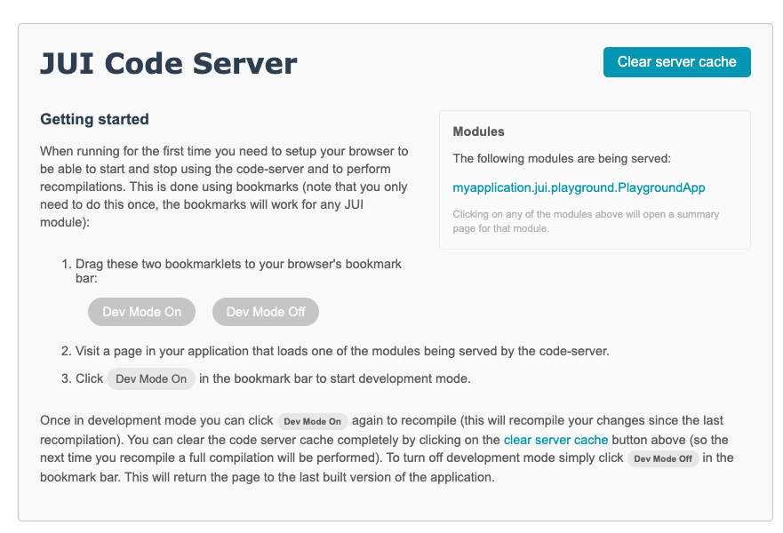
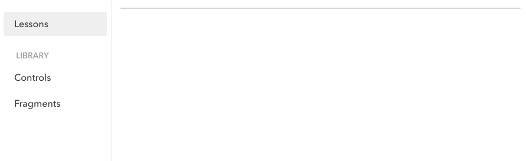

# Getting started

*Assuming you have the [prerequisites](#prerequisites) in place you should allow for approximately 60 minutes to get the application running, another 30 minutes for the code server setup and orientation and an additional 90 minutes to work through the various JUI concepts (excluding the [lessons](lessons.md) and associated setup).*

We provide here a brief guide to setting up a simple JUI based project using [Spring Boot](https://spring.io/projects/spring-boot) and [Maven](https://maven.apache.org/). Once you have this up-and-running we spend some time exploring the core principles of JUI as well as providing a launch point to work through the [lessons](lessons.md). Finally we describe how to integrate JUI into your own project.

Having completed this guide you should:

1. Know how to setup a project.
2. Be oriented with the princples of JUI DOM construction and basic use of components.
3. Be sufficiently prepared to undertake the [lessons](#lesson).
4. To be able to map out how you will integrate JUI into your own project. 

## Starter project

### Prerequisites

To work through this guide you will need to have the following installed:

1. A JDK (17 or greater)
2. Maven (3.8.0 or greater)
3. A suitable IDE

Note that in respect of the IDE (item 3) this documentation makes explicit reference to [VS Code](https://code.visualstudio.com/); however, similar principles should apply to you preferred IDE. If do use VS Code then refer to the [Appendix](#vs-code-setup-and-configuration) for additional configuration and guides before start.

?>At the time of writing the JUI libraries have not been deployed to a public Maven repository. You should perform a local Maven installation of the `jui-stack` version (as described in the projects `README.md`). You should then ensure that any version references to a JUI project should use the version that was installed.

### Directory structure

We begin with a bare-bones project that contains just enough to provide a basis to build upon. Create an empty Java project named `myapplication-jui` in your IDE and create the following directory structure with associated files (see [source code](#source-code) for the file contents and descriptions and [POM file](#pom-file) for the Maven POM):

```txt
myapplication-jui
├── src
|   ├── jui
|   |   ├── java
|   |   |   └── myapplication.jui.playground.ui
|   |   |       └── PlaygroundApp.class
|   |   └── resources
|   |       └── myapplication.jui.playground
|   |           └── PlaygroundApp.gwt.xml
|   └── main
|       ├── java
|       |   └── myapplication.jui.playground
|       |       ├── PagesController.class
|       |       └── PlaygroundApp.class
|       |    
|       └── resources
|           ├── static
|           |   └── css
|           |       └── main.css
|           └── templates 
|               └── playground.html
└── pom.xml
```

?> Note that depending on your IDE you may need to reload the project, remove and re-add the project or restart the IDE once you have created the POM file to ensure it is registered as a Maven project.

### POM file

The POM file follows (replace the version JUI with the latest):

```xml
<?xml version="1.0" encoding="UTF-8"?>
<project xmlns="http://maven.apache.org/POM/4.0.0" xmlns:xsi="http://www.w3.org/2001/XMLSchema-instance" xsi:schemaLocation="http://maven.apache.org/POM/4.0.0 http://maven.apache.org/maven-v4_0_0.xsd">
  <modelVersion>4.0.0</modelVersion>
  <groupId>jui-samples</groupId>
  <artifactId>myapplication-jui</artifactId>
  <version>${revision}</version>
  <packaging>jar</packaging>
  <name>My Application - Playground</name>

  <properties>
    <!-- Project version -->
    <revision>LATEST-SNAPSHOT</revision>

    <!-- General -->
    <java.version>17</java.version>
    <project.build.sourceEncoding>UTF-8</project.build.sourceEncoding>
    <build.output>target</build.output>

    <!-- JUI libraries -->
    <version.effacy-jui>...</version.effacy-jui>

    <!-- Spring related -->
    <version.spring>6.1.1</version.spring>
    <version.spring-boot>3.2.0</version.spring-boot>

    <!-- Plugin versions -->
    <version.build-helper-maven-plugin>3.4.0</version.build-helper-maven-plugin>
    <version.maven-compiler-plugin>3.8.1</version.maven-compiler-plugin>
  </properties>

  <dependencies>
    <dependency>
      <groupId>com.effacy.jui</groupId>
      <artifactId>jui-ui</artifactId>
      <version>${version.effacy-jui}</version>
    </dependency>

    <!-- Optional as these are only needed for the playground -->
    <dependency>
      <groupId>org.springframework.boot</groupId>
      <artifactId>spring-boot-starter-web</artifactId>
      <version>${version.spring-boot}</version>
      <optional>true</optional> 
    </dependency> 
    <dependency>
      <groupId>org.springframework.boot</groupId>
      <artifactId>spring-boot-starter-thymeleaf</artifactId>
      <version>${version.spring-boot}</version>
      <optional>true</optional>
    </dependency>
  </dependencies>

  <build>
    <sourceDirectory>src/main/java</sourceDirectory>
    <resources>
      <resource>
        <!-- General resources -->
        <directory>src/main/resources</directory>
        <filtering>false</filtering>
      </resource>
      <resource>
        <directory>src/jui/resources</directory>
        <filtering>false</filtering>
      </resource>
      <resource>
        <!-- This allows for the JUI sources to be bundled in with the JAR -->
        <directory>src/jui/java</directory>
        <filtering>false</filtering>
      </resource>
    </resources>

    <plugins>

      <!-- Additional sources -->
      <plugin>
        <groupId>org.codehaus.mojo</groupId>
        <artifactId>build-helper-maven-plugin</artifactId>
        <version>${version.build-helper-maven-plugin}</version>
        <executions>
          <execution>
            <id>add-source</id>
            <phase>generate-sources</phase>
            <goals>
              <goal>add-source</goal>
            </goals>
            <configuration>
              <sources>
                <source>src/jui/java</source>
                <!-- This can instruct the IDE to present a package structure -->
                <source>src/jui/resources</source>
              </sources>
            </configuration>
          </execution>
        </executions>
      </plugin>

      <!-- Java compilation -->
      <plugin>
        <groupId>org.apache.maven.plugins</groupId>
        <artifactId>maven-compiler-plugin</artifactId>
        <version>${version.maven-compiler-plugin}</version>
        <configuration>
          <source>${java.version}</source>
          <target>${java.version}</target>
          <encoding>UTF-8</encoding>
        </configuration>
      </plugin>

      <!-- JUI / GWT compilation -->
      <plugin>
        <groupId>com.effacy.jui</groupId>
        <artifactId>jui-maven-plugin</artifactId>
        <version>${version.effacy-jui}</version>
        <executions>
          <execution>
            <phase>compile</phase>
            <goals>
              <goal>compile</goal>
            </goals>
            <configuration>
              <module>myapplication.jui.playground.PlaygroundApp</module>
              <extraJvmArgs>-Xmx4096M,-Xss1024k</extraJvmArgs>
              <style>OBF</style>
              <webappDirectory>${basedir}/src/main/resources/static</webappDirectory>
            </configuration>
          </execution>
        </executions>
      </plugin>
    </plugins>
  </build>

</project>
```

Walking through this we make note of the following:

1. The JUI version corresponds to the version of `jui-stack` this documentation appears in. The versions of the other dependencies were the latest as of the time of writing.
2. The project makes use of [Thymeleaf](https://www.thymeleaf.org/) for templating (though not extensively) where templates are found under the `templates` directory. This is not a requirement for JUI applications and is employed here for convenience.
3. There are two source trees: `jui` and `main`. The first contains the JUI code (which is ultimately compiled to JavaScript) while the second contains the server-side. This is more a matter of convention to maintain clear separation between codebases. The `main` tree is defined as the default source and `jui` is exposed through the use of the [Build Helper Maven Plugin](https://www.mojohaus.org/build-helper-maven-plugin/) (`build-helper-maven-plugin`).
4. All static resources are declared under the `static` directory (such as CSS and JavaScript).
5. We employ the `jui-maven-plugin` to perform the JUI build (*later this will be replaced by a JUI supported Maven Plugin*). This is configured to build the `myapplication.jui.playground.PlaygroundApp` module (more on modules later) generating the various web artefacts into the `src/main/resources/static` directory (see [Initial build](#initial-build) for details).

We now turn to a detailed description of the source code.

### Source code

#### PlaygroundApp.java

At this juncture this is the only JUI class we have and serves as the *entry point* when the JUI portion of the application starts. This implements the `ApplicationEntryPoint` class (that informs the compiler to generate suitable bootstrap code to invoke it) along with the `onApplicationLoad()` method that is called on start up. For simplicty this creates a simple JUI component that displays the text "Playground App Loaded!" and binds that component to the DOM element whose ID is `pageLoad` (see [playground.html](#playgroundhtml)). Binding simply involves rendering the component into that element and hooking it up to receive UI events from the browser.

```java
package myapplication.jui.playground.ui;

import com.effacy.jui.core.client.component.ComponentCreator;
import com.effacy.jui.platform.core.client.ApplicationEntryPoint;

public class PlaygroundApp implements ApplicationEntryPoint {

    @Override
    public void onApplicationLoad() {
        ComponentCreator.build (root -> {
            root.text ("Playground App Loaded!");
        }).bind ("pageBody");
    }
    
}
```

#### PlaygroundApp.gwt.xml

Modules form the backbone of a JUI application; they tie together different dependencies (such as JUI libraries) and provide guidance to the compiler (you can find a detailed survey of modules under [Structuring an application](ess_create.md#jui-modules)).

Modules follow a naming convention similar to class files: a base name combined with a package, such as `myapplication.jui.playground.PlaygroundApp` (for our case). Each module is associated with a *module file*, a resource named after the base name of the module with the extension `.gwt.xml`, situated in the module's package.

As such, this file serves as the module file for our application:

```xml
<?xml version="1.0" encoding="UTF-8"?>
<!DOCTYPE module PUBLIC "-//JUI//1.0.0" "jui-module-1.0.0.dtd">
<module>
    <inherits name="com.effacy.jui.ui.UI" />
    <source path="ui" />
    <entry-point class="myapplication.jui.playground.ui.PlaygroundApp" />
</module>
```

Quite a lot can be done with a module file but for our purposes we have:

1. A dependency on the module `com.effacy.jui.ui.UI` (which is the UI library from JUI).
2. A declaration that the JUI source is found under the sub-package `ui` (note that the entry point class in (3)  resides under this package).
3. There is an entry point class named `myapplication.jui.playground.ui.PlaygroundApp` (see above).

Of note is point (3) which instructs the compiler to generate bootstrap code that will instantiate the entry point class and call its `onApplicationLoad()` method (allowing the JUI code to generate the browser hooks needed to start interacting with the user).

?>The reference to the DTD `jui-module-1.0.0.dtd` is based on the configuration of a *catalog* (until such time it is posted on a public URL). See [Appendix: XML Catalog](#xml-catalog) for instructions on setting this in VS Code.

#### PagesController.java

This is a simple [Spring MVC](https://docs.spring.io/spring-framework/reference/web/webmvc.html) controller for exposing web resources. In our case we have a root redirect to `/playground` and off `playground` we generate content from the [playground.html](#playgroundhtml) template.

```java
package myapplication.jui.playground;

import org.springframework.stereotype.Controller;
import org.springframework.web.bind.annotation.GetMapping;

/**
 * Handler presentation of all pages.
 */
@Controller
public class PagesController {

    /**
     * Main page.
     */
    @GetMapping("/playground")
    public String main() {
        return "playground";
    }
    
    /**
     * Documentation root (API root). Redirects to /playground.
     */
    @GetMapping("/")
    public String root() {
        return "redirect:/playground";
    }
}
```

#### PlaygroundApp.java

This the Spring Boot application class that is used to startup the application webserver.

```java
package myapplication.jui.playground;

import org.springframework.boot.SpringApplication;
import org.springframework.boot.autoconfigure.SpringBootApplication;

@SpringBootApplication
public class PlaygroundApp {

    public static void main(String... args) {
        SpringApplication.run (PlaygroundApp.class, args);
    }
}
```

#### main.css

Here we have a very simple CSS file that provides a base-level of styling for [playground.html](#playgroundhtml).

```css
html, body {
    font-size: 11pt;
    font-kerning: normal;
    height: 100%;
    width: 100%;
    margin: 0px;
    text-rendering: optimizelegibility;
}

body * {
    box-sizing: border-box;
    overflow-wrap: break-word;
}

body {
    font-family: Avenir Next,"Helvetica Neue",Helvetica-,Arial,sans-serif;
    overflow: hidden;
}

#pageBody {
    height: 100%;
}
```

#### playground.html

This is the *entry html* for the JUI application. When it is served up it pulls in a a script the `myapplication.jui.playground.PlaygroundApp.nocache.js` (this is generated during the JUI compilation process). This is the bootstrap JavaScript that ultimate creates an instance of `PlaygroundApp` and invokes the `onApplicationLoad()` method that starts up the JUI application. Note that the various `th:` references are Tymeleaf directives.

```html
<!DOCTYPE HTML>
<html xmlns:th="http://www.thymeleaf.org">

<head>
    <title>Playground</title>
    <meta http-equiv="Content-Type" content="text/html; charset=UTF-8" />
    <link rel="stylesheet" type="text/css" href="./static/css/main.css" th:href="@{/css/main.css}" />
    <script
        src="./static/myapplication.jui.playground.PlaygroundApp/myapplication.jui.playground.PlaygroundApp.nocache.js"
        th:src="@{/myapplication.jui.playground.PlaygroundApp/myapplication.jui.playground.PlaygroundApp.nocache.js}"></script>
</head>

<body>
    <div id="pageBody">Application Loading...</div>
</body>

</html>
```

Now that we have the source code in place we turn to getting the project up-and-running. This first requires an initial build that performs a JUI compilation to generate the JUI web resources.

## Running the application

### Performing the initial build

To perform a build simply run `mvn clean install` from the project root. This will perform a JUI compilation which results in the web deployable artefacts beging created under `src/main/resources/static/myapplication/jui/playground/PlaygroundApp/` (some additional resources are created under `src/main/resources/static/WEB-INF/deploy/` but these are not used).

?>If you checking this project into version control then you should **exclude** all of this generated content.

After the build the `src/main/resources/static/myapplication/jui/playground/PlaygroundApp/` directory should have been created and look something like (there will likely be more, including various JS and font files, but these are the important ones):

```txt
2FBE3EBBA3174AF9534DE8C40E62D8BD.cache.js
myapplication.jui.playground.PlaygroundApp.nocache.js
```

The file `myapplication.jui.playground.PlaygroundApp.nocache.js` is what will need to be referenced in any HTML file that provides a home for the JUI application (see [playground.html](#playgroundhtml) for our case). This is contains bootstrap code that manages the subsequent loading of the compiled JUI source found in the various `.cache.js` files.

### Setup the run configuration

To run the application in the IDE you should setup a suitable *run configuration* that executes the class `myapplication.jui.playground.PlaygroundApp` as a Java application.

The following is the JSON configuration for VS Code (a *launch configuration* in their vernacular; see [launch configurations](#launch-configurations) in the appendix for details):

```json
{
    "type": "java",
    "name": "MyApplication Playground",
    "request": "launch",
    "mainClass": "myapplication.jui.playground.PlaygroundApp",
    "projectName": "myapplication-jui",
    "vmArgs": "-Dserver.port=8080"
}
```

Assumimg you have performed an [initial build](#performing-the-initial-build) you should launch this run configuration and the application should start up. This will run a Tomcat server on port 8080, when you access this on `http://localhost:8080/playground` you should see the text "Playground App Loaded!".

We are nearly in a position to start some development, but first we need to introduce the JUI Code Server.

### Launching the code server

Recall that we needed to perform an [initial build](#performing-the-initial-build) to generate not only the bootstrapping code but to compile the JUI code to JavaScript. It would be quite inconvenient if we had to do that each time we made a JUI code change in order to test it.

Fortunately there is an approach which allows us to perfom a compilation on demand during runtime and such that the compilation only compiles the code that is affected by the change. That approach is to use the [JUI Code Server](app_codeserver.md).

The code server is a separate application that runs on a different port (`9876` by default) and serves up the compiler generated web artefacts (such as the `.cache.js` files) allowing these to be recompiled on demand. This is achieved through the use of bookmarks that interact with the JUI bootstrap code (i.e. as found in `myapplication.jui.playground.PlaygroundApp.nocache.js`) directing it to retrieve JUI assets from the code server rather than the application server.

For a comprehensive description of the code server see [JUI Code Server](app_codeserver.md). For now we walk through the basic setup needed for this project.

#### Add profile to the POM

The easiest way to run the codeserver is by using the `jui-maven-plugin`'s `codeserver` goal. This can be configured as a profile in the `pom.xml`:

```xml
<profiles>
  <profile>
    <id>codeserver</id>
    <build>
      <plugins>
        <plugin>
          <groupId>com.effacy.jui</groupId>
          <artifactId>jui-maven-plugin</artifactId>
          <version>${version.effacy-jui}</version>
          <configuration>
            <module>myapplication.jui.playground.PlaygroundApp</module>
            <jvmArgs>-Xmx3g</jvmArgs>
            <sources>
              <source>src/jui/java</source>
              <source>src/jui/resources</source>
            </sources>
          </configuration>
          <executions>
            <execution>
              <id>codeserver</id>
              <phase>initialize</phase>
              <goals>
                <goal>codeserver</goal>
              </goals>
            </execution>
          </executions>
        </plugin>
      </plugins>
    </build>
  </profile>
</profiles>
```

Take note of the explicit specification of the source directories (why this is needed is explained in detail in [JUI Code Server](app_codeserver.md)). You can start the code server by running:

```bash
mvn -Pcodeserver initialize
```

(we take advantage of the fact that `initialize` is the first Maven lifecycle phase so only this plugin will execute making for a faster startup).

*Alternatively you can run the codeserver as a [launch configuration](#launch-configurations) in the same way you ran the application. This may be a little easier depending on your IDE setup. However, for this guide, run as above.*

#### Running the code server

Start the code server as described above. If you look at the log stream arising it generates you should eventually see something similar to the following:

```txt
Code server starting up
   Working in /var/folders/sq/2bn4nbq53_q7px8p5fz8mm1h0000gn/T/jui-codeserver-6198144151076324306.tmp
   Caching in /var/folders/sq/2bn4nbq53_q7px8p5fz8mm1h0000gn/T/gwt-cache-6BC23B18F53EE51A68FCDEF6B57A6300
   Loading Java files in myapplication.jui.playground.PlaygroundApp.
Compile with -strict or with -logLevel set to TRACE or DEBUG to see all errors.
   Module setup completed in 11540 ms
```

You should now point your browser to http://localhost:9876 to see something like:



This is the code server *console* with instructions on setup (see the next section) and various other actions that can be performed.

#### Configure the browser

The code server interacts with your JUI application by way of bookmarks. Ensure that your bookmarks bar is displayed for your browser then drag into that bar the two bookmarks **Dev Mode On** and **Dev Mode On**. These will work for *any* JUI application so only needs to be done once for a given browser.

#### Perform a recompilation

Navigate back to http://localhost:8080/playground then click on the **Dev Mode On** bookmark (if you are opening this location afresh a recompilation may start automatically, just wait until that has finished then click on the bookmark). You sould see something like the following:


Click on **Compile** and a recompilation will start. You should see log messages arising from the code server run configuration that describe the progress of compilation (and should there be any errors these will appear here).

Once it finishes the page will refresh.

#### Verify with a change

Open `PlaygroundApp.java` and change "Playground App Loaded!" to "Playground App Started!":

```java
@Override
public void onApplicationLoad() {
    ComponentCreator.build (root -> {
        root.text ("Playground App Started!");
    }).bind ("pageBody");
}
```

Save the changes then preform another recompilation in the browser. You should see the text on the page change accordingly.

#### Dealing with errors

It is instructive to see how to deal with compilation errors. Again modify `PlaygroundApp.java` but this time introduce a problem (i.e. adding a characted after the first semi-colon):

```java
@Override
public void onApplicationLoad() {
    ComponentCreator.build (root -> {
        root.text ("Playground App Started!");! // Added an ! mark
    }).bind ("pageBody");
}
```

Now perform a recompilation. You should see something like the following:


Click on **view log** and you should see something similar to:


These logs also appear in the console log of the run configuration.

Now correct the problem and click **Try Again**, the recompilation should complete successfully.

Finally, if you encounter problems that seem stubborn (in the sense the recompilations don't seem to give the expected results) then there are two potential remedies:

1. **Clear the cache** by clicking on **Clear server cache** in the code server console (see image above, the button is located in the top right corner).
2. **Remove the compilation cache** by stopping the code server and deleting on disk the *cache* directory, then starting the code server again.

For reference the *cache* directory can be determined from the logs during startup of the code server:

```txt
Code server starting up
   Working in /var/folders/sq/2bn4nbq53_q7px8p5fz8mm1h0000gn/T/jui-codeserver-6198144151076324306.tmp
   Caching in /var/folders/sq/2bn4nbq53_q7px8p5fz8mm1h0000gn/T/gwt-cache-6BC23B18F53EE51A68FCDEF6B57A6300
   Loading Java files in myapplication.jui.playground.PlaygroundApp.
Compile with -strict or with -logLevel set to TRACE or DEBUG to see all errors.
   Module setup completed in 11540 ms
```

Such problems don't often occur and when they do (1) is usually sufficient.

?>After running the codeserver for some time you may start to notice performance degredation (i.e. not compiling as fast is it used to). Often you find the same effect with your IDE if you have not restarted in awhile. The causes are likely similar and related resource consumption (more so if you are running it from within your IDE). The first resolution to try in this situation is simply to restart the code server with the second being a restart of your IDE.

## JUI concepts

We have an application running with the code server for development and the tools needed to test changes. We take the opportunity now to explore a little bit of JUI then prepare you to work through the [lessons](lessons.md).

### Interacting with the DOM

Key to any UI framework is the ability to render and interact with the browser DOM. JUI makes use of [Elemental2](https://github.com/google/elemental2) as a direct interface to DOM classes as well as a builder framework for structuring DOM and attaching event handlers within JUI components.

This can be illustrated by modifying `PlaygroundApp.java` as follows (see the [appendix](#syntax-highlighting) for a useful configuration if you are using VS Code):

```java
package workforce.app.jui.playground.ui;

import com.effacy.jui.core.client.component.ComponentCreator;
import com.effacy.jui.core.client.dom.builder.Button;
import com.effacy.jui.core.client.dom.builder.H1;
import com.effacy.jui.core.client.dom.builder.P;
import com.effacy.jui.platform.core.client.ApplicationEntryPoint;

import elemental2.dom.DomGlobal;

public class PlaygroundApp implements ApplicationEntryPoint {

    @Override
    public void onApplicationLoad() {
        ComponentCreator.build (root -> {
            H1.$ (root).text ("A Simple JUI Application");
            P.$ (root).text ("This is a simple JUI application");
            Button.$ (root).text ("Simple button").onclick (e -> {
                DomGlobal.window.alert ("Button clicked");
            });
        }).bind ("pageBody");
    }
    
}
```

Which, after a recompilation, generates something like the following:


Walking through the code we first note the use of `ComponentCreator`:

```java
ComponentCreator.build (root -> {
    ...
}).bind ("pageBody");
```

This creates what is known as an *inline component* (JUI makes extensive use of *components* to encapsulate UI and behaviour, an *inline component* is the simplest way to create a one-off component for a single use). The `build(...)` method takes a lambda-expression that takes an `ExistingElementBuilder` (found in the `com.effacy.jui.core.client.dom.builder` package) that wraps a DIV element that serves as the *root element* of the (inline) component. This class provides a number of tools to build out DOM, insert other components and attach event handlers.

Specifically for DOM JUI supplies a number of helper classes (such as `H1`, `P` and `Button` found in the `com.effacy.jui.core.client.dom.builder` package) to create DOM elements:

```java
...
H1.$ (root).text ("A Simple JUI Application");
...
```

Here the static method `$` on `H1` takes a parent DOM builder instance and appends an H1 DOM element to it. Returned is a builder instance for the H1 element into which content can be added, such as some text. This general pattern is repeated for all the DOM builder helper classes.

We can also add event handlers:

```java
Button.$ (root).text ("Simple button").onclick (e -> {
    DomGlobal.window.alert ("Button clicked");
});
```

Here we create a BUTTON DOM element with the text "Simple button". To this we add a click handler passing a lambda-expression that takes a UI event to operate on (common events have dedicated attachment methods, more general events can be added with the `on(...)` family of methods). In this case we display a standard browser alert instigated directly against the DOM using the Elemental2 class `DomGlobal`.

We can even capture DOM element that are created during rendering of a component and interact with them. To see this modify `PlaygroundApp.java` as follows (this is for illustrative purposes only, in reality we would probably create a dedicated component to properly encapsulate UI and behaviour):

```java
...
import elemental2.dom.Element;

public class PlaygroundApp implements ApplicationEntryPoint {

    private Element headerEl;

    @Override
    public void onApplicationLoad() {
        ComponentCreator.build (root -> {
            H1.$ (root).$ (header -> {
                header.text ("A Simple JUI Application");
                header.use (n -> headerEl = (Element) n);
            });
            P.$ (root).text ("This is a simple JUI application");
            Button.$ (root).text ("Simple button").onclick (e -> {
                headerEl.textContent = "Button clicked!";
            });
        }).bind ("pageBody");
    }
    
}
```

Take note of the changes to `H1`:

```java
...
H1.$ (root).$ (header -> {
    header.text ("A Simple JUI Application");
    header.use (n -> headerEl = (Element) n);
});
...
```

Here we make use of a second `$` method that takes a lamda-expression that accepts a builder instance representing (in this case) the H1 DOM element for further modification (the advantage with this is that it provides a convenient visual layout). Within this we assign the inner text context (as before) but we, in addition, capture an instance of the H1 DOM element with the `use(...)` method. The important concept here is that we are working with `builders` here not actual DOM elements. The builders are used to build out what is effectively a template, only after the template has been fully crafted is the actual underlying DOM created (among other reasons this approach is needed for us to properly interact with the underlying component model). The `use(...)` method provides a *hook* that is called when the DOM is built granting us access to the actual DOM element. In our case we retain a reference to it in the `headerEl` member.

We also modify the BUTTON DOM element to interact with the header element:

```java
Button.$ (root).text ("Simple button").onclick (e -> {
    headerEl.textContent = "Button clicked!";
});
```

When the button is clicked the header contents is updated.

We can also work with CSS. There are several approach to this but the simplest is to use CSS injection. Create a file `playground.css` and locate it as follows:

```txt
myapplication-jui
├── src
|   ├── jui
|   |   ├── java
|   |   |   └── myapplication.jui.playground.ui
|   |   |       └── PlaygroundApp.class
|   |   └── resources
|   |       └── myapplication.jui.playground
|   |           ├── public
|   |           |   └── playground.css
|   |           └── PlaygroundApp.gwt.xml
|   ...
└── pom.xml
```

Populate the file as such:

```css
.myapplication {
    padding: 2em;
}

.myapplication > H1 {
    font-weight: 300;
    margin: 0;
}

.myapplication > P {
    margin-top: 0.5em;
}
```

Now modify `PlaygoundApp.java` as follows:

```java
...
import com.effacy.jui.core.client.dom.css.CSSInjector;

public class PlaygroundApp implements ApplicationEntryPoint {

    static {
        CSSInjector.injectFromModuleBase ("playground.css");
    }

    private Element headerEl;

    @Override
    public void onApplicationLoad() {
        ComponentCreator.build (root -> {
            root.style ("myapplication");
            H1.$ (root).$ (header -> {
                header.text ("A Simple JUI Application");
                header.use (n -> headerEl = (Element) n);
            });
            P.$ (root).text ("This is a simple JUI application");
            Button.$ (root).text ("Simple button").onclick (e -> {
                headerEl.textContent = "Button clicked!";
            });
        }).bind ("pageBody");
    }
    
}
```

The first modification injects the CSS file (the module base is take as the `public` directory under the module base package, any resource added to this directory will be exposed as a web resource):

```java
static {
    CSSInjector.injectFromModuleBase ("playground.css");
}
```

The second modification applies the `myapplication` style to the (inlined) components root element:

```java
...
root.style ("myapplication");
...
```

A recompilation of the page should result in the following:


As illustrative as is the above we are probably going beyond what would be considered good design. As noted we would probably want to start encapsulating UI and behaviour into reusable components. We now turn to that as we work our way to the [lessons](lessons.md).

#### Formatting the paragraph

Consider the paragraph element in the above:

```java
...
P.$ (root).text ("This is a simple JUI application");
...
```

Lets say you want to introduce some additional formatting (like strong and emphasis). We can build on the principles and make use of the `Strong`, `Text` and `Em` helper classes (the `Text` is a special case that creates a DOM text node):

```java
...
P.$ (root).$ (p -> {
    Text.$ (p, "This is a simple ");
    Strong.$ (p).text ("JUI ");
    Em.$ (p).text ("application");
});
...
```

The use of the lambda-expression `p -> {...}` does introduce some visual clutter (though it's use becomes apparent when you need to introduce conditionals, loops and local variables). We can simplify this as follows:

```java
...
P.$ (root).$ (
    Text.$ ("This is a simple "),
    Strong.$ ().text ("JUI "),
    Em.$ ().text ("application")
);
...
```

This makes use of a different set of `$(...)` methods that is a little cleaner and more readable. Having said that, this approach is not suitable when employing conditional and loop logic or making use of local variables, here you need to take the lambda-expression approach (which can prove to be very flexible).

*Throughout the documentation we will tend to lean towards the lambda-expression approach, though not exclusively. In practice you may find youself starting with the simpler method then converting to a lambda-expression when you need to accommodate more complex arrangements.*

### Working with components

#### Custom components

Previously we created an inline component to bind to the DOM and encapsulate our application, we now create a dedicated custom component for this purpose. We begin by simply replicating the existing functionality.

Create the class `PlaygroundUI` in the same package `myapplication.jui.playground.ui` as `PlaygroundApp`:

```java
package myapplication.jui.playground.ui;

import com.effacy.jui.core.client.component.SimpleComponent;
import com.effacy.jui.core.client.dom.INodeProvider;
import com.effacy.jui.core.client.dom.builder.Button;
import com.effacy.jui.core.client.dom.builder.Em;
import com.effacy.jui.core.client.dom.builder.H1;
import com.effacy.jui.core.client.dom.builder.P;
import com.effacy.jui.core.client.dom.builder.Strong;
import com.effacy.jui.core.client.dom.builder.Text;
import com.effacy.jui.core.client.dom.builder.Wrap;
import com.effacy.jui.core.client.dom.css.CSSInjector;

import elemental2.dom.Element;

public class PlaygroundUI extends SimpleComponent {

    static {
        CSSInjector.injectFromModuleBase ("playground.css");
    }

    private Element headerEl;

    @Override
    protected INodeProvider buildNode(Element el) {
        return Wrap.$ (el).$ (root -> {
            root.style ("myapplication");
            H1.$ (root).$ (header -> {
                header.text ("A Simple JUI Application");
                header.use (n -> headerEl = (Element) n);
            });
            P.$ (root).$ (
                Text.$ ("This is a simple "),
                Strong.$ ().text ("JUI "),
                Em.$ ().text ("application")
            );
            Button.$ (root).text ("Simple button").onclick (e -> {
                headerEl.textContent = "Button clicked!";
            });
        }).build ();
    }

}
```

Note that we now make use of the `buildNode(...)` method with the additional code:

```java
return Wrap.$ (el).$ (root -> {
            ...
}).build ();
```

What is happening here is that `buildNode(Element)` is passed an actual DOM element representing the root node of the component. We wrap this in an `ExsitingElementBuilder` using `Wrap.$ (...)` then use the second `$` method to operate on it. This is essentially what is happening with the inline component.

We need to modify `PlaygroundApp.java` to use this new component:

```java
package myapplication.jui.playground.ui;

import com.effacy.jui.platform.core.client.ApplicationEntryPoint;

public class PlaygroundApp implements ApplicationEntryPoint {

    @Override
    public void onApplicationLoad() {
        new PlaygroundUI ().bind ("pageBody");
    }
    
}
```

Recompiling the page should result in the new code being compiled and used.


Try this out and see the effect for youself, then revert back to the previous paragraph expression for the rest of the guide.

#### Standard JUI components

JUI does provide a core set of components to work with (mostly controls); though most applications will make use of custom components (which keeps JUI quite lite-weight).

Lets replace the DOM button previously used with the JUI standard button:

```java
package myapplication.jui.playground.ui;

import com.effacy.jui.core.client.component.SimpleComponent;
import com.effacy.jui.core.client.dom.INodeProvider;
import com.effacy.jui.core.client.dom.builder.Button;
import com.effacy.jui.core.client.dom.builder.Em;
import com.effacy.jui.core.client.dom.builder.H1;
import com.effacy.jui.core.client.dom.builder.P;
import com.effacy.jui.core.client.dom.builder.Strong;
import com.effacy.jui.core.client.dom.builder.Text;
import com.effacy.jui.core.client.dom.builder.Wrap;
import com.effacy.jui.core.client.dom.css.CSSInjector;
import com.effacy.jui.ui.client.button.ButtonCreator;

import elemental2.dom.Element;

public class PlaygroundUI extends SimpleComponent {

    static {
        CSSInjector.injectFromModuleBase ("playground.css");
    }

    private Element headerEl;

    @Override
    protected INodeProvider buildNode(Element el) {
        return Wrap.$ (el).$ (root -> {
            root.style ("myapplication");
            H1.$ (root).$ (header -> {
                header.text ("A Simple JUI Application");
                header.use (n -> headerEl = (Element) n);
            });
            P.$ (root).$ (
                Text.$ ("This is a simple "),
                Strong.$ ().text ("JUI "),
                Em.$ ().text ("application")
            );
            ButtonCreator.$ (root, cfg -> {
                cfg.label ("JUI button");
                cfg.handler (() -> {
                    headerEl.textContent = "Button clicked!";
                });
            });
        }).build ();
    }

}

```

Recompile and you should see a different button appear (but should still update the header when clicked). Note that the `ButtonCreator` is a special *helper* class and follows a design pattern that makes it easy to create components in specific contexts; in this case it is simply a shorthand for the more general insertion of a component in the DOM as illusrated below (for a fictitous custom component named `MyComponent`):

```java
...
P.$ (root).$ (
    Text.$ ("This is a simple "),
    Strong.$ ().text ("JUI "),
    Em.$ ().text ("application")
);
Insert.$ (root, new MyComponent (/* configuration */));
...
```

#### Constructor renderer

Consider the first example of a JUI component given in the introductory section [Understanding JUI](intro_understanding.md):

```java
public class MyButton extends SimpleComponent {

    public MyButton(String title, Consumer<UIEvent> onclick) {
        renderer (root -> {
            root.style ("my-button");
            Button.$ (root).$ (
                Text.$ (title)
            ).onclick (onclick);
        });
    }
}
```

Note that we haven't overridden the `INodeProvider buildNode(Element el)` but rather made a call `render(...)` in the constructor. This simple registers a consumer (presented as a lambda-expression) that is executed against a wrapped root element (much in the same way we have done with `buildNode(...)`).

*In practice you will often use this method for smaller components while employing the `buildNode(...)` approach for those that are more involved. From a pedagogical perspective the `buildNode(...)` approach is more transparent as to the details and so is the approach we generally adopt throughout the documentation.*

**As an exercise** how could our `PlaygroundUI` component be modified to employ this approach? Can you think of scenarios where one of these approaches would be preferred over the other?

#### Component inheritance

Standard components can also be extended to create new custom components. Lets consider `TabNavigator` (which provides a mechanism to construct a set of tabs) by modifying `PlaygroundUI.java` as follows:

```java
package myapplication.jui.playground.ui;

import com.effacy.jui.core.client.component.ComponentCreator;
import com.effacy.jui.core.client.dom.builder.P;
import com.effacy.jui.core.client.dom.css.CSS;
import com.effacy.jui.core.client.dom.css.Insets;
import com.effacy.jui.ui.client.navigation.TabNavigator;

public class PlaygroundUI extends TabNavigator {

    public PlaygroundUI() {
        super (new TabNavigator.Config ().style (TabNavigator.Config.Style.VERTICAL).padding (Insets.em (0)));

        tab ("tab1", "Tab 1", ComponentCreator.build (root -> {
            P.$ (root).css (CSS.MARGIN, Insets.em (1))
                .text ("This is tab 1");
        }));
        tab ("tab2", "Tab 2", ComponentCreator.build (root -> {
            P.$ (root).css (CSS.MARGIN, Insets.em (1))
                .text ("This is tab 2");
        }));
    }

}

```

The standard JUI component `TabNavigator` is a type of *panel* component that contains and sets out the child components that are added to it. In this particular case it sets the children out as tabs so that only one child is shown at a time (dependent on which tab is active).

Here we extend the panel and configure it from within the constructor (this is a common strategy for such components). In particular:

1. We pass through to the base-class contructor an instance of `TabNavigator.Config` used to provide configuration. In this case we want the tab navigator to render tabs vertically down the left side of the page.
2. We employ the `tab(...)` method on `TabNavigator` to add tabs (note that tabs can also be added via configuration). This particular method takes three arguments, the first a navigation path component (i.e. `tab1`), the second a label for the tab (i.e. `Tab 1`) and the third a component to display when the tab is active. For the latter, and in both cases, we create a *inline* components (like we did for the first version of the `PlaygroundApp` class). These components each consist of a single P DOM element with some text (i.e. `This is tab 1`).

*Note that this approach is quite different from the direct creation of DOM we used in the previous examples. In this case the `TabNavigator` exposes methods that allows us to add components as tabs. The `TabNavigator` uses that information to construct the underlying DOM. That way we encapsulate all the DOM construction (and associated user interaction) allowing one to focus on the core behaviour of the component which is to set out other components as tabs.*

Now recompile and you should see something like the following:


You may have noticed that we have introduced direct application of styles via the `css(...)` method (which in this case applies a margin of 1em to the P DOM element giving it some relief from the edge of the tab content area):

```java
...
P.$ (root).css (CSS.MARGIN, Insets.em (1)).
...
```

Try changing the value of the `Insets` and observe the effect as you recompile.

#### Component explorer

We will finish this introduction to JUI by reconfiguring the tabs to show the JUI *component explorer*. This is a special set of components that is used to present and document components in a interactive manner.

```java
package myapplication.jui.playground.ui;

import com.effacy.jui.core.client.dom.css.Insets;
import com.effacy.jui.ui.client.explorer.ComponentExplorer;
import com.effacy.jui.ui.client.navigation.TabNavigator;
import com.effacy.jui.ui.client.navigation.TabNavigatorCreator;

public class PlaygroundUI extends TabNavigator {

    public PlaygroundUI() {
        super (new TabNavigator.Config().style (TabNavigator.Config.Style.VERTICAL).padding (Insets.em(0)));

        group ("Library");
        tab ("library-controls", "Controls", TabNavigatorCreator.create(cfg -> {
            cfg.style(TabNavigator.Config.Style.HORIZONTAL_BAR);
        }, panel -> {
            ComponentExplorer.controls(panel);
        }));
        tab ("library-fragments", "Fragments", TabNavigatorCreator.create(cfg -> {
            cfg.style(TabNavigator.Config.Style.HORIZONTAL_BAR);
        }, panel -> {
            ComponentExplorer.fragments(panel);
        }));
    }

}
```

We take the use of components a step further by nesting tabs:

```java
...
tab ("library-controls", "Controls", TabNavigatorCreator.create(cfg -> {
    cfg.style(TabNavigator.Config.Style.HORIZONTAL_BAR);
}, panel -> {
    ComponentExplorer.controls(panel);
}));
...
```

Here we add to the tab `Controls` a sub-tab created using the `TabNavigatorCreator` helper class (which allows us to create a tab navigator with content and to do so without needing to sub-class `TabNavigator`). The first argument is used to configure the tab navigator (and in this case we orient it horizontally using a bar motif) while the second allows us to add content to the tab navigator. This is delivered by component explorer:

```java
...
ComponentExplorer.controls (panel);
...
```

This method takes a `TabNavigator` and adds to that panel special component explorer content describing documentation for each of the standard JUI controls.

If you recompile you should see something similar to the following:


You should spend some time exploring the various components and how they operate.

## Learning JUI

The next stage in your learning journey is to work through the various [lessons](lessons.md). These explore, in depth, a number of the key topics within the JUI framework.

These lessons are interactive, requiring you to create code along the way. You need a suitable environment for this so it makes sense to continue using the project you have created thus far. However some preparation is required.

?> You will need access to the source code for the `jui-playground` project. This contains some code that needs to be copied over to your project as well as code describe the various solutions.

### Lesson structure

Each lesson (referenced by number, i.e. [lesson 1](lessons_1.md)) is broken into parts (referenced by letter, i.e. [lesson 1, part a](lessons_1.md#part-a)). Each part explores a particular theme that involves building out some functionality across one or more components. As these are developed they can be hosted within a tab structure with the top-level enumerating accross lessons and the secondary level across parts.

For this we need:

1. A top-level tab navigator (that also loads the a CSS style sheet used by all lessons) to hold the second-level tabs for each lesson.
2. A second-level tab navigator that, sub-classed for each lesson, that holds the parts for that lesson.
3. A preconfigured panel, sub-classed for each lesson part, that holds the components for that lesson part.

We now create these various components.

### The tab navigator

First the shared CSS stylesheet `lessons.css` found in the `jui-playground` project under `src/jui/resources/com/effacy/jui/playground/public` needs to copied across. Locate this copy alongside `playground.css`.

Now create the package `myapplication.jui.playground.ui.lessons` which will contain all the lesson code. Within this package create the class `Lessions`, our top-level panel:

**Lessions.java**
```java
package myapplication.jui.playground.ui.lessons;

import com.effacy.jui.core.client.component.layout.CardFitLayout;
import com.effacy.jui.core.client.dom.css.CSSInjector;
import com.effacy.jui.core.client.dom.css.Insets;
import com.effacy.jui.ui.client.navigation.TabNavigator;
import com.effacy.jui.ui.client.navigation.TabNavigatorCreator;

public class Lessons extends TabNavigator {

    static {
        CSSInjector.injectFromModuleBase ("lessons.css"); 
    }

    public Lessons() {
        super (
            TabNavigatorCreator.config ()
                .style (TabNavigator.Config.Style.HORIZONTAL_BAR)
                .padding (Insets.em (0))
                .effect (CardFitLayout.Config.Effect.FADE_IN)
        );

        // The child tabs (for each lesson) go here.
    }

    @Override
    protected void onAfterRender() {
        super.onAfterRender();

        // Add a style class to the root DOM element of the component. This
        // ensures the styles cascade through to the child components.
        getRoot ().classList.add ("lessons");
    }
}
```

This needs to be integrated into the application, so update `PlaygroundUI` as follows:

```java
...
public PlaygroundUI() {
    super (new TabNavigator.Config ().style (TabNavigator.Config.Style.VERTICAL).padding (Insets.em (0)));

    tab ("lessions", "Lessons", new Lessons ());
    ...
}
...
```

Recompiling you should now have a new tab with nothing in it:



So how do we deal with the second level navigation for each lesson? We will be taking a short cut and use an inlined component. We will get to that shortly. First we look at what will house the components of the lesson parts.

### Lesson parts

Each lesson requires the construction and composition of components, all of which need a place to live. A simple standard JUI component that would suffice as a home is `Panel`. A simple `Panel` can layout its child components in a variety of ways, one of these is vertically down the page.

Create the following class alongside `Lessons`:

**LessonPanel.java**
```java
package myapplication.jui.playground.ui.lessons;

import com.effacy.jui.core.client.component.layout.VertLayout;
import com.effacy.jui.core.client.component.layout.VertLayout.VertLayoutData.Separator;
import com.effacy.jui.core.client.dom.css.Insets;
import com.effacy.jui.core.client.dom.css.Length;
import com.effacy.jui.ui.client.panel.Panel;
import com.effacy.jui.ui.client.panel.PanelCreator;

public class LessonPanel extends Panel {

    protected LessonPanel() {
        super (
            PanelCreator.config ()
                .scrollable ()
                .padding (Insets.em (2)).
                layout (VertLayout.$().separator(Separator.LINE).spacing (Length.em (1)).build ()
            )
        );

    }

}
```

Note the `VertLayout` which directs the panel to arrange its children vertically as described (and with a separator between them). This class will serve as the base class for each lesson part.  For example, for lesson 1 part a we create the following class:

**Lesson1a.java**
```java
package myapplication.jui.playground.ui.lessons;

public class Lesson1a extends LessonPanel {

    protected Lesson1a() {
        // Here we add the components that we create as we go through
        // the lesson (part a).
    }

}
```

Note this extends `LessonPanel` so takes on its configuration settings. We now add this into the tab structure by by modifying `Lessons`:

```java
...
public Lessons() {
    super (
        TabNavigatorCreator.config ()
            .style (TabNavigator.Config.Style.HORIZONTAL_BAR)
            .padding (Insets.em (0))
            .effect (CardFitLayout.Config.Effect.FADE_IN)
    );

    tab ("lesson1", "Lesson 1",
        TabNavigatorCreator.create (cfg -> {
            cfg.style (TabNavigator.Config.Style.HORIZONTAL_UNDERLINE);
            cfg.tab ("lesson1a", "Part A", new Lesson1a ());
    }));
}
...
```

Recompiling we get the following:


To see what is happening look closely at:

```java
tab ("lesson1", "Lesson 1",
    TabNavigatorCreator.create (cfg -> {
        cfg.style (TabSet.Config.Style.HORIZONTAL_UNDERLINE);
        cfg.tab ("lesson1a", "Part A", new Lesson1a ());
}));
```

We see that we are adding a tab named `Lesson 1` associated with the component returned by `TabNavigatorCreator.create(...)`. This is a helper class for creating tab navigators and this constitutes our second-level navigation through the lesson parts. We see that it is configuted with a horizontal underlined tab style:

```java
cfg -> {
    cfg.style (TabSet.Config.Style.HORIZONTAL_UNDERLINE);
    ...
}
```

and the content of the tab navigator consists of a single tab named `Part A` being an instance of our `Lesson1a` component:

```java
cfg.tab ("lesson1a", "Part A", new Lesson1a ());
```

*Comparing with the previous section where the tabs were added in the constructor of a sub-class of `TabNavigator`, tabs can also be declared directly through the configuration.*

As we progress through the lesson we add more part tabs:

```java
...
tab ("lesson1", "Lesson 1",
    TabNavigatorCreator.create (cfg -> {
        cfg.style (TabNavigator.Config.Style.HORIZONTAL_UNDERLINE);
        cfg.tab ("lesson1a", "Part A", new Lesson1a ());
        cfg.tab ("lesson1b", "Part B", new Lesson1b ());
        cfg.tab ("lesson1c", "Part C", new Lesson1c ());
        cfg.tab ("lesson1d", "Part D", new Lesson1d ());
}));
```

And as we go through the lessons we add more lesson tabs:

```java
...
tab ("lesson1", "Lesson 1",
    TabNavigatorCreator.create (cfg -> {
        cfg.style (TabNavigator.Config.Style.HORIZONTAL_UNDERLINE);
        cfg.tab ("lesson1a", "Part A", new Lesson1a ());
        ...
}));
tab ("lesson2", "Lesson 2",
    TabNavigatorCreator.create (cfg -> {
        cfg.style (TabNavigator.Config.Style.HORIZONTAL_UNDERLINE);
        cfg.tab ("lesson2a", "Part A", new Lesson2a ());
        ...
}));
```

You are now ready to progress with the [lessons](lessons.md) for which you should start with [lesson 1](lessons_1.md) (which covers basic rendering of DOM).

### Self-exploration

Having worked though some or all of the lessons you may want to explore on your own. A convenient approach is to create a separate panel for you to experiment around with.

Create the class `Experiments` (you could create a separate package for this or just add it alongside the lessons):

**Experiments.java**
```java
public class Experiments extends LessonPanel {

    protected Experiments() {

        // Add you stuff here.
    }
}
```

Then modify `PlaygroundUI` as follows:

```java
...
public PlaygroundUI() {
    super (new TabNavigator.Config ().style (TabNavigator.Config.Style.VERTICAL).padding (Insets.em (0)));

    tab ("experiments", "Experiments", new Experiments ());
    tab ("lessions", "Lessons", new Lessons ());
    ...
}
...
```

That will give you an extra tab to use for your own exploration.

## Where to from here

Having worked through this getting started guide and the [lessons](lessons.md) you should be in a position to integrate JUI into a project. There are various approaches to this and these are described in [Structuring an application](ess_create.md) (which includes information on encapsulating your own JUI code into *modules*). The recommended approach is the [Component explorer](ess_create.md#component-explorer), for which this getting started application can serve as a precusor.

It is also worth looking through the [Recipies](recipies.md); these contain a fairly large number of code snippets for commonly used patterns and starters.

## Appendices

The following assumes that you have (or will have) a local version of JUI installed in your Maven repository. This can be done by either building the project directly or when (when the project becomes public accessible) when you first build the `myapplication-jui` project (where JUI is referenced in the POM).

### VS Code setup and configuration

#### Installation

VS Code can be downloaded and installed from the [official site](https://code.visualstudio.com/download). Once installed you should install the following extensions:

1. Debugger for Java (Microsoft)
2. Extension Pack for Java (Microsoft)
3. Language Support for Java (Red Hat)
4. Project Manager for Java (Microsoft)
5. Test Runner for Java (Microsoft)
6. (Optional, see [Syntax highligting](#syntax-highlighting)) Highlight (Fabio Spampinato)

#### Creating a project

A simple approach to creating a project is:

1. Open VS code in an existing workspace, or create a new workspace.
2. In the workspace create a directory for the project (i.e. `myapplication-jui`).
3. In VS code select **File** > **Add Folder to Workspace...** and choose the directory created in (2).

The project should then appear in the VS Code explorer view.

#### XML catalog

*Since this project is pre-public access the DTD used to validate the module descriptors (which are expressed in XML) is not available on a public URL, so for validation we rely on a local reference. Not having this does not cause any problems other than the aesthetic of VS code reporting problems with the DTD.*

To properly resolve the module DTD you should have an XML catalog that maps `-//JUI//1.0.0` to the DTD file. Simply add the following to your `settings.json`:

```json
"xml.catalogs": [
    "<path-to-jui-stack>/jui-stack/support/catalog.xml"
],
```

where `<path-to-jui-stack>` is the absolute path to the checked out version of `jui-stack`.

If you don't have the project checked out, but rather have the JAR files installed locally, then you can extract the DTD and craft a custom catalog. To extract the file, run the following in a suitable location:

```bash
jar xf <maven-repo-location>/com/effacy/jui/jui-platform/<version>/jui-platform-<version>.jar jui-module-1.0.0.dtd
```

In the same location create a `catalog.xml`:

```xml
<catalog xmlns="urn:oasis:names:tc:entity:xmlns:xml:catalog">

  <public
      publicId="-//JUI//1.0.0"
      uri="./jui-module-1.0.0.dtd" />

</catalog>
```

Finally modify your `settings.json` as above but to reference this `catalog.xml`.

#### Syntax highlighting

It can be quite convenient to colour highlght the DOM helper classes (such as `H1.$` and `P.$` encountered in the `PlaygoundApp`) when building out DOM structures. A simple way to achieve this is to use the **Highlight** extension (by Fabio Spampinato) configured with (in `settings.json`):

```json
"highlight.regexes": {
    "((?!Wrap)[a-zA-Z0-9_]+\\.\\$)": {
        "filterLanguageRegex": "java",
        "regexFlags": "g",
        "decorations": [
            {
                "color": "#ce7a46"
            }
        ]
    },
},
```

Of course you can change the colour as best suites your preference.

#### Launch configurations

Your application (and the code server) can be run using standard [VS Code launch configurations](https://code.visualstudio.com/docs/editor/debugging) which can be setup as follows (in the relevant `launch.json`, make sure you substitute `<version>` for the JUI version you are using):

```json
{
    "configurations": [
        {
            "type": "java",
            "name": "MyApplication Playground (8081)",
            "request": "launch",
            "mainClass": "myapplication.jui.playground.PlaygroundApp",
            "projectName": "myapplication-jui",
            "vmArgs": "-Dserver.port=8081"
        },
        {
            "type": "java",
            "name": "MyApplication Playground (CodeServer)",
            "request": "launch",
            "mainClass": "com.effacy.jui.codeserver.CodeServer",
            "args": "-logLevel INFO myapplication.jui.playground.PlaygroundApp",
            "vmArgs": "-Xmx3g",
            "projectName": "myapplication-jui",
            "classPaths": [
                "${userHome}/.m2/repository/com/effacy/jui/jui-platform-codeserver/<version>/jui-platform-codeserver-<version>-jar-with-dependencies.jar",
                "$Auto",
            ]
        },
    ]
}
```

The first block pertains to the application itself, which being based on Spring Boot allows it to be configured as a normal Java application. This is fairly straight forward.

The second block pertains to the codeserver whose configuration is a little more involved. The codeserver is bundled into a single executable jar file `jui-platform-codeserver-<version>-jar-with-dependencies.jar` (replace `<version>` with the version of JUI you are using) which needs to be resolved into your local Maven repository. You should **not** include it as a dependency to your project, rather run the codeserver once via Maven, as described [previously](#launching-the-code-server) this dependency is automatically resolved (alternatively install manually with `mvn dependency:get -DgroupId=com.effacy.jui -DartifactId=jui-platform-codeserver` `-Dclassifier=jar-with-dependencies -Dversion=<version>` (again replacing `<version>` as appropriate)).


?> Make sure that you do not have the `jui-stack` project (and family of modules) loaded into your IDE workspace. If so there is a good change that the classpath for the launch configuration will not be set properly and the code server will fail to start.

Note that the classpath referenced includes `$Auto` which resolves the classpath from the project (in this case `myapplication-jui`). For more complex arrangements you may need to reference other projects. See the [JUI Code Server](app_codeserver.md) for a description of how to handle this situation.
