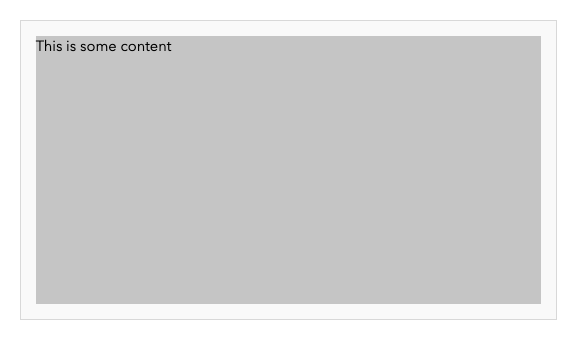
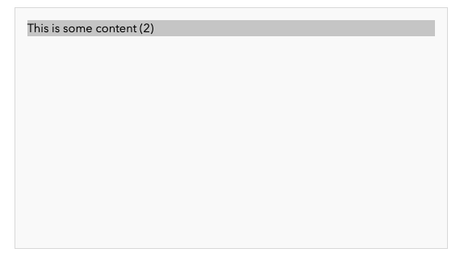
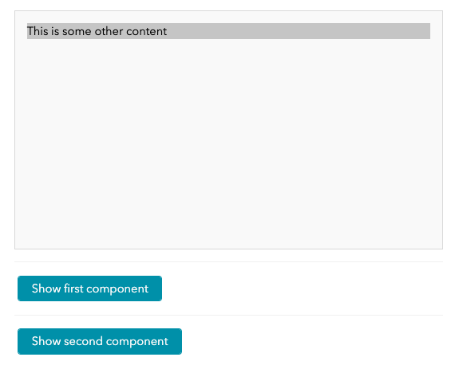
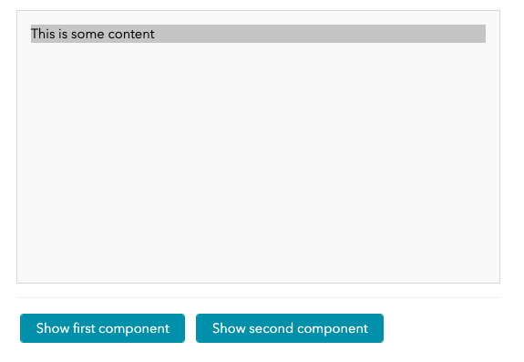
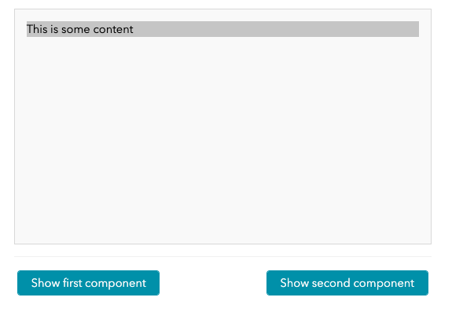
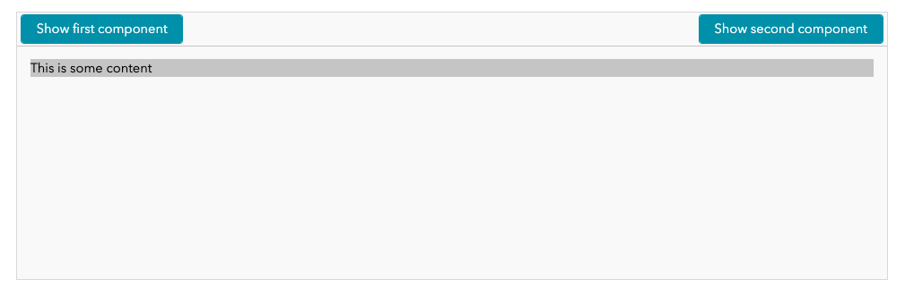
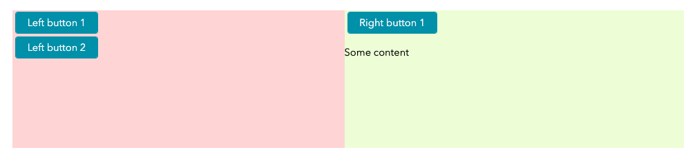

# Lesson 1

**By the end of this lesson, you will be able to create and use inline components for prototyping, transform prototypes into concrete components, develop complex components with internal and external interactions, work with state (and understand re-rendering), and understand the notion of content regions and layouts and put them to use in panels.**

?>It is assumed you have read through the [code structure](lessons.md#code-structure) documentation in [Lessons](lessons.md) that describes where the sample code resides and how CSS styles are treated in the examples. You are also encouraged to refer to [Components](ess_components.md) that provides a more detailed overview of components (than the more hands-on approach presented here) as well as [Rendering](topic_rendering.md) that provides a comprehensive description of the DOM construction employed here.

Components are the building blocks of JUI applications (and are a common theme across many UI frameworks). They encapsulate presentation, interaction and behaviour into a single object that can be replicated across an application. We aim to explore various facets of components, their use and their construction in the following parts:

1. [Part A](#part-a-rendering) we introduce inline components as a quick way to craft a component particularly for prototyping (or more complex component construction) and we focus on rendering and event handling.
2. [Part B](#part-b-prototyping) we build on the inline component concept as a prototype to building a concrete component from your prototype.
3. [Part C](#part-c-interaction) we develop more complex components with interaction both internally and externally.
4. [Part D](#part-d-states) we introduce state and build on the ideas of re-rendering (including its limitations).
5. [Part E](#part-e-panels-and-layouts) we introduce the various types of panel and the notion of content regions and layouts.

Each of the parts includes a set of exercises that you are encouraged to work through. Candidate solutions are provided under [Solutions to exercises](#solutions-to-exercises).

*Recall that working solutions can be found in the classes `Lesson1a`, `Lesson1b`, etc in the `com.effacy.jui.playground.ui.lessons` package.*

## Part A: Rendering

*You should prepare for this part by reading the [What are components?](ess_components.md#what-are-components) in [Components](ess_components.md).*

We begin by exploring how components render their content into the DOM. To allow us to focus only in this specific dimension we make use of [inline components](ess_components.md#component-inlining) which are constructed using the family of `ComponentCreator.$(...)` helper methods. This allows us to create a one-off components, inline within the code, without having to create a dedicated class for those components (it turns out that inline components are quite useful generally, more on this later in the lesson).

### Our first component

*Throughout the following code snippets will be given (and described). You are expected to transcribe these into the constructor of the `Lesson1a` class as described in [lessons](lessons.md) in order to seem them in action. This pattern is followed for all subsequent lesson parts (and for other lessons).*

Consider the following code snippet which creates a one-off inline component that renders a single P element with some textual content:

```java
add (ComponentCreator.build (root -> {
    P.$ (root).text ("This is some text 1");
}));
```

Contextually, it is the call to `ComponentCreator.build(...)` that creates the component which is then *added* to the `Lesson1a` *panel* via the `add(...)` method. For our purposes a panel is a type of component that can hold other components and arrange them in some defined manner (in this case, vertically down the page); we explore more deeply panels in [Part E: Panels and layouts](#part-e-panels-and-layouts).

Passed to `build(...)` is a lambda-expression that itself takes an instance of `ExistingElementBuilder` (this is part of the *DOM builder* mechanism, see the breakout box below). As the name suggests an element builder allows you to build into it a DOM structure. In this case this element represents the *root* element of the component being created and is the element which contains the DOM of the component.

If you were to inspect the rendering output of this component in the browser you would see something like the following:

```html
...
<div class="
  JUI-com-effacy-jui-core-client-component-layout-VertLayout-LocalCSS-wrap
  JUI-com-effacy-jui-core-client-component-layout-VertLayout-LocalCSS-alignMiddle
  JUI-com-effacy-jui-core-client-component-layout-VertLayout-LocalCSS-first"
  style="padding: 0px 0px 1em;">
  <div>
    <p>This is some text 1</p>
  </div>
</div>
...
```

The outer DIV is not part of the component but part of the *layout* that `Lesson1a` uses to arrange its child components, this is included for context. The inner DIV (with no CSS class or styling, a consequence of this being an inline component) is the root element of the component (in general, components use a DIV as their root element); this is associated with the `root` in the previous code snippet. Within that is the P element which is what is generated by `P.$ (root).text ("This is some text 1");`.

?>The *DOM builder mechanism* is an abstracted means of building DOM, along with the ability to attach event handlers and insert components and other DOM related objects in a convenient manner. It makes use of a herirarchy of classes based on `NodeBuilder` (including `ContainerBuilder`, `ElementBuilder` and `ExistingElementBuilder`) supported by *helper classes* such as `P` previously introduced. These classes are used to build out a model of the DOM you want to create, from this the actual DOM is created (this approach allows for some sophisticaed constructions, such as including other components directly into the DOM). This final construction makes use of the concrete DOM classes of [Elemental2](https://github.com/google/elemental2) and its interaction with the DOM tree of the browser. This is explained in more depth in [Rendering](topic_rendering.md).

Delving into the lambda expression we employ the helper class `P` (there are other classes for other DOM element types and these are resident in the `com.effacy.jui.core.client.dom.builder` package) that inserts a P element into the components root (by way of `P.$ (ElementBuilder)`). This returns an instance of an `ElementBuilder` representing that P element for which we can further configure (in this case by adding some text content).

This lambda expression is executed when the component returned by `ComponentCreator.build(...)` is rendered (which happens under the control of the parent component, i.e. when it is rendered).

### Adding child elements

The P element need not just contain text, it can contain other content as well. To illustrate, we can build this out a little further using the `$(IDomInsertable...)` method on the `ElementBuilder` returned by `P.$ (root)`:

```java
add (ComponentCreator.build (root -> {
    P.$ (root).$ (
        Em.$ ().style (FontAwesome.user ()),
        Text.$ ("Some content")
    );
}));
```

Notice the slightly different use of `$` between `P.$ (root)` and `Em.$ ()`. In the first case we are creating a P element and adding it to the parent represented by `root`. In the second case we are creating an *unattached* EM element which is being passed back to the parent as a method argument. It is here that it is added to the P element.

Now we need to given some explanation to `Text.$(...)`. This, just like the other helper classes, creates a DOM node. In this case it is a *text* DOM node which, by definition, expresses some plain text content. In the previous section we used the `text(String)` method to do this, which is simply a short-cut. That means that:

```java
P.$ (root).text ("Some content");
```

is just a more convenient way of writing:

```java
P.$ (root).$ (
    Text.$ ("Some content")
);
```

Moving on, as an alternative to the construction of the previous example we could have used the variant `$(Consumer<T>)` that takes a lambda-expression:

```java
add (ComponentCreator.build (root -> {
    P.$ (root).$ (outer -> {
        Em.$ (outer).style (FontAwesome.user ());
        Text.$ (outer, "Some content");
    });
}));
```

Here `outer` is an instance of `ElementBuilder` which represents our P element. Into this we add the EM element and text node explicitly.

Although more complex, the use of lamda-expressions allows one to employ conditional logic and looping (as well as local variables and calculations) so is more powerful. To illustrate consider the following example that employs a loop and counter to generate content:

```java
add (ComponentCreator.build (root -> {
    for (int i = 0; i < 5; i++) {
        // This variable is final so that it can be accessed from the
        // inner lambda-expression.
        final int count = i + 1;
        P.$ (root).$ (outer -> {
            Em.$ (outer).style (FontAwesome.user ());
            Text.$ (outer, "Some content " + count);
        });
    }
}));
```

Which variant you use in general is ultimately this a matter of choice. We will tend to prefer the lambda-expression approach for consistency, though will occasionally use the other variant to encorage familiarity.

As you may guess you can build out quite complex DOM structures. You are encouraged to explore this by building out a few of your own using the various DOM element helper classes.

### Applying styles

Now let us have a closer look and the EM tag. We see the call to `style (...)`; this applies a CSS class to the tag. The call to `FontAwesome.user()` returns a CSS class from the (free version of the) [Font Awesome](https://fontawesome.com/) icon library. We aren't restricted to just applying CSS classes but can apply CSS directly using the `css(...)` family of methods. The following 

```java
add (ComponentCreator.build (root -> {
    P.$ (root).css ("display", "flex").css ("flex-direction:", "column").css ("gap", "1em").css ("align-items", "baseline").$ (outer -> {
        Em.$ (outer).style (FontAwesome.user ());
        Text.$ (outer, "Some content");
    });
}));
```

Here we apply a number of CSS styles directly to the P tag, these styles layout the contents of the tag more aesthetically.

As it stands the long chain of CSS assignments can be a little unwieldly and we can make this a little more readable by employing the `$(...)` function twice:

```java
add (ComponentCreator.build (root -> {
    P.$ (root).$ (outer -> {
        outer.css ("display", "flex");
        outer.css ("flex-direction", "row");
        outer.css ("gap", "1em");
        outer.css ("align-items", "baseline");
    }).$ (outer -> {
        Em.$ (outer).style (FontAwesome.user());
        Text.$ (outer, "Some content");
    });
}));
```

You don't need to apply `$(...)` twice and the following is equally valid, though possibly less readable:

```java
add (ComponentCreator.build (root -> {
    P.$ (root).$ (outer -> {
        outer.css ("display", "flex");
        outer.css ("flex-direction", "row");
        outer.css ("gap", "1em");
        outer.css ("align-items", "baseline");
        Em.$ (outer).style (FontAwesome.user());
        Text.$ (outer, "Some content");
    });
}));
```

As you explore JUI code in general you may come across the `CSS` class as a means of applying CSS styles. This class provides for a number of commonly used styles that can be applied in a type-safe manner. For example the application `outer.css ("gap", "1em");` has as its `CSS` equivalant:

```java
outer.css (CSS.GAP, Length.em (1));
```

*You are encouraged to explore applying other styles, both directly and using `CSS`.*

?> In general, styles applied this way usually arise from some parameterisation or configuration. The other scenario is during prototyping (before you develop out a style sheet). In this case you can make use of a very compact way which is to combine into a single statement: `.css ("display: flex; flex-direction: row; gap: 1em; align-items: baseline")`. 

We'll finish this section by applying a custom CSS class. Look at `lesson.css` and note the class `lesson1_mystyle`:

```css
.lessons .lesson1_mystyle {
    display: flex;
    flex-direction: row;
    gap: 1em; 
    align-items: baseline;
    margin: 0.25em 0;
    font-weight: 600; /* Added to make it clear it is being applied */
}
```

We can dispense with the direct application of individual styles and apply this CSS class instead:

```java
add (ComponentCreator.build (root -> {
    P.$ (root).$ (outer -> {
        outer.style ("lesson1_mystyle");
        Em.$ (outer).style (FontAwesome.user());
        Text.$ (outer, "Some content");
    });
}));
```

Which if we inspect the generate DOM looks like:

```html
<p class="lesson1_mystyle"><em class="fas fa-user"></em>Some content</p>
```

*If you noticed the `lessons` CSS class in the above recall that all lessons are scoped by this class as applied to the root DOM element of the `Lessons` panel created when you built the lessons support classes.*

### Fragments (code templates)

[Fragments](topic_rendering.md#fragments) are akin to DOM templates (they are not quite components but pretty close). JUI has a number of pre-built fragments under the package `com.effacy.jui.ui.client.fragments`  that you can put to use to simplify some of the DOM creation (and you can create your own):

```java
add (ComponentCreator.build (root -> {
    Stack.$ (root).horizontal ().gap (Length.em (1)).$ (stack -> {
        Icon.$ (stack, FontAwesome.user ())
            .color (Color.raw ("green"));
        // Note that onclick() is declared on the fragment class
        // and is not the onclick used in later examples.
        Icon.$ (stack, FontAwesome.anchorLock ())
            .color (Color.raw ("blue"))
            .onclick (() -> {
                DomGlobal.window.alert ("Icon clicked!");
            });
        Icon.$ (stack, FontAwesome.appleAlt ())
            .color (Color.raw ("magenta"));
    });
}));
```

Here we first use the `Stack` fragment to arrange its children vertically or horizontally (thise uses a flex CSS layout). Within the stack we add three `Icon`'s which can be configured with the icon to display (in this case from Font Awesome), a colour and optionally to perform an action when clicked. Note that all these methods are methods *on the fragment class* rather than directly on the DOM `ElementBuilder`.

*You are encouraged to look at the source code for the `Stack` and `Icon` fragments to see how the DOM is created as well as perusing the `com.effacy.jui.ui.client.fragments` package for other fragments that you can employ. If you are interested in trying your hand at creating a fragment then read through [Rendering: Creating fragments](topic_rendering.md#creating-fragments).*

?>You may note that we use `DomGlobal` which is part of the [Elemental2](https://github.com/google/elemental2) project. JUI makes use of this library for all concrete DOM construction and interaction.

### User interaction

In the previous example the `Icon` fragment was able to be assigned an `onclick` handler. Under-the-hood this fragment makes use of the ability to assign event handlers directly into the DOM building process (the component then extracts these event handlers and inserts them into its own UI event handling mechanism).

The following example introduces two such directly applied event handlers onto the same DOM element to detect when the mouse move in-to and out-of that element (you could, of course, use the `hover` CSS selector to achieve this, but we want a simple example to illustrate the concepts):

```java
add (ComponentCreator.build (root -> {;
    Div.$ (root).$ (area -> {
        area.css ("width", "2em");
        area.css ("height", "2em");
        area.css ("border", "1px solid #ccc");
        area.css ("background", "#f1f1f1");
        area.on ((e,n) -> {
            CSS.BACKGROUND_COLOR.apply ((Element) n, Color.raw ("#ccc"));
        }, UIEventType.ONMOUSEENTER);
        area.on ((e,n) -> {
            CSS.BACKGROUND_COLOR.apply ((Element) n, Color.raw ("#f1f1f1"));
        }, UIEventType.ONMOUSELEAVE);
    });
}));
```
Here we create a single DIV element under the component's root element. This is styled to be a square with a border and a light-gray background. Two separate handlers are added, one for the mouse enter and one for the mouse leave. On enter we change the background of the element to a darker gray, while for the leave we revert it back to the original.

Observe that the event handler itself is given as a lambda expression that takes an event object (of type `UIEvent`) and a node (of type `Node` from [Elemental2](https://github.com/google/elemental2)). This node is a concrete DOM element created by the builder structure, so we cast it as such. Here we use the `CSS` helper class introduced previously to apply CSS to the node.

?>Just to emphasise the point: the DOM structure you build with `ElementBuilder` (and its related classes) isn't the actual DOM but rather a structure that *represents* the DOM. Once you have built this structure the structure will then be used to *generate* the DOM (this allows us to do some nice things such as embedding components and event handlers). This will become more explicit when we start looking at building custom components.

Of all the available events likely the most common is the click. Due to is ubiquity a dedicated convenience method `onclick(...)` is provided to register one:

```java
add (ComponentCreator.build (root -> {
    Button.$ (root).$ (btn -> {
        btn.text ("Click me");
        btn.onclick (e -> {
            DomGlobal.window.alert ("Link clicked!");
        });
    });
}));
```

Of course you could have equally used `on(..., UIEventType.ONCLICK)` (in fact, under-the-hood, this is how it is implemented). Note also the lambda expression is passed just the event object, this is a variation also available with `on(..., UIEventType...)`.

?> As mentioned not all CSS styles may be at your disposal in `CSS`. If you need one that is not available then you can make use of (a slightly abridged version of) [JQuery](https://jquery.com/) via the `JQuery` class; for example `((e,n) -> JQuery.$ (n).css ("backgroundColor", "#ccc"));` In fact `JQuery` is used quite a bit throughout JUI and not just for CSS.

We finish this section by making a few summary points:

1. Any number of event handlers can be added to a DOM node and each is distinguished by the event type (or types) that it receives and handles.
2. Event types are specified using the `UIEventType` enumeration while event objects are instances of `UIEvent` (from which you can extract event related information).
3. Event handlers may be of the form `(UIEvent,Node) -> {...}` or `(UIEvent) -> {...}`.
4. Events are added using the `on(...)` family of methods where you need to specify the handler and the event type(s) being handled; there are a handful of dedictaed methods such as `onclick(...)` that are available for the most common events (without having to specify the event type explicitly).
5. Event processing is performed by the enclosing component and the builder just supplies the component with the necessary information to register and handle the events.

### Inserting child components

We now consider the mechanism by which we can add other components to your inline component (and ultimately to any custom component you create) *directly into the DOM*.

Consider the standard JUI `Button` component (not to be confused with the Button DOM element, so we declare the package explicity). An instance of this can be created from is *configuration class*:

```java
new com.effacy.jui.ui.client.button.Button.Config ()
    .label ("Click me")
    .handler (() -> {
        DomGlobal.window.alert ("Link clicked!");
    }).build ();
```

Here we configure the button with the label `Click me` and an action handler this display an HTML alert dialog.

?> Most standard JUI components have a *configuration class* which provide necessary configuration to the component. These configuration classes have a convenience `build()` method that creates an instance of the component class passing the built configuration. In addition, most standard JUI components have a commensurate *helper* class (for buttons this is `ButtonCreator`) which provide both standard and custom methods for creation and supporting common configurations. For more on this see [Components: Standards and guidelines](ess_components.md#standards-and-guidelines).

We can use this to recast the last example of the previous section, this time using a button component:

```java
add (ComponentCreator.build (root -> {
    root.insert (new com.effacy.jui.ui.client.button.Button.Config ()
        .label ("Click me")
        .handler (() -> {
            DomGlobal.window.alert ("Link clicked!");
        }).build ());
}));
```

We observe the use of `root.insert(...)` which simply *inserts* the passed component into the root DOM element. This is not particularly special in that the `insert(...)` method works with other DOM elements all well. In fact, components can be treated the same as any other DOM element in this regard. To emphasize this point, consider the following:

```java
add (ComponentCreator.build (root -> {
    Div.$ (root).$ (
        P.$ ().text ("Click the button:"),
        new com.effacy.jui.ui.client.button.Button.Config ()
            .label ("Click me")
            .handler (() -> {
                DomGlobal.window.alert ("Link clicked!");
            }).build ()
    );
}));
```

As noted in the breakout box above, most standard JUI components are paired with commensurate helper classes; for `Button` this is `ButtonCreator`. These helper classes are akin to the helper classes used to create DOM elements and so share similar semantics (namely the use of `$(...)` for operating with DOM elements, for creating instances alone the `build(...)` family of methods is preferred). With this in mind the two previous examples would become:

```java
add (ComponentCreator.build (root -> {
    ButtonCreator.$ (root, cfg -> {
        cfg.label ("Click me");
        cfg.handler (() -> {
            DomGlobal.window.alert ("Link clicked!");
        });
    });
}));
```

and

```java
add (ComponentCreator.build (root -> {
    Div.$ (root).$ (
        P.$ ().text ("Click the button:"),
        ButtonCreator.build (cfg -> {
            cfg.label ("Click me");
            cfg.handler (() -> {
                DomGlobal.window.alert ("Link clicked!");
            });
        })
    );
}));
```

*Going forward we will use the helper classes for components almost exclusively, thereby remaining consistent with the manner in which helper classes are used for DOM elements.*

?>You may notice when looking through the JUI code or other documentation the helper class `Cpt.$ (ElementBuilder,IComponent)`. This is used when you are given a component instance to insert; this simply invokes `insert(...)` on the element builder to add the component. The rationale for having this is to maintain consistency with other helper classes.

Building on the principles explored so far, we can combine child components with inline components. Consider the following which makes use of the standard JUI `TabNavigator` component:

```java
add (ComponentCreator.build (root -> {
    P.$ (root).$ (p -> p.text ("The following is a set of tabs:"));
    TabNavigatorCreator.$ (root, cfg -> {
        cfg.style (TabNavigator.Config.Style.HORIZONTAL_UNDERLINE);
        cfg.padding (Insets.em (1));
        cfg.effect (Effect.FADE_IN);
        cfg.tab ("tab1", "Tab 1", ComponentCreator.build (tab -> {
            P.$ (tab).$ (p -> p.text ("The first tab"));
        }));
        cfg.tab ("tab2", "Tab 2", ComponentCreator.build (tab -> {
            P.$ (tab).$ (p -> p.text ("The second tab"));
        }));
        cfg.tab ("tab3", "Tab 3", ComponentCreator.build (tab -> {
            P.$ (tab).$ (p -> p.text ("The third tab"));
        }));
    }, cpt -> {
        cpt.css (n -> CSS.HEIGHT.apply (n, Length.em (10)));
    });
}));
```

Here we create an inline component into which a `TabNavigator` is inserted. This is created (and inserted) with the helper method:

```java
TabNavigatorCreator.$ (ElementBuilder, Consumer<TabNavigator.Config>, Consumer<TabNavigator>);
```

The first element is the DOM element to insert into, the second is a lambda-expression to configure the tab navigator and the third is a lambda expression to act on the tab navigator instance. This latter argument is needed (in this case) to apply some additional syling.

As for the tabs, we add three of them. The components for each of them are inline components as well. As it stands this approach is quite useful for prototyping more complex arrangements, particularly before breaking into separate dedicated components. However, it can be quite useful within a component as inline components can refer to members of the parent component directly.

We finish this section with a note on the following code snippet from the previous example:

```java
cpt.css (n -> CSS.HEIGHT.apply (n, Length.em (10)));
```

Components are generally quite self-contained and limit configurability to what is exposed via the components configuration class (or what can be passed through its constructor or accessible via methods). This is necessary for sound encapsulation. However, there will be cases where you may want to apply to a component some additional styling. This often arises when you need a component to conform with some layout constrainst. In this case the tabbed panel is added without any height constraints. Normally tabbed panels are included in other panels and expand to fully height, in this case there are no natural contraints for the height to conform to. Instead, we want to give the component a specific height. We can do this by acting directly on the components root DOM element; that is where the `css(...)` method comes in, and is present for all components. This method takes a lambda-expression which takes an `Element` instance (not a builder by a concrete DOM element) being the root DOM element of the component. To this we can apply specific styles.

### Exercises

Using the tools and techniques that you have been exposed to in this part try to create the following as inline components:

1. A component that renders a simple article consisting of a title, sub-title and body content (which should include a list of items). You should provide your own content for this exercise and use direct CSS styles to format. *A a stretch goal, modify `lessons.css` to add a CSS class (or classes) to apply the styling.*
2. A component that displays a light blue square and when the user clicks in the square a window alert dialog appears stating which quadrant of the square the user clicked in (being top-left, top-right, bottom-left or bottom-right).
3. **Advanced** A component that displays a `TextControl` component and a button that, when clicked, sets the value of the text control to one of five random values (a random value can be obtained using `Random.nextInt(int)`).

*Note that each execerise has no one right solution, any one that works will do. Candidate solutions can be found in [Solutions to exercises](#solutions-to-exercises) as well as in `com.effacy.jui.playground.ui.lessons.Lesson1a` in the **playground** project source code.*

## Part B: Prototyping

This part introduces the prototyping of components and turnng of those prototypes into custom components. We begin by prototyping using inline components in a panel then move that code to a simple component class. We then introducing configuration for the component then round out with an (optional) creator support class for our component.

### The prototype

A very simple way to prototype a component is to begin by with an inline component added to a panel somewhere in your playground (or application). *For this lesson we assume that you are working in the class `Lesson1b`, as before the following code snippets are intended to reside in the constructor.*

Here we will prototype an *action panel* that contains a title with icon, some body text as a description and a single action button. Note that we put this into a `Stack` which allows it to render to its natural (unconstrained) width. We also use a custom CSS style class `action_panel` that is declared in `lessons.css`:

```java
add (ComponentCreator.build (root -> {
    Stack.$ (root).horizontal ().gap (Length.em (1)).$ (stack -> {
        // This is the "to-be" custom component we are prototyping.
        ComponentCreator.$ (stack, el -> {
            el.style ("action_panel");
            H5.$ (el).$ (h -> {
                Span.$ (h).text ("This is the title");
                Icon.$ (h, FontAwesome.user ());
            });
            P.$ (el).text ("This is a description of the action represented by this panel");
            Div.$ (el).$ (d -> {
                ButtonCreator.$ (d, cfg -> {
                    cfg.label("Go there");
                    cfg.handler (() -> {
                        DomGlobal.window.alert ("CLICK!");
                    });
                });
            });
        });
    });
}));
```

All the concepts employed here have been introduced in [Part A](#part-a-rendering) so you should be able to follow what is happening. However, you may notice `ComponentCreator.$(...)` and `ButtonCreator.$(...)` which differ from the `.build(...)` variants in that they take, as their first argument, an `ElementBuilder` just like our DOM element helper classes. In fact these `$(...)` methods are equivalent to:

```java
.$(ElementBuilder el, ...) {
    IComponent cpt = build (...);
    el.insert (cpt);
    return cpt;
}
```

which is just a short-cut for build and insert. This is intentional so that we follow the same general pattern whether we are creating DOM elements or components (or even fragments). See [Components: Standards and guidelines](ess_components.md#standards-and-guidelines) for more information on this pattern.

With such a prototype we can quite easily make adjustments until we are happy with the general layout. We can them look to encapsulate it into a custom component that we can use repeatedly.

### Outlining the component

From the prototype we can create an initial simple component (using the [rendering by method](ess_components.md#rendering-by-method) approach):

```java
public class ActionPanel1 extends SimpleComponent {

    @Override
    protected INodeProvider buildNode(Element root) {
        return Wrap.$ (root).$ (el -> {
            el.style ("action_panel");
            H5.$ (el).$ (h -> {
                Span.$ (h).text ("This is the title");
                Icon.$ (h, FontAwesome.user ());
            });
            P.$ (el).text ("This is a description of the action represented by this panel");
            Div.$ (el).$ (d -> {
                ButtonCreator.$ (d, cfg -> {
                    cfg.label ("Go there");
                    cfg.handler (() -> {
                        DomGlobal.window.alert ("CLICK!");
                    });
                });
            });
        }).build ();
    }

}
```

We see that we have overridden the `buildNode(Element)` method which is called by the component when it is rendered. During rendering the component creates its *root* DOM element (which is DIV by default) then passed that element through to the `buildNode(Element)` method.

As you can see, within `buildNode(Element)` we have included the rendering code from the prototype replacing the `ComponentCreator.$ (stack, el -> {...});` with `return Wrap.$ (root).$ (el -> {...}).build ();`. What is happening here is that `Wrap.$ (Element)` takes a concrete DOM element and wraps it in a `ExistingElementBuilder` from the DOM builder framework. We can treat this as a `ElementBuilder` representing the root DOM element and into that we can build our DOM content.

Finally the call to `build()` on `ExistingElementBuilder` actually does the heavy lifting of creating all the concrete DOM elements, attaching event listeners an incorporating any inserted components bundling all of this into an instance of `INodeProvider` that is returned back to the component. The component implementation taks this instance and uses it to perform any required registrations required for event handling and child component management. For a more detailed description of this process see [Rendering](topic_rendering.md).

Now that we have a component class we can instantiate it as may times as we like:

```java
add (ComponentCreator.build (root -> {
    Stack.$ (root).horizontal ().gap (Length.em (1)).$ (
        new ActionPanel1 (),
        new ActionPanel1 (),
        new ActionPanel1 ()
    );
}));
```

or using the lamda-expression approach (using the `insert(...)` method described in [Inserting child components](#inserting-child-components) from part A):

```java
add (ComponentCreator.build (root -> {
    Stack.$ (root).row ().gap (Length.em (1)).$ (stack -> {
        stack.insert (new ActionPanel1 ());
        stack.insert (new ActionPanel1 ());
        stack.insert (new ActionPanel1 ());
    });
}));
```

The next step is to incorporate configuration of the title, description and button.

### Configuring the component

To allow for configuration we could either add configuration to a constructor or employ the standard component configuration pattern.  The latter allows for more comprehensive configuration patterns as well a future expansion so we adopt that approach:

```java
public static class ActionPanel2 extends Component<ActionPanel2.Config> {

    public static class Config extends Component.Config {

        protected String title;
        protected String description;
        protected String actionLabel;
        protected Invoker actionHandler;
        
        public Config title(String title) {
            this.title = title;
            return this;
        }

        public Config description(String description) {
            this.description = description;
            return this;
        }

        public Config actionLabel(String actionLabel) {
            this.actionLabel = actionLabel;
            return this;
        }

        public Config actionHandler(Invoker actionHandler) {
            this.actionHandler = actionHandler;
            return this;
        }

        @Override
        @SuppressWarnings("unchecked")
        public ActionPanel2 build(LayoutData... data) {
            return new ActionPanel2(this);
        }

    }

    public ActionPanel2(Config config) {
        super(config);
    }

    @Override
    protected INodeProvider buildNode(Element root) {
        return Wrap.$ (root).$ (el -> {
            el.style ("action_panel");
            H5.$ (el).$ (h -> {
                Span.$ (h).text (config().title);
                Icon.$ (h, FontAwesome.user ());
            });
            P.$ (el).text (config().description);
            Div.$ (el).$ (d -> {
                ButtonCreator.$ (d, cfg -> {
                    cfg.label (config().actionLabel);
                    cfg.handler (config().actionHandler);
                });
            });
        }).build ();
    }
    
}
```

The changes should be fairly self-evident but we do draw your attention to the replacement of the base class from `SimpleComponent` (which assume no configuration class) to `Component<C extends Config>` which allows for specification of a separate configuration class. We can access the configuration passed through the constructor by calling the `config()` method; this is used during rendering.

We can now employ the component more usefully:

```java
add (ComponentCreator.build (root -> {
    Stack.$ (root).horizontal ().gap (Length.em (1)).$ (
        new ActionPanel2.Config ()
            .title ("Title of this one")
            .description ("Description of this one, different from the others")
            .actionLabel ("Open one")
            .actionHandler (() -> DomGlobal.window.alert ("Clicked on one!"))
            .build (),
        new ActionPanel2.Config ()
            .title ("Title of this two")
            .description ("Description of this two, different from the others")
            .actionLabel ("Open two")
            .actionHandler (() -> DomGlobal.window.alert ("Clicked on two!"))
            .build (),
        new ActionPanel2.Config ()
            .title ("Title of this three")
            .description ("Description of this three, different from the others")
            .actionLabel ("Open three")
            .actionHandler (() -> DomGlobal.window.alert ("Clicked on three!"))
            .build ()
    );
}));
```

Our last step for this sequence is to create a supporting creator class.

### Standardising the component

Recalling from Part A that all standard JUI components are paired with a helper class we now do the same for our new class. This is optional but encourages a commonality of usage.

```java
public static class ActionPanel2Creator {

    public static ActionPanel2 $(IDomInsertableContainer<?> el, Consumer<ActionPanel2.Config> cfg) {
        return ComponentCreatorSupport.$ (el, new ActionPanel2.Config (), cfg, null);
    }

    public static ActionPanel2 build(Consumer<ActionPanel2.Config> cfg) {
        return ComponentCreatorSupport.build (new ActionPanel2.Config (), cfg, null);
    }
}
```

which simplifies the addition:

```java
add (ComponentCreator.build (root -> {
    Stack.$ (root).horizontal ().gap (Length.em (1)).$ (
        ActionPanel2Creator.build (cfg -> {
            cfg.title ("Title of this one");
            cfg.description ("Description of this one, different from the others");
            cfg.actionLabel ("Open one");
            cfg.actionHandler (() -> DomGlobal.window.alert ("Clicked on one!"));
        }),
        ActionPanel2Creator.build (cfg -> {
            cfg.title ("Title of this two");
            cfg.description ("Description of this two, different from the others");
            cfg.actionLabel ("Open two");
            cfg.actionHandler (() -> DomGlobal.window.alert ("Clicked on two!"));
        }),
        ActionPanel2Creator.build (cfg -> {
            cfg.title ("Title of this three");
            cfg.description ("Description of this three, different from the others");
            cfg.actionLabel ("Open three");
            cfg.actionHandler (() -> DomGlobal.window.alert ("Clicked on three!"));
        })
    );
}));
```

Or even (switching to the lamda-expression approach so that we can use a loop):

```java
add (ComponentCreator.build (root -> {
    Stack.$ (root).horizontal ().gap (Length.em (1)).$ (stack -> {
        for (int i = 1; i < 4; i++) {
            final int count = i;
            ActionPanel2Creator.$ (stack, cfg -> {
                cfg.title ("Title of this " + count);
                cfg.description ("Description of this " + count + ", different from the others");
                cfg.actionLabel ("Open " + count);
                cfg.actionHandler (() -> DomGlobal.window.alert ("Clicked on " + count + "!"));
            });
        }
    });
}));
```

The creator class can build on this example to include other creation contexts as you see fit (however you should only use the `$` method naming convetion for the case where the component is being created into some DOM).

### Render in constructor

We have used the [rendering by method](ess_components.md#rendering-by-method) to build out the component, which means that we put the rendering code into the `buildNode(...)` method. There is also the [render in constructor](ess_components.md#rending-in-constructor) approach where rendering is declared in the constructor:

```java
public class ActionPanel1InConstructor extends SimpleComponent {

    public ActionPanel1InConstructor() {
        renderer(el -> {
            el.style ("action_panel");
            H5.$ (el).$ (h -> {
                Span.$ (h).text ("This is the title");
                Icon.$ (h, FontAwesome.user ());
            });
            P.$ (el).text ("This is a description of the action represented by this panel");
            Div.$ (el).$ (d -> {
                ButtonCreator.$ (d, cfg -> {
                    cfg.label ("Go there");
                    cfg.handler (() -> {
                        DomGlobal.window.alert ("CLICK!");
                    });
                });
            });
        });
    }

}
```

The render-by-method approach affords more flexibility (and when rendering code becomes involved, you will often want to move it out of the constructor in any case) however the render-in-constructor is ideal for simple components.

In general we will employ the render-by-method approach, however, from time-to-time, we will use render-in-constructor where appropriate.

### Exercises

Using the tools and techniques that you have been exposed to in this part try to create the following components:

1. Create a version of the `ActionPanel1` component that does not use a configuration class but takes the title, description, action label and action handler as arguments to its constructor (*hint*: continue to use `SimpleComponent` but make use of member variables).
2. Create a component that displays a *joystick* with button for up, down, left and right. Do not use a configuration class but simply allow one to pass a `Consumer` that receives the direction of button activated. Test this by logging the actions to the console (use the `Logger` class from `com.effacy.jui.platform.util.client` for console logging).
3. Convert the component in (2) to use a configuration class and create a suitable helper class as well. ***Advanced** could you still create a helper class for the component in (2) without converting to use a configuration class?*

*Note that, in general, each execerise has no one right solution, any one that works will do. Candidate solutions can be found in [Solutions to exercises](#solutions-to-exercises) as well as in `com.effacy.jui.playground.ui.lessons.Lesson1b` in the **playground** project source code.*

## Part C: Interaction

Having introduced the fundamentals of rendering and the process from prototype to component we now delve more deeply into components and their various faculties for user interaction.

*In the following we will make exclusively make use of `SimpleComponent` with no configuration or helper classes, this is only for the purposes of brevity and focus.*

### DOM manipulation

Often you will want to interact with the DOM in response to external (including user) events. For this we need to be able to gain access to the relevant DOM elements from within the component. There are two approaches to this:

1. Make use of a tool such as `JQuery` to select elements from the component's root node using an appropriate selector, or
2. Extract specific elements post render and retain a reference to them in the component.

We explore the second option here.

#### DOM referencing

During the render process we invariable make use of the `Wrap.$`, for example, consider the following snippet which displays a title and description (assuming these are given by member properties on the associated component):

```java
@Override
protected INodeProvider buildNode(Element root) {
    return Wrap.$ (root).$ (el -> {
        Div.$ (el).$ (outer -> {
            H1.$ (outer).text (title);
            P.$ (outer).text (description);
        });
    }).build ();
}
```

Lets say we wanted to permit programmatic update of the title and description. An approach would be to directly manipulate the DOM by writing text content to the DOM elements holding the title and description respectively. To do this we need to gain a handle on these two elements.

To achieve this we can may use of the `by(String)` method on `ElementBuilder` which allows us to access the generated concrete element post-build:

```java
@Override
protected INodeProvider buildNode(Element root) {
    return Wrap.$ (root).$ (el -> {
        Div.$ (el).$ (outer -> {
            H1.$ (outer).by ("title").text (title);
            P.$ (outer).by ("description").text (description);
        });
    }).build (dom -> {
        Element titleEl = dom.first ("title");
        Element descriptionEl = dom.first ("description");
        // Do something with the titleEl and descriptionEl.
    });
}
```

Here we give the title H1 the reference `title` and the description P the reference `description`. We pass a lambda-expression to the `build(...)` method that is invoked with an instance of `NodeContext`. This context object presents a number of methods to allows us access to the build DOM tree. One of these is `first(String)` which returns the first instance of the DOM element labelled with the given reference.

We can complete the above by storing these elements within the instance and exposing update methods to change their text:

```java
public class MyComponent1 extends SimpleComponent {

    private String title;
    
    private String description;

    private Element titleEl;

    private Element descriptionEl;

    public MyComponent1(String title, String description) {
        this.title = title;
        this.description = description;
    }

    public void updateTitle(String title) {
        titleEl.textContent = title;
    }

    public void updateDescription(String description) {
        descriptionEl.textContent = description;
    }

    @Override
    protected INodeProvider buildNode(Element root) {
        return Wrap.$ (root).$ (el -> {
            Div.$ (el).$ (outer -> {
                H1.$ (outer).by ("title").text (title);
                P.$ (outer).by ("description").text (description);
            });
        }).build (dom -> {
            titleEl = dom.first ("title");
            descriptionEl = dom.first ("description");
        });
    }

}
```

This can be added to the `Lesson1c` constructor:

```java
add (ComponentCreator.build (root -> {
    MyComponent1 cpt = new MyComponent1 ("Sample title", "Sample description");
    Cpt.$ (root, cpt);  // Same as: root.insert (cpt);
    ButtonCreator.$ (root, cfg -> {
        cfg.label ("Update");
        cfg.handler (() -> {
            // Update the title and description when clicked.
            cpt.updateTitle ("Title has been updated");
            cpt.updateDescription ("Description has been updated");
        });
    });
}));
```

#### DOM rewriting

A variant on the above is to rewrite a block of DOM completely rather than update it in-situ. Replace `MyComponent1` with the following (and is added exactly the same way as `MyComponent1`):

```java
public class MyComponent2 extends SimpleComponent {

    private String title;
    
    private String description;

    private Element outerEl;

    public MyComponent2(String title, String description) {
        this.title = title;
        this.description = description;
    }

    public void updateTitle(String title) {
        this.title = title;
        refresh ();
    }

    public void updateDescription(String description) {
        this.description = description;
        refresh ();
    }

    protected void refresh() {
        Wrap.buildInto (outerEl, outer -> {
            H1.$ (outer).text (title);
            P.$ (outer).text (description);
        });
    }

    @Override
    protected INodeProvider buildNode(Element root) {
        return Wrap.$ (root).$ (el -> {
            Div.$ (el).by ("outer").$ (outer -> {
                H1.$ (outer).text (title);
                P.$ (outer).text (description);
            });
        }).build (dom -> {
            outerEl = dom.first ("outer");
        });
    }

}
```

The effect is the same however we are now re-writing the entire contents of the outer DIV. To do this we make use of the `Wrap.buildInto(...)` method that takes a DOM element and a lambda-expresion that is invoked with the DOM element wrapped in an instance of `ExistingElementBuilder` (sound familiar?). The key difference here is that `buildInto(...)` will first clear the contents of the passed DOM element as well as performing a `build()` (have a look at the methods implementation).

### Effect on event handlers

Let's explore what happens to event handlers when a DOM rewrite occurs. Modify `MyComponent2` as follows:

```java
protected void refresh() {
    Wrap.buildInto (outerEl, outer -> {
        // Since we are rewriting the DOM node we need to
        // register the click event on the new node.
        H1.$ (outer).text (title).onclick (e -> {
            DomGlobal.window.alert ("Title clicked!");
        });
        P.$ (outer).text (description);
    });
}

protected INodeProvider buildNode(Element root) {
    return Wrap.$ (root).$ (el -> {
        Div.$ (el).by ("outer").$ (outer -> {
            // Register a click event on the title.
            H1.$ (outer).text (title).onclick (e -> {
                DomGlobal.window.alert ("Title clicked!");
            });
            P.$ (outer).text (description);
        });
    }).build (dom -> {
        outerEl = dom.first ("outer");
    });
}
```

So when you click on the title a window dialog appears. Now click on the update button to change the title. That works, but when you click on the title now nothing appears.

To understand what has happened we need to explain in more depth how event handlers work. When you add an event handler to an `ElementBuilder` the built DOM element is wired into the JUI event mechanism. This mechanisms detects when a registered event occurs on an element then directs that event through to the component that the element belongs to. In this, a click event on the title element is directed to our `MyComponent2` instance. Now the component needs to know what to do with the event. What it tries to do first to work out if there are any registered event handlers for that event type and the element that emitted it. That information comes through from the `INodeProvider` instance returned by `buildNode(Element)`. So now we see where the problem occurs, when we rewrite the DOM using `Wrap.buildInto(...)` we are not passing anything back to the component so there is no way the component is able to register the new event handler (and the old one is no use as its attached to the node we have now removed).

Thankfully there is a solution and that is to use the `buildInto(...)` method declared on `Component`:

```java
protected void refresh() {
    buildInto (outerEl, outer -> {
        H1.$ (outer).text (title).onclick (e -> {
            DomGlobal.window.alert ("Title clicked!");
        });
        P.$ (outer).text (description);
    });
}
```

This looks and behaves just like the version on `Wrap` (it pretty much is just that) except it processes the `INodeProvider` just the same way `buildNode(...)` does (though a little smarter in that it does not affect nodes *not* under the node you are building into). If you run this example you'll see that clicking on the title continues to work.

As an aside, if you want to extract DOM nodes from the `NodeContext` then you can pass the equivalant lambda-expression as a third argument to `buildInto(...)` (this applies both to `Component` and `Wrap`):

```java
protected void refresh() {
    buildInto (outerEl, outer -> {
        H1.$ (outer).text (title).onclick (e -> {
            DomGlobal.window.alert ("Title clicked!");
        });
        P.$ (outer).text (description);
    }, dom -> {
        // Extract any nodes you like here.
    });
}
```

### Re-rendering

Another approach that avoids extracting and storing references is to rerender the component completely. This only works if the component's state data is maintained internally such that only that data is needed to present the component.

Consider the following variation (and is added exactly the same way as `MyComponent1` and `MyComponent2`):

```java
public class MyComponent3 extends SimpleComponent {

    private String title;
    
    private String description;

    public MyComponent3(String title, String description) {
        this.title = title;
        this.description = description;
    }

    public void updateTitle(String title) {
        this.title = title;
        rerender ();
    }

    public void updateDescription(String description) {
        this.description = description;
        rerender ();
    }

    @Override
    protected INodeProvider buildNode(Element root) {
        return Wrap.$ (root).$ (el -> {
            Div.$ (el).$ (outer -> {
                H1.$ (outer).text (title);
                P.$ (outer).text (description);
            });
        }).build ();
    }

}
```

Note the considerable simplification and the use of `rerender()` in the two update methods. When rerendering the compotent DOM (as resident under its root element) is cleared and `buildNode(Element)` is invoked to rebuild the component (so if essentially the same as applying `buildInto(...)` on the root element). It is also render-safe (see [Exercise 1](#exercises-2)) in that the update methods can be invoked safely (without and addtional consideration) before the component has rendered.

Of course there is a caveat with re-rendering: it is expensive. Everything gets removed and rebuilt. This includes any child components (and their components) (though there are ways of mitigating this, this is covered more thoroughly in [Part D](#part-d) where we introduce the notion of a `StateComponent` and `IStateVariable` as a more comprehensive view on state management in an application).

In the end you need to consider how best to employ the various techniques. Whether it makes sense to hold elements and modify them directly, re-write portions of the DOM or simply re-render the entire component.

### Interactive menu

We now delve into a more comprehensive example of a menu selector. This consists of an HTML structure akin to the following:

```html
<div> <!-- The root element -->
    <div> <!-- The activator -->
        <span>Select item</span> <!-- The label -->
        <em class="caret" /> <!-- Caret icon -->
    </div>
    <div> <!-- The selector (shown and hidden) -->
        <ul>
            <li>Item 1</li> <!-- First item (selectable) -->
            <li>Item 2</li> <!-- Second item (selectable) -->
            <li>Item 3</li> <!-- Last item (selectable) -->
        </ul>
    </div>
</div>
```

The idea is that the selector is initially hidden. When the user clicks on the activator the selector is shown. If the user clicks on the activator again the selector is hidden. While showing the user may select any of the items in the selector and that will generate a notification, change the label to reflect what has been selected and hide the selector.  The following component achieves that:

```java
public static class MyMenuSelector extends SimpleComponent {

    private Consumer<String> handler;

    private Element labelEl;

    private Element selectorEl;

    // Indicates the the selector is open (showing).
    private boolean open = false;

    public MyMenuSelector(Consumer<String> handler) {
        this.handler = handler;
    }

    protected INodeProvider buildNode(Element el) {
        return Wrap.$ (el).$ (root -> {
            Div.$ (root).$ (activator -> {
                activator.css ("display", "flex");
                activator.css ("gap", "0.5em");
                activator.css ("cursor", "pointer");
                activator.onclick (e -> {
                    // Toggle the selector.
                    if (open) {
                        open = false;
                        JQuery.$ (selectorEl).hide ();
                    } else {
                        open = true;
                        JQuery.$ (selectorEl).show ();
                    }
                });
                Span.$ (activator).by ("label").text ("Select item");
                Em.$ (activator).style (FontAwesome.caretDown ());
            });
            Div.$ (root).by ("selector").$ (
                Ul.$ ().$ (ul -> {
                    ul.css ("list-style", "none");
                    ul.css ("padding", "0");
                    ul.css ("cursor", "pointer");
                }).$ (
                    Li.$ ().text ("Item 1").onclick (e -> {
                        onItemClick ("Item 1");
                    }),
                    Li.$ ().text ("Item 2").onclick (e -> {
                        onItemClick ("Item 2");
                    }),
                    Li.$ ().text ("Item 3").onclick (e -> {
                        onItemClick ("Item 3");
                    })
                )
            );
        }).build (dom -> {
            labelEl = dom.first ("label");
            selectorEl = dom.first ("selector");
            // Make sure the selector starts in a hidden state.
            JQuery.$ (selectorEl).hide ();
        });
    }

    protected void onItemClick(String selection) {
        // Update the label.
        labelEl.textContent = selection;

        // Hide the selector.
        open = false;
        JQuery.$ (selectorEl).hide ();

        // Notify the handler of a selection.
        handler.accept (selection);
    }
}
```

And include within the lesson constructor as follows:

```java
add (new MyMenuSelector(v -> {
    // Logger is in com.effacy.jui.platform.util.client
    Logger.info ("Selected: " + v);
}));
```

Lets look closely at that. When the component renders it renders the full DOM structure as depicted (through with some sensible CSS styles attached). References are extracted and held for the element displaying the label and for the element holding the selector. The latter is hidden (using `JQuery`, being quite convenient for such things).

When building the DOM a click event listener is added to the activator that toggles the show/hide state of the selector depending on an internal variable indicating whether it is showing or not. This implements the activator based show and hide of the selector. In addition, click event handlers are added to each of the items in the selector. These invoke the `onItemClick(String)` method which updates the label text, hides the selector and notifies of the selector item.

Finally, notification is performed through the use of a handler that is passed through to the constructor of the component.

This finishes off this part of the lesson. The following exercises include creating several variants of the selector.

### Exercises

Using the tools and techniques that you have been exposed to in this part try to do the following:

1. Make `MyComponent1` more resiliant by not displayling the title or description if either are empty or `null` (*hint:* use `StringUtils.empty(String)`) and to handle updates made prior to the component being rendered (*hint:* use the `isRendererd()` method).
2. Modify `MyMenuSelector` so that you can pass the items to select from through the constructor.
3. Further modify the selector so that it uses CSS class names rather than directly applying CSS styles (if you feel adventerous, trying incorporating some nice styling and use absolute positioning as well as introducing some effects when the selector opens).
4. **Advanced**: Use the class `ActivationHandler` to control the opening and closing of the selector. Note how the selector now closes when you click outside of the region defined by the selector and activator.
5. Rewrite `MyComponent3` using the constructor based render method. What wouldn't you employ this approach in all cases?

Even if you don't work through exercise (4) you are encouraged to read the candidate solution in [Solutions to exercises](#solutions-to-exercises) as the `ActivationHandler` can be quite useful.

*Note that, in general, each execerise has no one right solution, any one that works will do. Candidate solutions can be found in [Solutions to exercises](#solutions-to-exercises) as well as in `com.effacy.jui.playground.ui.lessons.Lesson1c` in the **playground** project source code.*

## Part D: States

We now move onto an exposition of stateful components (see [Stateful components](ess_states.md) for an in depth discussion on these). These combine the notion of a *state variable* and component re-rendering to automatically respond to changes in state.

### State variables

The class `StateVariable` (which implements `IStateVariable`) represents an object that holds some information to which external objects can listen for changes in that object. For example, we can make use of `ValueStateVariable<T>` (that extends `StateVariable` by allowing the encapsulation of a single data object of type `T`):

```java
ValueStateVariable<String> sv = new ValueStateVariable<String> ("Initial value");
sv.listen (variable -> {
    Logger.info ("Value: " + variable.value ());
});
...
sv.assign ("A new value");
```

Here we create a state variable that encapsulate a string assigned an initial value of "Initial value". A listener is assigned that, when the state variable is modified, prints the value to the console. A bit later a value "A new value" is assigned and at this point the listener will be invoked (printing the updated value).

We can demonstrate this with a simple example whereby we share a single state variable across three buttons to define the buttons label. As we update the state variable each of the buttons will re-render with the revised label. As an update mechanism we use a timer on repeat and a counter as we used in previous examples.

The button itself is quite simple (now employing the [rendering in constructor](ess_components.md#rending-in-constructor) approach):

```java
public class MyButtonWithState extends StateComponent<ValueStateVariable<String>> {

    public MyButtonWithState(StateVariable<String> label, Invoker handler) {
        super (label);
        // This just registers a builder that is invoked automatically in lieu
        // of calling buildNode(...).
        renderer (root -> {
            ButtonCreator.$ (root, btn -> {
                btn.label (state ().value ());
                btn.handler (() -> handler.invoke ());
            });
        });
    }
}
```

Here we extend `StateComponent` that registers the state variable passed through the constructor by adding a listener that re-renders the component when triggered. This state variable is made available via the `state ()` method (where the underlying value value is obtained from the `value ()` method on `StateVariable`).

For the lesson we make use of three copies of the button that all share the same state variable:

```java
private int button5Counter = 0;

...

StateVariable<String> buttonLabel = new StateVariable<String> ("Button count 0");
add (PanelCreator.buttonBar (null, bar -> {
    bar.add (new MyButtonWithState (buttonLabel, () -> {
        DomGlobal.window.alert ("Clicked");
    }));
    bar.add (new MyButtonWithState (buttonLabel, () -> {
        DomGlobal.window.alert ("Clicked");
    }));
    bar.add (new MyButtonWithState (buttonLabel, () -> {
        DomGlobal.window.alert ("Clicked");
    }));
}));
TimerSupport.repeat (() -> {
    buttonLabel.assign ("Button count " + (++button5Counter));
}, 2000);

...
```

Here we add panel another panel arranged as a button bar (so the children are aligned across the page). To this we add three instance of the button that each share a common state variable `buttonLabel` that has been initialised with the starting label.  We then start a timer on a 2 second cycle where it updates the state variable with a new label (based on increments of the counter). As the state variable is updated each of the buttons is re-rendered and display the new label.

### Custom states

The use of `ValueStateVariable` covers many cases but does require some structure to represent the encapsulated data and modification is by way of assignment. With more complex data this is not alway desirable and one should extends `StateVariable` directly.

Consider the following example which encapsulate a set of errors:

```java
public static class ErrorState extends StateVariable<ErrorState> {

    private List<String> items = new ArrayList<>();

    public void clear() {
        modify (v -> {
            v.items.clear ();
        });
    }

    public void errors(String...messages) {
        modify (v -> {
            for (String message : messages)
                v.items.add (message);
        });
    }

}
```

Here we maintain an internal list of error messages and method to modify this list. Note the use of the `modify(...)` method. This is a convenience that allows for modifying of the state within a lambda and automatically notifies the listeners to the state. We can make use of this in a component:

```java
public  class ErrorMessage extends StateComponent<ErrorState> {

    public ErrorMessage(ErrorState state) {
        super (state);
        renderer (root -> {
            if (!state ().items.isEmpty()) {
                P.$ (root).$ (p -> p.text ("There was a problem:"));
                Ul.$ (root).$ (list -> {
                    state ().items.forEach (item -> {
                        Li.$ (list).text (item);
                    });
                });
            }
        });
    }

}
```

Being a `StateComponent` over `ErrorState` it is passed an instance of `ErrorState` that it will respond to (namely re-render when the state changes). Take note of the rendering which display nothing if there are no errors in the state and otherwise a message combined with a list of those messages.

The following puts this to use:

```java
add (ComponentCreator.build (root -> {
    ErrorState errors = new ErrorState ();
    Cpt.$ (root, new ErrorMessage (errors));
    Cpt.$ (root, PanelCreator.buttonBar (null, bar -> {
        bar.add (ButtonCreator.build (btn -> {
            btn.label ("Generate errors");
            btn.handler (() -> {
                errors.errors (
                    "First error message",
                    "Second error message"
                );
            });
        }), null);
        bar.add (ButtonCreator.build (btn -> {
            btn.label ("Clear errors");
            btn.handler (() -> {
                errors.clear ();
            });
        }), null);
    }));
}));
```

Here we have a simple inline component to bring the elements together. Internally an instance of `ErrorState` is created and passed through to the `ErrorMessage`. The state is accessible by two buttons arranged in a row (the button bar as used previously). The first button updates the state variable to instert two messages while the second clears the state. Clicking on the buttons automatically updates the `ErrorMessage` instance.

### State lifecycles

In many cases the state data undergoes a lifecycle. An example of this is loading information remotely (initating a load puts it into a LOADING satte, retrieval into an OK state and a failed load in an ERROR state). JUI supports this at a state level by `ILifecycleStateVariable` with a concrete implementation provided by `LifecycleStateVariable`.

To see this in practive consider the following (overly simplified) menu component:

```java
public class SimpleMenu extends StateComponent<SimpleMenu.MenuItems> {

    public static class MenuItems extends LifecycleStateVariable<MenuItems> {

        private List<String> items = new ArrayList<>();

        public void load() {
            loading ();

            // Mimic a remote load.
            TimerSupport.timer (() -> {
                modify (v -> {
                    v.items.clear ();
                    v.items.add ("Menu item 1");
                    v.items.add ("Menu item 2");
                    v.items.add ("Menu item 3");
                });
            }, 300);
        }

    }

    public SimpleMenu() {
        super (new MenuItems ());
        renderer (root -> {
            root.css (CSS.PADDING, Insets.em (1)).css ("border", "1px solid #ccc");
            if (state ().isLoading()) {
                Span.$ (root).text ("Loading...");
            } else {
                Ul.$ (root).$ (list -> {
                    state ().items.forEach (item -> {
                        Li.$ (list).text (item);
                    });
                });
            }
        });
    }

    public void load() {
        state().load ();
    }

}
```

This class declares its state internally and grants access to the state via the `load()` method (that delegates through). The reason for this is more convenience in that the component can leverage the lifecycle of the state to dictates its own presentation depending on where in the lifecycle the state is.

When one calls `load()` the state enters the `LOADING` phase (which can be determined by calling `isLoading()`). This forces the component to re-render displaying the "Loading..." message. In our case we mimic the delay of a remote call and assume success, which modifies the state with a list of resulting items. This again results in the component rerendering and displaying the menu items. We can put this to use as follows:

```java
add (ComponentCreator.build (root -> {
    SimpleMenu menu = new SimpleMenu ();
    menu.hide ();
    Cpt.$ (root, menu);
    ButtonCreator.$ (root, btn -> {
        btn.label ("Load menu");
        btn.handler (() -> {
            menu.show ();
            menu.load ();
        });
    });
}));
```

Here we create a menu instance, set it hide initially and bind it to the inline component. We also add a button that, when clicked, invokes the menu's `load()` method initiating the loading process.

### Re-rendering and child components

*The points raised below apply to any case when a component is re-rendered, not just when states are involved.*

Re-rendering is a key (though not required) mechanism associated with state components. As previously noted re-rendering is effective but potentially expensive. This is particularly the case where child components are involved as the re-rendering will result in new components being created and rendered.

To illustrate this consider the following:

```java
add (ComponentCreator.build (root -> {
    StateComponentCreator.$ (root, new ValueStateVariable<Integer>(0), (state, el) -> {
        P.$ (el).$ (p -> p.text ("Counter: " + state.value ()));
        ButtonCreator.$ (el, cfg -> {
            cfg.label ("Increase counter");
            cfg.handler (() -> {
                state.assign (state.value() + 1);
            });
        });
    });
}));
```

Here we make use of the helper class `StateComponentCreator` to create an inline component bound to an instance of a `ValueStateVariable` over an integer initially set to `0`. This helper class is nearly identical in structure to `ComponentCreator` except that a state variable needs to be provided externally and that state variable is passed through to the various expressions. For example, when rendering:

```java
(state, el) -> {
    ...
}
```

which is passed the internal state plus the root element of the component which allows the rendering of the component to gain access to the state

In terms of the behaviour, the component renders with a message indicating the current state count and a button that allows one to increase the counter (as implemented by the handler). 

#### The rebuilding of children

In the previous example, when the button is clicked the state is updated and the inline component re-renders, including rebuilding a new button (being part of its rendering). We can see this more explicitly by include the following code:

```java
Component.DEBUG_RENDER = true;
add (ComponentCreator.build (root -> {
...
```

This forces each render and re-render of every component to be logged to the console. When one clicks on the button one sees something along the lines of:

```text
Re-rendering: 1::287
Dispose: Button::288::
Rendering: Button::295::
```

What is happening here is that during re-render (the first line) the button contained in the component is disposed of (the second line), a new button is created and rendered (the last line).

#### Avoiding rebuilding children

Generally this re-building of child components isn't really a problem but if one encounters performance problems then there are two potential remedies:

1. Avoid re-rendering and perform modifications directly to the DOM.
2. Mark child components as reusable.

For the first case we note that `StateComponent` declares a method `onStateChanged()` and this is what is invoked by the components state listener. It is also the method that determines the components behaviour on change and the default is to re-render. You can override this method and implement the response to the state change as you desire.

For the second case we need to identify the components that we are re-using, maintain a reference to them (such as in a class member) and create them outside of DOM construction. We also need to pass them through to the `resuse(...)` method on `Component` that prevents them from being disposed of during re-render.

We can build on the example above and create a custom component that ruses the button as follows:

```java
public class ReRenderWithReUse extends StateComponent<ValueStateVariable<Integer>> {

    public ReRenderWithReUse() {
        super (new ValueStateVariable<Integer>(0));

        Button btn = reuse (ButtonCreator.build (cfg -> {
            cfg.label ("Increase counter");
            cfg.handler (() -> {
                state().assign(state ().value () + 1);
            });
        }));

        renderer (root -> {
            P.$ (root).$ (p -> p.text("Counter: " + state.value()));
            Cpt.$ (root, btn);
        });
    }
}
```

and include accordingly:

```java
add(new ReRenderWithReUse());
```

Assuming we are still debugging renders when clicking on the button we see  a single line for the re-rendering of the state component only:

```text
Re-rendering: 1::291
```

So the button is being re-used as desired.

#### Reuse for inline components

One may wonder if we could achieve the same without creating a custom component and doing this entirely inline. For completeness we extend the orginal example in this manner (though in reality one is likely only do this in a custom component):

```java
add (ComponentCreator.build (root -> {
    ValueStateVariable<Integer> counter = new ValueStateVariable<Integer> (0);
    Button btn = ButtonCreator.build (cfg -> {
        cfg.label("Increase counter");
        cfg.handler(() -> {
            counter.assign(counter.value() + 1);
        });
    });
    StateComponentCreator.$ (root, counter, (state, el) -> {
        P.$ (el).$ (p -> p.text("Counter: " + state.value()));
        Cpt.$ (el, btn);
    }, null, cpt -> {
        cpt.reuse(btn);
    });
}));
```

Here we have externalised the counter state variable and the button so that we can access the button for reuse. We have also used an extended form of `StateComponentCreator.$ (...)` whose last expression acts on the build component. In this case it is the state component and we declare the button used in that component as being reused.

### Exercises

Using the tools and techniques that you have been exposed to in this part try to do the following:

1. Suppose you have an application that displays the logged in users name in various locations. The application has the ability to update the users name (i.e. via a profile page) and you want to make sure that changes to the name are propagated throughout the application. How could you use states to achieve this in the least intrusive manner possible?
2. Using only inline components create an arrangement that uses the state in (1) to display the users name (if there is no name then display "No name") and to display a text field (as an INPUT element) and button (as a BUTTON element) so that when the button is clicked the value of the text field is used as the new name for the user. ***Hint:** the challenge will be gaining access to the text field contents when the button is clicked, consider placing the text element and button element so they are siblings then using the form of the onclick handler that gives access to the node then using `JQuery` on the parent element of the node to find the input and get its value.*
3. Re-write `MyButtonWithState` so that it makes use of a state variable but extends `SimpleComponent` rather than `StateComponent` (that is, how could you use state variables in a simple component).
4. Building on exercise (3) what modification could we employ so that we don't need to pass the state variable as an argument to the constructor? ***Hint**: Take the approach of exercise (1).* 

*Note that, in general, each execerise has no one right solution, any one that works will do. Candidate solutions can be found in [Solutions to exercises](#solutions-to-exercises) as well as in `com.effacy.jui.playground.ui.lessons.Lesson1d` in the **playground** project source code.*

## Part E: Panels and layouts

To date we have described how components can be included in other components by way of direct inclusion in the DOM (see also [Rendering](topic_rendering.md)). This approach is both straightforward and effective, however it does require knowledge of the components being included ahead of time. There are cases where we want a general purpose component into which other components can be added (possibly dynamically at runtime). An example is `Panel` (which the lesson classes extends and into which our examples are added). In this part we explore the various types of panel that come as standard with JUI and the various ways that we can lay components out within these panels.

### Panels and layouts

We begin with a simple `Panel` class and add it to our lesson class:

```java
Panel panel1 = new Panel.Config()
    .adorn(el -> {
        JQuery.$ (el)
            .css("height", "300px")
            .css("border", "1px solid #ddd")
            .css("background-color", "#fafafa");
    }).build();
add(panel1);
```

Note the use of `adorn(Element)`, which is a configuration property common to all components, that allows one to pass a lambda-expression that is invoked on the root element post render. In our case we use it to apply some additional styles that allow for a visual representation of the panel that we have added.

To the panel we will add a simple block of text:

```java
panel1.add(ComponentCreator.build(el -> {
    el.css("background-color: #ccc; margin: 1em;");
    Text.$ (el, "This is some content");
}));
```

and we see something like this:



The outer border and light background is the styling we applied to the panel. The component we added consists of a single DIV (the root element of the component) with some text. This DIV is styled with a margin of `1em` and a darker background than the panel. We see this as the inner rectangle. What should be noticable is that it extends to the full height of the panel; this is not how DIV's naturally arrange (they extend to the height of their contents). What is happening here?

The answer is the *layout* we are using. A layout (see `ILayout`) is a mechanism that guides how components are arranged visually (in this case, as they are added to the panel). The default layout for `Panel` is the `CardFitLayout` which, with its default configuration, expands the component to fill out the full size of its containment area. Since our panel has a fixed height, it expands the DIV to fill the full height. We can change this behaviour by assigning a different layout.

```java
Panel panel2 = new Panel.Config()
    .layout(CardFitLayoutCreator.create(false))
    .adorn(el -> {
        JQuery.$ (el)
            .css("height", "300px")
            .css("border", "1px solid #ddd")
            .css("background-color", "#fafafa");
    })
    .build();
add(panel2);

panel2.add(ComponentCreator.build(el -> {
    el.css("background-color: #ccc; margin: 1em;");
    Text.$ (el, "This is some content");
}));
```

Note the addition of `.layout(CardFitLayoutCreator.create(false))` which uses `CardFitLayoutCreator` to create a custom `CardFitLayout` but this time one that does not expand its contents. The result looks like:



Now lets add another component:

```java
panel2.add(ComponentCreator.build(el -> {
    el.css("background-color: #ccc; margin: 1em;");
    Text.$ (el, "This is some other content");
}));
```

You will note that it does not appear to display. This is another feature of `CardFitLayout` in that it displays only *one* child component at a time. During runtime we can switch between component by *activating* them.  Replace the code above with the following to see this in action:



As you click on the buttons the associated component displays. This is enacted by calling `activate(IComponent)` on the panel.

### Action-bar layout

In the previous part you may have noticed that the two buttons seem somewhat awkwardly placed; maybe a better arrangement is to have the appear side-by-side. Now one approach to acheiving this is to create an inline component and embedding the buttons in that (see excercise). Another is to use the `ActionbarLayout`; comment out the addition of the two buttons above and replace with:

```java
add(PanelCreator.build(cfg -> {
    // To explore why we give this height, see the exercises.
    cfg.adorn(el -> JQuery.$ (el).css("height", "3em"));
    // Here we create an action bar layout that will be used.
    cfg.layout(ActionBarLayoutCreator.create(bar -> {
        bar.zone(HAlignment.LEFT);
    }));
}, panel -> {
    panel.add(ButtonCreator.build (cfg -> {
        cfg.label("Show first component");
        cfg.handler(() -> panel2.activate(cpt1));
    }));
    panel.add(ButtonCreator.build (cfg -> {
        cfg.label("Show second component");
        cfg.handler(() -> panel2.activate(cpt2));
    }));
}));
```

We have used `PanelCreator.build(Consumer<Panel.Config>,Consumer<Panel>)` which gives a compact way of creating, configuring and populating a panel. Here we create a panel but this time configure it with an `ActionBarLayout`. To the panel we add our two buttons which results in the following:



We see the two buttons now appear side-by-side. You will note that when we created the actionbar layout we created a single *zone*:

```java
cfg.layout(ActionBarLayoutCreator.create(bar -> {
    bar.zone(HAlignment.LEFT);
}));
```

Zones are areas in the action bar into which we can assign components. Zones traverse the actionbar left to right and themselves can align their content to the left, center or to the right. Lets say we wanted to arrange the buttons so one was on the left and the other on the right, then we could use two zones (one aligned left and the other right):

```java
cfg.layout(ActionBarLayoutCreator.create(bar -> {
    bar.zone(HAlignment.LEFT);
    bar.zone(HAlignment.RIGHT);
}));
```

The natual question arises: how to we direct the components we add to locate in the right zone? For this we may use *layout data*. Layout data is additional data we can pass to the `add(...)` method that is passed through to the layout to give it some direction. For the `ActionBarLayout` it responds to layout data of type `ActionBarLayout.Data`, which itself allows specification of which zone the component should be directed to. Zones are indexed from zero so:

```java
add(PanelCreator.build(cfg -> {
    cfg.adorn(el -> JQuery.$ (el).css("height", "3em"));
    cfg.layout(ActionBarLayoutCreator.create(bar -> {
        bar.zone(HAlignment.LEFT);
        bar.zone(HAlignment.RIGHT);
    }));
}, panel -> {
    panel.add (ButtonCreator.build(cfg -> {
        cfg.label("Show first component");
        cfg.handler(() -> panel2.activate(cpt1));
    }), new ActionBarLayout.Data(0)); // Here we direct to the first zone
    panel.add (ButtonCreator.build(cfg -> {
        cfg.label("Show second component");
        cfg.handler(() -> panel2.activate(cpt2));
    }), new ActionBarLayout.Data(1)); // ... and the second zone
}));
```

yields what we are looking for:



Besides `CardFitLayout` and `ActionBarLayout` there is `VertLayout` (and some others). The latter is what we use for our lesson panels and arrange component vertically down the page. You are encouranged to explore these layouts and their configuration (for example, you can set padding insets for `ActionBarLayout`).

### Scrolling panels

Another challenge faced with panels is scrolling contents. Consider the following:

```java
Panel panel3 = new Panel.Config()
    .adorn(el -> {
        JQuery.$ (el)
            .css("height", "300px")
            .css("border", "1px solid #ddd")
            .css("background-color", "#fafafa");
    })
    .build();
add(panel3);
panel3.add(ComponentCreator.build(el -> {
    for (int i = 0; i < 100; i++)
        Div.$ (el).text("This is line " + i);
}));
```

This creates a panel of fixed height and contents that descends past the bottom of the panel (which is hidden). This content should (ideally) scroll (this is not always desirable, hence configurable). We can make this scroll by setting the `scrollable` property of the panel:

```java
Panel panel3 = new Panel.Config()
    .scrollable()
    ...
    .build();
```

You should now be able to scroll the contents.

*In the most part panels aren't assigned fixed height, rather they are assembled as part of a web applications general layout structure and tend to fill up all available area. You can see this in the way that the tabbed panels are nested in the structure used to support the lessons. So our examples are somewhat artificial in that regard.*

### Other panel types

In addition to `Panel` (and `TabNavigator`, which is a type of panel) there are several other panels, the one we explore in some depth here is `SplitPanel`. The split-panel allows us to locate components in *two* regions and to assign to each region different layouts. The more common arrangement is an action-bar at the top (this is of minimal height) and a card-fit layout in the main region (that expands fully).

```java
SplitPanel panel4 = new SplitPanel.Config()
    .separator()
    .vertical()
    .otherLayout(ActionBarLayoutCreator.create(bar -> {
        bar.zone (HAlignment.LEFT);
        bar.zone(HAlignment.RIGHT);
    }))
    .adorn(el -> {
        JQuery.$ (el)
            .css("height", "300px")
            .css("border", "1px solid #ddd")
            .css("background-color", "#fafafa");
    })
    .build();
add(panel4);
IComponent cpt4_1 = panel4.add(ComponentCreator.build(el -> {
    el.css("background-color: #ccc; margin: 1em;");
    Text.$ (el, "This is some content");
}));
IComponent cpt4_2 = panel4.add(ComponentCreator.build(el -> {
    el.css("background-color: #ccc; margin: 1em;");
    Text.$ (el, "This is some other content");
}));
panel4.addOther(ButtonCreator.build(cfg -> {
    cfg.label("Show first component");
    cfg.handler(() -> panel4.activate(cpt4_1));
}), new ActionBarLayout.Data(0));
panel4.addOther(ButtonCreator.build(cfg -> {
    cfg.label("Show second component");
    cfg.handler(() -> panel4.activate(cpt4_2));
}), new ActionBarLayout.Data(1));
```

As you may see this appears to be a conglomeration of the previous example bound into a single panel; this is true. The `SplitPanel`, like a `Panel`, has an `add(...)` method that adds content to the main content area. The secondary area is referred to as *other* and that has mirror methods `addOther(...)`. You also see that we have assigned an `ActionBarLayout` to this other region (in the configuration) and this is used to setout our buttons much as we did previously.



*Although the examples we have given here create the panel alongside the contents, often one combines these into a single custom component where the panel is the base class. This makes for a convenient way of building a class of components that adhere nicely to the panel layouts (like galleries and tables) rather than creating bespoke layouts from DOM. See the exercises for an example of this.*

### Custom panels

**This is an advanced topic and can be safely skipped.**

Sometimes you may want to create a custom panel for some specific purpose that is not supported by any of the standard panels. We will consider a simplar case of a panel that has content areas on the left and the right. This basic arrangement can be given by the following component (we given each panel a background colour for clarity):

```java
public class LeftRightPanel extends SimpleComponent {
    public LeftRightPanel() {
        renderer(el -> {
            el.css("display: flex; min-height: 200px;a lign-items: stretch;");
            Div.$ (el).css("flex-grow: 1; background-color: #fdd9d9;");
            Div.$ (el).css("flex-grow: 1; background-color: #f0fdd9;");
        });
    }
}
```

Now we make use of `Component`'s ability to declare *region points*, which are regions that we can add components to. A region point is embodied in an instance of `RegionPoint` and is registered against the component by a reference. The region point is configured with a layout and a DOM element. The following modification to the constructor of the previous class creates two region points (under the references `LEFT` and `RIGHT`), assigns to them a vertical layout (like the lesson panels have) and attach them, respectively, two the two DIVs.

```java
public LeftRightPanel() {
    // Create the region points to which components will be added. Noting that
    // "find" will create them if they don't already exist.
    findRegionPoint("LEFT").setLayout(VertLayoutCreator.create());
    findRegionPoint("RIGHT").setLayout(VertLayoutCreator.create());

    // When we render we pick up the concrete DOM nodes for the left and right
    // areas and assign them to their respective regions.
    renderer(el -> {
        el.css ("display: flex; min-height: 200px;");
        Div.$ (el)
            .css("flex-grow: 1; background-color: #fdd9d9;")
            .use(n -> findRegionPoint("LEFT").setElement((Element) n));
        Div.$ (el)
            .css("flex-grow: 1; background-color: #f0fdd9;")
            .use(n -> findRegionPoint("RIGHT").setElement((Element) n));
    });
}
```

Note that the `.use(Consumer<Node>)` method invokes the passed lambda-expression when the DOM structure is built (see [Rendering](topic_rendering.md)) passing the associated DOM node. We use this to assign the node to the region point.

Finally we need methods to add components:

```java
public class LeftRightPanel extends SimpleComponent {
    ...
    public void addLeft(IComponent cpt) {
        findRegionPoint("LEFT").add(cpt);
    }

    public void addRight(IComponent cpt) {
        findRegionPoint("RIGHT").add(cpt);
    }
}
```

We can now put it to use:

```java
LeftRightPanel panel5 = add(new LeftRightPanel());
panel5.addLeft(ButtonCreator.build(cfg -> cfg.label("Left button 1")));
panel5.addLeft(ButtonCreator.build(cfg -> cfg.label("Left button 2")));
panel5.addRight(ButtonCreator.build(cfg -> cfg.label("Right button 1")));
panel5.addRight(ComponentCreator.build(el -> P.$ (el).text ("Some content")));
```

Which presents as:




### Exercises

Using the tools and techniques that you have been exposed to in this part try to do the following:

1. In our panels we apply a fixed height. If we remove that height the panel it will vanish, why?
2. In the last example of the lesson part we made use of the custom class `LeftRightPanel` to setout three buttons and some content. Create a variant of this that makes use of a separate custom class that extends `LeftRightPanel` and setout the content in the constructor (this is the usual way of doing this). For the content allow this to be passed through the constructor and for it to only display if there is content to display.
3. How could we have used a different approach to `use(...)`? *Hint: consider the dom selector that can be passed to the `renderer(...)` method.*
4. **Advanced** Create a component that can be used to build pages that have a tool bar at the top and a custom content area below. The content area needs be populated using the `renderer(...)` method while the top should be populated with a dedicated `add(...)` method. *Hint: override the `renderer(...)` method which should create the basic structure then delegate to the passed consumer to build the content area; use a region with the action bar layout for the top section.* 

## Solutions to exercises

Here we present candidate solutions to the exercises presented in each of the parts. Note that these are (in general) only one of many possible solutions.

All solutions are presented as if they were being added to the constructor of the appropriate `Lesson1a`, `Lesson1b`, etc class used for the lessons in general.

### Part A

Exercies are:

1. A component that renders a simple article consisting of a title, sub-title and body content (which should include a list of items). You should provide your own content for this exercise and use direct CSS styles to format. *A a stretch goal, modify `lessons.css` to add a CSS class (or classes) to apply the styling.*
2. A component that displays a light blue square and when the user clicks in the square a window alert dialog appears stating which quadrant of the square the user clicked in (being top-left, top-right, bottom-left or bottom-right).
3. **Advanced** A component that displays a `TextControl` component and a button that, when clicked, sets the value of the text control to one of five random values (a random value can be obtained using `Random.nextInt(int)`).

#### Exercise 1

```java
add (ComponentCreator.build (root -> {
    root.css (CSS.WIDTH, Length.px (600));
    H1.$ (root).css (CSS.FONT_WEIGHT, Decimal.of (500)).text ("Exercises");
    H2.$ (root).css (CSS.FONT_WEIGHT, Decimal.of (500)).text ("A small set of exercises to practice your skill against");
    P.$ (root).$ (
        // This could have been done using the lambda-expression approach,
        // however, for textual content, this is more readable.
        Text.$ ("Using the tools and techniques that you have been exposed to in this part try to create the following as inline components:"),
        Ol.$ ().$ (
            Li.$ ().$ (
                Text.$ ("A component that renders a simple article consisting of a title, sub-title and body content (which should include a list of items). You should provide your own content for this exercise and use direct CSS styles to format. "),
                I.$ ().text ("A a stretch goal, modify lessons.css to add a CSS class (or classes) to apply the styling.")
            ),
            Li.$ ().text ("A component that displays a light blue square and when the user clicks in the square a window alert dialog appears stating which quadrant of the square the user clicked in (being top-left, top-right, bottom-left or bottom-right)."),
            Li.$ ().$ (
                Strong.$ ().text ("Advanced"),
                Text.$ (" A component that displays a "),
                Code.$ ().text ("TextControl"),
                Text.$ (" component and a button that, when clicked, sets the value of the text control to one of five random values (a random value can be obtained using "),
                Code.$ ().text ("Random.nextInt(int)"),
                Text.$ (").")
            )
        )
    );
}));
```

#### Exercise 2

```java
add (ComponentCreator.build (root -> {
    Div.$ (root).$ (outer -> {
        outer.css (CSS.BACKGROUND_COLOR, Color.raw ("lightblue"));
        outer.css ("display", "inline-block");
        outer.css ("cursor", "pointer");
        // Here we just illustrate the more direct approach to styles.
        Div.$ (outer).css ("display: flex; flex-direction: row").$ (row -> {
            Div.$ (row).css (CSS.WIDTH, Length.em(5)).css (CSS.HEIGHT, Length.em(5)).onclick (e -> {
                DomGlobal.window.alert ("Top-left");
            });
            Div.$ (row).css (CSS.WIDTH, Length.em(5)).css (CSS.HEIGHT, Length.em(5)).onclick (e -> {
                DomGlobal.window.alert ("Top-right");
            });
        });
        Div.$ (outer).css ("display: flex; flex-direction: row").$ (row -> {
            Div.$ (row).css (CSS.WIDTH, Length.em(5)).css (CSS.HEIGHT, Length.em(5)).onclick (e -> {
                DomGlobal.window.alert ("Bottom-left");
            });
            Div.$ (row).css (CSS.WIDTH, Length.em(5)).css (CSS.HEIGHT, Length.em(5)).onclick (e -> {
                DomGlobal.window.alert ("Bottom-right");
            });
        });
    });
}));
```

#### Exercise 3

```java
add (ComponentCreator.build (root -> {
    String [] labels = {
        "Label 1", "Label 2", "Label 3", "Label 4", "Label 5"
    };
    TextControl ctl = TextControlCreator.build (cfg -> {
        cfg.width (Length.em (15));
    });
    Div.$ (root).$ (ctl);
    Div.$ (root).$ (
        ButtonCreator.build (cfg -> {
            cfg.label ("Change label");
            cfg.handler (() -> {
                ctl.setValue (labels[Random.nextInt (labels.length - 1)]);
            });
        })
    );
}));
```

### Part B

Exercises are:

1. Create a version of the `ActionPanel1` component that does not use a configuration class but takes the title, description, action label and action handler as arguments to its constructor (*hint*: continue to use `SimpleComponent` but make use of member variables).
2. Create a component that displays a *joystick* with button for up, down, left and right. Do not use a configuration class but simply allow one to pass a `Consumer` that receives the direction of button activated. Test this by logging the actions to the console (use the `Logger` class from `com.effacy.jui.platform.util.client` for console logging).
3. Convert the component in (2) to use a configuration class and create a suitable helper class as well. ***Advanced** could you still create a helper class for the component in (2) without converting to use a configuration class?*

#### Exercise 1

```java
public class Exercise1 extends SimpleComponent {

    private String title;
    
    private String description;
    
    private String actionLabel;

    private Invoker actionHandler;

    public Exercise1(String title, String description, String actionLabel, Invoker actionHandler) {
        this.title = title;
        this.description = description;
        this.actionLabel = actionLabel;
        this.actionHandler = actionHandler;
    }

    @Override
    protected INodeProvider buildNode(Element root) {
        return Wrap.$ (root).$ (el -> {
            el.style ("action_panel");
            H5.$ (el).$ (h -> {
                Span.$ (h).text (title);
                Icon.$ (h, FontAwesome.user ());
            });
            P.$ (el).text (description);
            Div.$ (el).$ (d -> {
                ButtonCreator.$ (d, cfg -> {
                    cfg.label (actionLabel);
                    cfg.handler (actionHandler);
                });
            });
        }).build ();
    }

}
```

which can be added as follows:

```java
add (new Exercise1 ("Title for exercise 1", "This is the component for exercise 1", "Open me", () -> {
    DomGlobal.window.alert ("Clicked!");
}));
```

#### Exercise 2

```java
public class Exercise2 extends SimpleComponent {

    public enum Direction {
        UP, DOWN, LEFT, RIGHT;
    }

    private Consumer<Direction> handler;

    public Exercise2(Consumer<Direction> handler) {
        this.handler = handler;
    }

    @Override
    protected INodeProvider buildNode(Element root) {
        return Wrap.$ (root).$ (el -> {
            Div.$ (el).$ (ctl -> {
                ctl.css (CSS.WIDTH, Length.em (10));

                // Use a grid display for a 3x3 evenly spaced layout.
                ctl.css ("display", "grid");
                ctl.css ("grid-template-columns", "1fr 1fr 1fr");
                ctl.css ("grid-template-rows", "1fr 1fr 1fr");

                // Top row.
                Div.$ (ctl);
                ButtonCreator.$ (ctl, cfg -> {
                    cfg.icon (FontAwesome.arrowUp ());
                    cfg.handler (() -> handler.accept (Direction.UP));
                });
                Div.$ (ctl);

                // Middle row.
                ButtonCreator.$ (ctl, cfg -> {
                    cfg.icon (FontAwesome.arrowLeft ());
                    cfg.handler (() -> handler.accept (Direction.LEFT));
                });
                Div.$ (ctl);
                ButtonCreator.$ (ctl, cfg -> {
                    cfg.icon (FontAwesome.arrowRight ());
                    cfg.handler (() -> handler.accept (Direction.RIGHT));
                });

                // Bottom row.
                Div.$ (ctl);
                ButtonCreator.$ (ctl, cfg -> {
                    cfg.icon (FontAwesome.arrowDown ());
                    cfg.handler (() -> handler.accept (Direction.DOWN));
                });
                Div.$ (ctl);
            });
        }).build ();
    }

}
```

which can be added as follows:

```java
add (new Exercise2 (v -> {
    Logger.info (v.name ());
}));
```

#### Exercise 3

```java
public class Exercise3 extends Component<Exercise3.Config> {

    public enum Direction {
        UP, DOWN, LEFT, RIGHT;
    }

    public static class Config extends Component.Config {

        private Consumer<Direction> handler;

        public Config handler(Consumer<Direction> handler) {
            this.handler = handler;
            return this;
        }

        @Override
        @SuppressWarnings("unchecked")
        public Exercise3 build(LayoutData... data) {
            return new Exercise3 (this);
        }
    }

    public Exercise3(Config config) {
        super (config);
    }

    @Override
    protected INodeProvider buildNode(Element root) {
        return Wrap.$ (root).$ (el -> {
            Div.$ (el).$ (ctl -> {
                ctl.css (CSS.WIDTH, Length.em (10));

                // Use a grid display for a 3x3 evenly spaced layout.
                ctl.css ("display", "grid");
                ctl.css ("grid-template-columns", "1fr 1fr 1fr");
                ctl.css ("grid-template-rows", "1fr 1fr 1fr");

                // Top row.
                Div.$ (ctl);
                ButtonCreator.$ (ctl, cfg -> {
                    cfg.icon (FontAwesome.arrowUp ());
                    cfg.handler (() -> config ().handler.accept (Direction.UP));
                });
                Div.$ (ctl);

                // Middle row.
                ButtonCreator.$ (ctl, cfg -> {
                    cfg.icon (FontAwesome.arrowLeft ());
                    cfg.handler (() -> config ().handler.accept (Direction.LEFT));
                });
                Div.$ (ctl);
                ButtonCreator.$ (ctl, cfg -> {
                    cfg.icon (FontAwesome.arrowRight ());
                    cfg.handler (() -> config ().handler.accept (Direction.RIGHT));
                });

                // Bottom row.
                Div.$ (ctl);
                ButtonCreator.$ (ctl, cfg -> {
                    cfg.icon (FontAwesome.arrowDown ());
                    cfg.handler (() -> config ().handler.accept (Direction.DOWN));
                });
                Div.$ (ctl);
            });
        }).build ();
    }

}
```

with helper class:

```java
public class Exercise3Creator {

    public static Exercise3 $(IDomInsertableContainer<?> el, Consumer<Exercise3.Config> cfg) {
        return ComponentCreatorSupport.$ (el, new Exercise3.Config (), cfg, null);
    }

    public static Exercise3 build(Consumer<Exercise3.Config> cfg) {
        return ComponentCreatorSupport.build (new Exercise3.Config (), cfg, null);
    }
}
```

which can be added as follows:

```java
add (Exercise3Creator.build (cfg -> {
    cfg.handler (v -> {
        Logger.info (v.name ());
    });
}));
```

For the advanced exercise, the following is a helper class for `Exercise2` that does not use a configuration class (so cannot use `ComponentCreatorSupport`).

```java
public class Exercise2Creator {

    public static Exercise2 $(IDomInsertableContainer<?> el, Consumer<Exercise2.Direction> handler) {
        Exercise2 cpt = build (handler);
        el.insert (cpt);
        return cpt;
    }

    public static Exercise2 build(Consumer<Exercise2.Direction> handler) {
        return new Exercise2 (handler);
    }
}
```

### Part C

Exercises are:

1. Make `MyComponent1` more resiliant by not displayling the title or description if either are empty or `null` (*hint:* use `StringUtils.empty(String)`) and to handle updates made prior to the component being rendered (*hint:* use the `isRendererd()` method).
2. Modify `MyMenuSelector` so that you can pass the items to select from through the constructor.
3. Further modify the selector so that it uses CSS class names rather than directly applying CSS styles (if you feel adventerous, trying incorporating some nice styling and use absolute positioning as well as introducing some effects when the selector opens).
4. **Advanced**: Use the class `ActivationHandler` to control the opening and closing of the selector. Note how the selector now closes when you click outside of the region defined by the selector and activator.
5. Rewrite `MyComponent3` using the constructor based render method. What wouldn't you employ this approach in all cases?

#### Exercise 1

Note that when not yet rendered we can just update the member variable as the render mechanism uses those directly to source the values for the title and description.

```java
public class MyComponentExercise1 extends SimpleComponent {

    private String title;
    
    private String description;

    private Element titleEl;

    private Element descriptionEl;

    public MyComponentExercise1(String title, String description) {
        this.title = title;
        this.description = description;
    }

    public void updateTitle(String title) {
        // This has been added.
        if (!isRendered ()) {
            this.title = title;
            return;
        }
        titleEl.textContent = title;
    }

    public void updateDescription(String description) {
        // This has been added.
        if (!isRendered ()) {
            this.description = description;
            return;
        }
        descriptionEl.textContent = description;
    }

    @Override
    protected INodeProvider buildNode(Element root) {
        return Wrap.$ (root).$ (el -> {
            Div.$ (el).$ (outer -> {
                // This have been modified.
                if (!StringSupport.empty (title))
                    H1.$ (outer).by ("title").text (title);
                if (!StringSupport.empty (description))
                    P.$ (outer).by ("description").text (description);
            });
        }).build (dom -> {
            titleEl = dom.first ("title");
            descriptionEl = dom.first ("description");
        });
    }

}
```

#### Exercise 2

```java
public class MyMenuSelectorExercise2 extends SimpleComponent {

    private Consumer<String> handler;

    private String[] items;

    private Element labelEl;

    private Element selectorEl;

    private boolean open = false;

    public MyMenuSelectorExercise2(Consumer<String> handler, String...items) {
        this.handler = handler;
        this.items = items;
    }

    protected INodeProvider buildNode(Element el) {
        return Wrap.$ (el).$ (root -> {
            Div.$ (root).$ (activator -> {
                activator.css ("display", "flex");
                activator.css ("gap", "0.5em");
                activator.css ("cursor", "pointer");
                activator.onclick (e -> {
                    if (open) {
                        open = false;
                        JQuery.$ (selectorEl).hide ();
                    } else {
                        open = true;
                        JQuery.$ (selectorEl).show ();
                    }
                });
                Span.$ (activator).by ("label").text ("Select item");
                Em.$ (activator).style (FontAwesome.caretDown ());
            });
            Div.$ (root).by ("selector").$ (
                Ul.$ ().$ (ul -> {
                    ul.css ("list-style", "none");
                    ul.css ("padding", "0");
                    ul.css ("cursor", "pointer");
                    for (String item : items) {
                        Li.$ (ul).text (item).onclick (e -> {
                            onItemClick (item);
                        });
                    }
                })
            );
        }).build (dom -> {
            labelEl = dom.first ("label");
            selectorEl = dom.first ("selector");
            JQuery.$ (selectorEl).hide ();
        });
    }

    protected void onItemClick(String selection) {
        labelEl.textContent = selection;
        open = false;
        JQuery.$ (selectorEl).hide ();
        handler.accept (selection);
    }
}
```

added with

```java
add (new MyMenuSelectorExercise2 (v -> {
    Logger.info ("Selected: " + v);
}, "Item a", "Item b", "Item c", "Item d"));
```

#### Exercise 3

Note that the open and close state is now a CSS class applied to the component root element. We also use the application of which to determine if the selector is open or closed when toggling. This way we don't need to hold a reference to the selector element itself.

```java
public class MyMenuSelectorExercise3 extends SimpleComponent {

    private Consumer<String> handler;

    private String[] items;

    private Element labelEl;

    public MyMenuSelectorExercise3(Consumer<String> handler, String...items) {
        this.handler = handler;
        this.items = items;
    }

    protected INodeProvider buildNode(Element el) {
        return Wrap.$ (el).$ (root -> {
            root.style("l1c");
            Div.$ (root).$ (activator -> {
                activator.style ("l1c_activator");
                activator.onclick (e -> {
                    if (getRoot ().classList.contains ("l1c_open"))
                        getRoot ().classList.remove ("l1c_open");
                    else
                        getRoot ().classList.add ("l1c_open");
                });
                Span.$ (activator).by ("label").text ("Select item");
                Em.$ (activator).style (FontAwesome.caretDown ());
            });
            Div.$ (root).style ("l1c_selector").$ (
                Ul.$ ().$ (ul -> {
                    for (String item : items) {
                        Li.$ (ul).text (item).onclick (e -> {
                            onItemClick (item);
                        });
                    }
                })
            );
        }).build (dom -> {
            labelEl = dom.first ("label");
        });
    }

    protected void onItemClick(String selection) {
        labelEl.textContent = selection;
        getRoot ().classList.remove ("l1c_open");
        handler.accept (selection);
    }
}
```

With the following CSS (see `lessons.css` recalling that all lessons are scoped by `.lesson`):

```css
.lessons .l1c {
    position: relative;
    cursor: pointer;
}

.lessons .l1c .l1c_activator {
    display: flex;
    gap: 0.5em;
    align-items: center;
}

.lessons .l1c .l1c_selector {
    display: none;
    position: absolute;
    background-color: #fff;
    padding: 1em;
    border: 1px solid #ccc;
    border-radius: 3px;
    bottom: 2em;
}

.lessons .l1c.l1c_open .l1c_selector {
    display: block;
}

.lessons .l1c .l1c_selector ul {
    list-style: none;
    padding: 0;
    margin: 0;
}

.lessons .l1c .l1c_selector ul li {
    padding: 0.25em 0.5em;
}

.lessons .l1c .l1c_selector ul li:hover {
    background-color: #eee;
}
```

#### Exercise 4

The `ActivationHandler` is a support class for controlling the opening and closing of selector panels (in particular is handles the closing of the selector panel when a click is detected outside of the panel and activator region, the region that is responsible for opening the panel in the first instance).

The constructor takes three arguments:

1. The activator element. This is simply to exclude it from the event preview when determining what is deemed a click "outside" of the panel. In our case this is the element referenced by `activator` (though see comment to argument (2) below).
2. An element encompassing the selector panel itself to which a CSS class can be applied to open the panel. In our case this actually the root element of the component.
3. The CSS class to apply to the element in (2) to open the selector panel.

There are a couple of common variants to this:

1. The activator element in argument (1) is only used to exclude the activator from consideration when determining when a click has occurred outside of the selector and thus should close the selector when open. The same consideration is applied to the element in argument (2). In our example solution (2) contains (1) so we don't actually need to specify (1); this could have been `null`.
2. In our example solution (2) was taken to be the component itself, however that may not always be sensible. We could easily have taken it to be the DIV with the `l1c_selector` class. This would be accompanied with a slight change to CSS.

```java
public class MyMenuSelectorExercise4 extends SimpleComponent {

    private Consumer<String> handler;

    private String[] items;

    private Element labelEl;

    private ActivationHandler activation;

    public MyMenuSelectorExercise4(Consumer<String> handler, String...items) {
        this.handler = handler;
        this.items = items;
    }

    protected INodeProvider buildNode(Element el) {
        return Wrap.$ (el).$ (root -> {
            root.style("l1c");
            Div.$ (root).$ (activator -> {
                activator.by ("activator");
                activator.style ("l1c_activator");
                activator.onclick (e -> {
                    activation.toggle ();
                });
                Span.$ (activator).by ("label").text ("Select item");
                Em.$ (activator).style (FontAwesome.caretDown ());
            });
            Div.$ (root).style ("l1c_selector").$ (
                Ul.$ ().$ (ul -> {
                    for (String item : items) {
                        Li.$ (ul).text (item).onclick (e -> {
                            onItemClick (item);
                        });
                    }
                })
            );
        }).build (dom -> {
            labelEl = dom.first ("label");
            activation = new ActivationHandler (dom.first ("activator"), el, "l1c_open");
        });
    }

    protected void onItemClick(String selection) {
        labelEl.textContent = selection;
        activation.close ();
        handler.accept (selection);
    }
}
```

with the following variation to the CSS:

```css
.lessons .l1c .l1c_open .l1c_selector {
    display: block;
}
```

#### Exercise 5

Here we simply remove the `buildNode(...)` method and transcribe over the DOM build to the `renderer(...)` method in the constructor. As for why we wouldn't do this exclusively, one simple response is that it keeps the constructor clean and logically separated from rendering (especially when there is a lot of render code). In addition to this there are cases where you may want to operate on the root element directly and that is precluded when you use the constructor approach.

```java
public static class MyComponent3Exercise5 extends SimpleComponent {

    private String title;
    
    private String description;

    public MyComponent3Exercise5(String title, String description) {
        this.title = title;
        this.description = description;

        renderer (root -> {
            Div.$ (root).$ (outer -> {
                H1.$ (outer).text (this.title);
                P.$ (outer).text (this.description);
            });
        });
    }

    public void updateTitle(String title) {
        this.title = title;
        rerender ();
    }

    public void updateDescription(String description) {
        this.description = description;
        rerender ();
    }

}
```

### Part D

Exercises are:

1. Suppose you have an application that displays the logged in users name in various locations. The application has the ability to update the users name (i.e. via a profile page) and you want to make sure that changes to the name are propagated throughout the application. How could you use states to achieve this in the least intrusive manner possible?
2. Using only inline components create an arrangement that uses the state in (1) to display the users name (if there is no name then display "No name") and to display a text field (as an INPUT element) and button (as a BUTTON element) so that when the button is clicked the value of the text field is used as the new name for the user. ***Hint:** the challenge will be gaining access to the text field contents when the button is clicked, consider placing the text element and button element so they are siblings then using the form of the onclick handler that gives access to the node then using `JQuery` on the parent element of the node to find the input and get its value.*
3. Re-write `MyButtonWithState` so that it makes use of a state variable but extends `SimpleComponent` rather than `StateComponent` (that is, how could you use state variables in a simple component).
4. Building on exercise (3) what modification could we employ so that we don't need to pass the state variable as an argument to the constructor? ***Hint**: Take the approach of exercise (1).* 

#### Exercise 1

A simple approach is to create a state variable with a single static accessor similar to the following:

```java
public static class UserNameStateExercise1 extends ValueStateVariable<String> {

    private final static UserNameStateExercise1 INSTANCE = new UserNameStateExercise1();

    public static UserNameStateExercise1 instance() {
        return INSTANCE;
    }
}
```

An application can listen to this:

```java
UserNameStateExercise1.instance ().listen (...);
```

As well as notify a change:

```java
UserNameStateExercise1.instance ().assign ("New value");
```

Or if over a more complex type than `String`:

```java
UserNameStateExercise1.instance ().modify (state -> {
    // Apply changes to the state value.
    ...
});
```

*This **Notifier** pattern is quite useful in practice when you have common data that multiple components depend on in some capacity. Declaring a notifier each dependent component can listen to it and when a change is notified they can respond (by rerendering or simple updating the relevant portion of the DOM). See exercise (4).*

#### Exercise 2

As observed the challenge is actually getting access to the input (the exercise instructs us to use inline components only), to this end we just make use of the node received from the onclick event, traverse up to the parent node using `parentElement` and then using the `find(...)` method of `JQuery`. In terms of construction we make use of an overarching inline component and an embedded state inline component.

```java
add (ComponentCreator.build (root -> {
    Div.$ (root).$ (
        StateComponentCreator.build(UserNameStateExercise1.instance(), (state, el) -> {
            if (StringSupport.empty (state.value()))
                Div.$ (el).text ("No name");
            else
                Div.$ (el).text (state.value());
        }),
        Div.$ ().css ("display: flex; gap: 1em;").$ (
            Input.$ ("test"),
            Button.$ ()
                .text ("Change name")
                .onclick((e, n) -> {
                    String name = (String) JQuery.$ (n.parentElement).find("input").val();
                    UserNameStateExercise1.instance().assign (name);
                })
        )
    );
}));
```

(in practice you may need to replace `Button` with `com.effacy.jui.core.client.dom.builder.Button` do differentiate it from the button component).

#### Exercise 3

Here we simple add a listener to the state variable.

```java
public class MyButtonWithStateExercise3 extends SimpleComponent {

    public MyButtonWithStateExercise3(StateVariable<String> label, Invoker handler) {
        super (label);
        
        // Here we add a listener to the state variable and re-render when it changes.
        // The render has access to the state variable from the constructor.
        label.listen (v -> {
            rerender();
        });

        renderer (root -> {
            ButtonCreator.$ (root, btn -> {
                btn.label (state ().value ());
                btn.handler (() -> handler.invoke ());
            });
        });
    }
}
```

#### Exercise 3

As with exercise (1):

```java
public class ButtonLabelNotifier extends ValueStateVariable<String> {

    private static final ButtonLabelNotifier INSTANCE = new ButtonLabelNotifier();

    public static ButtonLabelNotifier instance() {
        return INSTANCE;
    }
}
```

Then we can modify the component from exercise 3:

```java
public class MyButtonWithStateExercise4 extends SimpleComponent {

    public MyButtonWithStateExercise4(Invoker handler) {
        super (label);
        
        ButtonLabelNotifier.instance().listen (v -> {
            rerender();
        });

        renderer (root -> {
            ButtonCreator.$ (root, btn -> {
                btn.label (state ().value ());
                btn.handler (() -> handler.invoke ());
            });
        });
    }
}
```

### Part E

Exercises are:

1. In our panels we apply a fixed height. If we remove that height the panel it will vanish, why?
2. In the last example of the lesson part we made use of the custom class `LeftRightPanel` to setout three buttons and some content. Create a variant of this that makes use of a separate custom class that extends `LeftRightPanel` and setout the content in the constructor (this is the usual way of doing this). For the content allow this to be passed through the constructor and for it to only display if there is content to display.
3. How could we have used a different approach to `use(...)`? *Hint: consider the dom selector that can be passed to the `renderer(...)` method.*
4. **Advanced** Create a component that can be used to build pages that have a tool bar at the top and a custom content area below. The content area needs be populated using the `renderer(...)` method while the top should be populated with a dedicated `add(...)` method. *Hint: override the `renderer(...)` method which should create the basic structure then delegate to the passed consumer to build the content area; use a region with the action bar layout for the top section.* 

#### Exercise 1

Our `Lesson1e` class is a panel and the panel has a `VertLayout`. When we add components to the panel they are rendered one after the other down the page to their natural height. If you inspect the first panel to see its DOM it appears something along the lines of:

```html
<div class="JUI-...-VertLayout-LocalCSS-wrap
    JUI-...-VertLayout-LocalCSS-alignMiddle
    JUI-...-VertLayout-LocalCSS-first"
    style="padding: 0px 0px 1em;">
    <div class="JUI-...-Panel-LocalCSS-component"
        style="height: 300px;...">
        <div class="JUI-...-Panel-LocalCSS-contents 
        JUI-...-CardFitLayout-LocalCSS-layout"
        style="position: relative;">
            <div style="position: absolute; inset: 0px;...">This is some content</div>
        </div>
    </div>
</div>
```

Looking carefully we note the outer DIV comes from the vertical layout. Here no height is specified and will display the natural hieght of its contents.

The second DIV is the panel root element and has the panels assigned height (`300px` in this case) while the third DIV is the content region of the panel. The layout for the panel is `CardFitLayout` and is bound to this third DIV to setout its contents. The default card fit layout is configured to expand fully and it achieves this by absolutely positioning its contents (and panel style for this third DIV imposes a `100%` height).

The resultant effect is that the contents expand to the height of the component root element. If you were not to set a height then the root DIV would carry its natural height (with its contents forced to that through the absolute positioning). This is, of course, zero. As such the panel appears to disappear.


#### Exercise 2

Here we use `StringSupport` to test whether the passed content is empty.

```java
public class Exercise2 extends LeftRightPanel {

    public Exercise2(String content) {
        addLeft(ButtonCreator.build(cfg -> cfg.label("Left button 1")));
        addLeft(ButtonCreator.build(cfg -> cfg.label("Left button 2")));
        addRight(ButtonCreator.build(cfg -> cfg.label("Right button 1")));
        if (!StringSupport.empty(content))
            addRight(ComponentCreator.build(el -> P.$ (el).text (content)));
    }
}
```

#### Exercise 3

We can simply pass a dom selector to the `renderer(...)` method in `LeftRightPanel`:

```java
...
renderer(el -> {
    el.css ("display: flex; min-height: 200px;");
    Div.$ (el)
        .by("left")
        .css("flex-grow: 1; background-color: #fdd9d9;");
    Div.$ (el)
        .by("right")
        .css("flex-grow: 1; background-color: #f0fdd9;");
}, dom -> {
    findRegionPoint("LEFT").setElement(dom.first("left"));
    findRegionPoint("RIGHT").setElement(dom.first("right"));
});
...
```

#### Exercise 4

A candidate panel uses the `ActionBarLayout` for the top and an `add(...)` method to add components to the region. The content area is generated via the `renderer(...)` method.

```java
public abstract class TopPanel extends SimpleComponent {

    private static String REGION_TOP = "top";

    protected TopPanel() {
        findRegionPoint(REGION_TOP).setLayout(ActionBarLayoutCreator.create(cfg -> {
            cfg.zone(Zone.$(HAlignment.LEFT));
        }));
    }

    protected <C extends IComponent> C add(C cpt) {
        findRegionPoint(REGION_TOP).add(cpt, new ActionBarLayout.Data(0));
        return cpt;
    }

    protected void renderer(Consumer<ElementBuilder> builder, Consumer<NodeContext> onbuild) {
        super.renderer(root -> {
            root.css("display: flex; flex-direction: column; height: 100%;");
            Div.$ (root).css("background: #fff; border-bottom: 1px solid #ccc; padding: 0.75em 1em;").$ (
                Div.$().use (n -> {
                    findRegionPoint(REGION_TOP).setElement((Element) n);
                })
            );
            Div.$ (root).css("flex-grow: 1; padding: 1em;").$ (bottom -> {
                builder.accept(bottom);
            });
        }, onbuild);
    }

}
```

With an example usage:

```java
public class MySample extends TopPanel {

    public MySample() {
        add(ButtonCreator.build (cfg -> {
            cfg.label("Add something");
        }));
        renderer(root -> {
            // Render contents.
        });
    }
}
```

A potential extension would be to create left and right zones for the action bar layout and adapt the `add(...)` method to specify which zone to add the passed component to.