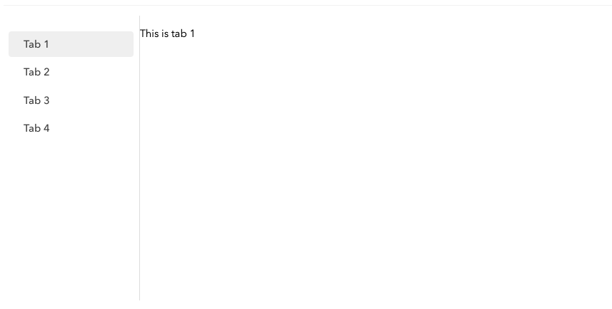
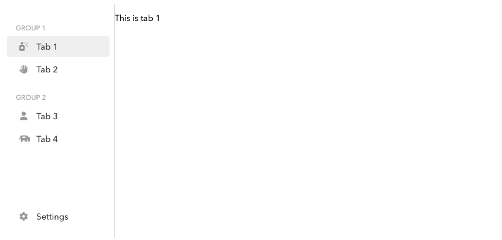

# Lesson 3

**By the end of this lesson, your will understand tabbed-based navigation, how to reflect navigation in the URL, develop a simple custom navigation component, and build top-level navigation for custom entry points.**

?>It is assumed you have read through the [code structure](lessons.md#code-structure) documentation in [Lessons](lessons.md) that describes where the sample code resides and how CSS styles are treated in the examples. You are expected to be familiar with the terminology found in [Navigation](ess_navigation.md), particularly the navigation model and the concepts of forward and backward propagation (as described in [Navigation model](ess_navigation.md#navigation-model) and [Navigation events](ess_navigation.md#navigation-events)).

Navigation is a key element of JUI applications (and are a common theme across many UI frameworks). There are many approaches to navigation and, naturally, JUI provides one such out-of-the-box (though you are not bound to this) which includes a few standard navigation components. This lesson aims to expose to you core principles of navigation through the following topics:

1. [Part A](#part-a-tabbed-navigation) we explore tabbed based navigation.
2. [Part B](#part-b-browser-url) understand how to reflect the navigation in the URL.
3. [Part C](#part-c-custom-navigation) we develop a simple custom navigation component.
4. [Part D](#part-d-top-level-navigation) build out custom entry point (top-level) navigation.

Each of the parts includes a set of exercises that you are encouraged to work through. Candidate solutions are provided under [Solutions to exercises](#solutions-to-exercises).

*Recall that working solutions can be found in the classes `Lesson3a`, `Lesson3b`, etc in the `com.effacy.jui.playground.ui.lessons` package.*


## Part A: Tabbed navigation

Of the more ubquitous navigation schemes is that of *tabbed navigation*. Here a series of tabs are presented to the user that, when clicked on, displays some content that appear "under" the tab. This model has a long heritage dating back to desktop application and has maintained a definitive place in contemporary web applications.

You will have already been exposed to this form of navigation as it is employed in the getting started guide and the structures used to host the code for the lessons. The part will build on this to illustrate the variety of tabs arrangements that are available and various navigation behaviours that can be utilised.

### The tabbed navigator

The `TabNavigator` provides a standard implementation of tabbed navigation and supports a variety of tabbing mechanisms (all configured by way of styles). We begin by creating a simple tabbed panel and adding to it four tabs:

```java
add (TabNavigatorCreator.create(cfg -> {
    cfg.style (TabNavigator.Config.Style.VERTICAL);
    cfg.padding (Insets.em (0));
    cfg.effect (CardFitLayout.Config.Effect.FADE_IN);
}, tabs -> {
    // Here we apply a height directly to the tabbed component, if we
    // don't do this it will have zero height by default. This is only
    // needed since we are add this into an existing page that makes
    // use of a verticaly layout where children appear in sequential order
    // down the page. Normally a tabbed panel will be added with a full
    // height layout and so no height specification is required.
    tabs.css (el -> CSS.HEIGHT.apply(el, Length.px (400)));

    // Here we add in four seperate tabs.
    tabs.tab ("tab1", "Tab 1", ComponentCreator.build (r -> {
        P.$ (r).text ("This is tab 1");
    }));
    tabs.tab ("tab2", "Tab 2", ComponentCreator.build (r -> {
        P.$ (r).text ("This is tab 2");
    }));
    tabs.tab ("tab3", "Tab 3", ComponentCreator.build (r -> {
        P.$ (r).text ("This is tab 3");
    }));
    tabs.tab ("tab4", "Tab 4", ComponentCreator.build (r -> {
        P.$ (r).text ("This is tab 4");
    }));
}));
```

which appears as follows:



Looking closely at the code we first observe that we are employing the helper class method `TabNavigatorCreator.create(...)`  where the first argument is a lambda-expression to configure the panel and the second adds tabs directly to the resultant panel component.

With regards to the configuration we select the `VERTICAL` style which presents the tabs down the left-hand side of the page and to the right the content of each tab. We also assign a zero padding (this is the padding used for the content area) and the `FADE_IN` navigation effect which applies a transition effect each time a new tab is selected.

When it comes to adding tabs we add these directly to the tabbed panel post construction (but prior to rendering). Tabs are added using the family of `tab(...)` methods; in this instance we specify a reference (i.e. `tab1` and is used to perform programmatic tabbing), a display label (i.e. `Tab 1`) and the tabs contents as a component (for convenience we employ simple inline components that display some text).

### Tab styles

The style in the previous example was `VERTICAL`, however there are quite a few standard styles to choose from. Modify the example above to explore each of these, for example:

```java
add (TabNavigatorCreator.create(cfg -> {
    cfg.style (TabNavigator.Config.Style.HORIZONTAL_BAR);
    ...
}, tabs -> {
    ...
}));
```

You may notice that if you try `VERTICAL_ICON` you don't see any of the tab labels appear. In addition to the label tabs may also be configured with icons. Try replacing the example with the following:

```java
add (TabNavigatorCreator.create(cfg -> {
    cfg.style (TabNavigator.Config.Style.VERTICAL_ICON);
    cfg.padding (Insets.em (0));
    cfg.effect (CardFitLayout.Config.Effect.FADE_IN);
}, tabs -> {
    tabs.css (el -> CSS.HEIGHT.apply(el, Length.px (400)));

    // Notice the addition of the icons.
    tabs.tab ("tab1", "Tab 1", ComponentCreator.build (r -> {
        P.$ (r).text ("This is tab 1");
    })).icon (FontAwesome.airFreshener ());
    tabs.tab ("tab2", "Tab 2", ComponentCreator.build (r -> {
        P.$ (r).text ("This is tab 2");
    })).icon (FontAwesome.allergies ());
    tabs.tab ("tab3", "Tab 3", ComponentCreator.build (r -> {
        P.$ (r).text ("This is tab 3");
    })).icon (FontAwesome.user ());
    tabs.tab ("tab4", "Tab 4", ComponentCreator.build (r -> {
        P.$ (r).text ("This is tab 4");
    })).icon (FontAwesome.cow ());
}));
```

Now replace `VERTICAL_ICON` with `VERTICAL` as with the original example.

?> Although not part of the lesson, you can construct your own styles or modify the existing styles as with other standard JUI components. The [Tutorial](tutorial.md) provides an example of this.

### Grouping and spacing

The vertical styles available to `TabNavigator` also support tab grouping as well as positioning tabs at the bottom of the tab set:

```java
add (TabNavigatorCreator.create(cfg -> {
    cfg.style (TabNavigator.Config.Style.VERTICAL_ICON);
    cfg.padding (Insets.em (0));
    cfg.effect (CardFitLayout.Config.Effect.FADE_IN);
}, tabs -> {
    tabs.css (el -> CSS.HEIGHT.apply(el, Length.px (400)));
    
    // First group.
    tabs.group ("Group 1");
    tabs.tab ("tab1", "Tab 1", ComponentCreator.build (r -> {
        P.$ (r).text ("This is tab 1");
    })).icon (FontAwesome.airFreshener ());
    tabs.tab ("tab2", "Tab 2", ComponentCreator.build (r -> {
        P.$ (r).text ("This is tab 2");
    })).icon (FontAwesome.allergies ());

    // Last group
    tabs.group ("Group 2");
    tabs.tab ("tab3", "Tab 3", ComponentCreator.build (r -> {
        P.$ (r).text ("This is tab 3");
    })).icon (FontAwesome.user ());
    tabs.tab ("tab4", "Tab 4", ComponentCreator.build (r -> {
        P.$ (r).text ("This is tab 4");
    })).icon (FontAwesome.cow ());

    // At the bottom.
    tabs.group (null).expand ();
    tabs.tab ("settings", "Settings", ComponentCreator.build (r -> {
        P.$ (r).text ("Settings here");
    })).icon (FontAwesome.cog ());
}));
```

which displays as follows:



Note that a group is declared with the `group(String)` method and all tabs added after this appear under that group. Passed to the group is the label for the group; this can be `null` in which case no label is displayed. This is used in the group that the `Settings` tab appears to take advangae of the group `expand()` configuration. This expands the group out away from its prior sibiling as much as possible. If this is done for the last group the effect is to place it at the bottom of the tab set.

### Nested tabs

Tabs can be nested quite easily (that is, the tab component is a `TabNavigator` itself):

```java
add (TabNavigatorPanelCreator.create(cfg -> {
    cfg.style (TabNavigator.Config.Style.VERTICAL);
    cfg.padding (Insets.em (0));
    cfg.effect (CardFitLayout.Config.Effect.FADE_IN);
}, tabs -> {
    tabs.css (el -> CSS.HEIGHT.apply(el, Length.px (400)));
    
    // First set of tabs.
    tabs.tab ("tab1", "Tab 1", TabNavigatorCreator.create (cfg -> {
        cfg.style (TabNavigator.Config.Style.HORIZONTAL_BAR);
        cfg.padding (Insets.em (1));
    }, tabs2 -> {
        tabs2.tab ("taba", "Tab A", ComponentCreator.build (r -> {
            P.$ (r).text ("This is tab 1.A");
        }));
        tabs2.tab ("tabb", "Tab B", ComponentCreator.build (r -> {
            P.$ (r).text ("This is tab 1.B");
        }));
    }));

    // Second set of tabs.
    tabs.tab ("tab2", "Tab 2", TabNavigatorCreator.create (cfg -> {
        cfg.style (TabNavigator.Config.Style.HORIZONTAL_UNDERLINE);
        cfg.padding (Insets.em (1));
    }, tabs2 -> {
        tabs2.tab ("taba", "Tab A", ComponentCreator.build (r -> {
            P.$ (r).text ("This is tab 2.A");
        }));
        tabs2.tab ("tabb", "Tab B", ComponentCreator.build (r -> {
            P.$ (r).text ("This is tab 2.B");
        }));
    }));
}));
```

Here we have configured the parent tab panel to contain two tabs: `Tab 1` and `Tab 2`. Each of these contains itself a tabbed pabel containing two tabs `Tab A` and `Tab B`. Through the labels and references are the same, each is scope by the respective parent tab so are distinct. For emphasis different styles are used for the child tabbed panels.

You may observe that initially the first tab in each panel is selected by default. This is intentional and a characteristic of the behaviour of tabbed panels. These are internal to the navigation tree and cannot be referenced directly themselves; that is, they always display a child. In the last example the parent tabbed panel activates `tab1` by default and its child, being a tabbed pabel, activate its first tab `taba` by default.

### Navigation awareness

The interface `INavigationAware` allows child components to be aware of when then are being activated or otherwise in a navigation heirarchy.  Create the following simple component:

```java
public class AwareComponent extends SimpleComponent implements INavigationAware {
        
    public AwareComponent(String content) {
        renderer (root -> {
            P.$ (root).text (content);
        });
    }

    @Override
    public void onNavigateTo(NavigationContext context) {
        Logger.info ("Navigated to");
    }

    @Override
    public void onNavigateFrom() {
        Logger.info ("Navigated from");
    }

}
```

the construct the following tab structure:

```java
add (TabNavigatorCreator.create(cfg -> {
    cfg.style (TabNavigator.Config.Style.VERTICAL);
    cfg.effect (CardFitLayout.Config.Effect.FADE_IN);
}, tabs -> {
    tabs.css (el -> CSS.HEIGHT.apply(el, Length.px (400)));
    tabs.tab ("tab1", "Tab 1", new AwareComponent ("This is tab 1"));
    tabs.tab ("tab2", "Tab 2", ComponentCreator.build (r -> {
        P.$ (r).text ("This is tab 2");
    }));
}));
```

As you navigate between the two tabs you should see logging appear in the console log that corresponds to the activation and deactivation of the first tab. The `onNavigationTo(...)` method is useful to initiate content loading (i.e. if there is a gallery or table) while the `onNavigationFrom(...)` can be employed to prompt the user if there is unsaved content. To better illstrate the latter, replace the `onNavigateFrom()` method in `AwareComponent` with the following:

```java
...

@Override
public void onNavigateFrom(INavigateCallback cb) {
    NotificationDialog.confirm (
        "Are you sure?",
        "Are you sure that you want to navigate away from this page?",
        outcome -> {
            if (NotificationDialog.OutcomeType.OK == outcome)
                cb.proceed ();
        }
    );
}

...
```

Here we are overriding a version of `onNavigateFrom(...)` that is passed a callback of type `INavigateCallback`. This has a method `proceed()` which tells it to continue with the navigation flow (this is called during forward-propagation, before any of the navigation state changes are actually applied). The effect of this is when you navigate away from the tab this method is invoked and a pop-up dialog is presented that asks you if you want to continue. If you confirm then the `OutcomeType` is `OK` and we proceed with the navigation flow. If you cancel the dialog then the navigation flow simply stops and you remain on the tab.

### Exercises

Now you have some familiarity with tabbed panels, try the following exercises:

1. The examples created tabbed panels using `TabNavigatorCreator` however you can create custom components that extend `TabNavigator` where the tabs are added in the constructor. Create a version of the nested tabbed example that uses such a custom component for the nested tabs.
2. Create a custom component that implements `INavigationAware` such the each time it is navigated to it display some randomised text. What do you observe when the tab is first navigated to?
3. Suppose you have added to a tabbed panel a component that has content that forces the panel to scroll.

## Part B: Browser url

*This part assumes you are working in the project created during [Getting started](intro_gettingstarted.md) where the entry point class is `PlaygroundApp` and the main UI class is `PlaygroundUI`.*

Often we will want to express the navigation location as a path on the URL. For a "single page" application is this achieved using the URL segment separated by a `#`.

### Updating the url

As you navigate through the application you want the URL to reflect the navigation location. To enable this modify the `onApplicationLoad()` method of the `PlaygroundApp` class as follows:

```java
@Override
public void onApplicationLoad() {
    PlaygroundUI ui = new PlaygroundUI();
    ui.bind ("pageBody");

    ui.assignParent (new INavigationHandlerParent () {

        @Override
        public void onNavigation(NavigationContext context, List<String> path) {
            DomGlobal.window.open ("#" +  NavigationSupport.build (path), "_self", null);
        }
    });
}
```

Here we are invoking the `assignParent()` method on the `PlaygroundUI` class (which extends `TabNavigator` and implements `INavigationHandlerWithProvider` which declares this method) passing an instance of `INavigationHandlerParent`. What is happening here is that when a navigable component received a back-propagation event it checks for an assigned parent, if there is one it propagates the event up to the parent. Here the parent simply receives the tail end of the back-propagation which carries with it the fully resolved navigation path (consisting of the various component references). This is then applied to the URL. The segment `#` tells the browser to append the path but not to refresh the page. This allows us to reflect the current navigation path on the URL without reloading the application each time.

When you recompile, as you navigate through the various tabs you will see the URL change. However, you will not see any changes to the URL when you navigation through the tabs that appear from [Part A](#part-a-tabbed-navigation), more on why this is later.

### Navigating from the url

As it stands, if you were to type in a url then nothing will happen (despite the url change when you navigate internally). In order to update the navigation based on changes in the URL you need to tap into the browser history.  Make the following changes to the `onApplicationLoad()` method of the `PlaygroundApp`:

```java
...

private String currentPath;

@Override
public void onApplicationLoad() {
    PlaygroundUI ui = new PlaygroundUI();
    ui.bind ("pageBody");

    ui.assignParent (new INavigationHandlerParent () {

        @Override
        public void onNavigation(NavigationContext context, List<String> path) {
            currentPath = NavigationSupport.build (path);
            DomGlobal.window.open ("#" + currentPath, "_self", null);
        }
    });

    History.addValueChangeHandler (new ValueChangeHandler<String> () {

        @Override
        public void onValueChange(ValueChangeEvent<String> event) {
            if (event != null) {
                String path = event.getValue();
                if ((currentPath == null) || !currentPath.equals (path))
                    ui.navigate (new NavigationContext (Source.EXTERNAL), NavigationSupport.split (path));
            }
        }

    });
}

...
```

Here we have attached a history listener that is triggered when there are changes to the URL segment. When a change is detected the segment value is retrieved as the path and is passed through to the top-level UI component via a call to `navigate(...)` (which is declared on `INavigationHandlerWithProvider`). In this case the navigation context is marked as being external (coming from the URL) and the path needs to be split into it respective path components.

Now this approachs resilient to putting in an invalid URL. If you do the history will generate a navigation event with an invalid URL. As that propagates forward through the navigation hierarchy the hierarchy will correct the URL by deferring to default locations. The resultant path is back-propagated through to the parent handler which then writes the corrected URL. Thus effectively correcting the URL and ensuring the URL properly reflect the current navigation.

There is a problem with this and that is the write-back to the URL generates a new history event. If this were processed then we would end up in an infinite loop. To remedy this we capture the updated URL in `currentPath` and compare that with the path obtained from the history event. If they are the same we do nothing (thereby breaking the cycle).

### Broken navigation heirarchies

We end this part by resolving the issue with the URL not updating for those tabbed panel examples. To see why this has happened we need to understand how the heirarchy is built. With respect to tabbed panels these all implement `INavigationHandlerWithProvider`. If we add a tab whose component also implements `INavigationHandlerWithProvider` (such as another tabbed panel) then that component is automatically *wired* into the heirarchy. If not then the component is treated as a *leaf* node where navigation flows terminate.

Since the tabbed panel examples are *embedded* in an instance of `LessonPanel` these are detached from the navigation heirachy so changes do not propagate back up (nor are navigation events propagated down through).

To our `Lesson3b` class add the following embedded tabbed panel:

```java
add (TabNavigatorCreator.create(cfg -> {
    cfg.style (TabNavigator.Config.Style.VERTICAL);
    cfg.padding (Insets.em (1));
    cfg.effect (CardFitLayout.Config.Effect.FADE_IN);
}, tabs -> {
    tabs.css (el -> CSS.HEIGHT.apply(el, Length.px (400)));
    tabs.tab ("tab1", "Tab 1", ComponentCreator.build (r -> {
        P.$ (r).text ("This is tab 1");
    })).icon (FontAwesome.airFreshener ());
    tabs.tab ("tab2", "Tab 2", ComponentCreator.build (r -> {
        P.$ (r).text ("This is tab 2");
    })).icon (FontAwesome.allergies ());
    tabs.tab ("tab3", "Tab 3", ComponentCreator.build (r -> {
        P.$ (r).text ("This is tab 3");
    })).icon (FontAwesome.user ());
    tabs.tab ("tab4", "Tab 4", ComponentCreator.build (r -> {
        P.$ (r).text ("This is tab 4");
    })).icon (FontAwesome.cow ());
}));
```

On recompile you should see the tabbed panel and observe that as you navigate through the tabs the URL does not change. Now modify the class so it looks like the following:

```java
public class Lesson3b extends LessonPanel implements INavigationHandlerProvider {

    private TabNavigator tabbedPanel;

    protected Lesson3b() {
        tabbedPanel = add (TabNavigatorCreator.create(cfg -> {
            cfg.style (TabNavigator.Config.Style.VERTICAL);
            cfg.padding (Insets.em (1));
            cfg.effect (CardFitLayout.Config.Effect.FADE_IN);
        }, tabs -> {
            tabs.css (el -> CSS.HEIGHT.apply(el, Length.px (400)));
            tabs.tab ("tab1", "Tab 1", ComponentCreator.build (r -> {
                P.$ (r).text ("This is tab 1");
            })).icon (FontAwesome.airFreshener ());
            tabs.tab ("tab2", "Tab 2", ComponentCreator.build (r -> {
                P.$ (r).text ("This is tab 2");
            })).icon (FontAwesome.allergies ());
            tabs.tab ("tab3", "Tab 3", ComponentCreator.build (r -> {
                P.$ (r).text ("This is tab 3");
            })).icon (FontAwesome.user ());
            tabs.tab ("tab4", "Tab 4", ComponentCreator.build (r -> {
                P.$ (r).text ("This is tab 4");
            })).icon (FontAwesome.cow ());
        }));
    }

    public INavigationHandler handler() {
        return tabbedPanel.handler();
    }

}
```

Now upon recompile you will see that the embedded tabbed panel not only contributes to the URL it can be controlled from the URL (as with the other tabs). So what is happening? First we have the lesson panel implement `INavigationHandlerProvider` (this is closed related to `INavigationHandlerWithProvider` mentioned above, but provides the bare essentials to embed a component in the navigation heirarchy). This interface declare the `handler()` method which is expected to return an instance of `INavigationHandler`. It is this handler that hooks the component into the navigation heirarchy. If we want to bring the tabbed panel into that heirarchy we simply return the handler for the panel, which we do.

Also note that we are not restructed to tabbed panels; any navigable component will work. We will illustrate this in the next part where we build out a custom navigable component.

### Exercises

Sometimes we want to invoke a programmatic navigation from within the application to navigate to some other location in the application.

1. Modiy the `PlaygroundApp` class to expose a static navigate method that takes a path (as a string) and navigates to the associated path location. Test this by hard coding a button on one of the pages to navigate to another page.
2. In the last example we exposed the `INavigationHandler` from the embedded tabbed panel to introduce it into the navigation heirarchy. If we had two embedded tabbed panels could we bring both of them into the heirarchy? If not, explain why not.

## Part C: Custom navigation

**Refer to `ReportNavigation`**

*The example that follows is a variant of the standard JUI navigation component `CardNavigator`; however it is significantly simplified.*

Tabbed navigation will often take you where you need from a navigation standpoint, however occasions arise where you want to create your own navigation.

Consider a scenario where you have a number of interactive reports and you want a way of navigating to them that does not pre-suppose any initial report. One approach is to list all the reports as cards in the page and when clicked on the report displays. A simple breadcrumb-like navigation allows you to go back to the gallery of reports.

To achieve this we need:

1. A custom navigation component that one can add any number of child components (i.e. interactive reports) to along with meta-data pertaining to each component that can guide the user selection.
2. The component presents a gallery of cards, each representing a child component and presenting the components meta-data appropriately formatted.
3. The cards are clickable and when clicked on the gallery is replaced by the associated component. In addition a breadcrumb trial appears allowing one to navigate back to the gallery.

As you can see this differs fundamentally from the tabbed panel in that the component itself can be navigated to (i.e. the navigation path can terminate at card gallery).

### Basic component

We being by creating a basic component `ReportNavigation` (CSS is declared in `lesson.css` that you copied across when building the lesson structure):

```java
public class ReportNavigation extends SimpleComponent {

    private static final String REGION_BODY = "body";

    private Element headerEl;

    @Override
    protected INodeProvider buildNode(Element el, Config data) {
        return Wrap.$ (el).$ (root -> {
            root.style ("lesson3_navigation");
            Div.$ (root).$ (wrap -> {
                wrap.style ("wrap");
                Header.$ (wrap).$ (header -> {
                    header.by ("header");
                    H2.$ (header).text ("Reports");
                });
                Div.$ (wrap).$ (body -> {
                    body.style ("body");
                    body.use (region (REGION_BODY, new CardFitLayout.Config ().build ()));
                });
                Div.$ (wrap).$ (cards -> {
                    cards.style ("card");
                });
            });
        }).build (dom -> {
            headerEl = dom.first("header");
        });
    }
}
```

which is added with (setting a fixed height as with the prior parts):

```java
add (new ReportNavigation())
    .css (el -> CSS.HEIGHT.apply(el, Length.px (400)));
```

What we have done here is create three separate areas: header, body and card. The header appears at the top with body and card below, however only one of body or card will be displayed at any one time (this is controlled by the CSS `body` and `card`). The body element is bound to a *region*, under the reference `REGION_BODY`, that child components can be added to. The layout of these children is `CardFitLayout` that only display one child at a time. The header contains an H2 element that displays the current location and will (soon) display a breadcrumb trail. Since this is a navigation for reporting, the initial state displays the header *Reports* and the list of reports as cards. We now move to declaring the reports.

### Declaring reports

To keep things simple we pass a list of configuration items representing each report. This is done by passing an array of simple report configurations each specifying a title, description, navigation references (as appears in the navigation path) and the associated component to display when the report is activated:

```java
public class ReportNavigation extends SimpleComponent {

    public static class Report extends RegistrationItem {

        private String reference;

        private String title;

        private String description;

        public Report(String reference, String title, String description, IComponent component) {
            super (component);
            this.reference = reference;
            this.title = title;
            this.description = description;
            this.component = component;
        }
    }

    private static final String REGION_BODY = "body";

    private Element headerEl;

    private List<Report> reports;

    public ReportNavigation(List<Report> reports) {
        this.reports = reports;
            
        reports.forEach (report -> {
            // Add the components to the body region.
            findRegionPoint (REGION_BODY).add (report.component);
        });
    }

    @Override
    protected INodeProvider buildNode(Element el, Config data) {
        return Wrap.$ (el).$ (root -> {
            root.style ("lesson3_navigation");
            Div.$ (root).$ (wrap -> {
                wrap.style ("wrap");
                Header.$ (wrap).$ (header -> {
                    header.by ("header");
                    H2.$ (header).text ("Reports");
                });
                Div.$ (wrap).$ (body -> {
                    body.style ("body");
                    body.use (region (REGION_BODY, new CardFitLayout.Config ().build ()));
                });
                Div.$ (wrap).$ (cards -> {
                    cards.style ("card");
                    Div.$ (cards).style ("wrap").$ (inner -> {
                        reports.forEach(card -> {
                            Div.$(inner).$ (
                                H3.$().text (card.title),
                                P.$ ().text(card.description)
                            );
                        });
                    });
                });
            });
        }).build (dom -> {
            headerEl = dom.first("header");
        });
    }
}
```

First note that the report configuration extends `RegistrationItem` (which is declared in `NavigationHandlerRouter` as discussed in the next section). This allows the component associated to the report to receive navigation events and, if desired, provide a navigation handler so it can partake in the broader navigation hierarchy.

Also note that in the constructor we add each of the report components to the body region, the intention being that as we select a report to display we just activate it in that region (by way of the card-fit layout).

We update the addition as follows to configure this with four dummy reports:

```java
List<ReportNavigation.Report> reports = new ArrayList<>();
reports.add (new ReportNavigation.Report ("report1", "Report 1", "The first interactive report", ComponentCreator.build (root -> {
    P.$ (root).text ("Interactive report 1");
})));
reports.add (new ReportNavigation.Report ("report2", "Report 2", "The second interactive report", ComponentCreator.build (root -> {
    P.$ (root).text ("Interactive report 2");
})));
reports.add (new ReportNavigation.Report ("report3", "Report 3", "The third interactive report", ComponentCreator.build (root -> {
    P.$ (root).text ("Interactive report 3");
})));
reports.add (new ReportNavigation.Report ("report4", "Report 4", "The fourth interactive report", ComponentCreator.build (root -> {
    P.$ (root).text ("Interactive report 4");
})));
add (new ReportNavigation (reports))
    .css (el -> CSS.HEIGHT.apply (el, Length.px (400)));
```

We now need to incorporate the actual navigation.

### Activating the navigation

We now modify the class to incorporate a suitable instance of `NavigationHandlerRouter` which is used to orchestrate navigation events:

```java
public class ReportNavigation extends SimpleComponent {

    ...
    
    public ReportNavigation(List<Report> reports) {
        this.reports = reports;
        
        reports.forEach (report -> {
            findRegionPoint (REGION_BODY).add (report.component);
            // Here we register the report configurations.
            navigationRouter.register (report);
        });
    }

    @Override
    protected INodeProvider buildNode(Element el, Config data) {
        return Wrap.$ (el).$ (root -> {
            root.style ("lesson3_navigation");
            Div.$ (root).$ (wrap -> {
                wrap.style ("wrap");
                Header.$ (wrap).$ (header -> {
                    header.by ("header");
                    H2.$ (header).text ("Reports");
                });
                Div.$ (wrap).$ (body -> {
                    body.style ("body");
                    body.use (region (REGION_BODY, new CardFitLayout.Config ().build ()));
                });
                Div.$ (wrap).$ (cards -> {
                    cards.style ("card");
                    Div.$ (cards).style ("wrap").$ (inner -> {
                        reports.forEach(card -> {
                            Div.$(inner).$ (
                                H3.$().text (card.title),
                                P.$ ().text (card.description)
                            ).onclick (e -> {
                                navigationRouter.navigate (new NavigationContext (NavigationContext.Source.INTERNAL, false), card.reference);
                            });
                        });
                    });
                });
            });
        }).build (dom -> {
            headerEl = dom.first("header");
        });
    }

    private Object TOP = new Object();

    private NavigationHandlerRouter navigationRouter = new NavigationHandlerRouter () {

        @Override
        protected void onNavigationForward(NavigationContext context, List<String> path, TriConsumer<NavigationContext, List<String>, Object> propagator) {
            Report card = null;
            List<String> childPath = NavigationSupport.copy (path);

            // Here we take the first element of the child path (if there is
            // one) and map that to a report using the reference associated
            // with that report. If found we need to remove that child path
            // component from the front of the child path.
            if ((path != null) && !path.isEmpty ()) {
                String child = path.get(0);
                childPath.remove(0);
                for (Report report : reports) {
                    if (child.equals(report.reference))
                        card = report;
                }
            }

            // If we are here then either this is no child path or we could not
            // map a child to the first component of that path. In this case we
            // display the card gallery which is represented by TOP.
            propagator.accept (context, childPath, (card != null) ? card : TOP);
        }

        @Override
        protected Promise<ActivateOutcome> onChildActivated(Object child) {
            // Here we need to activate the child represent by the passed Object.
            // The first case is the distinguished TOP which represents the
            // card gallery. Otherwise we expect it to be an instance of Report.
            if (TOP == child) {
                getRoot().classList.remove("body");
                buildInto(headerEl, header -> {
                    H2.$ (header).text ("Reports");
                });
                return Promise.create (ActivateOutcome.ACTIVATED);
            }

            // Here we are displaying a report component.
            getRoot().classList.add("body");
            Report card = (Report) child;
            IComponent cpt = card.component;
            Promise<ActivateOutcome> promise = Promise.create ();
            buildInto(headerEl, header -> {
                Div.$ (header).style ("crumb").$ (crumb -> {
                    Span.$ (crumb).onclick (e -> {
                        navigate (new NavigationContext (NavigationContext.Source.INTERNAL, false));
                    }).text ("Reports");
                    Em.$ (crumb).style (FontAwesome.chevronRight ());
                    Span.$ (crumb).text (card.title);
                });
                H2.$ (header).$ (
                    A.$ ().$ (
                        Em.$ ().style(FontAwesome.chevronLeft ())
                    ).onclick(e -> {
                        navigate (new NavigationContext (NavigationContext.Source.INTERNAL, false));
                    }),
                    Text.$ (card.title)
                );
            });
            ((CardFitLayout) findRegionPoint (REGION_BODY).getLayout ()).activate (cpt).onFulfillment (v -> promise.fulfill (v));
            return promise;
        }
    };
}
```

There is quite a bit here so we unpack the changes in detail:

1. We have introduced a custom instance of `NavigationHandlerRouter` which manages the interface between the component and the navigation heirarchy. The details of this are expanded up below (as this constitutes the bulk of the custom navigation).
2. The navigable items are the instances of `Report` (rather than the components themselves). This allows us to capture the associated meta-data along with the component which can be used to modify the component state as navigation events are processed. We register each card with the router which leverages the report configuration extending `RegistratiobnItem`. The router can then send navigation events to the card which delegate through to the component. 
3. When a report card is clicked it needs to generate a navigation event. This is handled by an `onclick` handler that invokes `navigate(...)` on the router passing the card reference (that forms the child component of the navigation path). The router will engage to process the event by initiating a forward-propagation.

We can now focus on the router, in particular the implementation of the methods `onNavigationForward(...)` and `onChildActivated(...)`.

The `onNavigationForward(...)` is invoked on the forward-propagation flow (i.e. as initiated by clicking on a card as described in item (3) above). The expectation is that the method will use the passed child-path (the part of the navigation path that descended beyond this navigation node) to determine which child to display. This child is then propagated forward with a new child path relative to that child (i.e. with the front child component removed). Here the "child" is an instance of `Report` (so does not need to be the component that is ultimately displayed) and this is (later) used to re-configure the navigation state of the component. We will describe this shortly. However, what if we can't find a child (either there is no mapping to the path component or there is no path component at all)?

Normally if a child is not found we need to identify a default child and use that. Our navigation is different in that we don't have a notion of default other than the card gallery. This is a unique situation and one we represent by a distinguished object which is `TOP`. In this case `TOP` is used.

The router, having obtained the child to transition to, invokes `onChildActivated(Object)` passing that child. The expectation is that this method will change the state of the component to display the child represented by the passed object. First we test for the distinguided child `TOP`. If found we display the card gallery (by using the application and removal of the CSS class `body` on the component root) and update the header to render the simple title "Reports". If we are not passed `TOP` but rather a `Report` instance then we display the body region and activate in that region the component associated with the report data. In addition we re-render the header to display the title of the report as the header and a breadcrumb. The header is rendered with an icon (the EM) that navigates back to the card gallery when clicked on. The same action is applied to the first component of the breadcrumb. Note that this back navigation simply invokes `navigate(...)` on the router but with *no* path (which is mapped to `TOP` in `onNavigationForward(...)`).

As a final observation `onChildActivated(Object)` returns `Promise`. This allows for delayed child rendering which may be the case when code-splitting is used. The pattern employed here is to create a separate promise and return that. Then, when activating the child component in the body region we fulfill that promoise on fulfulment of the promise returned by that activation. When the card gallery is displayed there are no delays and we can return a fulfilled promise (i.e. `return Promise.create (ActivateOutcome.ACTIVATED)`).

You will see that the navigation is operational but the changes do not reflect on the URL (assuming you have worked through [Part B](#part-b)). We now turn to addressing this.

### Integrating into the navigation heirarchy

There are two reasons why the URL does not change. The first is described in [Part B](#part-b) where the navigation component is embedded in the lesson class. The second is that the component itself does not make itself known as being navigation aware. The latter we can address by having the class implement `INavigationHandlerWithProvider` and returning the router in the `handler()` method:

```java
public class ReportNavigation extends SimpleComponent implements INavigationHandlerWithProvider {

    ...

    @Override
    public INavigationHandler handler() {
        return navigationRouter;
    }
}
```

With these changes you can add the report navigation to any navigation component (i.e. a `TabNavigator`) and it will automatically register with the navigation heirarchy. To get this to work with the lesson class we need to make similar changes to the lesson class similar to what was done in [Part B](#part-b):

```java
public class Lesson3c extends LessonPanel implements INavigationHandlerWithProvider {

    private ReportNavigation reportNavigation;

    protected Lesson3c() {
        ...
        add (reportNavigation = new ReportNavigation (reports))
            .css (el -> CSS.HEIGHT.apply (el, Length.px (400)));
    }

    @Override
    public INavigationHandler handler() {
        return reportNavigation.handler ();
    }
}
```

You will now observe the report navigation is integrated with the browser URL.

## Part D: Top-level navigation

## Solutions to exercises

Here we present candidate solutions to the exercises presented in each of the parts. Note that these are (in general) only one of many possible solutions.

All solutions are presented as if they were being added to the constructor of the appropriate `Lesson3a`, `Lesson3b`, etc class used for the lessons in general.

### Part A

#### Exercise 1

A candidate custom class is:

```java
public class ExampleA1 extends TabNavigator {

    public ExampleA1(TabNavigator.Config.Style style) {
        super (new TabNavigator.Config().style (style));

        tab ("taba", "Tab A", ComponentCreator.build(root -> {
            P.$ (root).text ("Tab A (componentUuid=" + this.getUUID() + ")");
        }));
        tab ("tabb", "Tab B", ComponentCreator.build(root -> {
            P.$ (root).text ("Tab B (componentUuid=" + this.getUUID() + ")");
        }));
    }
}
```

Note that the contents of the child components displays the UUID of the `ExampleA1` instance that it is included in. This is just to demonstrate the uniqueness of the tabs.

This can then be included in the `Lesson3a` constructor as:

```java
add (TabNavigatorCreator.create(cfg -> {
    cfg.style (TabNavigator.Config.Style.VERTICAL);
    cfg.padding (Insets.em (0));
    cfg.effect (CardFitLayout.Config.Effect.FADE_IN);
}, tabs -> {
    tabs.css (el -> CSS.HEIGHT.apply (el, Length.px (400)));
    tabs.tab ("tab1", "Tab 1", new ExampleA1 (TabNavigator.Config.Style.HORIZONTAL_BAR));
    tabs.tab ("tab2", "Tab 2", new ExampleA1 (TabNavigator.Config.Style.HORIZONTAL_UNDERLINE));
}));
```

to align with the nested example from the lesson.

#### Exercise 2

The following is a simple component that renders, whenever navigated to, one of ten random sentences into a P tag contained in the components root element.

```java
public class ExampleA2 extends SimpleComponent implements INavigationAware {

    private Element contentsEl;

    private String [] sentences = new String [] {
        "The cat slept on the warm windowsill.",
        "He baked cookies for the school fundraiser.",
        "She went hiking in the nearby forest.",
        "The dog chased the ball with enthusiasm.",
        "She painted the fence blue last weekend.",
        "The sun set behind the tall mountains.",
        "He read a book under the old tree.",
        "The kids played soccer at the local park.",
        "She fixed the broken bike before dinner.",
        "The flowers bloomed in the spring garden."
    };

    public ExampleA2() {
        renderer (root -> {
            P.$ (root).by ("contents").text ("Initial content on render");
        }, dom -> {
            contentsEl = dom.first ("contents");
        });
    }

    @Override
    public void onNavigateTo(NavigationContext context) {
        // We need to check that the contents element is non-null. This is
        // due to the fact that the component can be navigated to (on the
        // forward propagation) before it is actually rendered (on the back-
        // propagation). Could also have used isRendered().
        if (contentsEl != null)
            contentsEl.innerHTML = sentences[Random.nextInt (sentences.length)];
    }

}
```

and included as follows:

```java
add (TabNavigatorCreator.create(cfg -> {
    cfg.style (TabNavigator.Config.Style.VERTICAL);
    // Makes the contents more readable.
    cfg.padding (Insets.em (1));
    cfg.effect (CardFitLayout.Config.Effect.FADE_IN);
}, tabs -> {
    tabs.css (el -> CSS.HEIGHT.apply(el, Length.px (400)));
    tabs.tab ("tab1", "Tab 1", new ExampleA2 ());
    tabs.tab ("tab2", "Tab 2", new ExampleA2 ());
}));
```

As you navigate between the tabs the text changes.

As for what you observe on first navigation to a tab? The random text does not display, it only displays on subsequent navigations. The reason for this is that the notification of being navigated to occurs *prior* to rendering (the reason for this is that the showing of the tab, which invokes the rendering, occurs on the back-propagation while the notification of being navigated to occurs on the forward-propagation and respects the node hierarhcy). You need to account for this by testing for being rendered in the `onNavigateTo(...)` method.

### Part B

#### Exercise 1

Here is an candidate version if `PlaygroundApp` (assumes you are using the getting started project):

```java
public class PlaygroundApp implements ApplicationEntryPoint {

    private String currentPath;

    // This is OK as we only have one instance of the entry point.
    private static PlaygroundUI UI = new PlaygroundUI();

    @Override
    public void onApplicationLoad() {
        UI.bind ("pageBody");

        UI.assignParent (new INavigationHandlerParent () {

            @Override
            public void onNavigation(NavigationContext context, List<String> path) {
                currentPath = NavigationSupport.build (path);
                DomGlobal.window.open ("#" + currentPath, "_self", null);
            }
        });

        History.addValueChangeHandler (new ValueChangeHandler<String> () {

             @Override
             public void onValueChange(ValueChangeEvent<String> event) {
                 if (event != null) {
                    String path = event.getValue();
                    if ((currentPath == null) || !currentPath.equals (path))
                        UI.navigate (new NavigationContext (Source.EXTERNAL), NavigationSupport.split (path));
                 }
             }

        });
    }

    public static void navigation(String path) {
        UI.navigate (new NavigationContext (Source.INTERNAL), NavigationSupport.split (path));
    }
    
}
```

The main points of variation from the changes made during the lesson is the transition of the `PlaygroundUI` instance to be a static members (since there is only one instance of the entry point) and the addition of the static `navigate(String)` method (the `Source.INTERNAL` is informative and indicates the navigation arose programmatically rather than via the URL).

We can add to `Lesson3b` the following activation:

```java
add (ButtonCreator.build(cfg -> {
    cfg.label ("Navigate to first lesson");
    cfg.handler (() -> {
        PlaygroundApp.navigation ("/lessions/lesson1/lesson1a");
    });
}));
```

The path specified (`"/lessions/lesson1/lesson1a"`) assumes you have constructed the lesson structure as per the getting started and you have done the first part of the first lesson. You may have choosen a different path and that is fine.

#### Exercise 2

The answer to this is **no**. The reason is that a component that forms a part of the navigation heirarchy can only have one active child at any one time. If we had two tabbed panels and both were to partake of the navigation hierarchy then, by definition, we would have two active children (which is not allowed).

The only way that you could accommodate more than one tabbed panel is to make each a child of the component at letting the component manage the display of the children (which is exactly how a tabbed panel works). Here we are heading into custom navigation territory.