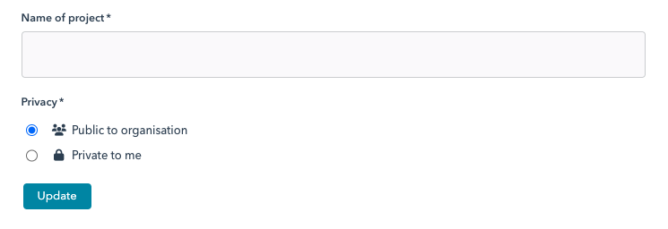

# Lesson 5

?>It is assumed you have read through [code structure](lessons.md#code-structure) that describes where the sample code resides and how CSS styles are treated in the examples. You are also encouraged to refer to [Modals](ess_modals.md) that provides a more detailed overview of modal dialogs than the more hands-on approach presented here.

Here we allows you to familarise youself with modal dialogs and how they can be employed in various circumstances.

## Part A

We begin by considering inline dialogs, these being dialogs that are created entirely inline to the context in which they are being used. These can be quite useful for dialogs that are not being reused in other locations and so do not require formal compoentisation. If you are wanting to reuse dialogs then see [Part B: Reusable dialogs](#part-b-reusable-dialogs).

### A confirmation dialog

A simple confirmation dialog provides an ideal example to illustrate how inline modals can be created. The following is assumed to be included in the constructor of a `Panel` (see the class `Lesson2a` for a working implementation):

```java
add (ButtonCreator.build (cfg -> {
    cfg.label ("Open modal");
    cfg.handler (() -> {
        ModalDialogCreator.build (ComponentCreator.$ (p -> {
            p.css (CSS.MARGIN, Insets.em (2)).text ("Hello!");
        }), mcfg -> {
            mcfg.removeOnClose ();
            mcfg.title ("Inline dialog");
            mcfg.width (Length.px (300));
            mcfg.action (action -> {
                action.label ("Confirm");
            });
        }).open ();
    });
}));
```

First we create and add a `Button` using `ButtonCreator.build(Consumer<Button.Config>)`. This takes a consumer that is passed a button configuration instance to configure and returns a button built from that configuration. To this button assign the label "Open modal" along with a click handler; the click handler is where we create the inline modal.

This modal is displayed by calling the `open()` on the instance returned by `ModalDialogCreator.build (IComponent,Consumer<ModalDialog.Config<C>>)`.

For the component (the first argument to the creator method) we create one inline (see [Components](ess_components.md)) that displays the text "Hello!" inside of a P element with a suitable margin.

For the modal's configuration we give it the title "Inline dialog" and width of 300px. We also declare a single action whose label is "Confirm". Actions created this way will, by default, close the dialog when they are enacted. We can attach a handler to actions an specify other behaviours (as we will see below) but for this example we just let the dialog close.

Now the modal dialog instance returned by the create can be reused (just be calling `open()` each time you want to use it). In our example, however, we don't want the dialog to remain since we are not retaining a reference to it. In this case we configure the dialog with `removeOnClose()` and when the dialog is closed it will be disposed of. We will refer to such dialogs as *single use*.

?> Dialogs are parented inside of a dedicated element attached to the body element in the DOM and is given the ID `modal-dialogs-container`. If you inspect the DOM in the browser you will see the dialog root elements being added to the element and removed when the dialog is closed (if the dialog is marked as `removeOnClose()`).

The following example is a variant of the above that will keep the dialog around and re-use it each time the button is clicked.

```java
add (ButtonCreator.$ (cfg -> {
    final ModalDialog<?> dialog = ModalDialogCreator.build (ComponentCreator.$ (p -> {
        p.css (CSS.MARGIN, Insets.em (2)).text ("Hello!");
    }), mcfg -> {
        mcfg.title ("Inline dialog");
        mcfg.width (Length.px (300));
        mcfg.action (action -> {
            action.label ("Confirm");
        });
    });
    cfg.label ("Open modal");
    cfg.handler (() -> dialog.open ());
}));
```

In this case we create the dialog as a final member of the configuration lambda expression, this is then referenced by the button handler which simply opens the dialog.

As to which variantion you choose will depend on the case at hand but is largely a matter of preference (noting that the second example the dialog is not being created on demand, which is not always desireable as creating a lot of UI components upfront can slow your application down noticably). However, if you are retaining instances in this way you will likely be better off considering creating concrete components rather than inlining them.

?> Note that JUI does provide a confirmation dialog that is out-of-the-box with `NotificationDialog`; there is no need to make use of the above in a practical sense for simple notifications.

### Dialog actions

As noted above, dialogs created this way can perform actions. The following example will keep with the theme of single-use dialogs, however we will assume the example below appears in a `Panel` so we retian a class member of type `Button` that the button is assigned to. This allows us to easily access the button within the inlined-code (otherwise it gets a little fiddly):

```java
private Button btn1;

...

add (btn1 = ButtonCreator.$ (cfg -> {
    Carrier<Integer> count = Carrier.of (1);
    cfg.label ("Open modal");
    cfg.handler (() -> {
        ModalDialogCreator.build (ComponentCreator.$ (root -> {
            root.p ().css (CSS.MARGIN, Insets.em (2)).text ("Click the button to update the label");
        }), mcfg -> {
            mcfg.removeOnClose ();
            mcfg.title ("Change button label");
            mcfg.width (Length.px (300));
            mcfg.action (action -> {
                action.label ("close");
                action.link ();
            });
            mcfg.action (action -> {
                action.label ("Change label");
                action.handler (hcb -> {
                    btn1.updateLabel ("Label changed " + count.get (v -> v + 1));
                    hcb.success ();
                });
            });
        }).open ();
    });
}));
```

Of note is that we create a state variable `count` (the `Carrier` allows us to declare the variable as `final` and thus is accessible from the ensuing lambda expressions). We declare a simple action whose label is `close` as of type `link()`, this is used to simply close the dialog. We declare a second action whose label is `Change label` along with an action handler (that is invoked when the action is enacted). This handler updates the label of the button with a count that comes from the state variable ( and then advances the variable by one). It then invokes the handlers callback method `success()` which tells the dialog that the action was successful and it can close (calling `fail()` will return control back to the dialog without closing it, see the next example for this behaviour).

### Interactive dialogs

We finish this part with a more complex dialog that is interactive. In practice dialogs of this complexity are likely to head towards being proper components than being inlined, however there are cases where this model remains valid (and it provides a great example with some depth):

```java
private Button btn2;

...

add (btn2 = ButtonCreator.$ (cfg -> {
    cfg.label ("Open modal");
    cfg.handler (() -> {
        ModalDialogCreator.build (ControlFormCreator.build (ccfg -> {
            ControlFormCreator.configureForDialog (ccfg);
        }, panel -> {
            panel.group (sec -> {
                sec.group (gcfg -> {
                    gcfg.control ("label", "New button label", Controls.text (tcfg -> {
                        tcfg.validator (
                            Validators.notEmpty ("Please provide a new label"),
                            Validators.length (0, 40, "Cannot be more that 40 characters")
                        );
                    }), cell -> {
                        cell.grow (1)
                            .required ()
                            .guidance ("The label of the button that opened this dialog will be updated with this text."); 
                    });
                });
            });
        }), mcfg -> {
            mcfg.removeOnClose ();
            mcfg.title ("Update button label");
            mcfg.width (Length.px (400));
            mcfg.action (action -> {
                action.label ("close");
                action.link ();
            });
            mcfg.action (action -> {
                action.label ("Change label");
                action.handler (hcb -> {
                    if (!hcb.contents ().validate ()) {
                        hcb.fail ();
                    } else {
                        String newLabel = (String) hcb.contents ().value ("label");
                        btn2.updateLabel (newLabel);
                        hcb.success ();
                    }
                });
            });
        }).open ();
    });
}));
```

As with the previous example we maintain a button (and button member `btn2`) that creates a single use modal. In this case our component is a `ControlPanel` created using `ControlPanelCreator.$ (Consumer<ControlPanel.Config>, Consumer<ControlPanel>)` (see [Forms & controls](ess_controls.md) for details). This creator is passed a consumer to configure the panels configuration, from which a panel is built and passed to the second consumer to build out. In the case above the panel is configured simply with some padding and instructed to display error messages in a compact manner (this is the typical for dialogs). Within the builder we create a *form section* within which we create a *form group* that contains a single text control and some giudance text. The control is given the lookup reference `label` and two validators (for not being empty and for having no more that 40 characters). In addition the controls is associated with the display label *New button label* and is marked as being required. The result looks something like this:


We retain the close action but expand on the second. In addition to a change of label, when enacted we first validate the form controls (we can gain access to the contents of the dialog via `hcb.contents()`). If validation fails then we fail the action and return (the dialog displays an error message remaining open and in focus). If validation passes the we retrieve the contents of the text field using its reference and use it to update the buttons label.

?> This example does violate some tenets, one in particular is the soft reference to data (in this case accessing the text controls value by a reference that is a string, not to mention the casting the value from `Object`). A more correct approach would be to assign the text control to a class member then access the control value directly. However that would be best handled with a proper component class than trying to do that inlined. The emphasise that inlining is a convenience and should be employed judiciously.

## Part B

We build on inline dialogs to describe how to dialog-enable panels (which are generally forms).

?>A note on the `Lesson2a` class that holds the code for this lesson. This implements `IResetable` that declares the `reset()` method. The default implementation is to call `reset()` on all children of the component that themselves implement `IResetable` (which `ControlPanel` does). This means that resetting the `Lesson2a` panel instance will also reset the added control panels and thus will reset the form fields. Now `Lesson2a` also implements `INavigationAware` and provides an implementation for the `onNavigateTo(NavigationContext)` method. This implementation calls `reset()`. The effect of this is that when the tab is navigated to the form will always reset to its initial state. It is useful to keep in mind this behaviour of `IResetable` (the same is true of `IEditable`).

### A simple form component

We begin by declaring a simple form (to create a fictitious "project") that we will ultimately turn into a dialog (which can be added to a panel, as with the example code, by `add (new SimpleFormPanel1 ()`) and is entirely self-contained):

```java
public static class SimpleFormPanel1 extends ControlPanel {

    private TextControl nameCtl;

    private SelectionGroupControl<String> privacyCtl;

    public SimpleFormPanel1() {
        super (new ControlPanel.Config (Length.em (0.75)).messagesStyles (NotificationBlock.Config.Style.STANDARD_COMPACT).padding (Insets.em (2.5, 2)));

        ControlSection sec1 = section ().build ();
        sec1.group (grp -> {
            grp.control (0, 0, nameCtl = new TextControl.Config () //
                    .validator (NotEmptyValidator.validator ("please enter the name of the project")) //
                    .build () //
            ).label ("Name of project").grow (1).required ();
        }).build ();
        sec1.group (grp -> {
            grp.control (0, 0, privacyCtl = new SelectionGroupControl.Config<String> () //
                    .radio () //
                    .option ("option1", FontAwesome.users (), "Public to organisation", null) //
                    .option ("option2", FontAwesome.lock (), "Private to me", null) //
                    .validator (NotEmptyValidator.validator ("please select an option")) //
                    .build () //
            ).label ("Privacy").required ();
        }).build ();
        privacyCtl.setValue (ListSupport.list ("option1"));

        add (PanelCreator.buttonBar (null, bar -> {
            bar.add (ButtonCreator.$ ().label ("Update").handler(() -> {
                if (SimpleFormPanel1.this.validate ()) {
                    // Perform the save action here.
                    NotificationDialog.alert ("Saving information", "The information has been saved", () -> {
                        SimpleFormPanel1.this.reset ();
                    });
                }
            }).build ());
        }));
    }
}
```

This extends `ControlPanel` and adds a single *form section* and two *form groups* (see [Controls & forms](ess_controls.md) for details on how forms can be constructed). The first form group contains a single text control (for the project name) and the second a radio button selector (for privacy). Each come with some standard in-line validations. The privacy control is assigned a default (the first option) and an update button is added at the tail of the form (using the convenience `PanelCreator.buttonBar` to create a panel that can layout button horizontally and adding a button to that). The resulting form looks something like:



When the "Update" button is clcked we mimic a flow where the panel is validated and if valid we enact a save. To indicate this flow we pop up a notification dialog then reset the form (which is purely for illustration not being the focus of this lesson).

### Preparing to put in a dialog

Dialogs provide a button bar at the button of the dialog to standardise layout (you are not bound by this restriction but it is advantageous to use). This facilitates a pathway to easy "wrap" components in a dialog and enact standard behaviours typical of a dialog. To leverage this we first need to isolate the update mechanism as a separate method (which is good practice in any case). We have the component implement `IProcessable` and add a `process(...)` method:

```java
public static class SimpleFormPanel2 extends ControlPanel implements IProcessable<Object> {

    ...

    public SimpleFormPanel2() {
        ...

        add (PanelCreator.buttonBar (null, bar -> {
            bar.add (ButtonCreator.$ ().label ("Update").handler(() -> {
                process(outcome -> {
                    if (!outcome.isEmpty ())
                        SimpleFormPanel2.this.reset ();
                });
            }).build ());
        }));
    }

    @Override
    public void process(Consumer<Optional<Object>> outcome) {
        if (validate ()) {
            // Perform the save action here.
            NotificationDialog.alert("Saving information", "The information has been saved", () -> {
                // Object is used as a proxy. Normally we would return a representation of the
                // updated object that can be used to propagate state changes.
                outcome.accept (Optional.of (new Object ()));
            });
        } else
            outcome.accept (Optional.empty ());
    }
    
}
```

There are some key points we need to make:

1. `IProcessible` is generic over a type (which we will refer to as `V`). This type represents some useful state information over what is being processed (for example it could be a ID for a newly created entity or a value type encapsulating the information that was updated). Usually this allows us to update application state once a change has occurred). For our purposes we have nothing that is actually being updated so we just use `Object`.
2. The `process(Consumer<Optional<V>> outcome)` method takes a consumer over `Optional<V>`. This consumer acts as a callback where should the optional value be empty then it is assumed processing failed otherwise it succeeded passing back the new state.

In our case we validate as before and if that fails we respond with `Optional.empty ()` (failure) otherwise we assume success and respond with `Optional.of (new Object ())` (using `Object` since we don't actually have state and the optional needs something to contain). Finally we have adapted our button action to call and respond to the `process(...)` method.

We are now ready to move onto turning this into a dialog.

### Creating a dialog

The approach shown below is the simplest means to turn an existing component into a dialog (which essentially wraps it). The next part will delve into more customised dialogs (including slider dialogs).

```java
public static class SimpleFormPanel3 extends ControlPanel implements IProcessable<Object> {

    private static IDialogOpener<Void, Object> DIALOG;

    public static void open(Consumer<Optional<Object>> cb) {
        if (DIALOG == null)
            DIALOG = ModalDialogCreator.<Void, Object, SimpleFormPanel3>dialog (new SimpleFormPanel3 (), cfg -> {
                cfg.style (ModalStyle.UNIFORM)
                    .title ("Create project")
                    .type (Type.CENTER)
                    .width (Length.px(500));
            }, b -> b.label ("cancel"), b -> b.label ("Create project"));
        DIALOG.open (null, cb);
    }

    ...

    public SimpleFormPanel3() {
        super (new ControlPanel.Config (Length.em (0.75)).messagesStyles (NotificationBlock.Config.Style.STANDARD_COMPACT).padding (Insets.em (2.5, 2)));

        ControlSection sec1 = section ().build ();
        sec1.group (grp -> {
            grp.control (0, 0, nameCtl = new TextControl.Config () //
                    .validator (NotEmptyValidator.validator ("please enter the name of the project")) //
                    .build () //
            ).label ("Name of project").grow (1).required ();
        }).build ();
        sec1.group (grp -> {
            grp.control (0, 0, privacyCtl = new SelectionGroupControl.Config<String> () //
                    .radio () //
                    .option ("option1", FontAwesome.users (), "Public to organisation", null) //
                    .option ("option2", FontAwesome.lock (), "Private to me", null) //
                    .validator (NotEmptyValidator.validator ("please select an option")) //
                    .build () //
            ).label ("Privacy").required ();
        }).build ();
        privacyCtl.setValue (ListSupport.list ("option1"));
    }

    ...
    
}
```

The first observation is that we have removed the "Update" button from the constructor (this is due to us having the dialog provide that). We could have left it there but made it conditional by passing a flag through the constructor, this would allow us to embed the form in a panel or open it as a dialog. For this example we are just going to be opening it as a dialog.

We have added `private static IDialogOpener<Void, Object> DIALOG;` which is a mechanism that is used to manage the dialog. An instance of this is returned by a call to `ModalDialogCreator.dialog(...)`. We invoke that on demand in `public static void open(Consumer<Optional<Object>> cb)` to create an instance of the dialog manager only when we first need it (this defers component creation). When the open an instance of the dialog using the open method of `IDialogOpener`. The callback passed is the same as what is passed to the `process(...)` method of the control panel and is used to inform the caller whether the operation was successful or not. We can invoke this as follows:

```java
SimpleFormPanel3.open (outcome -> {
    if (outcome.isPresent ()) {
        // Do something meaning with the state here.
        DomGlobal.window.alert ("Project created!");
    }
});
```

We make some points on the dialog opener and its creation:

1. We note that the opener has who generic types, the first is used to pass a value to the component (in which case the component needs to implement `IEditable`) while the second is used for processing (where `IProcessable` comes in). In our case we are not passing anything to the control so we treat this as `Void` and pass the value `null` to the `open(...)` method.
2. `ModalDialogCreator` is parameterised by the same two types as in (1) along with the type of component it will wrap. In out case that is `SimpleFormPanel3` of which an instance is passed as the first parameter to the `dialog(...)` method.
3. The second parameter to the `dialog(...)` method is a consumer that provides an instance of `ModalDialog.Config` for configuration of the dialog.
4. The last two prarameters to the `dialog(...)` method are used to configuration the cancel and action buttons.

Note that the buttons in (4) come pre-configured, in particular the action button will invoke the components `IProcessable.process(...)` method (if one exists) and will appropriately invoke the callback passed through to the `open(...)` method used to open the dialog. From this standpoint the behaviour is quite standardised and applicable for the majority of cases where dialogs are used. You can, of course, override this behaviour but still make use of the underlying mechanism (if you are OK with having at most two buttons in your dialog).

You are encouraged to explore `ModalDialogCreator` further as the are additional support methods for creating dialogs.

## Part C

We now consider more complex dialogs that have either multiple states (for example, multiple steps) or more demanding button configurations. We begin by presenting a simple three-step dialog making use of a state variable to track and render steps. We build on this to incorporate data capture then finish with a version that does not use a state variable (and is more applicable to the case where the steps are used to "break up" a large form).

### Multi-step dialog

We consider as simple a case as possible with a dialog that has three steps each step just presenting some text. The steps are navigable as follows:

1. When on the first two steps one can navigate to the following step (the **Next** button).
2. When on the last two steps one can navigate to the previous step (the **Back** button).
3. When on the last step the **Next** button should be replaced by a **Save** button (and when clicked will close the dialog - the assumption being that it will perform what the culmination of the steps leads to).
4. At any point one can close the dialog with either a **cancel** action or the close at the top-right of the dialog.

The above is implemented by the following:

```java
public class MultiStepDialog1 extends StateComponent<MultiStepDialog1.State> implements IResetable {

    /************************************************************************
     * Dialog support.
     ************************************************************************/

    private static IDialogOpener<Void, Void> DIALOG;

    public static void open() {
        if (DIALOG == null)
            DIALOG = ModalDialogCreator.<Void, Void, MultiStepDialog1>dialog (new MultiStepDialog1 (), cfg -> {
                cfg.style (ModalStyle.SEPARATED)
                        .title ("Multistep dialog")
                        .type (Type.CENTER)
                        .width (Length.px (500));
            }, b -> {
                b.cancel ();
                b.button ((c, btn) -> {
                    btn.reference ("back");
                    btn.label ("Back").icon (FontAwesome.arrowLeft ());
                    btn.left (true);
                    btn.handler (cb -> {
                        cb.contents().state().modify (v -> {
                            v.prev ();
                        });
                        if (cb.contents ().value ().isStart ())
                            cb.modal ().disable ("back");
                        cb.modal ().hide ("save");
                        cb.modal ().show ("next");
                        cb.fail ();
                    });
                });
                b.button ((c, btn) -> {
                    btn.reference ("next");
                    btn.label ("Next").icon (FontAwesome.arrowRight (), true);
                    btn.handler (cb -> {
                        cb.contents ().state ().modify (v -> {
                            v.next ();
                        });
                        cb.modal ().enable ("back");
                        if (cb.contents().value().isEnd()) {
                            cb.modal ().show ("save");
                            cb.modal ().hide ("next");
                        }
                        cb.fail ();
                    });
                });
                b.button ((c, btn) -> {
                    btn.reference ("save");
                    btn.label ("Save").icon (FontAwesome.check (), true);
                    btn.handler (cb -> {
                        cb.success ();
                    });
                });
            }).listener (modal -> {
                modal.disable ("back");
                modal.show ("next");
                modal.hide ("save");
            });
        DIALOG.open (null, null);
    }

    /************************************************************************
     * Dialog.
     ************************************************************************/
    
    public static class State {

        public enum Page {
            PAGE1, PAGE2, PAGE3;
        }

        private Page page = Page.PAGE1;

        public boolean isStart() {
            return (page == Page.PAGE1);
        }

        public boolean isEnd() {
            return (page == Page.PAGE3);
        }

        public void next() {
            if (page == Page.PAGE1) {
                page = Page.PAGE2;
            } else if (page == Page.PAGE2) {
                page = Page.PAGE3;
            }
        }

        public void prev() {
            if (page == Page.PAGE2) {
                page = Page.PAGE1;
            } else if (page == Page.PAGE3) {
                page = Page.PAGE2;
            }
        }

    }

    @Override
    protected INodeProvider buildNode(Element el) {
        // Page 3.
        if (value ().page == State.Page.PAGE3) {
            return Wrap.$(el).$ (root -> {
                root.css (CSS.PADDING, Insets.em (2,1));
                P.$ (root).$ (p -> {
                    p.text ("This is the last step");
                });
            }).build ();
        }

        // Page 2.
        if (value ().page == State.Page.PAGE2) {
            return Wrap.$(el).$ (root -> {
                root.css (CSS.PADDING, Insets.em (2,1));
                P.$ (root).$ (p -> {
                    p.text ("This is the second step");
                });
            }).build ();
        }

        // Page 1.
        return Wrap.$(el).$ (root -> {
            root.css (CSS.PADDING, Insets.em (2,1));
            P.$ (root).$ (p -> {
                p.text ("This is the first step");
            });
        }).build ();
    }

    @Override
    public void reset() {
        state ().assign (new State ());
    }
    
}
```

We will start with the dialog contents itself. This extends `StateComponent` over the type `State`. Now `State` contains a reference to the current `page` and offers two transformations: one to advance to the next page and one to go back to the previous page. There are two convenience methods to determine if one is on the starting page or is at a terminal one.

Looking at the `buildNode(...)` method we see there are three DOM variations which depend on the current page. Thus, when one updates the state to change the page the component will re-render to present that specific page (the `reset()` method is called on opening of the dialog and ensures that a fresh state is created with the first page as the current one). The three variations appear as below:


We observe that in the first variation (the first page) the back button is disabled and the save button is not visible. The second variation (the second page) the back button is now enabled and in the third variation the next button is not visible but the save button is. Here we employ the most flexible modal wrapper method on `ModalDialogCreator`:

```java
public static <V1, V2, C extends IComponent> IDialogOpener<V1, V2> dialog (
    C cpt,
    Consumer<ModalDialog.Config<C>> config,
    Consumer<IActionConfiguration<C,V2>> actions) {
    ...
}
```

The last argument enables buttons to be added through calls to `IActionConfiguration`:

```java
..., b -> {
    b.cancel ();
    b.button ((c, btn) -> {
        btn.reference ("back");
        btn.label ("Back").icon (FontAwesome.arrowLeft ());
        btn.left (true);
        btn.handler (cb -> {
            cb.contents ().state ().modify (v -> {
                v.prev ();
            });
            if (cb.contents ().value ().isStart ())
                cb.modal ().disable ("back");
            cb.modal ().hide ("save");
            cb.modal ().show ("next");
            cb.fail ();
        });
    });
    b.button ((c, btn) -> {
        btn.reference ("next");
        btn.label ("Next").icon (FontAwesome.arrowRight (), true);
        btn.handler (cb -> {
            cb.contents ().state ().modify (v -> {
                v.next ();
            });
            cb.modal ().enable ("back");
            if (cb.contents().value().isEnd()) {
                cb.modal ().show ("save");
                cb.modal ().hide ("next");
            }
            cb.fail ();
        });
    });
    b.button ((c, btn) -> {
        btn.reference ("save");
        btn.label ("Save").icon (FontAwesome.check (), true);
        btn.handler (cb -> {
            cb.success ();
        });
    });
})...
```

The first button created is the `cancel` link (and appears as the first button on the right side of the button bar at the footer of the dialog). This is standard button that closes the dialog (it has the same behaviour as the close action at the top-right of the dialog).

The second button is the **Back** button that appears on the left side of the button bar in the footer. Note that the button behaviour is customised by specifying the button handler:

```java
btn.handler (cb -> {
    cb.contents ().state ().modify (v -> {
        v.prev ();
    });
    if (cb.contents ().value ().isStart ())
        cb.modal ().disable ("back");
    cb.modal ().hide ("save");
    cb.modal ().show ("next");
    cb.fail ();
});
```

Here the callback `cb` allows access to the modal contents (the dialog component `MultiStepDialog1`) from which we obtain the state and modify the state by calling it's `prev()` method (which changes the current page to the prevuous page). The `modify(...)` method then emits a change event that the component pickups up to trigger a re-render. The dialog should then render the previous page. In addition to the change of state a test is performed on the new current page to determine what button should be enabled, disabled, shown or hidden. In this case if we are at the start we need to disable the back button (here we pass the reference to the button that is specified by the call to `btn.reference (...)`). In all cases we hide the save button and show the next. The last thing we need to do is *fail* the action. This is a bit of a misnomer as all it does is instruct the dialog to remain open and re-enable the button (that will have been placed in a wait state when clicked).

The next button we add is **Next** whose handler follows the same pattern as the **Back** but advances to the next page.

The last button we add is **Save** and this simply calls `cb.success()` the informs the dialog to close (the action completed successfully and the dialog is no longer needed). In practice this action will likely perform some update or create using data accumulated through the various steps of the dialog.

Finally we note that we have added a listener to the dialog creator. This is called whenever the dialog is opened. When opened we assert the initial state of the buttons.

Now one may note that there is some logic resident in those button handlers, where that logic should reside on the contents class. This is a valid observation and we address that next.

### Encapsulating transitions in the dialog

We want to remove as much logic from the button handlers resident in the dialog as possiveble, the following modifies the previous example to achieve this:

```java
public class MultiStepDialog2 extends StateComponent<MultiStepDialog2.State> implements IResetable {

    ...

    public static void open() {
        if (DIALOG == null)
            DIALOG = ModalDialogCreator.<Void, Void, MultiStepDialog2>dialog (new MultiStepDialog2 (), cfg -> {
                ...
            }, b -> {
                ...
                b.button ((c, btn) -> {
                    ...
                    btn.handler (cb -> {
                        if (cb.contents ().prev ().isStart ())
                            cb.modal ().disable ("back");
                        cb.modal ().hide ("save");
                        cb.modal ().show ("next");
                        cb.fail ();
                    });
                });
                b.button ((c, btn) -> {
                    ...
                    btn.handler (cb -> {
                        if (cb.contents ().next ().isEnd()) {
                            cb.modal ().show ("save");
                            cb.modal ().hide ("next");
                        }
                        cb.modal ().enable ("back");
                        cb.fail ();
                    });
                });
                b.button ((c, btn) -> {
                    ...
                    btn.handler (cb -> {
                        cb.contents ().save (outcome -> {
                            if (outcome)
                                cb.success ();
                            else
                                cb.fail ();
                        });
                    });
                });
            }).listener (modal -> {
                ...
            });
        DIALOG.open (null, null);
    }

    ...

    public State next() {
        state().modify (v -> {
            if (v.page == State.Page.PAGE1) {
                v.page = State.Page.PAGE2;
            } else if (v.page == State.Page.PAGE2) {
                v.page = State.Page.PAGE3;
            }
        });
        return value ();
    }

    public State prev() {
        state().modify (v -> {
            if (v.page == State.Page.PAGE2) {
                v.page = State.Page.PAGE1;
            } else if (v.page == State.Page.PAGE3) {
                v.page = State.Page.PAGE2;
            }
        });
        return value ();
    }

    public void save(Consumer<Boolean> callback) {
        callback.accept (true);
    }

    ...
    
}
```

Here we have introduced the methods `next()`, `prev()` and `save(Consumer<Boolean>)` onto the dialog component. As a convenience the first two method return the revised state after modifying it (and the logic that was on `State` have been moved into these methods; this concentrates logic into these methods and will facilitate data handling that we describe in the next section). The button handlers now simply invoke these methods (respectively) and are left only to enforce the display and enablement states of their siblings.

Note the save method is passed a consumer that shoudl be invoked with a boolean once the save action has completed. The value passed is simply `true` id the save was successful and the dialog should close and `false` if something went wrong and the dialog should remain (the component is responsible for displaying any errors).

We now turn to data capture between steps.

### Capturing data

We modify our previous example to display a single text control on each of the step pages. Our aim is to coallesce all these data into a single output during the save action and return the results of the save through a callback passed to the `open(...)` method:

```java
public class MultiStepDialog3 extends StateComponent<MultiStepDialog3.State> implements IResetable {

    ...

    public static void open(Consumer<Optional<String>> callback) {
        if (DIALOG == null)
            DIALOG = ModalDialogCreator.<Void, String, MultiStepDialog3>dialog (new MultiStepDialog3 (), cfg -> {
                ...
            }, b -> {
                ...
                b.button ((c, btn) -> {
                    btn.reference ("save");
                    btn.label ("Save").icon (FontAwesome.check (), true);
                    btn.handler (cb -> {
                        cb.contents ().process (outcome -> {
                            if (outcome.isPresent()) {
                                c.accept (outcome);
                                cb.success ();
                            } else
                                cb.fail ();
                        });
                    });
                });
            }).listener (modal -> {
                ...
            });
        DIALOG.open (null, callback);
    }

    ...
    
    public static class State {

        ...

        private Page page = Page.PAGE1;

        private String value1;

        private String value2;

        private String value3;

        ...

    }

    @Override
    protected INodeProvider buildNode(Element el) {
        // Page 3.
        if (value ().page == State.Page.PAGE3) {
            return Wrap.$(el).$ (root -> {
                ...
                root.insert (textCtl = TextControlCreator.build (cfg-> {
                    cfg.placeholder ("Last field");
                    cfg.modifiedHandler ((ctl, value, prior) -> value ().value3 = value);
                }, ctl -> ctl.setValue(value ().value3)));
            }).build ();
        }

        // Page 2.
        if (value ().page == State.Page.PAGE2) {
            return Wrap.$(el).$ (root -> {
                ...
                root.insert (textCtl = TextControlCreator.build (cfg-> {
                    cfg.placeholder ("Second field");
                    cfg.modifiedHandler ((ctl, value, prior) -> value ().value2 = value);
                }, ctl -> ctl.setValue(value ().value2)));
            }).build ();
        }

        // Page 1.
        return Wrap.$(el).$ (root -> {
            ...
            root.insert (textCtl = TextControlCreator.build (cfg-> {
                cfg.placeholder ("First field");
                cfg.modifiedHandler ((ctl, value, prior) -> value ().value1 = value);
            }, ctl -> ctl.setValue(value ().value1)));
        }).build ();
    }

    public State next() {
        state ().modify (v -> {
            if (v.page == State.Page.PAGE1)
                v.page = State.Page.PAGE2;
            else if (v.page == State.Page.PAGE2)
                v.page = State.Page.PAGE3;
        });
        return value ();
    }

    public State prev() {
        state ().modify (v -> {
            if (v.page == State.Page.PAGE2)
                v.page = State.Page.PAGE1;
            else if (v.page == State.Page.PAGE3)
                v.page = State.Page.PAGE2;
        });
        return value ();
    }


    public void process(Consumer<Optional<String>> callback) {
        callback.accept (Optional.of (value ().value1 + " " + value().value2 + " " + value ().value3));
    }

    ...
    
}
```

We see here that each page renders a text control that, when modified, updates the state. This update is passive from the perspective of the state variable (in that it does not trigger a re-render) and simply intends to reflect that there is parity between these state data and the form controls. In addition, when the component is re-rendered the data for the control being displayed is extracted from the state and applied to the control.

The button actions remain unchanged with the exception of save that has been renamed to `process` (this is consistent with the use of `IProcessable` as introduced in part B) and is now passed a consumer that is passed an optional value over the return type (a string). The process method assimulates the data on the state to a final response that is passed back through the callback (if something went wrong we would pass an empty optional and update the component display to render an error message). The save action has been changed slightly:

```java
b.button ((c, btn) -> {
    ...
    btn.handler (cb -> {
        cb.contents ().process (outcome -> {
            if (outcome.isPresent()) {
                c.accept (outcome);
                cb.success ();
            } else
                cb.fail ();
        });
    });
});
```

where we determine is a value is passed through the option and if so pass it back via `c.accept (outcome)`.

We complete this part of the lesson with a variation of the above that does not use a state variable.

### Variation without a state

We modify the previous example such that it does not use a state and does not perform re-rendering:

```java
public class MultiStepDialog4 extends SimpleComponent implements IResetable {

    ...

    public enum Page {
        PAGE1, PAGE2, PAGE3;
    }

    /**
     * The current page.
     */
    private Page page = Page.PAGE1;

    private JQueryElement page1El;

    private JQueryElement page2El;

    private JQueryElement page3El;

    private TextControl value1Ctl;

    private TextControl value2Ctl;

    private TextControl value3Ctl;
    

    @Override
    protected INodeProvider buildNode(Element el) {
        return Wrap.$ (el).$ (root -> {
            root.css (CSS.PADDING, Insets.em (2,1));
            Div.$ (root).$ (page1 -> {
                page1.by ("page1"); 
                P.$ (page1).$ (p -> {
                    p.text ("This is the second step");
                });
                page1.insert (value1Ctl = TextControlCreator.build (cfg-> {
                    cfg.placeholder ("Last field");
                }));
            });
            Div.$ (root).$ (page2 -> {
                page2.by ("page2"); 
                P.$ (page2).$ (p -> {
                    p.text ("This is the second step");
                });
                page2.insert (value2Ctl = TextControlCreator.build (cfg-> {
                    cfg.placeholder ("Last field");
                }));
            });
            Div.$ (root).$ (page3 -> {
                page3.by ("page3"); 
                P.$ (page3).$ (p -> {
                    p.text ("This is the last step");
                });
                page3.insert (value3Ctl = TextControlCreator.build (cfg-> {
                    cfg.placeholder ("Last field");
                }));
            });
        }).build (dom -> {
            page1El = JQuery.$ (dom.first ("page1"));
            page2El = JQuery.$ (dom.first ("page2"));
            page3El = JQuery.$ (dom.first ("page3"));
            refesh ();
        });
    }

    public Page next() {
        if (page == Page.PAGE1)
            page = Page.PAGE2;
        else if (page == Page.PAGE2)
            page = Page.PAGE3;
        refesh ();
        return page;
    }

    public Page prev() {
        if (page == Page.PAGE2)
            page = Page.PAGE1;
        else if (page == Page.PAGE3)
            page = Page.PAGE2;
        refesh ();
        return page;
    }

    protected void refesh() {
        if (page1El == null)
            return;

        page1El.hide ();
        page2El.hide ();
        page3El.hide ();

        if (page == Page.PAGE1)
            page1El.show ();
        else if (page == Page.PAGE2)
            page2El.show ();
        else if (page == Page.PAGE3)
            page3El.show ();
    }


    public void process(Consumer<Optional<String>> callback) {
        callback.accept (Optional.of (value1Ctl.getValue () + " " + value2Ctl.getValue () + " " + value3Ctl.getValue ()));
    }

    @Override
    public void reset() {
        page = Page.PAGE1;
        refesh ();
    }
    
}
```

As you can see this approach is quite different. Here we create each of the steps as separate DIV elements that we store in member variables. These we can show and hide as we move through the various steps (since we are not re-rendering). In addition we maintain member variables for each of the controls so the `save()` method simply pull the data from each of the controls.

This approach can be easier than re-rendering when we are (as alluded to above) effectively using steps to break up what would otherwise be a large form.

## Exercises

1. Create custom control for a list of things can be selected or unselected from a defined (passed) list of things.
2. Create a custom control that allows for a single selection among a range of options (from 1 - 5).