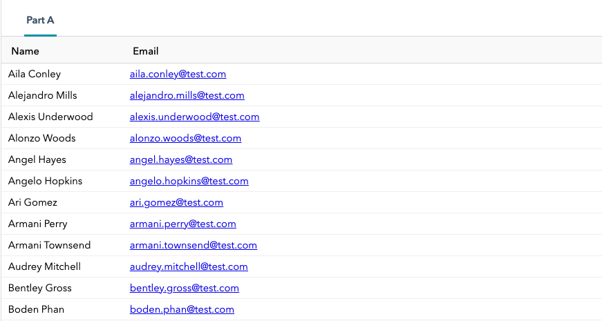
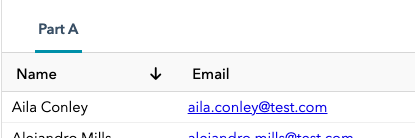
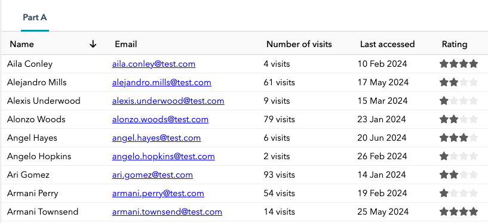
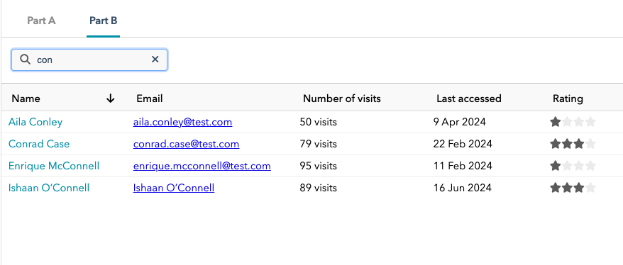
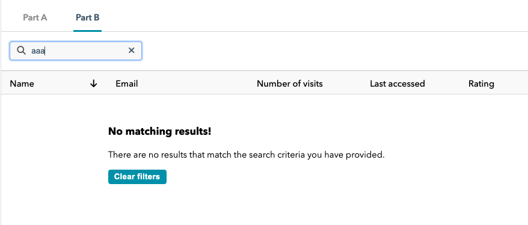
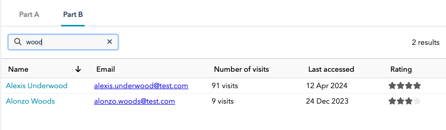
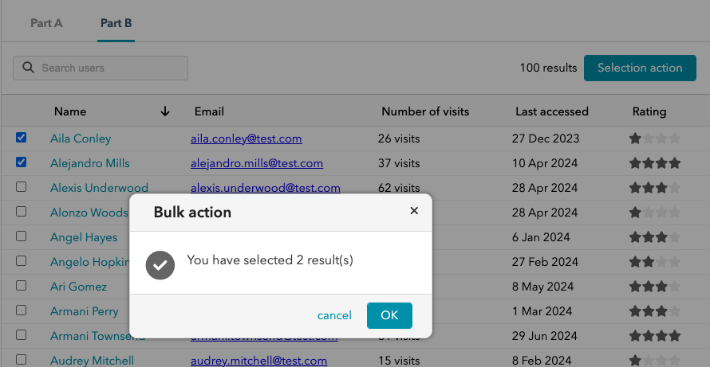

# Lesson 6

**By the end of this lesson, you will be able to configure simple tables, implement content filtering and selection through a backing store, construct galleries, and understand the basics of remote data loading.**

?>It is assumed you have read through [code structure](lessons.md#code-structure) that describes where the sample code resides and how CSS styles are treated in the examples. You are also expected to have completed [Lesson 1](lessons_1.md) that covers components and the essentials of DOM rendering. In addition you should familiarise yourself with [Galleries and stores](ess_galleries.md) (particularly the first section related to stores; this is assumed knowledge for this lesson).

Tables and galleries are ubuitous in web applications and JUI provides standard components to effect these concepts. Here we conver the essentials of creating and working with tables and provide an introduction to galleries:

1. [Part A](#part-a-tables) we introduce simple tables and the configuration of headers and cells (with a focus on rendering contents into the cells).
2. [Part B](#part-b-filtering) we build on part A and consider how we can implement filtering of the tabulated content through the backing store as well as making use of the selection capability of stores.
3. [Part C](#part-c-galleries) we swap out our table for a gallery (of cards).
4. [Part D](#part-e-remoting) we cover a brief introduction to stores that load their data remotely.

Each of the parts includes a set of exercises that you are encouraged to work through. Candidate solutions are provided under [Solutions to exercises](#solutions-to-exercises).

*Recall that working solutions can be found in the classes `Lesson6a`, `Lesson6b`, etc in the `com.effacy.jui.playground.ui.lessons` package.*

## Part A: Tables

*Make sure you have created the support classes as described in [Setup](#setup). These are used throughout this lesson.*

### Tables, stores and columns

Here we cover creating a simple table backed by a local store of records. All code is contained in `Lesson6a`. However, first we need to change the class hierarchy of `Lesson6a` from `LessonPanel` to a standard `Panel` (see [Lesson 1: Part E](lessons_1.md#part-e-panels-and-layouts)). Although not strictly required (we could apply a fixed height to the table we will add to this panel) this does allow us to have the table expand full height and take advantage of the full window size (which is the usual approach):

```java
public class Lesson6n  extends Panel {

    protected Lesson6n() {
        super (PanelCreator.config().scrollable());

        // Lesson code appears here.
    }

}
```

We now start with a basic table configuration:

```java
// Our mock data. In practice this would still be a store but one that
// sources its data remotely.
SampleRecordStore store = new SampleRecordStore();

// Creates a basic table displaying two columns for name and email.
Table<SampleRecord> table = TableCreator.build(cfg -> {
    // Some styling to apply to each cell.
    cfg.cellPadding(Insets.px(10, 5)).color(Theme.colorAuxWhite());
    // A column for the name field.
    cfg.header("Name", header -> {
        header.renderer(BuilderTableCellRenderer.create((cell, r) -> {
            Div.$(cell).text(r.getName());
        }));
        header.width(Length.em(12));
    });
    // A column for the email field.
    cfg.header("Email", header -> {
        header.renderer(BuilderTableCellRenderer.create((cell, r) -> {
            A.$(cell, "mailto:" + r.getEmail()).text(r.getEmail());
        }));
    });
}, store);

// Add the store to the panel (this expands to full height and scrolls
// the contents).
add (table);

// Load data into the store.
store.load(10);
```

Lets break this down:

1. The table is of class `Table<R>` over a record type `R` (in this case `SampleRecord`). Instances of this type are sourced from a store and each rendered as a row. 
2. We use `TableCreator.build(Consumer<Table.Config>)` to create and configure an instance of the table; this follows the creator pattern for standard JUI components (see [Components](ess_components.md#creators)).
3. Configuration allows us to style each cell to a limited extent. Here we give each cell a little padding and a white background. This applies uniformly to all cells, we can style the contents of specific cells when we declare them.
4. A column (also called a *header*) is declared with the `header(...)` family of methods. In all cases the first argument is the title of the column (and appears at the top of the table). In this case we pass a second argument as a lambda-expression that allows us to configure the cell itself.
5. For each of our columns we provide *render* that is used to render the contents of the respective cell given data for that row. This is achieved with the `render(ITableCellRenderer)` method which is passed an instance of `ITableCellRenderer` that is responsible for doing the actaul rendering. Now there are a range of standard such renderers (i.e. `TextTableCellRenderer` and `LinkTableCellRenderer`) but the most common is `BuilderTableCellRenderer` which allows you to create a custom renderer from `DomBuilder` (our usual rendering mechanism). Here we use `BuilderTableCellRenderer.create((cell,r)-> {/* render code */})` which takes a lambda-expression itself takes a `ElementBuilder` (to render the cell contents) and record of type `R` (being the data to render).
6. For the name column we render into a simple DIV element. For the email we are more adventurous and render into an A element with a `mailto:` in its `href`.
7. Finally we apply a fixed width (of `12em`) to the first column.

The result looks something like the following:



?>In practice the cell renderings can become quite involved (especially if there are label mappings and conditional states to evaluate). The recommended approach is to create a separate methods `buildXXXHeader(ElementBuilder, R)` and delegate through to those. That will keep the code manageable.

### Column sorting

We can also sort columns. This is achieved with additional configuration:

```java
cfg.header ("Name", header -> {
    header.renderer(BuilderTableCellRenderer.create ((cell, r) -> {
        Div.$(cell).text(r.getName());
    }));
    header.width(Length.em(12));
    header.sorted(true).sortable(SortDirection.ASC, dir -> {
        store.sortByName(dir == SortDirection.DESC);
    });
}); 
```

Here we use `sorted(true)` to indicate that this is column to sort by default (when rendered). Secondarily `sortable(...)` is used to configure how sorting should be implemented. More specifically:

1. We direct the column to have the default direction `SortDirection.ASC` (i.e. the direction taken when activated).
2. Sorting is implement by acting on the store with `store.sortByName (dir == SortDirection.DESC)` (see `SampleRecordStore` for the implementation).

A column that is sortable is marked up with a direction indicator (this can be configured with styles, see [Styles](ess_styles.md)):



### Advanced cell rendering

We can also be quite rich in terms of how we model out each cell. Let's add in the remaining properties from the `SampleRecord`:

```java
...
cfg.header ("Number of visits", header -> {
    header.renderer(BuilderTableCellRenderer.create ((cell, r) -> {
        if (r.getVisits() == 0)
            Div.$(cell).text("None");
        else if (r.getVisits() == 1)
            Div.$(cell).text("One vist");
        else
            Div.$(cell).text(r.getVisits() + " visits");
    }));
});
cfg.header ("Last accessed", header -> {
    header.renderer(BuilderTableCellRenderer.create((cell, r) -> {
        Div.$(cell).text(DateSupport.formatDate(r.getLastAccess()));
    }));
});
cfg.header ("Rating", header -> {
    header.renderer(BuilderTableCellRenderer.create((cell, r) -> {
        Div.$(cell).$(contents -> {
            for (int i = 1; i < 5; i++) {
                if (r.getRating() >= i)
                    Em.$(contents).style(FontAwesome.star()).css("color: #666;");
                else
                    Em.$(contents).style(FontAwesome.star()).css("color: #eee;");
            }
        });
    }));
});
```

Which presents as follows:



We end this part by noting that we are not restricted to just presenting content in cells, we can interact as well. Let's change the name cell so that we can click on it (mimicking a navigation away) a dialog appears:

```java
cfg.header ("Name", header -> {
    header.renderer(BuilderTableCellRenderer.create((cell, r) -> {
        Div.$(cell).text(r.getName())
            .onclick(e -> {
                NotificationDialog.alert(
                    "Name clicked on",
                    "You click on " + r.getName() + "!",
                    outcome -> {}
                );
            });
    }));
    ...
}); 
```

### Exercises

Using the tools and techniques that you have been exposed to in this part try to enhance your lesson code as follows:

1. In `lessons.css` (in your `public` directory) add a style that you can apply to the contents of the name column that configures the cursor to be a pointer and underlines the text when it is hovered over.
2. Modify the store to order on the rating and configure the table to enact this ordering. **Advanced** you may notice that as you sort by the rating column the heading shift a little. What do you thinks is happening here and how could you fix it?
3. Modify the name column so that it displays the name and email together (name on top, email below) and remove the email column. *Hint* you could try using the `Stack` fragment.

## Part B: Filtering

We extend our table to include filtering.  As with `Lesson6a` (which was modified to extend `Panel`) we have `Lesson6b` extend `SplitPanel` (see [Lesson 1: Part E](lessons_1.md#part-e-panels-and-layouts)):

```java
public class Lesson6b extends SplitPanel {

    protected Lesson6b() {
        super(new SplitPanel.Config()
            // The panel is top-to-bottom with the top region being "other"
            // sitting above the main content region.
            .vertical()
            // The layout for the top region. The default for the main region
            // is the card layout.
            .otherLayout(
                new ActionBarLayout.Config()
                    // First zone is on the left and aligned to the left.
                    .zone(HAlignment.LEFT, Length.em(2))
                    // Second zone is on the right and aligned to the right.
                    .zone(HAlignment.RIGHT)
                    // We provide a 1em padding around the edge.
                    .insets(Insets.em(1))
                    .build()
            )
            .separator ()
        );
    }
}
```

This provides for a main content region that will contain the table and a top section that makes use of the actionbar layout to provide a location for us to place our filters. To start we copy across the table from the previous lesson:

```java
public class Lesson6b extends SplitPanel {

    protected Lesson6b() {
        ...

        SampleRecordStore store = new SampleRecordStore();

        // This is where our filter code will go.

        Table<SampleRecord> table = TableCreator.build(cfg -> {
            ...
        }, store);
        add(table);

        store.load(10);
    }
}
```

### Filtering

Filtering is highly dependent on the store implementation (most stores are remote and filtering often involves the application of specific query criteria into the remote query), luckily our mock store has a very simple filtering mechanism provide by the `filter(Predicate<R>)` method. This uses the passed predicate to determine whether a given record in the store matches the filter criteria.

We can use this to implement a simple name query:

```java
...
SampleRecordStore store = new SampleRecordStore();

TextControl searchCtl = addOther(Controls.text(cfg -> cfg
    .iconLeft(FontAwesome.search())
    .width(Length.em(15))
    .placeholder("Search users")
    .clearAction()
    .modifiedHandler(DelayedModifiedHandler.create(300, (ctl, val, prior) -> {
        store.filter(record -> {
            return record.getName().toLowerCase().contains(val.toLowerCase());
        });
    }))), new ActionBarLayout.Data(0));

...
```

Here we make the following comments:

1. The search is implementing using a text control. This is added to the top content area of the underlying split panel with `addOther(...)`. Since this area is configured with the actionbar layout that has two zones (left and right) we direct placement in the left side with the layout data `new ActionBarLayout.Data (0)`.
2. The text control is configured to include a search icon (to emphasise this is a search) and a placeholder (again to enforce the search aspect). We include a clear action and provide a fixed width.
3. The action itself simply applies a filter on the store to match those record that contain the text entered (case insensitive).

What we see is the following (after apply a search for "con"):



### No results

It may be that when you search, no record matche. In this case you will see a default message. This is not particularly friendly, so you may want to replace it with something more pleasing. This can be achieved through configuration:

```java
cfg.header ("Rating", header -> {
    ...
});
cfg.emptyFiltered (el -> {
    Div.$(el).css("width: 60%; margin: auto; margin-top: 10%;").$(
        H3.$().text("No matching results!"),
        P.$().text("There are no results that match the search criteria you have provided."),
        Btn.$("Clear filters").onclick(()-> {
            searchCtl.setValue("");
        })
    );
});
```

The configuration property `emptyFiltered(...)` takes a lambda-expression that takes an `ElementBuilder` into which to build the message to display when there are no results *when the results are being filtered* (this is a feature supported by the store). We have included in this a button (using the `Btn` fragment, but equally could have been a `Button` component) that, when clicked, set the search control to empty. This triggers a change event that invokes a new search on the store. This search has no content and so the entire store is brought into view (effectively no filtering).

The result looks something like the following:



In addition there is configuration for the case of no results at all (even without filtering, this is explored in the exercises) and when the store generates an error (which is pertinent for remote base stores).

### Results indicator

Sometimes it is useful to provide guidance as to how may results are available for a given filter. We want this to display one the right side of the top area (opposite the search text field). To achieve this add the following in after adding the search control:

```java
ValueStateVariable<Integer> storeCounter = new ValueStateVariable<>(0);
store.handleOnChange(s -> storeCounter.assign (s.getTotalAvailable()));
addOther(StateComponentCreator.build(storeCounter, (s,el) -> {
    int value = s.value();
    if (value == 0)
        Div.$(el).text("No results");
    else if (value == 1)
        Div.$(el).text("One result");
    else
        Div.$(el).text(value + " results");
}), new ActionBarLayout.Data(1));
```

Here we create a *state variable* (see [Stateful components](ess_states.md)) `storeCounter` and add a listener to the store that updates `storeCounter` when the contents of the store changes. We also create an inline stateful component bound to `storeCounter` (so that it updates when the `storeCounter` changes value) that simply represents the number of results as updated. This is added to the top regions and directed, using `new ActionBarLayout.Data (1)` to appear on the right.



### Selection

Tables natively support selection of rows (records). This is activated simply by the `selectable()` configuration option:

```java
Table<SampleRecord> table = TableCreator.build(cfg -> {
    cfg.selectable();
    ...
}, store);
```

When the store is a selectable one (implements `IStoreSelection` which our mock store does) then it will update the select held against the store. This can be detected with a listener `store.handleOnSelectionChanged (s -> { /* do something */})`. For our example we will activate an action button that, when clicked, displays a message:

```java
...
addOther(StateComponentCreator.build(storeCounter, (s,el) -> {
    ...
}), new ActionBarLayout.Data(1));

// Action button that activates when there are selected item.
Button selectionBtn = addOther(ButtonCreator.build (cfg -> {
    cfg.label("Selection action");
    cfg.handler(() -> {
        NotificationDialog.confirm(
            "Bulk action",
            "You have selected " + store.selection().size() + " result(s)",
            outcome -> {
                store.clearSelection();
            }
        );
    });
}), new ActionBarLayout.Data(1));
// Initially disabled but change the state dependent on whether there
// are selected items (or not).
selectionBtn.disable();
store.handleOnSelectionChanged(s -> {
    if (s.selection().size() > 0)
        selectionBtn.enable();
    else
        selectionBtn.disable();
});

...
```

Here we create a `Button` and add to the right side of the top area and set it initially to the disabled state. We add a selection listener to the store that enables the button if there is a selection (and disable if there is no longer a selection). The button is configured to display an alert with a count of the selected items and, when closed, clears the selection on the store.

The following is generated after making a selection and clicking on the button:



### Exerices

Using the tools and techniques that you have been exposed to in this part try to enhance your lesson code as follows:

1. In the lesson you added a selection action button that displays a dialog which then clears the selection. How would you modify this so that closing (with the cross in the top-right corner) or canceling the dialog does not clear the selection, but clicking on dismiss does.
2. How would you componentise the results indicator?
3. Create a new column and to that column add two actions that render as icons (consider using the `Btn` fragment). When invoked just popup a notification. **Advanced** also add in a menu (use the `MenuActivator`, `Menu` and `MenuItem` fragments).


## Part C: Galleries

We swap out the table for a gallery.

## Part E: Remoting

We introduce some remoting?

## Solutions to exercises

Here we present candidate solutions to the exercises presented in each of the parts. Note that these are (in general) only one of many possible solutions.

All solutions are presented as if they were being added to the constructor of the appropriate `Lesson1a`, `Lesson1b`, etc class used for the lessons in general.

### Part A

#### Exercise 1

Create the following style in `lesson.css`:

```css
.lessons .lesson6_name {
    cursor:pointer;
    color: var(--jui-text-link);
}

.lessons .lesson6_name:hover {
    text-decoration: underline;
}
```

and modify the header declaration as follows:

```java
cfg.header ("Name", header -> {
    header.renderer(BuilderTableCellRenderer.create((cell, r) -> {
        // Here we apply the style to the DIV.
        Div.$(cell).style("lesson6_name").text(r.getName())
            .onclick(e -> {
                NotificationDialog.alert(
                    "Name clicked on",
                    "You click on " + r.getName() + "!",
                    outcome -> {}
                );
            });
    }));
    ...
}); 
```

#### Exercise 2

Add the following to `SampleRecordStore`:

```java
public void sortByRating(boolean asc) {
    Collections.sort(records(), (a, b) -> {
        int av = ((SampleRecord) a).getRating();
        int bv = ((SampleRecord) b).getRating();
        return !asc ? (av - bv) : (bv - av);
    });
    reload(10);
}
```

and modify the rating header:

```java
cfg.header ("Rating", header -> {
    ...
    header.sorted(true).sortable(SortDirection.ASC, dir -> {
        store.sortByRating(dir == SortDirection.DESC);
    });
});
```

For the advanced part the issue is that not all columns have a fixed width. The is most noticable on the email column where the longest cell will vary as the rating is re-ordered. The rectification is to place fixed with on these columns whose width vary (i.e. try `header.width (Length.em(16))' on the email column).

#### Exercise 3

Modify the renders for the first column as follows (not that this assumes previous exerices have been applied, if you haven't the same principles apply):

```java
header.renderer(BuilderTableCellRenderer.create((cell, r) -> {
    Stack.$(cell).vertical().gap(Length.em(0.25)).align(Align.START).$ (
        Div.$().style("lesson6_name").text (r.getName())
            .onclick(e -> {
                NotificationDialog.alert("Name clicked on", "You click on " + r.getName() + "!", outcome -> {});
            }),
        A.$("mailto:" + r.getEmail()).css ("font-size: 0.9em;").text(r.getEmail())
    );
    
}));
```

This uses the `Stack` fragment, however you could have used standard DOM elements and CSS styling directly to achieve the same.

### Part B

#### Exercise 1

This uses the `outcome` of the notification dialog:

```java
NotificationDialog.confirm (
    "Bulk action",
    "You have selected " + store.selection().size() + " result(s)",
    outcome -> {
        if (OutcomeType.OK == outcome)
            store.clearSelection();
    }
);
```

*Note that this may not seem to be related to tables however often actions are guarded by a confirmation.*

#### Exercise 2

Create a new class such as the following:

```java
public class ResultCounter extends StateComponent<ValueStateVariable<Integer>> {
        
    public ResultCounter(ValueStateVariable<Integer> state) {
        super(state);
        renderer(el -> {
            int value = state().value();
            if (value == 0)
                Div.$(el).text("No results");
            else if (value == 1)
                Div.$(el).text("One result");
            else
                Div.$(el).text(value + " results");
        });
    }
}
```

then add it as follows:

```java
addOther(new ResultCounter(storeCounter), new ActionBarLayout.Data(1));
```

*As with the first exercise this may not seem relevant, however applications tend to have a multiplicity of tables and galleries in which case it makes sense to componentise such things are indicators.*

#### Exercise 3

Consider the following column declaration (add to the end of the other declarations):

```java
cfg.header("Actions", header -> {
    header.renderer(BuilderTableCellRenderer.create((cell, r) -> {
        Stack.$(cell).horizontal().gap (Length.em(0.5)).$ (
            Btn.$("").icon(FontAwesome.edit()).onclick(() -> {
                NotificationDialog.alert("Edit", "Edit record " + r.getName(), outcome -> {});
            }),
            Btn.$("").icon(FontAwesome.trash()).nature(Btn.Nature.DANGER).onclick(() -> {
                NotificationDialog.alert("Delete", "Delete record " + r.getName(), outcome -> {});
            })
        );
    }));
});
```

Here we have just choosen two common actions: edit and delete. For delete we have elected to use the `DANGER` nature of `Btn` (which presents as red in the default theme). You may have tried just putting the `Btn`'s immediately under the cell but would have noticed they appear one above the other; to rectify this we have placed them in a horizontal `Stack` fragment (which is just a DIV with flex display).

For the advanced part we can extend the above as follows:

```java
cfg.header ("Actions", header -> {
    header.renderer(BuilderTableCellRenderer.create((cell, r) -> {
        Stack.$(cell).horizontal().gap(Length.em(0.5)).$ (
            Btn.$("").icon(FontAwesome.edit()).onclick(() -> {
                NotificationDialog.alert("Edit", "Edit record " + r.getName(), outcome -> {});
            }),
            Btn.$("").icon(FontAwesome.trash()).nature(Btn.Nature.DANGER).onclick(() -> {
                NotificationDialog.alert("Delete", "Delete record " + r.getName(), outcome -> {});
            }),
            MenuActivator.$().clickToActivate().$(content -> {
                Menu.$(content).$ (
                    MenuItem.$()
                        .label("edit")
                        .icon (FontAwesome.edit())
                        .onclick(() -> NotificationDialog.alert("Edit", "Edit record " + r.getName(), outcome -> {})
                    ),
                    MenuItem.$()
                        .label("delete")
                        .icon(FontAwesome.trashCan())
                        .variant(MenuItem.Variant.ERROR)
                        .onclick(() -> NotificationDialog.alert("Delete", "Delete record " + r.getName(), outcome -> {})
                    )
                );
            })
        );
    }));
});
```

Here we have just added after the buttons a `MenuActivator` configured with (though any actions would do) two menu items that reflect the two button actions already present.

## Setup

In the following we need to model some data, this is achieved with the following two classes:

```java
// Data record
public class SampleRecord {
    
    private String name;

    private String email;

    private int visits;

    private Date lastAccess;

    private int rating;

    public SampleRecord(String name, String email, int visits, Date lastAccess, int rating) {
        this.name = name;
        this.email = email;
        this.visits = visits;
        this.lastAccess = lastAccess;
        this.rating = rating;
    }

    public String getName() {
        return name;
    }

    public String getEmail() {
        return email;
    }

    public int getVisits() {
        return visits;
    }

    public Date getLastAccess() {
        return lastAccess;
    }

    public int getRating() {
        return rating;
    }
}

// Mock store for the data.
public class SampleRecordStore extends ListPaginatedStore<SampleRecord> {

    @Override
    protected void populate(List<SampleRecord> records) {
        for (int i = 0; i < 100; i++) {
            Date date = new Date(new Date().getTime() - Random.nextInt (200) * 24 * 60 * 60 * 1000);
            records.add(new SampleRecord(MockData.NAMES[i], MockData.EMAILS[i], Random.nextInt(99) + 1, date, Random.nextInt(4) + 1));
        }
        Collections.sort(records(), (a, b) -> {
            String av = ((SampleRecord) a).getName();
            String bv = ((SampleRecord) b).getName();
            return av.compareTo(bv);
        });
    }

    public void sortByName(boolean asc) {
        Collections.sort (records(), (a, b) -> {
            String av = ((SampleRecord) a).getName();
            String bv = ((SampleRecord) b).getName();
            return !asc ? av.compareTo(bv) : bv.compareTo(av);
        });
        reload(10);
    }

}
```

`SampleRecord` encapculates a single record of information represents a user of a system (with name, email and information about access). A collection of these records, randomised, is collated by `SampleRecordStore` that models an external datasource (whether local or remote). More on stores can be found in [Galleries and stores](ess_galleries.md#stores).