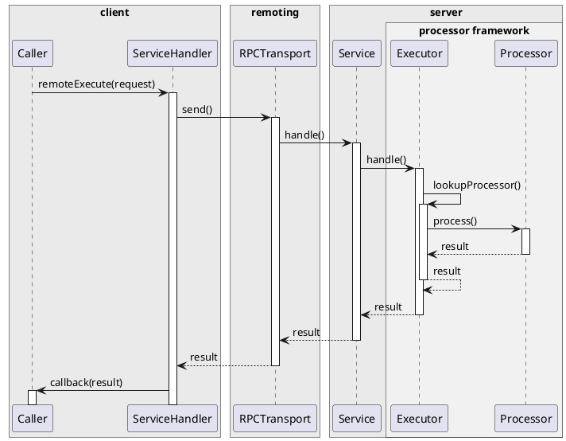
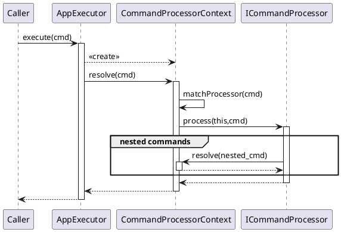

# Remoting

Remoting code reside in the **jui-remoting** project and is available in the associated library jar. Internally [SLF4J](https://www.slf4j.org/) is used for logging.

?>The remoting mechanism is quite involved, however, once it is in place it generally does not need to be changed and it is easy to add processors for executing commands and performing queries and lookups. We encourge you to first review the [Example](#example-playground) section, which describes a concrete implementation as employed in the **Playgound**, then return to the documentation in full. Walking through Lesson XXX will describe the ongoing creation of processors. 

## Overview

Remoting refers to the interaction between client and server (principally the client performing various operations agains the server). There are a host of mechanisms for performing this with RESTful endpoints being the most contemporary. Prior to this the RPC (Remote Procedure Call) model was quite popular. As far as JUI is concerned the underlying remoting mechanism is a matter of personal choice. The one presented here has its history with ExtDirect as an RPC oriented protocol and brokering model coupled with an implementation of the [command pattern](https://en.wikipedia.org/wiki/Command_pattern) allowing one to assemble, client-side, multiple, interdependent operations for atomic execution server-side.

Remoting, in this context, covers three distinct concerns:

1. [Serialisation](#serialisation) of data transferred between client and server.
2. [RPC transport](#rpc-transport) where a representation of operations and queries that can be executed against the server are available from the client.
3. [Processor framework](#processor-framework) where the representation in (2) are implemented for enacting data queries, lookups and modification (including creation and deletion).

We discuss each in turn.

## Serialisation

*Code specific to serialisation is contained in the `com.effacy.jui.json` package.*

Serialisation (and de-serialisation) is the process whereby which we translate between transportable JSON and objects (running in a JVM or JS runtime). The translation from object to JSON is fairly straight forward; the converse is more challenging.

Where the challenge arises (in the most part) is related to object type. When given a block of JSON one needs to know the object type that one is converting to. As once descends through the JSON-object heirarchy the same condition applies at each stages. In most cases this is not a problem until one encounters polymorphism: a base class is declared but where it is situated does not convey the information necessary to resolve the sub-class. This is a common situation and we deal with it by injecting a "hidden" field that can be used to discriminate across the possible sub-classes (more concretely we use the `_type` property).

### Client-side

Client-side serialisation is complicated by the fact that we are not afforded the benefit of any of the standard mechanisms available as third-party libraries. The approach we take here is to rely on tagging those classes that partake in serialisation with the `@JsonSerializable` annotation then leveraging the GWT compiler's rebinding mechanism to create a global (de-)serialiser for these classes (and their sub-classes).

The (de-)serialiser comes as an implementation of `Serializer` an instance of which is accessible via a static method:

```java
Serializer serialiser = Serializer.getInstance ();
String json = serialiser.serialize (myPojo);
...
```

Under-the-hood the `Serializer` implementation contains generated code for each of the tagged serialisable classes that invokes directly the relevant setters and getters. This does mean that there are some limitations (for example, arrays are not supported, only lists) but, for the most part, these are not particularly problematic. For those who are interested in how this generation works, have a look at `SerializationGenerator`.

In terms of the problem of polymorphism, this is resolved as described above by using the `_type` property. When de-serializing, if this is present then the type value is mapped to the representative class. For serialisation this is added in automatically when the `Serializer` class is being created during rebinding (if you are interested in this process, have a look at `SerializationGenerator`).

*As a convenience, classes that partake in serialisation should implement `ISerializable` (or extend `Serializable` or any of its sub-classes such as `Result`). This includes the `@JsonSerializable` annotation and explicitly declares a getter for `_type` thereby ensuring its presence.*

?> Note that arrays are not supported, only lists. Furthermore getters for list valued properties **must not** return `null`, rather they must return an empty list.

### Server-side

The interface `IJsonSerializableParser` provides a standard contract for (de-)serialisation of JSON as employed by related modules. A standard implementation is provided by `JsonSerializableParser` that makes use of [Jackson](https://github.com/FasterXML/jackson) and supports both the injection of the `_type` specifier on serialisation and respecting the specifier on deserialisation.

Since `JsonSerializableParser` is tailored for use with this RPC implementation it exhibits some special behaviours. The most important being the management of polymorphism. Here the parser performs class scanning to pick up the `@JsonSerializable` annotation and from this extracts the necessary data for conversion. This means you need to specify the packages that should be scanned. This can be done by passing through the packages to the `scanPackages(...)` method (if you are using the [RPC Transport](#rpc-transport) then this is normally done in the construction of the `Router`):

```java
@Controller
public class ApplicationRPC extends ControllerRouter {

    ...

    public WebApplicationRPC() {
        ...
        scanPackages ("com.effacy.jui.rpc.client",
            "com.effacy.jui.rpc.extdirect.client",
            "com.effacy.jui.rpc.handler.client",
            ...);

        ...
    }

    ...
}

```

!>There are two important caveats with the way that `JsonSerializableParser` currently works. The first is that any class in a polymorphic heirachy that is explicitly referenced must be annotated with `@JsonSerializable` (i.e. not rely on a base class for this). The second is any class annotated with `@JsonSerializable` and whose type mode is not `TypeMode.NONE` must be *abstract*. The reason for the former (as at the time of writing) is that deserialisers are registered directly against the class being resolved and are resolved as such, so if a class is polymorphic it needs to map to a polymorphic deserialiser and therefore needs to be directly annotated. The reason for being abstract is that the deserialiser will end up calling itself on the same class. In practice these caveats aren't particularly onerous but may change in the future.

If you want to debug the registration process then you can do so through the logging channel `com.effacy.jui.json.parser`.

#### Dealing with multiple serialisation contexts

As a side note the `JsonSerializableParser` appears to work reasonably well with `@JsonXXX` annotations, with the exception of `@JsonSubTypes`. For the latter is seems that these take precedence over the customer de-serialisers registered during package scanning. Generally one only mixes these annotation when the classes partake in some other serialisation context (for example, persistence into a JSON column or store). In this case you have limited options, however all is not lost. Often the problem occurs at the root level where you need to persist a top-level object in a polymorphic manner. This can be handled by wrapping the object by reference and annotating the relevant property.  To illustrate this suppose one needs to serialise a general `Result` object for (say) report generation. One can then wrap this in a `ReportData` object thus:

```java
@JsonAutoDetect(fieldVisibility = JsonAutoDetect.Visibility.ANY)
@JsonIgnoreProperties(ignoreUnknown = true)
public class ReportData {

    @JsonIgnoreProperties(ignoreUnknown = true)
    @JsonTypeInfo(use = JsonTypeInfo.Id.NAME, include = JsonTypeInfo.As.PROPERTY)
    @JsonSubTypes({
        @JsonSubTypes.Type(value = XXXResult.class, name = "xxx"),
        ...
    })
    private Result result;
}
```

Here you avoid having to annotation the `Result` class directly and the annotations guide serialisation only in the context of the wrapper class. Of course, you are still left with the inconvenience of having to be explicit about the sub-types themselves.

#### Serialisation for logging

In many cases one wishes to generate log entries in JSON serialised from some structure. An concrete example would be logging API calls and responses (i.e. via this remoting framework). The serialisation dimension is straight forward however a several challenges can arise:

1. With respect to privacy controls that may be in place (for example, as a result of GDPR) requiring some information not be recorded in persistent logs.
2. Where some content is excessive in size for logging purposes.

To simplify the logging of JSON arising from object structures we introduce a number of annotations:

|Annotation|Description|
|----------|-----------|
|`LogRedact`|To redact content during serialisation. The field content is replaced with the string `REDACTED` (though this can be customised via the annotation).|
|`LogTruncate`|To truncate string content to a specified length. Removed content is replaced by ellipses.|

The class `LogSerializer` is configured to action these annotations. This serialiser is independent from `JsonSerializableParser` and is only configured for serisalisation (to create JSON for logging purposes). To illustrate consider the following example:

```java
@Component
public class ObjectLogger {

    private LogSerializer json = new LogSerializer (false);

    public void log(String message, Object data) {
        log (message + ": " + json.toJson (data));
    }

    public void log(String message) {
        ...
    }

}
```


## RPC transport

*Code specific to serialisation is contained in the `com.effacy.jui.rpc` package.*

TBD

## Processor framework

*Code specific to serialisation is contained in the `com.effacy.jui.rpc.handler` package.*

### Principles

The processor framework is a standalone mechanism for processing serialisable queries (for retrieving information) and commands (for performing actions and applying changes) that can operate over the [RPC transport](#rpc-transport) described above (though is quite independent of it and could work perfectly well with a RESTful interface should that be desired).

It consists of an *executor* that brokers incoming queries and commands and a family of *processors* that enacts those queries and commands. We can illustrate the associated call sequence as follows:



The diagram depicts the processor framework exposed to the client via an RPC service. To perform a remote request the client invokes the client-side service handler passing a suitably configured request object (namely a query or command). The RPC transport transfers the request to the service endpoint where it is matched with the associated service implemention. The implementation then delegates the request to the processor framework via the executor which locates and delegates through to the relevant processor. The processor may return a result which makes its way back through the service chain to the client-side handler which passes it back asynchronously to the caller via a callback.

*One of the advantages with this apprach is that the transfer classes that embody the request and result are shared between client and server. This affords strict type and content enforcement while abracting away the transport and brokering mechanism.*

Queries consist of the triple *query*, *processor* and *response*. The *query* simply captures the information relevant to performing the query (for example, the ID of an entity to lookup or the search criteria of a record query to perform). The *processor* is bound to the query class for which an instance is registered against the executor. When the executor is passed a given query it maps it by class to the corresponding processor then delegates the request through. The processor accepts the query and returns a suitably populated *response* that is returned to the caller. The only constraints are that processors implement `IQueryProcessor` (so the executor knows how to work with them) and query and response classes be serialisable.

Commands, on the other hand, are intended to perform operations. They consist of the pair *command* and *processor* (different from the query processor describe above). Much like the query processor the command *processor* is registered againt the executor and is mapped to an incoming command by class. However, commands are processed with no specific response (they are either enacted or fail to enact). The can, however, be recursive so that a command may include other command that themselves operate quite separately. To illustrate, consider a command that creates an invoice and another command that creates a customer. One can next a customer create command inside of an invoice create command so that both are enacted in the same query.

Now that we have outlined the essential element of both query and command processing we exlaborate on the details within the context of processing *business objects* (or more simply, entities). This is the typical application of the processor framework. The topcis we cover are as follows:

1. [References](#references) covers the recommended approach to referring to business objects.
2. [Queries](#queries) discusses the various types of query that can be performed (with a focus on lookups and searches).
3. [Converters](#converters) describes a clean approach to type conversion (i.e. for creating and populating DTO's).
4. [Commands](#commands) describes how business objects can be updated.
5. [The executor](#the-executor) illustrates the role the executor plays, how it is configured and how it is wired up.
6. [Integrating with RPC](#integrating-with-rpc) outlines how we integrate the executor into the RPC service model, including the client-side handler use to invoke queries and commands.

Note that [references](#references) is prepartory and could safely be skipped, only to be returned to when you encounter `Ref` and references in the later sections.

?>We often refer to *business objects* in this section. These may be traditional (persisted) entities but may also include collectively associated *composite* entities which are rarely accessed directly (rather, independently of the parent entity). A fairly classic example of this is an *invoice* which may consist of an invoice entity plus associated line item entities (the latter being composites of the invoice).

### References

A reference is simply a means to identify a specific business object that is being queried or acted upon. In the most simple case it is a primitive (often a `Long` and sometimes a `String`). In more complicated cases it could be a composite (particularly where the underlying entity is mapped by a composite key). On other cases it could be some indirect means of indentification (like the current user or a profile associated to the current user).

In the non-primitive case we recommend extended the `Ref` class. In the following we will assume that `Ref` is the base class for the reference and allow one the discretion to replace it by a suitable primitive where that makes sense. This gives us the opportunity to describe a standard pattern for references:

1. For a given business entity `XXX` we associate an abstract base class `XXXRef` that extends `Ref`.
2. For each means of references we create static inner classes of `XXXRef` in accordance with the naming convention `XXXRefByYYY` and that extend `XXXRef`.
3. For each of the concrete reference classes in (2) we create static creators on `XXXRef` of the form `byYYY(...)`.

We can deviate from this as follows:

1. If there is only one concrete reference then that can be given as (1) (i.e. making it `XXXRef`). You still should create a creator on `XXXRef` as per (3) to maintain adherance to the pattern.
2. If there is only one concrete reference and it is a primitive then you can just use the primitive type for reference, thereby obviating the use of a separate reference class. *Take care though that later you may want to reference such business objects indirectly, if you have created an `XXXRef` modelled as above then this extension is quite straight forward.*

We can illustrate this as follows: suppose we have a user business object that has a unique persistence ID (a `Long` value) but may also have an email address which, if present, is unique to the user. A possible reference class hierarachy is as follows:

```java
import com.effacy.jui.json.annotation.JsonSerializable;
import com.effacy.jui.json.annotation.TypeMode;
import com.effacy.jui.rpc.handler.client.ref.Ref;

@JsonSerializable(settersRequired = false, type = TypeMode.SIMPLE)
public abstract class UserRef extends Ref {

    /************************************************************************
     * Creator methods.
     ************************************************************************/

    /**
     * References the currently logged in user.
     */
    public static UserRefByContext byContext() {
        return new UserRefByContext();
    }

    /**
     * References the user matching the passed ID.
     */
    public static UserRefById byId(long id) {
        UserRefById ref = new UserRefById();
        ref.setId(id);
        return ref;
    }

    /**
     * References the user matching the passed email.
     */
    public static UserRefByEmail byEmail(String email) {
        UserRefByEmail ref = new UserRefByEmail();
        ref.setEmail(email);
        return ref;
    }

    /************************************************************************
     * Reference classes.
     ************************************************************************/

    public static class UserRefByContext extends UserRef {}

    public static class UserRefById extends UserRef {
        private long id;
        public long getId() { return id; }
        public void setId(long id) { this.id = id; }
    }

    public static class UserRefByEmail extends UserRef {
        private String email;
        public String getEmail() { return email; }
        public void setEmail(String email) { this.email = email; }
    }
}
```

For which one may create an instance of a reference as follows:

```java
UserRef ref = UserRef.byContext();
```

We observe the following:

1. The class is annotated with `@JsonSerialisable` due to it being abstract. See [Serialisation](#serialisation) for details.
2. There are three concrete references classes each representing different ways one can reference a user.
3. There are three corresponding static creators each used to create and configure a reference.

*Note that the above is only provided by way of a recommendation (and is employed in the following examples). However, this is not an imposition in order to use the processor framework and you may find a more suitable, possibly quite different, approach in your specific set of circumstances.*

### Queries

As noted a query is something that is passed over for processing by a suitable processor, which then returns a response.

At its most basic level a query can be any serialisable class so long as that an instance of that class can be uniquely mapped to a processor by the executor. The processor itself implements `IQueryProcessor<CTX>` (the `CTX` is a *context* which is not relevant for our immediate discussion):

```java
public interface IQueryProcessor<CTX> {

    public Object process(CTX context, Object query) throws NoProcessorException, ProcessorException;

    public boolean matches(Object query);
}
```

The `matches(...)` method is used to map a processor to the incoming query, as used by the executor to find the desired processor. The `process(...)` method performs the heavy lifting to enact the query and return a suitable response object.

JUI provides two convenience classes: `Query<T>` and `QueryProcessor<CTX,V,Q extends Query<T>>` that grants some specifity to the query and its expected return type (i.e. enforce strict typing).

To illustrate we construct a simple example where some data analysis is performed so that result can be displayed to the user. We start with two transfer classes that embody the reponse and the query. The first is the response class (we don't worry about the specific members for this illustration):

```java
@JsonSerializable(type = TypeMode.SIMPLE)
public class MyDataAnaysisResult {
    ...
}
```

We then declare a query class that extends `Query<T>` where the reponse type `T` is `MyDataAnaysisResult`:

```java
public class MyDataAnalysisQuery extends Query<MyDataAnaysisResult> {
    ...
}
```

On the client we can invoke a query and manage the response as follows (the details of `AppServiceHandler` will be described later, including error handling, so use this purely for the illustration):

```java
// Create and populate query.
MyDataAnaysisResult query = ...;

// Perform a remote RPC invocation against the processor service.
new AppServiceHandler<MyDataAnaysisResult>()
    .onSuccessful(v -> {
        // Do something with the data.
    })
    .remoteExecute(query);
```

The gist of this should be clear:

1. The client creates an instance of a suitably configured query which is then passed back to the relevant remote service and makes its way to an executor.
2. The executor maps the incoming query to a processor which it then delegates to.
3. The processor returns a `MyDataAnaysisResult` instance which is returned back to the client.
4. The result is processed by the lambda-expression handler that was registered via the call to `onSuccessful(Consumer<T>)`.

To close out this example we need a processor (the `QueryContext` taken as given and is described in detail in [the executor](#the-executor)):

```java
@RPCHandlerProcessor
public class MyDataAnalysisQueryProcessor extends QueryProcessor<QueryContext,MyDataAnaysisResult,MyDataAnalysisQuery> {

    public ComparativeSkillsAnalysisQueryProcessor() {
        super (MyDataAnalysisQuery.class);
    }

    @Override
    protected MyDataAnaysisResult process(QueryNavigationContext context, MyDataAnalysisQuery query) throws ProcessorException {
        // Take the query data and perform the analysis. With the results
        // of the analysis populate the response and return.
        MyDataAnaysisResult result = ...;
        return result;
    }
}
```

Here we extend `QueryProcessor` parameterised with the result and query classes. This base class provides a default class-match mechanism for matching a query with the processor (a reference class type is passed through the constructor and a match is determined on whether or not the query class could be assigned to the referenc class). An alternative `process(...)` method is provided for override that employs the expected query and response classes. Finally the `@RPCHandlerProcessor` is described in [auto registration](#auto-registration) which, in a Spring environment, automatically registers the processor with the executor.

*See [Converters](#converters) for a clean way of performing type conversion from an internal to an external representation.*

Having described the general case we delve into two common scenarios used when dealing with business objects:

1. [Lookup queries](#lookup-queries) to lookup the details of a specific business object
2. [Result set queries](#result-set-queries) when searching into a collection of business objects for a matching records

#### Lookup queries

Here we consider the case where we want to lookup and pull back to the client details about a specific business object. This involves two transfer classes (one for the response result and the other to specify the business object being looked up along with and meta-data as to what is expected to be returned).

We start with the response result use the use business object as an exemplar:

```java
public class UserLookupResult extends Result {
    private long id;
    private String name;
    private String email;
    public long getId() { return id; }
    public void setId(long id) { this.id = id; }
    public String getName() { return name; }
    public void setName(String name) { this.name = name; }
    public String geEmail() { return email; }
    public void setEmail(String email) { this.email = email; }
}
```

This can be any serialisable class, however JUI provides the convenience class `Result` to extend (which includes the serialisation annotation). There are other classes provided that can be extended (such as `RecordResult` which provides out-of-the-box support for carrying back the objects unqiue ID and version for optimistic locking). Choose the best type for the circumstances.

We now consider how we reference the business object. Whatever approach we take we must use `Query<T>` were the response type is specified. As noted in [references](#references) there could be more than one way to reference a user and so we want to capture that. Carrying on with our example, if we were to employ `UserRef` directly then we would need to have it extend `Query` but, as we shall see, we want to use the same references in commands. Not only that, some lookups may require passing additional data to govern what information should be returned (we don't always want to retrieve the full set of data as that could be quite expensive). The recommended approach is to wrap the reference in a specialised *lookup* class, for which JUI provides `Lookup<T,R>` as a convenience. Here `Lookup<T,R>` extends `Query<T>` but includes another type `R` which is the reference. This allows is to adopt `Ref` (from [references](#references)) or to simply use a primitive (as best suites the occasion). As we already have `UserRef` then we employ that:

```java
public class UserLookup extends Lookup<UserLookupResult,UserLookup> {

    protected UserLookup() {
        super();
    }

    public UserLookup(UserRef ref) {
        super(ref);
    }
}
```

Note that `Lookup` declares a constructor that is passed an instance of the reference type, this has a corresponding setter and getter as well as a convenience `ref()` method to return the value. We can pass additional configuration to the lookup by adding properties to the lookup class itself.

We can also follow the same pattern as employed for references where we expose static creators (which is more of a convenience):

```java
public class UserLookup extends Lookup<UserLookupResult,UserRef> {

    public static UserLookup byContext() {
        return new UserLookup(UserRef.byContext());
    }

    public static UserLookup byId(long id) {
        return new UserLookup(UserRef.byId(id));
    }

    public static UserRefByEmail byEmail(String email) {
        return new UserLookup(UserRef.byEmail(email));
    }
    
    ...
}
```

Finally we need a processor. Here we (again) extend `QueryProcessor`:

```java
@RPCHandlerProcessor
public class UserLookupProcessor extends QueryProcessor<QueryContext, UserLookupResult, UserLookup> {

    public UserLookupProcessor() {
        super (UserLookup.class);
    }

    @Override
    protected UserLookupResult process(QueryContext context, UserLookup lookup) throws ProcessorException {
        UserRef ref = lookup.ref();
        if (ref instanceof UserRefByContext) {
            ...
        }
        ...
        UserLookupResult result = ...;
        return result;
    }
}
```

The strategy employed is to extract the reference from the lookup and use that to lookup the business object (*as noted the use of a `Ref` is not strict and could employ another means, such as a primitive.*). From there we construct the response result (using any additional configuration on the lookup to determine what needs to be returned) which is returned.

*See [Converters](#converters) for a clean way of performing type conversion from an internal to an external representation.*

?>For the business object `XXX` the recommended naming convention for the transfer classes is `XXXLookupResult` (extends `Result` or `RecordResult`) for the response type and `XXXLookup` (extends `Lookup<XXXLookupResult,XXXRef>`) for the query type. Here `XXXRef` is a suitable reference heirarchy as described in [reference](#references) (this is somewhat relaxed, for example you can use boxed-primitives, such as `Long` and `String`, rather than `Ref`'s). The associated processor should be named `XXXLookupProcessor` after the lookup class.

#### Result set queries

A common class of queries is a search into a collection of business objects whose response is a list of those that match. Such a search will generally include a set of constraints to apply (search terms) and a range of the matches results to return (given the potential for a large number of matches).

To facilitate such queries JUI provides the `ResultSet<T>` and `PageQuery<T>` support classes. The former is a response type that carries an outcome, a count representing the total matching results and a list of individual matches (of serialisable type `T`). The latter is the query class that supports range specification by way of page (by partitioning the results into pages of a specified size and returning the specified page indexed from 0). Both classes are expected to be extended and `T` should be a type that represents data from the underlying business object.

*Note that these classes are automatically supported by the JUI store mechanism used in [tables and galleries](ess_galleries.md) as well as selection [controls](ess_controls.md).*

Carrying on our example of users we illustrate this with the three classes below. The first is the transfer class that represents our business object (the `T` in the above):

```java
public class UserQueryResult extends Result {
    private long id;
    private String name;
    private String email;
    public long getId() { return id; }
    public void setId(long id) { this.id = id; }
    public String getName() { return name; }
    public void setName(String name) { this.name = name; }
    public String geEmail() { return email; }
    public void setEmail(String email) { this.email = email; }
}
```

Although this is nearly identical to `UserLookupResult` these two classes will contain information that is mutually exclusive (generally the lookup result is more extensive, and thus more expensive to process, while query results are much lighter weight).

We can now turn to the `ResultSet<T>`:

```java
public class UserQueryResultSet extends ResultSet<UserQueryResult> {

    // No results constructor.
    public UserQueryResultSet() {
        super (null, 0);
    }

    // Construct with given results and total.
    public UserQueryResultSet(Iterable<UserQueryResult> results, int totalResults) {
        super (results, totalResults);
    }
}
```

This becomes our *response* type for the query. As for the query itself:

```java
public class UserQuery extends PageQuery<UserQueryResultSet> {

    // For use by the serialiser.
    protected UserQuery() {}

    // Construct with paging information.
    public QueryQuery(int page, int pageSize) {
        super(page, pageSize);
    }

    // Search terms
    private String keywords;
    public String getKeywords() { return keywords; }
    public void setKeywords(String keywords) { this.keywords = keywords; }

}
```

Note that we declare a constructor that includes the page and page size and a protected construtor used by the (server-side) serialisation mechanism.

To finish we outline the associated query processor:

```java
@RPCHandlerProcessor
public class UserQueryProcessor extends QueryProcessor<QueryContext, UserQueryResultSet, UserQuery> {

    public UserQueryProcessor() {
        super (UserQuery.class);
    }

    @Override
    protected UserQueryResultSet process(QueryContext context, UserQuery query) throws ProcessorException {
        // Using the data on query perform the query obtaining the total
        // available results and the range of actual results being requested.
        // For the latter create instance of UserQueryResult that will be
        // passed to the result set.
        long total = ...;
        List<UserQueryResult> results = ...;
        return new UserQueryResultSet(results, total);
    }
}
```

?>For the business object `XXX` the recommended naming convention for the transfer classes are `XXXQueryResult` (extends `Result` or `RecordResult`), `XXXQueryResultSet` (extends `ResultSet<XXXQueryResult>`) and `XXXQuery` (extends `PageQuery<XXXQueryResultSet>`). The associated processor should be named `XXXQueryProcessor` after the query class.

### Converters

Converters provide a mechanism to convert from an internal (server-side) representation of data (i.e. entities, projections, etc) to an external (serialisable) representation.

There are myriad ways to perform such conversion, however JUI provides one that is quite particularly useful for result sets (and, of course, can be used for lookups). That is via an implementation of `IConverter<S,T>`.

This functional interface declares the method `T convert(S source)` to convert from the *source* (internal) to a *target* (external) representation. Such a converter can be passed through to a `ResultSet`; building on the example above:

```java
public class UserQueryResultSet extends ResultSet<UserQueryResult> {

    // No results constructor.
    public UserQueryResultSet() {
        super (null, 0);
    }

    // Construct with given results and total.
    public UserQueryResultSet(Iterable<UserQueryResult> results, int totalResults) {
        super (results, totalResults);
    }

    // Construct with a converter that converts from an iterable over S to UserQueryResult.
    public <S> UserQueryResultSet(Iterable<S> results, IConverter<S, UserQueryResult> converter, int totalResults) {
        super (results, converter, totalResults);
    }

}
```

We have added the additional constructor that takes an instance of `IConverter`. This allows use to perform an internal query and map those results to our transfer type:

```java
@RPCHandlerProcessor
public class UserQueryProcessor extends QueryProcessor<QueryContext, UserQueryResultSet, UserQuery> {

    public UserQueryProcessor() {
        super (UserQuery.class);
    }

    @Override
    protected UserQueryResultSet process(QueryContext context, UserQuery query) throws ProcessorException {
        // Using the data on query perform the query obtaining the total
        // available results and the range of actual results being requested.
        // For the latter create instance of UserQueryResult that will be
        // passed to the result set.
        long total = ...;
        List<UserEntity> results = ...;
        IConverter<UserEntity,UserQueryResult> converter = ...;
        return new UserQueryResultSet(results, converter, total);
    }
}
```

We can therefore more cleanly perform the conversion (it can also be used in conjuction with streams, if you prefer that approach).

As far as implemenation goes there is a static support method `<S,T> IConverter<S,T> create(Class<T> klass, BiConsumer<S,T> mapper)` on `IConverter` that makes it quite straight forward to create converters:

```java
public class UserQueryResultConverter {

    public static IConverter<UserEntity, UserQueryResult> fromEntity() {
        return IConverter.create(UserQueryResult.class, (entity,dto) -> {
            dto.setId(entity.getId());
            dto.setVersion(entity.getVersion());
            dto.setName(entity.getName());
            ...
        });
    }
}
```

Which can then be employed as:

```java
...
return new UserQueryResultSet(results, UserQueryResultConverter.fromEntity(), total);
```

If your converter needs additional, context specific, configuration then this can be passed through the static creator:

```java
public class UserQueryResultConverter {

    public static IConverter<UserEntity, UserQueryResult> fromEntity(ZoneId tz) {
        return IConverter.create(UserQueryResult.class, (entity,dto) -> {
            // Use tz directly as needed.
            ...
        });
    }
}
```

*Note that this method of creation actually returns an instance of `IExtendedCreator` which exposes an additional `void apply(S source, T target)` method; this can be used to employ converters when target types form a class hierarchy.*

Note that converters are not limited to result sets and can be employed in any context where a type conversion is required, such as a lookup processor:

```java
@RPCHandlerProcessor
public class UserLookupProcessor extends QueryProcessor<QueryContext, UserLookupResult, UserLookup> {

    public UserLookupProcessor() {
        super (UserLookup.class);
    }

    @Override
    protected UserLookupResult process(QueryContext context, UserLookup lookup) throws ProcessorException {
        UserRef ref = lookup.ref();
        if (ref instanceof UserRefByContext) {
            ...
        }
        ...
        UserEntity entity = ...;
        return UserQueryResultConverter.fromEntity().convert(entity);
    }
}
```

We end this section with a brief description of the `com.effacy.jui.json.Builder` static support methods for transferring values. For simple values one may use `set` to get a value from a source and apply it to a target:

```java
...
import static com.effacy.jui.json.Builder.set;
...
public static IConverter<UserEntity, UserQueryResult> fromEntity() {
    return IConverter.create(UserQueryResult.class, (entity,dto) -> {
        set(dto::setId, entity.getId());
        set(dto::setVersion, entity.getVersion());
        set(dto::setName, entity.getName());
        ...
    });
}
...
```

Often one encounters nested types:

```java
...
import static com.effacy.jui.json.Builder.set;
...
public static IConverter<UserEntity, UserQueryResult> fromEntity() {
    return IConverter.create(UserQueryResult.class, (entity,dto) -> {
        set(dto::setId, entity.getId());
        set(dto::setVersion, entity.getVersion());
        set(dto::setName, entity.getName());
        ...
        set (dto::setPosition, entity.getPosition (), new UserPositionResult (), (v,s) -> {
            set(v::setId, s.getId ());
            set(v::setVersion, s.getVersion ());
            set(v::setName, s.getEmail ());
            ...
        });
        ...
    });
}
...
```

One may also work with lists using `add`:

```java
...
import static com.effacy.jui.json.Builder.add;
import static com.effacy.jui.json.Builder.set;
...
public static IConverter<UserEntity, UserQueryResult> fromEntity() {
    return IConverter.create(UserQueryResult.class, (entity,dto) -> {
        set(dto::setId, entity.getId());
        set(dto::setVersion, entity.getVersion());
        set(dto::setName, entity.getName());
        ...
        entity.getItems().forEach(item -> {
            add(dto.getItemResults(), new ItemResult(), v -> {
                set(v::setId, item.getId());
                set(v::setVersion, item.getVersion());
                ...
            });
        });
        ...
    });
}
...
```

The above may not be to everyones pleasure but can aid in readability. You are encouraged to puruse the various other support methods that are available.

### Commands

As opposed to queries, commands provide a means to make changes to business entities. Despite sharing similarities with queries the command mechanism employs different classes. In particular commands themselves must implement `ICommand` and the processors must implement `ICommandProcessor`.

As with queries we proceed by way of example and build on the notion of a user, in this case, how to update one. To begin we consider the `ICommand` based transfer class which is sent over from the client that captures the changes to be made:

```java
public class UserCommand extends C {

    private VString name = new VString();

    protected UserCommand() {
        super();
    }

    public UserCommand(UserRef ref) {
        super(ref);
    }

    public UserCommand name(String name) {
        assign(this.name, name);
        return this;
    }

    public VString getName() { return name; }
    public void setName(VString name) { this.name = name; }
}
```

This requires some detailed unpacking:

1. The command extends the class `C` which is a JUI supplied convenience class that implements `ICommand`. It provides quite a number of supporting capabilities (marking for deletion, a construction mechanism and application of actions) but most importantly it is able to hold a *lookup* (that is, a reference) of no specific type that can be used to reference the business object being updated. For our purposes we use an instance of `UserRef` (as introduced in [references](#references)). We'll see how this is used by the command processor below.
2. The `VString` is a JUI supplied class that extends `V<T>`. This is a carrier type for recording a modification, that is, it records a value (to be assigned) and a flag that can be interrogated to determine if a modification has been requested. Most command classes contain quite a few of these (and over a range of types) so this provides a convenient means to localise changes to the things you want to change.
3. A setter and getter are provided for the `VString` property but since this is a carrier you tend to operate on it not supply one. That is where the `name(String)` method comes in. Here we *assign* the new value (which could be `null`) to the `name` property using the convenience `assign(...)` method and return the command instance. That allows us to chain modifications in a builder-like manner.

This is passed over to the remote service in a similar manner as with queries:

```java
UserCommand cmd = new UserCommand(UserRef.byContext());
cmd.name("My New Name");
new AppServiceHandler<Void>()
    .onSuccessful(v -> {
        // Close dialog or otherwise indicate the update was successful.
    })
    .remoteExecute(cmd);
```

Note that you could combine this with a lookup query to pull back a newly modified representation of the user to refresh the client:

```java
UserCommand cmd = new UserCommand(UserRef.byContext());
cmd.name("My New Name");
new AppServiceHandler<UserLookupResult>()
    .onSuccessful(v -> {
        // Update the client with the new value of the user lookup result.
    })
    // Here we specify the lookup and the command. The command is processed
    // first followed by the lookup.
    .remoteExecute(UserLookup.byContext(), cmd);
```

We can now turn our attention to the associated command processor (the `CommandContext` taken as given and is described in detail in [the executor](#the-executor)):

```java
@RPCHandlerProcessor
public class UserCommandProcessor extends CommandProcessor<UserCommand, UserEntity, CommandContext> {

    public UserCommandProcessor() {
        super (UserCommand.class, UserEntity.class);
    }

    public UserEntity resolve(UserCommand command, CommandContext context) throws NoProcessorException, ProcessorException {
        // Using the reference find the associated user entity.
        UserRef ref = command.lookup();
        UserEntity entity = ...;

        // Apply changes from the command.
        if (command.getName().isSet())
            entity.updateName(command.getName().value());

        // Save and return.
        return user.save();
    }

}
```

Our first observation is that we extend `CommandProcessor` which, much like `QueryProcessor` is a JUI support class that implements `ICommandProcessor` and provides a standard means to associate an incoming command with the appropriate processor. To facilitate this we need to pass through the command class type and the associated business object or entity class type (whatever is being acted upon). 

When an executor (or context) successfully maps a command to a processor it delegates through to the `resolve(...)` method. It is here that you make use of the reference from the command to locate the business object or entity needed modification and then apply the relevant modifications. What should be returned is a suitably updated object. 

The above is quite low-level, in practice you will likely use the more comprehensive `CRUDCommandProcessor` which provides much out-of-the-box support for entity lifecycle management (not just update but creation and deletion). Many of the features present in the `C` class (the one that our `UserCommand` extends) are leveraged by `CRUDCommandProcessor`. More on this is found in [the CRUD processor](#the-crud-processor) (under [Additional topics](#additional-topics)).

?>For the business object `XXX` the recommended naming convention for the command (transfer) class is `XXXCommand` (extends `C`). It is recommended that the command utilise a suitable `XXXRef` reference heirarchy as described in [reference](#references) (but again this can be somewhat relaxed, for example you can use boxed-primitives, such as `Long` and `String`, rather than `Ref`'s). The associated processor should be named `XXXCommandProcessor` after the command class.

### The executor

The executor provides the entry point into the processor mechanism. It accepts queries and commands and performs the requisite dispatch and processing of them.

In building out an executor are three classes that need to be created:

1. **Query context** being a class used to pass query context (as defined by the application but could include details on the user, authorisation, etc). This is used to parameterise `IQueryProcessor<C>` (where `C` is the query context class).
2. **Command context** similar to the query context and should extend `CommandProcessorContext` (which provides for the means to resolve other commands and perform lookups on the outcomes of other commands). This is used to parameterise `ICommandProcessor<CMD,T,C>` (where `C` is the command context class).
3. **Application executor** which extends `Executor` and is responsible for establishing the externally seen query and execute method and internally creates the aforementioned context classes which are passed through to the underlying query and execute methods.

The following is a (partial) example:

```java
// The query context class.
public class QueryContext {
    private User authenticatedUser;
    private Map<ReferenceLookup, Object> outcome;
    public QueryContext(User authenticatedUser, Map<ReferenceLookup, Object> outcome) {
        this.authenticatedUser = authenticatedUser;
        this.outcome = outcome
    }
    public Object getOutcome(ReferenceLookup lookup) {
        if ((outcome == null) || (lookup == null))
            return null;
        for (Entry<ReferenceLookup, Object> cmd : outcome.entrySet ()) {
            if (cmd.getKey () == null)
                continue;
            if (cmd.getKey ().equals (lookup))
                return cmd.getValue ();
        }
        return null;
    }
    ...
}

// The command context class.
public class CommandContext extends CommandProcessorContext<CommandContext> {
    private User authenticatedUser;
    public CommandContext(User authenticatedUser) {
        this.authenticatedUser = authenticatedUser;
    }
    ...
}

// The executor class.
public class AppExecutor extends Executor<QueryContext,CommandContext> {

    @Transactional(rollbackFor = { NoProcessorException.class, ProcessorException.class })
    public Collection<ResolutionResult> execute(User authenticatedUser, ICommand... commands) throws NoProcessorException, ProcessorException {
        CommandContext context = new CommandContext (authenticatedUser);
        super.execute (context, commands);

        var resolutions = new ArrayList<ResolutionResult> ();
        for (Entry<ReferenceLookup, ReferenceLookupItem> reference : references ()) {
            ResolutionResult resolution = ...; // Convent reference to resolution.
            resolutions.add (resolution);
        }

        return resolutions;
    }

    @Transactional(rollbackFor = { NoProcessorException.class, ProcessorException.class })
    public <T> T query(User authenticatedUser, Query<T> query, ICommand... commands) throws NoProcessorException, ProcessorException {
        CommandContext context = new CommandContext (authenticatedUser);
        super.execute (context, commands);

        try {
            Map<ReferenceLookup, Object> outcome = new HashMap<> ();
            context.getResolutions ().forEach ((ref, item) -> {
                outcome.put (ref, item.resultant ());
            });
            return (T) super.query (new QueryContext (access, outcome), query);
        } catch (RuntimeException e) {
            throw new ProcessorException ().add (ErrorType.SYSTEM, "There was a problem");
        }
    }

}
```

This particular example is typical of executors in practice, the details of which follow:

1. `QueryContext` is the query context object and holds a (fictitious) authenticated user as well as collection of resolved business objects (this will be described below).
2. `CommandContext` is the command context object that extends `ComponentProcessorContext` and hold the same authenticated user as described for the query context.
3. `AppExecutor` extends `Executor` and is our means to process queries and commands. One notes that the `query(...)` and `execute(...)` methods of `Executor` are protected, they are not intended to be exposed directly. Rather these provide support for implementing your own methods that may accept a variety of context information as assembly a mix of query and command. In our example we provide a method for pure execution and one that combines query with execution:
    - (a) `Collection<ResolutionResult> execute(User, ICommand...)` takes an authenticated user and an array of commands then executes those commands returning data about the outcome of the operation(s). The details of this we will describe below.
    - (b) `<T> T query(User, Query<T>, ICommand...)` primarily serves to execute a query but allows for the processing of command prior. This permits the query to access the results of those commands as needed (typically one may perform an update of a business object the return that updated business object as a query). Looking at the implementation we see that first the passed commands (where there are any) are processed. The command context that is used will contain reference data to those business objects which are extracted and passed into the query context. Then the query is performed. We will see below how this can be used.

We expand on the comment regarding data arising from the processing of commands. Each command generally performs an operation on some identifiable business object (we say *business object* to include composite or derived structures from entities). Commands must implement `ICommand` which declares a method `ReferenceLookup reference()` which returns a unique reference to the command, which can also be used to reference the business object it acted on. These referenced business objects are stored in the `CommandProcessorContext` so that when you resolve a command a check is made to see if a previously executed command corresponds to that same reference and if it does that cached object is returned. This means that if you have two commands with the same reference the first command will be processed but the second will only act as a reference (it won't be processed). The advantage of this is that you can have nested or self-referential commands.

?>An example of self reference may be when one creates an invoice. Suppose the invoice contains multiple line items each with a product code and a quantity. To build an invoice one could first create an invoice object then create line items associated to that object. Using commands this can be done by a list of commands with the first creating the invoice then the subsequent onces creating each line item referencing the invoice by using the same reference as was given to the invoice command. This example will be detailed in [commands and their processors](#commands-and-their-processors).

We can now return to where we left of describing the command execution in (3a). The command context maintains a map of command references to business objects. When performing a remove command that results in a creation we often want to return a reference to the created business object (i.e. an ID to an entity). In the example we can do this by collating all the commands along with their associated business entities, extracting from each business object a suitable reference then returning the command reference linked to that reference. This is what is represented by `ResolutionResult`. The calling then extract the relevant reference using the reference assigned to the command that it initiated.

Note that this facility is not made available to the query as it is expected to return the results of the query not the commands.

#### Resolving nested commands

The following sequence diagram illustrates how this is achieved:



Note that our command processor is expected to implement `ICommandProcessor` and, not made explicit in the diagram, the command must implement `ICommand`. The `CommandProcessorContext` is a support class that is employed to enable the recursive processing of commands.

This is also used by the context (more on that later) which implements `ICommandProcessorContext` and declares the method:

```java
public <S extends ICommand, T> T resolve(S command, Class<T> target) throws NoProcessorException, ProcessorException;
```

If you command includes a reference to another command this is the way to resolve it to the underlying business object or entity (and this implements the recursive nesting of commands, where this feature is employed).

### Integrating with RPC

TBD

### Additional topics

Covered within are:

1. [Auto-registration](#auto-registration) how to automatically register processors via annotation.
2. [The CRUD processor](#the-crud-processor) introduces a processor that facilitates the implementation of CRUD operations.
3. [Exception handling](#exception-handling) how to handle various exceptions.
4. [Modification](#modification) a compact and managed way to apply updates from commands that deals with value translation, authorisation and exception handling.
5. [Audit logging](#audit-logging) how audit logging of creates, deletes and property updates can be integrated in a standardised manner. 

#### Auto-registration

With Spring you can auto-register processors by annotating them with `@RPCHandlerProcessor` and wrapping your `Executor` instance in a `RPCHandlerProcessorBeanHandler`. The latter is a bean post-processor so inspects each  bean as it is instantiated. If that bean is annotated with `@RPCHandlerProcessor` it will be registered against the executor. As a convenience the `RPCHandlerProcessor` also applies `@Component` allowing the processor to be picked up via Spring's compoent scanning mechanism.

The following example demonstrates how to configure this using a Spring configuration bean under the hyposthesis that your processors reside under the `processors.package`:

```java
@Configuration
@ComponentScan("processors.package")
public class ExecutorConfig {

    @Bean
    public MyExecutor executor() {
        return new MyExecutor ();
    }

    @Bean
    public RPCHandlerProcessorBeanHandler rpcHandlerProcessorBeanHandler(MyExecutor executor) {
        return new RPCHandlerProcessorBeanHandler (executor);
    }
}
```

Here an instance of your executor (`MyExecutor` which is assumed to sit in the class hierarchy of `Executor`) is declared as a bean and passed through to an instance of `RPCHandlerProcessorBeanHandler`. The `@ComponentScan` annotation that will instruct Spring to scan for your processors.

#### The CRUD processor

#### Exception handling

*See [Modification](#modification) for handling exceptions using the modification framework, these ultimately are translated to `ProcessException` which are subsequently handled as described below.*

There are two exceptions that are processed by the mechanism: `NoProcessorException` which occurs when the incoming command or query cannot be matched with a processor and `ProcessorException` which embodies all other exception cases.

Processors should try their best to only throw `ProcessorException`'s, however that is not always guaranteed (particularly for uncaught exceptions). The executor, when encoutering an unexpected exception, will convert the exception to `ProcessorException` (creating an single violation of type `ErrorType.SYSTEM`, see the following).

The `ProcessorException` is structured so that it may contain multiple error conditions that can be reported back to the caller in a standard manner. Internally it maintains a list of `Error`'s each specifying an `ErrorType`, a path (that is meaningful in the context of the command or query so that the caller can better identify where the error occurred, for example, by specifying a property), an error code (optional but can be used for mapping) and a message.

An example of use is, say, when a lookup processor cannot find the entity being requested:

```java
new ProcessorException ().add (
    ProcessorException.ErrorType.NOT_FOUND,
    "unable to find what you are looking for");
```

The `ProcessorException` also includes limited facilities for conversion from other well-known exceptions. One of note is the `ValidationException` (see the `jui-validation` project and associated library jar) which can be handled as follows:

```java
try {
    ...
} catch (ValidationException e) {
    throw new ProcessorException (e);
}
```

?>Often it is useful to create a support class for creating processor exception for common situations to ensure standardisation. For example, a consistent way of dealing with a lack of access rights.

#### Modification

One can extend `CRUDCommandProcessor` for processing CRUD commands on an entity (or business object). To perform modification one overrides the `modify(...)` method which is passed the entity to modify (from the lookup) and the command that contains the modification directives.

The `modify(...)` method is also passed a `Modification` object which can be used to apply changes in a managed way. In particular you can:

1. Perform a test on modification rights only when a modification is being requested.
2. Automatically accumulate exceptions (in particular validation exceptions) across all modifications and collate these into a single processor exception for return.
3. Apply changes directly from a `V` command property (including mapping values).
4. Support collations and recording of modifications for audit logging.

To illustrate consider the following command and associated update:

```java
// The command object passed through via RPC from the client.
public class MyObjectCommand extends C {
    ...
    private VString title = new VString();
    
    public VString getTitle() {
        return title;
    }
    ...
}

// The server-side business object (modelled as an interface for simplicity).
public interface IMyObject {
    ...
    public void updateTitle(String title) throws ValidationException;
    ...
}

// The command processor (note that CommandProcessorContext is notional).
@RPCHandlerProcessor
public class MyObjectCommandProcessor extends BaseCRUDCommandProcessor<MyObjectCommand, IMyObject> {
    ...
    @Override
    protected void modify(IMyObject entity, MyObjectCommand command, CommandProcessorContext context, Modification modification) throws ProcessorException {
        boolean canModify = ...; /* work out the access rights */

        // Here configure an update of the title from the VString on the command
        // and apply it.
        modification.updater (entity::updateTitle)
            .accessCheck (canModify)
            .currentValue (entity.getTitle ())
            .path ("title")
            .updateByCmd (command.getTitle ());

        ...
    }
    ...
}
```

We draw attention to the `modification` where we:

1. Obtain a value `Setter` instance by calling `updater` passing through a suitable setter function (as a lambda-expression).
2. Configure an access check on the setter; this will generate an access rights error if the passed value is `false` and there is an actual attempt to perform an update.
3. Optionally assign a current value (which can be a `null`). This is used both to test against whether an change should be applied (i.e. a no-change situation) as well as a prior value for recording in an update audit log (described later).
4. Assign a path which is used to scope any error messages generated from the update; these are packaged up as errors in a `ProcessorException` that is generated automatically once the method finishes (which allows for multuple update attempts to contribute to the error state).
5. Apply the update conditioned by an instance of a `V` class; the update is only applied if `V.isSet()` returns `true` (and the value is taken from `V.getValue()` which can be a null value).

As you can see quite a lot happens here, but it does so in a structured and uniform manner that can be repeated across all potential updates.

We note that some updates are not faithfully represented by the value passed through on the command; consider the case where the update is another entity mapped to by an identifier. We can accommodate this we the variant `updateByCmd(V<Q>, ValueMapper<Q,T>)` that takes mapper. For example:

```java
// Here we assume a VLong returned by getAppointee() that references a user entity
// by its ID. The updateByCmd is passed a mapper that maps this ID to the associated
// entity and return that entity for assignment. Note that this is able to accommodate
// the generation of exceptions (in this case if the entity is not found).
...
.updateByCmd (command.getAppointee (), id -> {
    try {
        if (id == null)
            return null;
        return userRepository.findUser (id);
    } catch (NotFoundException e) {
        throw new  ValidationException ().add (new Message ("unable to find the user you are looking for"));
    }
})
```

Note here that we can through an exception (in the example, a `ValidationException` if the entity could not be mapped). Such an exception us subject to the same treatment as if it arose from calling the update method as provided in item (1).

We can also provide the updated value directly (when not using a `V` based assignment):

```java
if (/* test condition for a new title */) {
    String newTitle = ...; /* extract a new title */
    modification.updater (entity::updateTitle)
        .currentValue (entity.getTitle ())
        .path ("title")
        .value (newTitle)
        .update ();
}
```

Here we assign the value directly using `value(...)` then apply the change with the `update()` method. During application the various conditions are asserted and exceptions handled.

See `Modification.Setter` for a full description of the different facilities offered to perform an actual update. Returning to `Modification` itself it provide some additional capabilities:

1. One can register a change that has occurred outside if using a `updater(...)` by calling `modified()`. Doing so will ensure that `CRUDCommandProcessor` will correctly manage any additional lifecycle phases associated with a modified entity (i.e. persisting).
2. One can determine if an enity has just been created (see `isCreated()`) or previously existed and is being updated (`isUpdated()`). There is an `isDeleted()` but deletion does not result in a call to `modify(...)`, only a call to `delete(...)` (so is easily differentiated).
3. Can have errors registered directly (via the `error(...)` family of methods).
4. A post-update handler can be registered with `postUpdate(v -> {...})` which is only invoked when an update has been performed. Passed to the handler is the value that was assigned.

The are some additional methods related to its lifecycle that are used direcly by `CRUDCommandProcessor`. These you will generally not be concerned with.

Audit logging was mentioned above but not expanded upon; this is the purpose of the next section.

##### Errors and exceptions

The modification provides a mechanism for handling errors and exceptions. Loosely speaking:

1. The modification represents an error as a triple of path, error type (specifically `ProcessorException.ErrorType`) and message.
2. At any point errors can be recorded against the modification using one of the `error(...)` family of methods.
3. During an update exceptions that are generated are translated into errors (see below).
4. At the end of the command processing flow, if the modification has any errors recorded against it will throw a `ProcessorException` with each error internalised as a `ProcessorException.Error`.

As such, errors are essentially collated into `ProcessorException` to be handled upstream by the remoting mechanism.

It was noted in point (3) that generated exceptions are translated, by that we mean the following:

1. If the exception is of type `ProcessorException` then its errors are extracted and stored (as above).
2. If the exception is of type `ValidationException` this its messages (see `IValidator.Message`) are extracted and stores are errors of type `ErrorType.VALIDATION`.
3. If an exception handler is registered against the setter (see below) then the exception is passed through to the for it to generate suitable `IValidator.Message`'s which are then translated to errors of type `ErrorType.VALIDATION`.
4. Any uncaught exception is stored as a `ErrorType.VALIDATION` with a message indicating an uncaught exception (really, you need to map these). *However, the associated message is processed by `String translateUnexpectedError(Exception e)` which can be overidden; either to provide a more friendly message but also provides a hook to log the message.*

Note that where paths are not directly specified they will be drawn from the value set on the setter by `path(String)`.

As noted in point (3) you can registerd a setter-specific exception mapper:

```java
.exception ((e, msg) -> {
    if (e instanceof DuplicateEmailException)
        msg.accept (new Message ("there is a user that has this email already"));
    else if (e instanceof InvitationStateException)
        msg.accept (new Message ("email cannot be changed while an invitation is pending acceptance"));
})
```

This allows you to handle valid application exceptions that arise from the setting process.

Finally we note that the `accessCheck(...)` family of methods generate exceptions when an update is attempted and the acces check has failed. In particular:

1. Natively an `AccessRightsProcessorException` exception is generated with an error of type `ErrorType.ACCESS_RIGHTS` and the message `{AccessRightsProcessorException}` (this is a mapped message so, if mapping is performed, this need to have an entry declared for it).
2. Optionally a validation message can be passed as the second argument to `accessCheck(...)`. If present then a `ValidationException` is thrown with that messages.

Both cases are then handled as described above.

##### Command value remapping

It is quite common to re-map a command value onto something else which is actually applied to the entity. This is typical when the value is another entity that is being referenced by an ID. Remapping can be performed by passing a `Function` to `updateByCmd(...)`:

```java
modification
    .updater(entity::updateUser)
    .currentValue(entity.getUser())
    .updateByCmd(command.getUser(), id -> {
        if (id == null)
            return null;
        UserEntity user = ...; // Lookup by ID.
        return user;
    });
```

##### Deferred access rights

You can pass to `accessCheck(...)` a `Supplier` that can defer evaluation of access rights (this is useful when access rights checks are expensive and you only want to perform a check when a change is requested).

As best practice you should cache the access rights determination once it has been calculated.

##### Tricky updaters

Normally an updater is specified as a direct application of a command value (or a value derived from a command value) via a single-valued method (setter or updater). However, some updaters may take multiple arguments.

An approach to this is to create an inner `record` that captures the arguments then apply them through:

```java
...
record ValueUpdate(String v1, String v2) {}
...
modification
    .updater((ValueSetter<ValueUpdate>) v -> {
        entity.set...
    })
    .currentValue (new ValueUpdate(entity.getV1(), entity.getV2()))
    ...
    .updateByCmd (command.getValueBeingUpdated(), v -> {
        return new ValueUpdate(...);
    });
```

#### Audit logging

*This builds on [Modification](#modification) above.*

The notion of audit logging is a means to record what modifications are being made and who is making them. The actual location to which audit logs are recorded is independent of the audit logging mechanism and could simply be a log file or could be persisted in a retrievable manner.

As far a `Modification` is concerned one can assign to a `Setter` an instance of `IUpdateRecorder` (note that this is a functional interface so can be expressed as a lambda-expression). If the setter is activated (i.e. a modification is applied) then the recorders `record(...)` method is invoked passing the prior value (if set by `currentValue(...)`) and the update value.

The precient question now is: where do we get an `IUpdateRecorder` from? Specifically this is not in scope of the modification (or processor) framework, so it is up to you how you want to go about this. However, we do provide some guidance.

The recommended approach is to:

1. Provide a suitable `IAuditRecordService` that is able to lodge records generated by a suitable `AuditRecordBuilder`.
2. The `AuditRecordBuilder` is assumed to be constructed with relevant information from the context (i.e. the user) and expose methods to mark when an entity was created, deleted and when a particular property was updated (so a single record contains all the appropriate actions that were applied duing the processing of the command). It is also assumed to be able to register a target of action (i.e. the entity being updated) and extract from the relevant reference data to be recorded.
3. Subclass `CRUDCommandProcessor` and within subclass `Modification` that holds a reference to the record builder (this ensures thread-safety).
4. Override the `modification(...)` method to configure the modification with a means to record modifications.

The following is a minimal model template (assumes `IAuditRecordService` and `AuditRecordBuilder` are in place):

```java
public abstract class AuditableCRUDCommandProcessor<CMD extends C, ETY> extends CRUDCommandProcessor<CMD, ETY, CommandNavigationContext, AuditableCRUDCommandProcessor.AuditModification> {

    // Our extended Modification to support the record builder.
    public static class AuditModification extends CRUDCommandProcessor.Modification {

        private AuditRecordBuilder recordBuilder;

        public AuditModification(ModificationMode mode, AuditRecordBuilder recordBuilder) {
            super (mode);
            this.recordBuilder = recordBuilder;
        }

        public <T> Setter<T> updater(ValueSetter<T> setter, String property) {
            Setter<T> s = super.updater (setter);
            s.recorder ((value,prior,priorSupplied) -> {
                // If the setter is activated then we record an update.
                if (priorSupplied)
                    recordBuilder.update (property, value, prior);
                else
                    recordBuilder.update (property, value);
            });
            return s;
        }
        
    }

    // Overridden to provide an instane of AuditModification.
    @Override
    protected AuditModification modification(ETY entity, CMD command, CommandNavigationContext context, ModificationMode operation) throws ProcessorException {
        AuditRecordBuilder recordBuilder = /* construct with reference to context */;
        // Lodge with the builder the entity being updated, the builder should
        // extract relevant data (such as its ID and human readable reference).
        recordBuilder.targets (entity);
        // If the entity was created, mark that against the builder.
        if (ModificationMode.CREATED == operation)
            recordBuilder.created ();
        return new AuditModification (operation, recordBuilder);
    }

    // The audit record service to lodge records.
    @Autowired
    private IAuditRecordService auditRecordService;

    // Overridden to build the record post processing of the command.
    @Override
    protected void preComplete(ETY entity, AuditModification modification, boolean deleted) {
        super.preComplete (entity, modification, deleted);
        // If the entity was deleted, mark that against the builder.
        if (deleted)
            modification.recordBuilder.deleted ();
        // Create some audit record from the builder and lodge it with
        // the audit record service.
        auditRecordService.lodge (modification.recordBuilder.build ());
    }

}

```

Note that we declare an alternative `updated(...)` that takes an additional argument being the reference to the property being updated (which will be used by the record builder). The override of the `preComplete(...)` method does the delete check and lodges the built record with the record service (in practice you should check if the record is empty, when no changes have occurred).

The override to `modification(...)` is responsible for creating and configuring the record builder against the context and the entity being updated (the target). If this entity was created it is marked here as well (this information coming through via the modification mode).


## Interfacing

### With RPC Transport

TBD

#### Router logging

Logging in the RPC Transport is performed by static methods on `RouterLogger`. These are called from within the `Executor` to facilitate tracing through to processing. 

### With a RESTful endpoint

One of the key benefits of the command model is that is decouples the endpoint from the underlying operation so that only one endpoint needs to be exposed to support multiple operations. This is ideal for UI development as one only needs to create serialisable exchange classes (query, command and result) and register the requisite processors to implement a new operation. However, for externally exposed API's that is a different story and RESTful interfaces are the common approach.

From this standpoint we can still re-use the executor mechanism across both RPT Transport and your external API noting that the REST endpoint should construct the underlying command and queries, pass them through for processing then re-map the results to the relevenat transfer classes.

?>A different approach to the above is to create a separate business service layer and let processors interact with that, then the REST endpoint controllers can act in a similar fashion without going through the executor.

## Example: Playground

The **Playground** implements a simple example of remoting. Here we develop out a minimal command execution configuration and couple that with the RPC transport.

### Client-side

We being with the client side setup which is relatively straight forward and orients around the RPC service handler. The heart of this is the remote service interface `ApplicationService` (in `com.effacy.jui.playground.ui.remoting`):

```java
public interface ApplicationService extends IService {

    public static final ApplicationService INSTANCE = (ApplicationService) GWT.create (ApplicationService.class);

    public void execute(IRemoteMethodCallback<Void> cb, ICommand... commands);

    public <T> void query(IRemoteMethodCallback<T> cb, Query<T> query, ICommand... commands);

}
```

Declared (for this example) are two remote methods `execute(...)` (to perform one or more remote operations) and `query(...)` (primarily to lookup one or more things up and return the result but includes the option to perform any number of remote operations prior to performing the lookup or query).

We note that this extends `IService` which is used by the rebinding mecahnism to generate an instance of this interface (as held by the static member `INSTANCE`). This implementation looks for the JavaScript variable `RemoteApi` with the expectation that it contains a declaration of the RPC transport endpoint and remote actions and methods it supports. If you navigate to [/rpc/rpc.json](http://localhost:8080/rpc/rpc.json) in the **Playground** you should see the following:

```json
RemotingApi = {
    "url":"/app/rpc.json",
    "type":"remoting",
    "actions":{
        "ApplicationService":[
            {"name":"execute","len":1},
            {"name":"query","len":2}
        ]
    }
};
```

This is returned by the RPC transport mechanism and can be run as a script. If you look at the template `playground.html` (in the `templates` director under the main resources code source tree) it contains the line `<script src="/rpc/rpc.json"></script>` which establishes the `RemoteApi` JavaScript variable as needed.

If we take a moment we see that an action `ApplicationService` is declared and this matches the interface `ApplicationService`. Each action supports methods and we see two: `execute` and `query`. These match the two methods declared on the `ApplicationService` interface (the `len` informs how many arguments are expected, noting that the commands as declared is an array). So the interface and methods must name match against declared actions and methods and the supplied implementation does the heavy lifting of invocation (using XHR).

To execute a remote call one only needs to invoke the relevant method on the remote interface:

```java
ApplicationService.INSTANCE.query (new LocalRemoteMethodCallback<T> (cb) {

    @Override
    public void onSuccess(T response, List<ErrorMessage> messages) {
        ...
    }

    @Override
    public void onError(T response, List<ErrorMessage> messages, RemoteResponseType status) {
        ...
    }

}, query);
```

There are, infact, more methods on `LocalRemoteMethodCallback` that can be used to gain finer control over error handling. We can build out a more effective mechanism for remote invocation by providing a helper class and in our case this is implemented by `ApplicationServiceHandler`. You are encouraged to look at this in detail but the following is an example of how it can be used (the explicit example is described at the end of this section):

```java
new ApplicationServiceHandler<ExampleResult> ()
    .onSuccessful (v -> {
        ...
    })
    .remoteExecute (new ExampleLookup ());
```

which provides for a compact invocation and a degree of standardised error handling.

### Transfer objects

Transfer objects are classes that are serialised and transferred between client and server. As such they need to be accessible by both code bases.

In our case we place these under the package `com.effacy.jui.playground.dto` and note the entry `<source path="dto" />` in the `TestApplication.gwt.xml` module file which exposes the classes to the UI. The server side code has access to this simply by virtue of being in the same project.

?>If you are using multiple projects to separate client and server code bases then you will need to create a separate project to hold the transfer objects. The best way to handle this is to treat the project as a module and create an associated GWT module declaration. This project can then treated as a shared dependency.

As noted these transfer classes need to be serialisable and a serialisation mechanism is provided by JUI as a default. To use you need to be aware of the following:

1. Classes that are to be serialised must be annotated with `@JsonSerializable` or extends a class suitably annotated (i.e. `Query` or `Result`). JUI will automatically detect these classes an provide a suitable means to serialise and de-serialise these objects.
2. A suitable serialiser needs to be used server-side. The standard is `JsonParser` and this needs to be told what classes are subject to serialisation using `scanPackages(...)`. More details on this are provided later.

### RPC endpoint

We now consider the server-side endpoint to receive and process RPC requests. This is provided by `ApplicationRPC` in the `com.effacy.jui.playground.remoting` package in the main source code tree. This extends `ControllerRouter` and is annotated with `@Controller` (thus leverages Spring MVC). There are two methods to handle requests:

```java
@GetMapping("/app/rpc.json")
public ModelAndView meta(HttpServletRequest request, HttpServletResponse response) throws Exception {
    response.setContentType ("application/javascript");
    return super.handleRequest (request, response);
}

/**
 * Endpoint for processing RPC queries.
 */
@PostMapping("/app/rpc.json")
public ModelAndView rpc(HttpServletRequest request, HttpServletResponse response) throws Exception {
    return super.handleRequest (request, response);
}
```

The first responds to `GET` and returns the meta data descriptor for the service (as discussed in [Client-side](#client-side) above). The second responds to `POST` and this is where actual requests are directed. In both cases these methods invoke the super-class method `handleRequest(...)` so simple act as URL request bindings.

Now `ControllerRouter` extends `AnnotatedRouter` which is the heart of the RPC mechanism. This allows one to add actions as instances of classes that are annotated by `@RemoteAction` and whose remote methods are annoted by `@RemoteMethod`. In our case we add one action defined by `ApplicationService` (in the same package):

```java
@RemoteAction(name = "ApplicationService", errorHandler = ApplicationRPCErrorHandler.class)
public class ApplicationService {

    /**
     * The underlying executor to delegate to.
     */
    @Autowired
    private ApiExecutor executor;

    @RemoteMethod
    public RemoteResponse<Void> execute(ICommand... commands) throws Exception {
        executor.execute (commands);
        return new RemoteResponse<Void> ();
    }

    @RemoteMethod
    public <T> RemoteResponse<T> query(Query<T> query, ICommand... commands) throws Exception {
        if (commands.length == 0)
            return new RemoteResponse<T> (executor.query (query));
        return new RemoteResponse<T> (executor.query (query, commands));
    }
    
}
```

One should see the similarity with the `ApplicationService` interface on the client-side where the methods have near identical signatures. By way of an oversimplification a call against the `ApplicationService` client-side is mapped to call against the corresponding action server-side and the returned result is passed through to the client-supplied callback.

In this case the calls are delegated through to `ApiExecutor` which is built around the command processor framework.

?>All that has been described above pertains only to the RPC transport mechanism and is quite independent of the processor framework (so its use is entirely optional). One of the key advantages of the processor framework is that once you have setup the RPC transport (as well as the bulk of the processor framework) it never needs to be touched again even as you add commands and queries. This makes development quite easy.

Finally we note that the `ApplicationService` is injected into `ApplicationRPC` as a bean, meaning that it needs to be declared somewhere. For our purposes this is done in `WebConfig`:

```java
public class WebConfig implements WebMvcConfigurer {

    @Bean
    public ApplicationService webApplicationService() {
        return new ApplicationService ();
    }

    ...

}
```

though a production application will likely have a more relevant location to declare this.

?>An obious question rises: where does security and authorisation come in? In general user resolution and initial authorisation should be performed by the web security framework wrapped around the web endpoints (i.e. by using Spring security). As you transition from the RPC framework through to the command processor it is here you should extract the user and reformulate that user to a form that is accessible by the processor mechanism.

### Processor executor

We now turn to the processor mechanism, which is manifest trough `ApiExecutor` as referred to above. Note that all processor code resides under the `com.effacy.jui.playground.remoting.api` package.

?> One of the advantages of using the processor framework is that it is quite easy to perform integration testing against. One simple performs queries against the `ApiExecutor` bean noting that the RPC transport effectively acts as a pass-through. This can take some of the load off UI based integration testing letting the latter focus on UI.

Looking a `ApiExecutor` we see this extends `Executor` and effectively provides a mapping of `execute(...)` and `query(...)` through to the underlying query and execution methods supported by the framework. This is where we align the services provided to the client (via the server) to the separate processing of queries and commands. We see this with `query(...)` were we first process any of the optional commands then process the query while `execute(...)` is essentially a pass-through:

```java
public class ApiExecutor extends Executor<QueryContext, CommandContext> {

    public void execute(ICommand... commands) throws NoProcessorException, ProcessorException {
        CommandContext ctx = new CommandContext();
        super.execute (ctx, commands);
    }

    @SuppressWarnings("unchecked")
    public <T> T query(Query<T> query, ICommand... commands) throws NoProcessorException, ProcessorException {
        // No query then generate suitable exception.
        if (query == null)
            throw new NoProcessorException (Void.class);

        // Run any commands.
        if ((commands != null) && (commands.length > 0))
            execute (commands);

        // Perform the query.
        try {
            return (T) super.query (new QueryContext(), query);
        } catch (RuntimeException e) {
            throw new ProcessorException ().add (ErrorType.SYSTEM, "There was a problem and we have taken note of if. You can try again later.");
        }
    }
}
```

We note the classes `QueryContext` and `CommandContext` are instantiated and passed through to queries and executions respectively. These are custom to the application and, for our purposes, are empty (note tht `CommandContext` extends `CommandProcessorContext` which is a requirement of the framework). The intention is that these classes will carry additional information through to the underlying processors. Generally this will include information about the user performing the action (for authorisation) and possible some additional context information (which is entirely defined by the application at hand).

We now turn to the actual processors. For our purposes these reside under the package `com.effacy.jui.playground.remoting.api.processors`.

Processors need to be instantiated and registered against the executor (which can be done with any of the `add(...)` methods). This can be done programmatically however the preferred method is using *auto-registration*. Here we only need to annotate processors with `@RPCHandlerProcessor` and direct Spring to pick these up automtically and register them. To achieve this we turn to the Spring configuration `PackageConfig`:

```java
@Configuration("ApiPackageConfig")
@ComponentScan("com.effacy.jui.playground.remoting.api")
public class PackageConfig {

    @Bean(name = "apiExecutor")
    public ApiExecutor apiExecutor() {
        return new ApiExecutor ();
    }

    @Bean
    public RPCHandlerProcessorBeanHandler rpcHandlerProcessorBeanHandler(ApiExecutor executor) {
        return new RPCHandlerProcessorBeanHandler (executor);
    }
}
```

This provides a natural place to create the `ApiExecutor` bean and this is passed through to an instance of the `RPCHandlerProcessorBeanHandler` bean. This actually implements `BeanPostProcessor` and inspects all beans for the `@RPCHandlerProcessor` annotation. If found the bean is registered against the executor.

As a convenience we note that `@RPCHandlerProcessor` it itself annotated with `@Component` which makes it accessible to Spring's component scannning. We see this employed above with `@ComponentScan` which is directed to scan across the `processors` package that contains our processors.

With the above in place it now becomes quite easy to declare a processor with its associated transfer classes. The following section describes this as a repeatable process.

### Our first processor

We begin with the implementation of a simple lookup query for which we need the following:

1. A data transfer class that enacapsulates the information we want to retrieve. In our case this is given by `ExampleResult`.
2. A lookup class that implements `Query<T>` where `T` is the return type the lookup will generate. In our case this is `ExampleLookup` (often this will contain additional information to focus on what is being looked up, such as filter data or an identifier).
3. A processor that extends `QueryProcessor` that implements the query and generates the return object.

Each of these is quite minimal. We begin with the data class:

```java
public class ExampleResult extends Result {
    
    private String value1;

    public String getValue1() {
        return value1;
    }

    public void setValue1(String value1) {
        this.value1 = value1;
    }
    
}
```

which extends `Result` (used by the serialisation mechanism) and declares a single parameter `value1` (to give us some data to pass). The associated lookup is:

```java
public class ExampleLookup extends Query<ExampleResult> {
    
}
```

which normally would contains a reference of some form, but for our example we don't need this. Finally we have the processor:

```java
@RPCHandlerProcessor
public class ExampleLookupProcessor extends QueryProcessor<QueryContext, ExampleResult, ExampleLookup> {

    public ExampleLookupProcessor() {
        super (ExampleLookup.class);
    }

    @Override
    protected ExampleResult process(QueryContext context, ExampleLookup query) throws ProcessorException {
        ExampleResult result = new ExampleResult();
        result.setValue1 ("It worked!");
        return result;
    }
}
```

The constructor passes down the lookup class, this is used to match the processor against the incoming query. The `process(...)` method performs the actual lookup and returns the associated result.

Once these classes have been added we only need to restart the application server for the processor to register and be able to serve requests. The following is a example invoction via a button:

```java
ButtonCreator.build (cfg -> {
    cfg.label("Remote query");
    cfg.handler (() -> {
        new ApplicationServiceHandler<ExampleResult> ()
            .onSuccessful (v -> {
                DomGlobal.window.alert ("Remote query returned value1= " + v.getValue1 ());
            })
            .remoteExecute (new ExampleLookup ());
    });
})
```

We refer to Lession XXX for some further examples.

## Troubleshooting

## Processor

### `Unable to find processor for Void` on a remote execution

Most likely the JUI serialiser has not generated the serialiser for the command or query class. This often happens when a new one is added and you have just run a recompilation. To resolve, clear the code server cache. That should force a full recompilation which will invoke a new rebind of the serialiser code.

## Exceptions

### `java.lang.IllegalArgumentException: argument type mismatch` on a remote execution

If this arises from `AnnotatedActionHandler.process` then the most likely cause from this is that a type being passed has not been registered for deserialisation and presents itself as a `Map` (or similar as the default deserialisation). See [Serialisation](#serialisation) for details.
