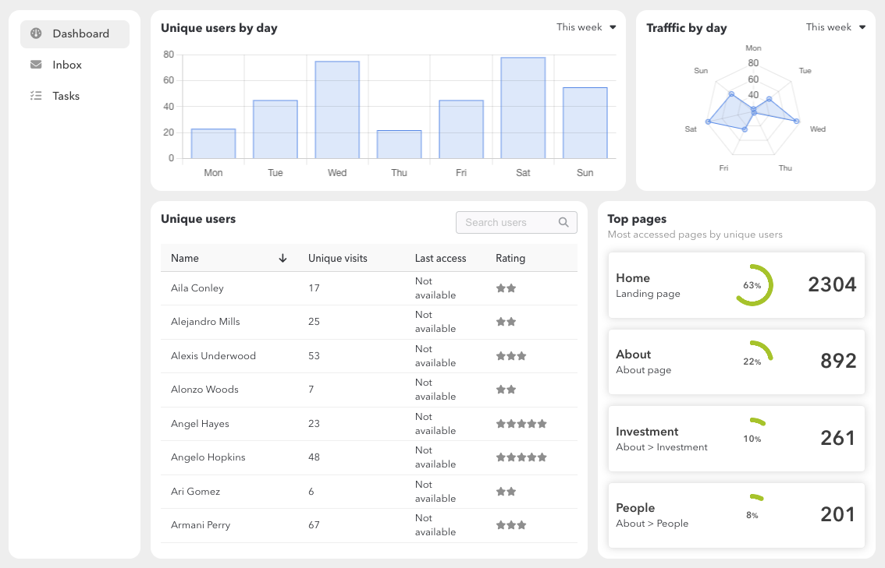
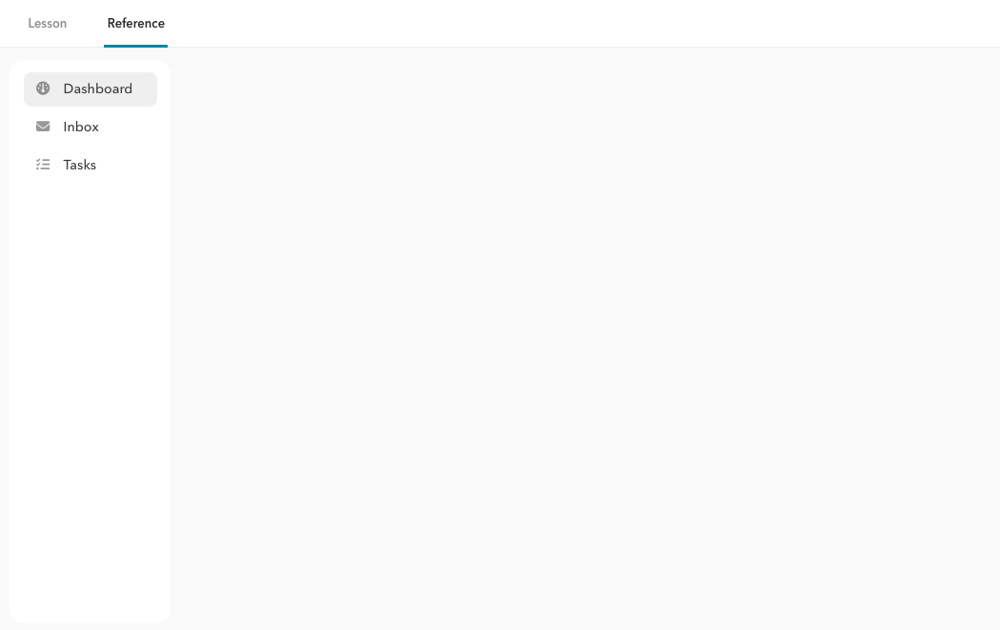
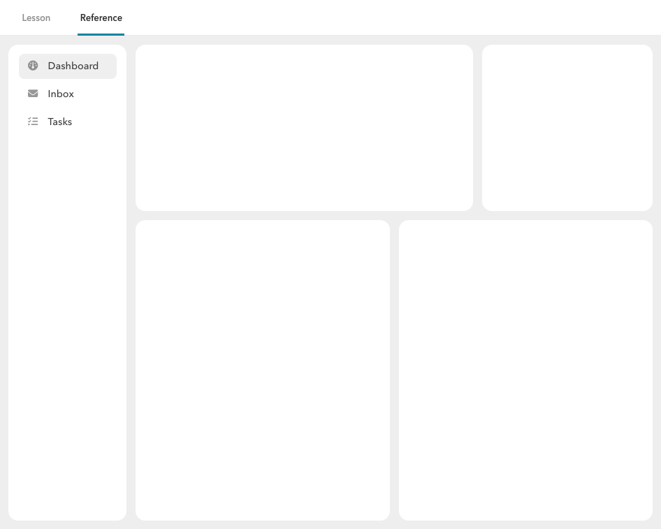
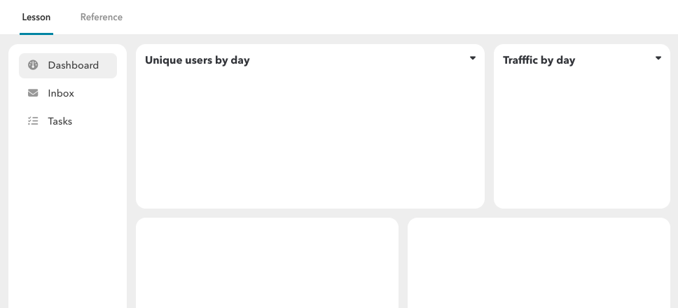
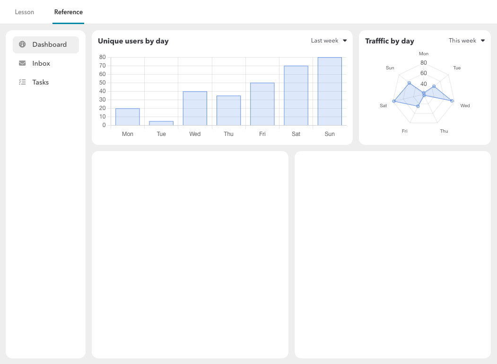

# Tutorial overview

The aim of this tutorial is to introduce you to the JUI framework from a practical standpoint: building something concrete that is not necessarily trivial. The approach is not intended to dictate how you would go about this in a work setting but rather to prompt thought about how to translate a design into working code commensurate with the pedagogical objective of learning how to build and assemble JUI components.

# Planning

Suppose we are given the following design to craft into a working prototype. It represents a dashboard for a hypothetical application that analysis website traffic and usage (there is no intent here to be realistic about this, rather the focus has been on providing something rich enough to expound the employment of JUI).



In terms of translating this to working code we need to:

1. Deconstruct the design into candidate components that we can build.
2. Define a data and interaction model to describe how information flows through the components and how the component react to that information.
3. Peform an initial design to determine the classes that will be created and structure of HTML and CSS used.
4. Implement the design into the playground.

We describe the first three steps below with the last being elaborated more fully as steps [Implementation](#implementation).

## Componentisation

To begin we look at how we can deconstruct the design into candidate components that we can build.

1. **Tabbed navigation** We first observe that the dashboard is really just one tab in a collective, though we still need to accommodate this. We do have access to a pre-build tabbed panel so can make use of that. That panel does some with a number of pre-built styles (vertical, icon only, horizontal, etc) the follow a standard style pattern which allows us to provide our own styles where needed. In this case we will need to do so to achieve the enclosure with the rounded corners.
2. **Dashboard layout** The dashboard proper is the assemblage of components in the content area of the tabbed panel (see (1) above). Note that we refer to assemblage as each of the four squares corresponds to a component in their own right. The dashboard then consists of these components along with a means to layout the components. One approach is to use a pre-built panel with a custom layout (that gives the four sections) but that only makes sense if we know we are going to re-use the layout (which would only make sense if we are able, in some way, configure that layout for a variable number of containers). To go this far is unnecessary. The other option is to create a custom component whose DOM specifically renders the scaffolding to allow the child components to reside it. This will be the approach we will take. We note that we will treat the containers being inclusive of the background and rounded corners rather than treating that visual presentation as being part of the child components (if you think about it that presentation is really connected to the layout of the components rather than imposing on the components themselves, which should focus on the content).
3. **Charts** There are two charts whose visual presentation and behaviour are similar (title, selection of data and chart). For this reason it makes sense to create a single configurable component and use two suitably configured instances of that component, one for each of the charts.
4. **Users list** TBD
5. **Summary** TBD

Now that we have a good sense of how the scene decomposes into components we need to understand the data flows.

## Data and interaction

We can take it as given the navigation (this can be delivered by way of pre-defined components and behaviours) so we focus on the details of the dashboard itself.

We see that the graphs and top pages could be delivered by way of a single data query that captures the information needed for display. The graphs themselves include the ability to select between a number of dimenisions; these too can be delivered as separate data sets since the size (being seven days) is not large. In terms of loading and refreshing we can do this each time the dashboard is navigated to. *Of course, this is not the only approach, but will serve our purposes.*

The list of unique users, however, could be quite large. For this we treat this as a separate data query that is subject to keyword filtering and pagination.

Outside the above the above there are no other interactions we need to be consider with.

## Initial design

We will taken this as having been done and elaborate on specific elements duing the implementation (this will be easier to follow).

# Implementation

## Getting started

The playground has provided a reserved space for you to develop code while walking through this tutorial. This consists of:

1. Code stubs residing under the `com.effacy.jui.playground.ui.tutorial`.
2. The code generates UI that resides under the **Tutorial** > **Lession** section of the playground (see [tutorial lesson](http://localhost:8080/playground#/tutorial/lesson)).
3. A completed example has been provided under `com.effacy.jui.playground.ui.tutorial.reference` and appears under the **Tutorial** > **Reference** section of the playground (see [tutorial reference](http://localhost:8080/playground#/tutorial/reference/dashboard)).

The classes provided are:

1. `Tutorial` a tabbed panel that contains the lesson and reference tabs. It also injects the CSS file (see [Styles](#styles) below) used in the tutorial.
2. `MockDataService`, `DashboardResult`, `UserResult`, `UserResultStore` and `Names` colletively represent the data objects the transfer data from the server to the dashboard and support for mocking this behaviour.
3. `ApplicationSection` a tabbed panel to hold the three tabs in the design (the **Inbox** and **Tasks** are empty panels).
4. `Dashboard` the dashboard assembly that builds the layout and attaches the various components.
5. `ChartComponent` a re-usable component for generating charts; used from the two graphs in the dashboard.
6. `Summarizer` a re-usable component for generating a summary consisting of various visual elements that are configured by some data (in this case an instance of `DashboardResult`).
7. `UsersGallery` a component that displays the table that displays the unqiue users.

For development you will need to run the code server:

1. Details of how to do this are described in the project `README.md` file (it requires configuration within your choosen IDE).
2. Remember to add bookmarks for the code build and open a window ([http://127.0.0.1:9876](http://127.0.0.1:9876)) that gains access to the **clean** action (which is useful for fully clearing the code build cache).
3. Ensure you perform a **dev mode build** (from the bookmarks) before you start and each time you make a code change (to see that change in action).

## Preparation

### Styles

?> Styles, as employed in JUI, are described in detail in [Styles](ess_styles.md). In the following we ultimately make take the **injected CSS** approach.

A decision needs to be made about how styles will be handled. In general you would likely create **localised CSS** to a component (see [Components](ess_components.md) for details). An alternative is to create a shared style-sheet that can be used across components (**injected CSS**). This does not promote component re-use (as the styles will be localised to a specific context, unless they are globally shared) but is quite efficient. Having said that if you choose to localise styles to a component then it is easy enough to do so. So for the purposes of the tutorial we will begin with a style-sheet that is local to the tutorial package (and leave it to [next steps](#next-steps) to describe the process by which we migrate styles local to the component).

The styles will be declared in the `tutorial.css` file under the *module base* `public` in the `com.effacy.jui.playground` package of the resources source tree. A completed version is provided so you don't need to modify it (just refer to to).

Finally we need to inject these styles into the application (just placing them in `public` won't import them). To do this we have placed the following in the `Tutorial` class (this being the root component for the tutorial):

```java
static {
  CSSInjector.injectFromModuleBase ("tutorial.css");
}
```
Under-the-hood this creates a `script` tag dynamically with a suitably configured URL to reference the CSS file (see [Styles](ess_styles.md) for more information).

### Data mocking

As described above data is provided through two separate mechanisms:

1. The data for the two graphs and the list of top pages will come from a server-side call that returns a `DashboardResult` object.
2. The data for the list of users will come from a server-side call returning a list of `UserResult` objects (subject to filtering by keyword and pagination).

For the first case we will assume that we want to perform a reload of the these data whenever the dashboard is shown (i.e. navigated to). For the second case we will be making use of a table component which uses a backing store (see [Stores](ess_store.md) for more details), for theses purposes we will mock this using a `UserResultStore`.

The class `DashboardResult`, `UserResult` and associated `UserResultStore` (which extends `PaginatedListStore`) are provided for you so does not need to be implemented. We will also be mocking the server-side calls (to reduce the complexity of the tutorial).

### Application

For these purposes the application has already been setup as the playground itself. You will be creating the design into the **Lesson** tab of the **Tutorial** section (as described above).

For interest you should look at `TestApplication` as the entry point and `ApplicationUI` as the main application component (created in the entry point and bound to the `pageBody` element of the main HTML page). This component extends `TabbedPanel` and builds out the various tabs in the playground. The one of interest is **Tutorial** which makes use of the `Tutorial` component (found in the `com.effacy.jui.playground.ui.tutorial` package). This, too, extends `TabbedPanel` (but with a different tab style) and includes the `ApplicationSection` for **Lesson** which you will be building out in accordance with the steps described below.

## Components

### 1. Tabs

The tabs component we be our top-level component for this tutorial. We have created a stub of this that you can start work on called `ApplicationSection` (which is instantiated in `Tutorial` under the **Lesson** tab).

We begin by having it extend `TabbedPanel` then add in the three tabs (using simple `Panel`'s as placeholder's). You can start by using the `Style.VERTICAL` as the default and you will see a tab set down the left hand side and by setting the background to a darker colour than the default white.

```java
public class ApplicationSection extends TabbedPanel {

  public ApplicationSection() {
    // We pass through an instance of the TabbedPanel.Config (as returned by
    // TabbedPanelCreator.$()) that configures the background colour and
    // the look-and-feel style that sets out the tabs vertically down the
    // left side of the screen with a border separating the tab set from the
    // page content.
    super (TabbedPanelCreator.$ ().color ("#fafafa").style (TabSet.Config.Style.VERTICAL));

    // The 'tab' method adds a tabe with reference (that appears in the url),
    // a label (for display in the tab set) and a component (in this case
    // all components are empty panels as placeholders). The returned object
    // allows for further configuration such as adding an icon.
    tab ("dashboard", "Dashboard", PanelBuilder.$ ().build ()).icon (FontAwesome.gauge ());
    tab ("inbox", "Inbox", PanelBuilder.$ ().build ()).icon (FontAwesome.envelope ());
    tab ("tasks", "Tasks", PanelBuilder.$ ().build ()).icon (FontAwesome.listCheck ());
  }
}
```

The tabs style is not the one we want, we need these to appear with a white backgroud with rounded corner and no border. To achieve this we can build our own `TabSet` style (we can't use the style sheet we described above as the mechanism for providing a new style to the tabset follow a pattern and that pattern requires we declare styles this particular way, which happens to be the same as localising styles to a component).

To create a new style it is simplest to copy an existing one that is pretty close (this is an exception to our decision to use `tutorial.css` but one that is imposed by `TabbedPanel`, see [Styles](ess_styles.md) for a detailed explanation of this particular approach to CSS). For these purposes the vertical one seems a good fit. So we copy the `VerticalLocalCSS` from `TabSet` into `ApplicationSection` and rename it to `RoundTabSetLocalCSS` (just for differentiation).  We then need to create an instance of `Style` which we reference statically as `ROUNDED_TABSET`. We then pass that to the tabbed panel configuration as the tab set style to use. The last thing we need to do is modify the CSS. To do this we create a resource `TabSet_Rounded.css` (see below for the required modifications) and add it to the `@StyleResource` annotation of the styles (we can remove the `_Override.css` as we don't need it). The end result is the class below.

```java
public class ApplicationSection extends TabbedPanel {

  public ApplicationSection() {
    // We supply a revised style to the tabbed panels' tab set. This is
    // declared below and allows is to provide our own CSS for this particular
    // instance.
    super (TabbedPanelCreator.$ ().color ("#fafafa").style (ROUNDED_TABSET));

    tab ("dashboard", "Dashboard", PanelBuilder.$ ().build ()).icon (FontAwesome.envelope ());
    tab ("inbox", "Inbox", PanelBuilder.$ ().build ()).icon (FontAwesome.envelope ());
    tab ("tasks", "Tasks", PanelBuilder.$ ().build ()).icon (FontAwesome.listCheck ());
  }

  /**
   * This is the instance of the style that is needed for configuraing
   * the tab set. It includes the CSS style plus configuration for
   * orientation (vertical or horizontal - vertical in this case) and
   * open / close icons for tab grouping.
   */
  private static final Style ROUNDED_TABSET = Style.create (
    RoundTabSetLocalCSS.instance (),
    true,
    FontAwesome.minus (),
    FontAwesome.plus ()
  );

  /**
   * This is our styles configuration and follows the standard "localised"
   * styles model (as described in the Styles under Essentials).
   */
  @CssResource({
    IComponentCSS.COMPONENT_CSS,
    ILocalCSS.CSS,
    "com/effacy/jui/ui/client/tabs/TabSet_Vertical.css",
    "com/effacy/jui/playground/ui/tutorial/reference/TabSet_Rounded.css"
  })
  public static abstract class RoundTabSetLocalCSS implements ILocalCSS {

    /**
     * This is our singleton instance of the styles.
     */
    private static RoundTabSetLocalCSS STYLES;

    /**
     * This builds (on demand) the singleton instance and serves it up.
     */
    public static ILocalCSS instance() {
      if (STYLES == null) {
        STYLES = (RoundTabSetLocalCSS) GWT.create (RoundTabSetLocalCSS.class);
        STYLES.ensureInjected ();
      }
      return STYLES;
    }
  }
}
```

The CSS file `TabSet_Rounded.css` (found in the `src/jui/resources` source sub-tree) has been created for you and looks like the following:

```css
.component {
  width: 15em;
  padding: 1em;
  background: transparent;
  border: none;
}

.component>div {
  background: #fff;
  height: 100%;
  border-radius: 14px;
  padding: 1em 0.5em !important;
}
```

The resulting UI is (this is under **Reference**, but yours should be under **Lession**):



### 2. Dashboard layout

We now move onto the dashboard layout which consists of four sections consisting of two graphs at the top and below that a table and a list. As noted during planning we separate out the contents of the four sections as their own components and assemble them into a single dashboard component that specifies the layout. This section describes this layout into which we will add the additional components.

We begin by create the `Dashboard` component (a stub has already been created for you) as follows (for a detailed description on DOM building using the method described below, refer to [Rendering](topic_rendering.md#dom_building)):

```java
public class Dashboard extends Component<Component.Config> {

  @Override
  protected INodeProvider buildNode(Element el, Config data) {
    // DomBuilder (in this case) builds content to the passed root element.
    // This follows a builder pattern so the actual creation of the nodes
    // occurs only during the call to the build() method.
    return DomBuilder.el (el, root -> {
      root.addClassName ("dashboard");
      root.div (upper -> {
        upper.addClassName ("upper");
        upper.div ().addClassName ("item", "item11");
        upper.div ().addClassName ("item", "item12");
      });
      root.div (lower -> {
        lower.addClassName ("lower");
        lower.div ().addClassName ("item", "item21");
        lower.div ().addClassName ("item", "item22");
      });
    }).build ();
  }
}
```

Here we override the `buildNode(Element, Config)` method and use `DomBuilder` to build DOM into the passed element (which is the root DOM element of the component). The `Config` data is not used in this case (in fact it will be `null` since we don't need component configuration for this particular component).  The DOM built corresponds to the following pseudo-HTML:

```html
<{root-node} class="dashboard">
  <div class="upper">
    <div class="item item11"></div>
    <div class="item item12"></div>
  </div>
  <div class="lower">
    <div class="item item21"></div>
    <div class="item item22"></div>
  </div>
</{root-node}>
```

The relevant CSS is added to **tutorial.css** (again, this have been done for you):

```css
.dashboard {
  height: 100%;
  padding: 1em 1em 1em 0;
  display: flex;
  flex-direction: column;
  gap: 1em;
}

.dashboard .upper {
  display: flex;
  height: 35%;
  gap: 1em;
}

.dashboard .lower {
  display: flex;
  flex-grow: 1;
  gap: 1em;
}

.dashboard .item {
  background: #fff;
  border-radius: 14px;
  flex-grow: 1;
  padding: 1em;
}

.dashboard .item12 {
  flex-grow: 0;
  width: 33%;
}
```

We finally need to include and instance of this component in our `ApplicationSection` class, replacing the placeholder for the dashboard. This involves modifying the constructor:

```java
public ApplicationSection() {
  super (TabbedPanelBuilder.$ ().color ("#fafafa").style (ROUNDED_TABSET));

  // We now pass an instance of the dashboard rather than the placehoder
  // panel.
  tab ("dashboard", "Dashboard", new Dashboard ()).icon (FontAwesome.envelope ());
  tab ("inbox", "Inbox", PanelBuilder.$ ().build ()).icon (FontAwesome.envelope ());
  tab ("tasks", "Tasks", PanelBuilder.$ ().build ()).icon (FontAwesome.listCheck ());
}
```


The resulting UI is:



### 3. Graphs

#### Charting library

For the charts we make use of [Charba](https://pepstock-org.github.io/Charba-Wiki/docs) (which is a J2CL wrapper around [ChartJS](https://www.chartjs.org/)). Being a third party library this is included as a Maven dependency (the version at the time of writing was 6.3):

```xml
<dependency>
  <groupId>org.pepstock</groupId>
  <artifactId>charba</artifactId>
  <version>6.3</version>
</dependency>
```

with the module inclusion `<inherits name="org.pepstock.charba.Charba" />` in `TestApplication.gwt.xml` (note that there is a GWT version of Charba but we are not using that). These inclusions have already been enacted so you don't need to do anything.

#### Chart component

We will now create a `ChartComponent` (a stub has been created for you) class of which two instances will be created (one for each of the two charts). Again we begin by overriding the `buildNode(Element, Config)` method:

```java
@Override
protected INodeProvider buildNode(Element el, RadarComponent.Config data) {
  return DomBuilder.el (el, root -> {
    root.addClassName ("chart");
    root.div (header -> {
      header.addClassName ("heading");
      header.h3 ().text (config ().title);
      header.div (menu -> {
          menu.on (e -> onMenuClick (e), 2, UIEventType.ONCLICK);
          menu.by ("menu");
          menu.addClassName ("menu");
          menu.span ().by ("menuLabel");
          menu.em ().addClassName ("closed", FontAwesome.caretDown ());
          menu.em ().addClassName ("open", FontAwesome.caretUp ());
          menu.div (selector -> {
              selector.on (e -> onMenuOptionClick (e), 1, UIEventType.ONCLICK);
              selector.addClassName ("selector");
              selector.ul (options -> {
                  for (Config.Option option : config ().options)
                      options.li ().id (option.reference).text (option.label);
                });
            });
        });
      });
      root.div (holder -> {
        holder.apply (n -> n.appendChild (chart.getChartElement ().as ()));
    });
  }).build (tree -> {
    menuEl = tree.first ("menu");
    menuLabelEl = tree.first ("menuLabel");
  });
}
```

Which corresponds to the psuedo-HTML (the CSS can be found in the `tutorial.css` file):

```html
<{root-node} class="chart">
  <div class="heading">
    <h3>{title}</h3>
    <div class="menu {open}">
      <span>{selected-label}</span>
      <em class="open icon-open" />
      <em class="closed icon-closed" />
      <div class="selector">
        <ul>
          <li item="{option-reference}">{option-label}</li>
        </ul>
      </div>
    </div>
  </div>
  <div class="holder">
    {chartjs}
  </div>
</{root-node}>
```

There are some key observation to make here (see [Rendering](topic_rendering.md) for a detailed description):

1. ChartJS declares charts as a sub-class of `AbstractChart` which makes available an element via `getChartElement()` that needs to be added to the DOM. In our case the chart is assigned to the member field `chart` of the component and is appended as a child of the `holder` element via `holder.apply (n->n.appendChild (chart.getChartElement ().as ()))` (the `apply(Consumer<Node>)` method allows one to execute code on a node post-build).
2. We make use of *event handlers* using the `on(...)` method. This is provided a lambda expression to handle the event and a directive as to which event needs to be handled. So for the `menu` element we call `onMenuClick(UIEvent)` when the element is clicked on and similarly for `selector` we call `onMenuOptionClick(UIEvent)` when that element is clicked on.
3. We need references to the `menu` element and the `menuLabel` element to support interaction with the menu selector. These are extracted after the DOM structure has been built. We use the references supplied using the `by(String)` method to refer to the elements that we want to extract.
4. The title of the component is drawn from the component configuration (see the following section that introduces the configuration).
5. The generation of menu options iterates over the `option` member of the configuration. This is described in detail a bit later. However note that the event handler for menu selection is actually on a parent node meaning that we to supply a reference to the item being selected so that the handler know which item was selected (can you think of a different way of doing this? If so, try it out once you have completed the tutorial). 

We are not quite ready to start adding the chart component into the dashboard layout as we need, at a minimum, to create the actual ChartJS chart instance.

#### Creating the chart

ChartJS offers a range of chart types for which we are (currently) interested in the bar and radar variants. Since our chart component is reusable we want to pass through the chart type as component configuration (along with the title of the component):

```java
public static class Config extends Component.Config {

  public enum Type {
      RADAR, BAR;
  }

  private Type type = Type.RADAR;

  private String title;

  public Config type(Type type) {
      if (type != null)
          this.type = type;
      return this;
  }

  public Config title(String title) {
      this.title = title;
      return this;
  }

  @Override
  @SuppressWarnings("unchecked")
  public ChartComponent build(LayoutData... data) {
      return new ChartComponent (this);
  }

}
```
This configuration can now be employed to create the relevant chart (see [Charba](https://pepstock-org.github.io/Charba-Wiki/docs) for details on the configuration of the various charts that are available):

```java
public ChartComponent(Config config) {
    super (config);

    if (Config.Type.RADAR == config.type) {
        chart = new RadarChart ();
    } else if (Config.Type.BAR == config.type) {
        chart = new BarChart ();
        chart.getOptions ().setMaintainAspectRatio (false);
    }
    chart.getOptions ().getLegend ().setDisplay (false);
    chart.getOptions ().setResponsive (true);
}
```

We have enough now to include the component into the dashboard.

#### Placing the component in the dashboard

Moving back to the `Dashboard` class we need to further modify the `buildNode(Element,Config)`:

```java
@Override
protected INodeProvider buildNode(Element el, Config data) {
    return DomBuilder.el (el, root -> {
        root.addClassName ("dashboard");
        root.div (upper -> {
            upper.addClassName ("upper");
            upper.div ().addClassName ("item", "item11") //
                .apply (attach (users));
            upper.div ().addClassName ("item", "item12") //
                .apply (attach (traffic));
        });
        root.div (lower -> {
            lower.addClassName ("lower");
            lower.div ().addClassName ("item", "item21");
            lower.div ().addClassName ("item", "item22");
        });
    }).build ();
}
```

Here we make use of the `apply(Consumer<Node>)` method again, this time to each of the upper two sections (`item11` and `item12`). The first attaches the `users` component to the left and `traffic` to the right (see [Rendering](topic_rendering.md) for details of attaching components). Naturally we need to create instances of these components (for now we will create very simple ones as placeholders):

```java
private ChartComponent users = new ChartComponent.Config () //
    .title ("Unique users by day") //
    .type (ChartComponent.Config.Type.BAR) //
    .build ();

private ChartComponent traffic = new ChartComponent.Config () //
    .title ("Trafffic by day") //
    .type (ChartComponent.Config.Type.RADAR) //
    .build ();
```

Which results in the following UI:



Note that no charts actually show as we need to populate them with data.

#### Dealing with data

Recall that we are supplying data by way of the `DashboardResult` data object (more specifically as lists of `DashboardResult.Data` objects one for traffic and one for unique users). What we don't want to do is tie this representation to the chart component; we want to keep the component generic.

The approach we take is to first configure the component against a fixed set of categories (labels), this is done during configuration:

```java
public static class Config extends Component.Config {
  ...
  
  private String[] labels;

  public Config labels(String... labels) {
      this.labels = labels;
      return this;
  }

  ...
}
```

We then expose a method that takes a list of double value (one corresponding to each label):

```java
public void update(double... values) {
    if (values == null)
        return;

    // The method config() return the component configuration passed during
    // construction. This contains the chart type and the list of labels.
    if (Config.Type.RADAR == config ().type) {
        LiningDataset dataset = ((RadarChart) chart).newDataset ();
        dataset.setBackgroundColor (HtmlColor.CORNFLOWER_BLUE.alpha (0.2));
        dataset.setBorderColor (HtmlColor.CORNFLOWER_BLUE);
        dataset.setBorderWidth (1);
        dataset.setData (values);
        chart.getData ().setLabels (config ().labels);
        chart.getData ().setDatasets (dataset);
    } else if (Config.Type.BAR == config ().type) {
        BarDataset dataset = ((BarChart) chart).newDataset ();
        dataset.setBackgroundColor (HtmlColor.CORNFLOWER_BLUE.alpha (0.2));
        dataset.setBorderColor (HtmlColor.CORNFLOWER_BLUE);
        dataset.setBorderWidth (1);
        dataset.setData (values);
        chart.getData ().setLabels (config ().labels);
        chart.getData ().setDatasets (dataset);
    }

    // Forces the chart to update.
    chart.reconfigure ();
}
```

Obviously this requires supplying the data to the component, however we also include in the component the ability to choose between data sets. So how to we achieve in an integrated manner? The approach we have taken is to create separate options to appear in the menu selector along with a mechanism to *pull* the data relevant for that option. This allows us to keep the logic together in the component but externalise the source of the data.

These options are configured as follows:

```java
public static class Config extends Component.Config {
    ...
    
    private List<Option> options = new ArrayList<> ();

    public Config option(String label, Supplier<double[]> data) {
        Option option = new Option (label, data);
        options.add (option);
        return this;
    }

    private class Option {

        final String reference = UID.createUID ();

        final String label;

        final Supplier<double[]> data;

        public Option(String label, Supplier<double[]> data) {
            this.label = label;
            this.data = data;
        }
    }

    ...
}
```

Note that for each object we require a supplier, this provides the data at the time of selection of that option. We see that each option declares a reference (which is internal) and this is used to look up the option when the option is selected. The following method performs the lookup and applies the change in selection:

```java
protected boolean load(String reference) {
    for (Config.Option option : config ().options) {
        if (reference.equals (option.reference)) {
            // Update the label of the menu selector to indicate the newly
            // select item.
            DomSupport.innerText (menuLabelEl, option.label);
            // Apply the associated data using the supplier to retrieve the
            // data.
            update (option.data.get ());
            return true;
        }
    }
    return false;
}
```

We now need a means to prime the data, for convenience we tie this in with the ability to reset the component (to this primed state). This is a defined behavuour so the component implements `IResetable` and provides a `reset()` method:

```java
@Override
public void reset() {
    // Reset the selection and load the associated data (we can only do this when
    // rendered).
    if (isRendered ())
        load (config ().options.get (0).reference);
}
```

and we invoke this method when the component is first rendered:

```java
@Override
protected void onAfterRender() {
    super.onAfterRender ();
    reset ();
}
```

We can now see the effect of these changes by expanding on the configuration of the two charts in `Dashboard`:

```java
private ChartComponent users = new ChartComponent.Config () //
    .title ("Unique users by day") //
    .type (ChartComponent.Config.Type.BAR) //
    .labels ("Mon", "Tue", "Wed", "Thu", "Fri", "Sat", "Sun") //
    .option ("This week", () -> (value == null) ? null : value.findUserData (Period.THIS_WEEK)) //
    .option ("Last week", () -> (value == null) ? null : value.findUserData (Period.LAST_WEEK)) //
    .option ("Weekly average", () -> (value == null) ? null : value.findUserData (Period.WEEKLY_AV)) //
    .option ("Monthly average", () -> (value == null) ? null : value.findUserData (Period.MONTHLY_AV)).build ();

private ChartComponent traffic = new ChartComponent.Config () //
    .title ("Trafffic by day") //
    .type (ChartComponent.Config.Type.RADAR) //
    .labels ("Mon", "Tue", "Wed", "Thu", "Fri", "Sat", "Sun") //
    .option ("This week", () -> (value == null) ? null : value.findTrafficData (Period.THIS_WEEK)) //
    .option ("Last week", () -> (value == null) ? null : value.findTrafficData (Period.LAST_WEEK)) //
    .option ("Weekly average", () -> (value == null) ? null : value.findTrafficData (Period.WEEKLY_AV)) //
    .option ("Monthly average", () -> (value == null) ? null : value.findTrafficData (Period.MONTHLY_AV)).build ();
```

The resulting UI is:



Finally we activate the menu selection.

#### Selecting between data sets

We nearly have everything in place, we only need to implement the remaining two menu related on-click handlers. The first activates the menu (i.e. opens and closes it):

```java
protected void onMenuClick(UIEvent event) {
    event.stopEvent ();
    if (menuHandler == null)
        menuHandler = new ActivationHandler (menuEl, menuEl, "open");
    menuHandler.toggle ();
}
```

This makes use of a utility class `ActivationHandler`. This provides tools to apply (and remove) a specific *open* class to a suitable element when that element is clicked on (and also to remove when clicked outside of that element). This can be used to open and close a menu selector and have it behave as you would expect such a menu selector to behave. In this case the menu structure resides under the `menuEl` element (see `menu` in the build node method) and the relevant class is `open`.

Finally we need to respond to a click on a menu item. As noted above the actual event handler is registered against a parent element (this will still generate click events whenever its children are clicked on). The target of the click event should be one of the list items and that carries with it the reference to the option it represents (as also noted this is not the only way and you are encourged to think of an alternative - maybe adding event handlers to the list items themselves?). The relevant code follows:

```java
protected void onMenuOptionClick(UIEvent event) {
    Element targetEl = event.getTarget ("li", 3);
    if (targetEl == null)
        return;
    String reference = targetEl.id;
    if (load (reference)) {
        menuHandler.toggle ();
        event.stopEvent ();
    }
}
```

This is the last change needed and the UI should now respond as expected (i.e. you can select options from the menu and see that change in the chart data).

### 4. Table gallery

TBD

### 5. Summary panel

TBD

# Next steps

## Localise styles

The `ChartComponent` can be seen as one that could have uses outside of the dashboard so is a candidate for localising styles. When styles are localised they are declared in an interface and the actual style names are obfuscated. The advantage of this is that it reducing the likelihood of a style name clash and ensures the correct style names are used when building DOM. For an application you can often get away without localising styles but if you creating a library, or creating components for re-use, then localisation is recommended.

As an exercise try to localise the styles of `ChartComponent`. Begin by creating a CSS called `ChartComponent.css` in the same package as `ChartComponent.java` but in the resources source tree. Here copy across the chart related styles in `tutorial.css` (you don't need to remove them though) to this new CSS file and rename `.chart` to `.component`.

Next add the following to `ChartComponent`:

```java
@Override
protected LocalCSS.ILocalCSS styles() {
  return LocalCSS.instance ();
}

public static interface ILocalCSS extends IComponentCSS {

    public String heading();

    public String menu();

    public String selector();

    public String holder();

    public String open();

    public String closed();

}

@CssResource({ IComponentCSS.COMPONENT_CSS, "com/effacy/jui/playground/ui/tutorial/ChartComponent.css" })
public static abstract class LocalCSS implements ILocalCSS {

  private static LocalCSS STYLES;

  public static ILocalCSS instance() {
    if (STYLES == null) {
      STYLES = (LocalCSS) GWT.create (LocalCSS.class);
      STYLES.ensureInjected ();
    }
    return STYLES;
  }
}
```

Finally replace the styles declared in text in `buildNode(...)` with references to the interface declared styles. For example `header.addClassName ("heading");` becomes `header.addClassName (styles ().heading ());`. Note that you can delete `root.addClassName ("chart");` as the `Component` base-class will apply the `component` style automatically (remember we changed `.chart` to `.component` when copying the styles across between CSS files).

## Masking

The masking of `Dashboard` during load is fairly crude and uses the out-of-the-box version. Try overriding the `mask()` and `unmask()` and do something a bit nicer. For example, activate a mask using a CSS style and create overlays for each of the "squares" (absolutely positioned to block click access to elements underneath).